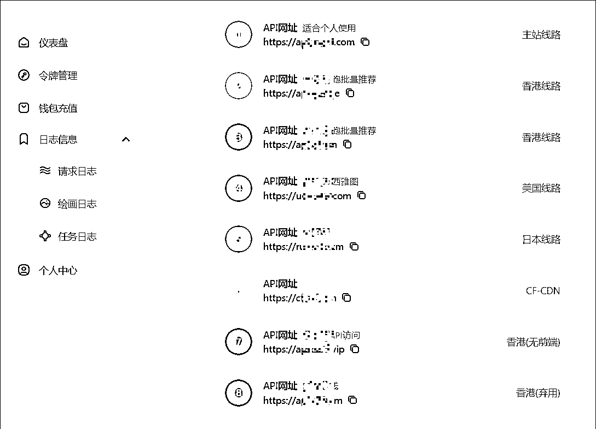

# 保姆级最轻松使用 deepseek、cluade、GPT4.0 教程分享

> 原文：[`www.yuque.com/for_lazy/zhoubao/qnf55n4xcnehgofw`](https://www.yuque.com/for_lazy/zhoubao/qnf55n4xcnehgofw)

## (46 赞)保姆级最轻松使用 deepseek、cluade、GPT4.0 教程分享

作者： 侠狼

日期：2025-02-18

市面上现在有很多的怎么使用 deepseek 教程，但是每一个教程都是会让你去每一个不同的软件，或者很卡。

切换起来使用很不方便，特别是如果你要用 deepseek，以及 cluade 协同办公使用的话，更不方便！

今天就给大家分享一下**最方便使用 deepseek，以及 cluade，市面上所有的大模型，一篇文章给你搞定** ！

回答的速度还不错，具体看 GIF，未加速的回复速度。

注意：这是需要购买 APikey 的，APIkey 并非免费的。

**1、使用说明介绍**

我们使用的是**中转 APi 的形式** 进行使用的。

目前市面上现在有很多的这类似的中转 APi 供应商，具体稳不稳定，好不好用，建议自己找找，我分享一个我自己用了很长一段时间的给大家。

这个是我自己的账号使用情况，620 块钱有 300 美金，足够使用很长很长一段时间，除非需要大量处理大量的文章，图片，压缩包内容，可能 APi 就会消耗的快一些。

软件使用教程完整版，看后面哈，会讲解如何使用。

**2、注册购买生成 APi 秘钥**

打开 APi 代理中转官网：[`api.v3.cm/`](https://api.v3.cm/register?aff=RSeH)

注册，登录账号，然后进入到钱包充值，建议首次使用充值 10 美金大概 20 块钱，用多少充多少。

充值完成后，进入令牌管理，创建令牌 key，名称随意填写，额度建议 10 美金，创建数量 1 就行，不建议无限额度。

创建完成后，我们在下次的表格里面，就可以看到生成出来的令牌了，点击复制就行。

这个 APikey 生成很重要，我们后续会拿来使用的。

**3、软件下载**

首先我们需要下载 chatbox

chatbox 官网：[`chatboxai.app/zh`](https://chatboxai.app/zh)

打开官网，下载自己需要的版本，安卓就下载安卓，电脑就下载电脑版本。

为了写文章方便，我就以电脑版为例子写教程演示使用了。

下载软件，安装打开后，进入设置，添加自定义模型。

配置说明如下，下面还有基础配置，建议不了解的，不建议修改，默认的即可。

创建的时候，自定义模型，建议用什么模型就用什么模型的名称，这样方便切换使用。

APi 域名来源于我发大家的这个中转站控制台首页。

模型来源于网站后台，模型价格，用什么模型，就点击对应模型名称就会自动复制，我们填写到 chatbox 对应的位置粘贴即可。

目前建议的几个模型分别是：

GPT4 的：gpt-4o-2024-11-20

Cluade3.5 的：claude-3-5-haiku-20241022

Deepseek：deepseek-r1-search

每个模型，在这个对应的平台上是有说明介绍的，我的个人建议是以上三个，具体的根据自己实际使用的情况来，模型基本都是同步官方去使用的，还是很不错的。

**4、软件配置**

路线配置，设置完成后，进入对话，点击一下新对话，编辑看下我们刚刚的配置是否生效了。

点开后，点击模型设定就可以看到，实际上是生效了，这时候就配置好了。

然后随便问一个问题就好了，比如最近很热门的哪吒，就可以看到是 Deepseek 深度思考+联网搜索版本了。

基本就对接好了，具体的建议自己研究使用，然后需要的话，也可以加上 Cluade3.5 版本进行使用的。

可以看到，回复内容也是 Cluade3.51 的版本，还是很方便使用的，具体的支持可以去看官网，以及介绍，这里就不过多说明使用了。

消费的金额也可以看到的，具体看 token 实际使用来收费的。

安卓跟苹果端，都可以下载使用，具体的看对应官网使用教程。

好了，文章到这里就结束了，期望对大家有帮助。

* * *

评论区：

侠狼 : MJ 也可以用，还可以

11 : 感谢分享