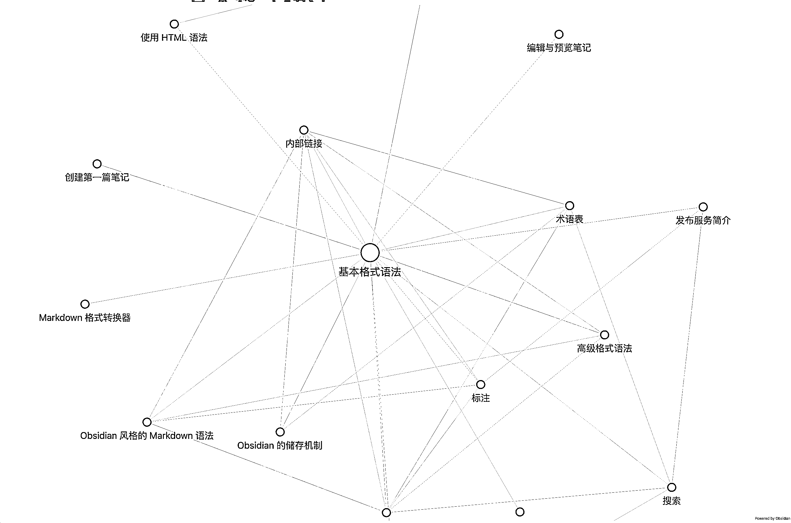
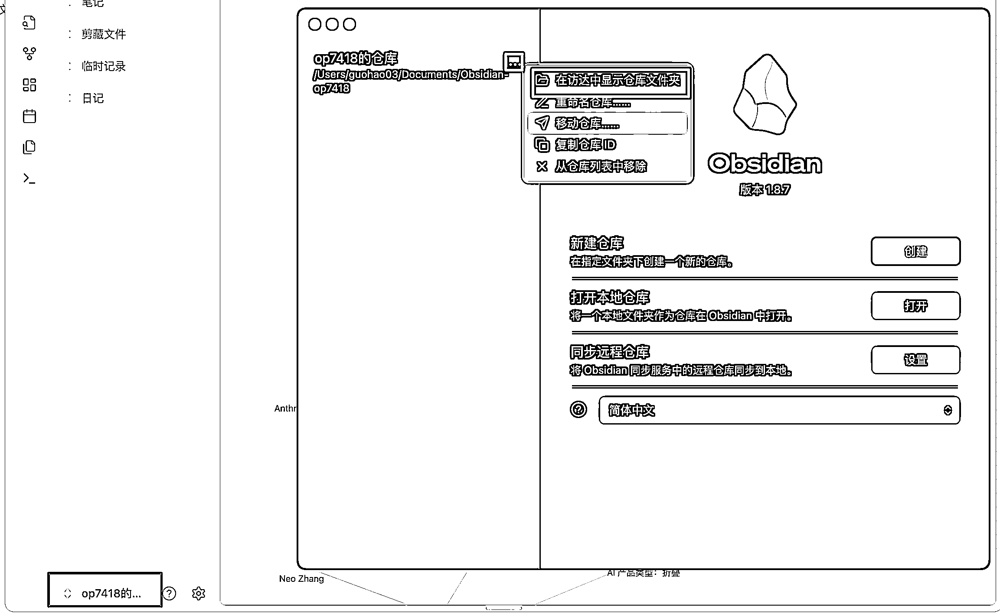
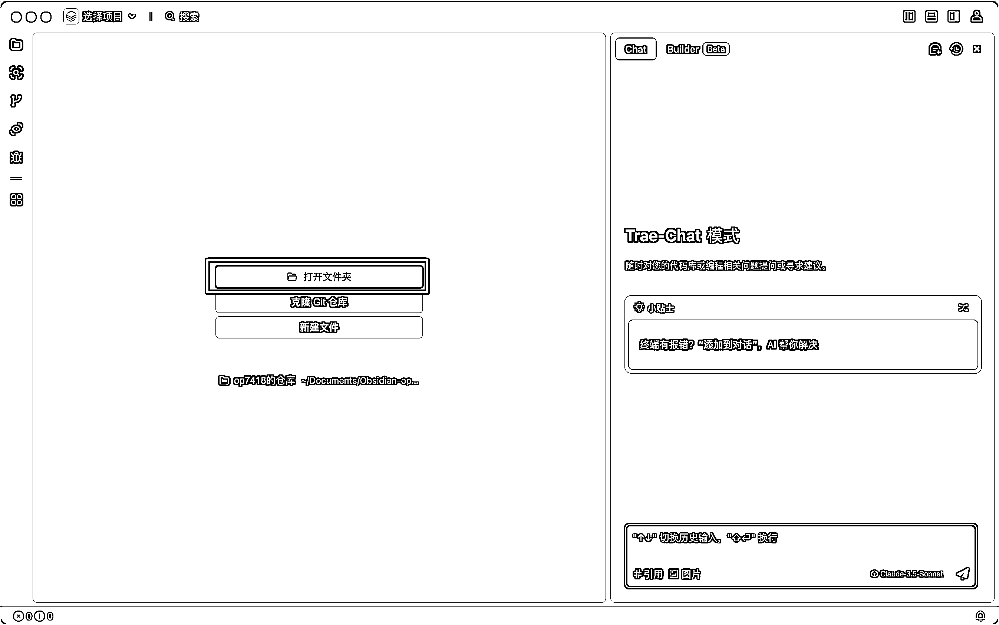
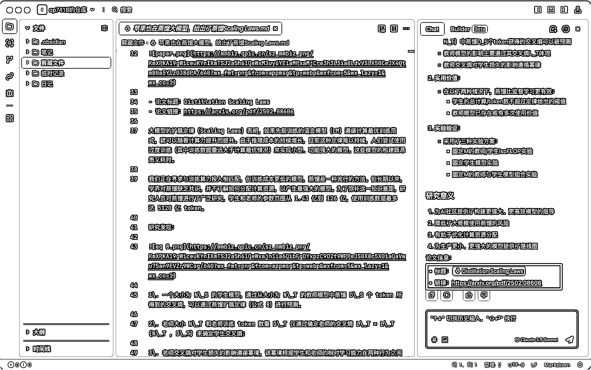
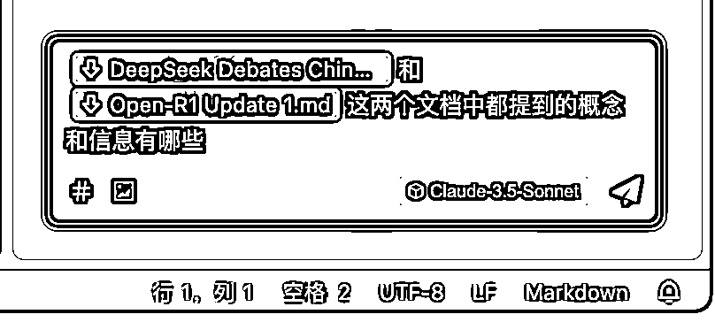
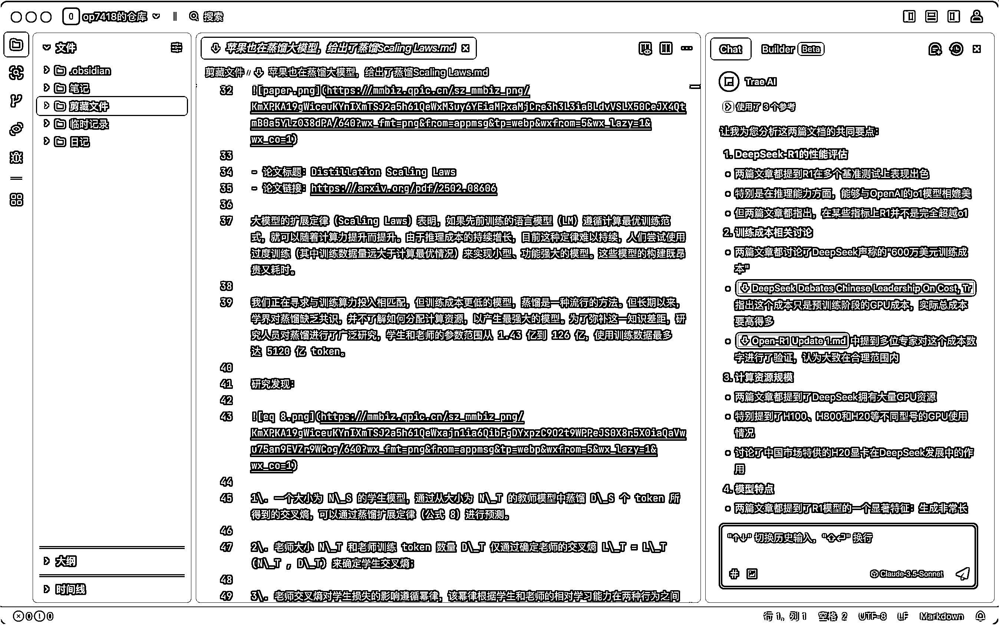
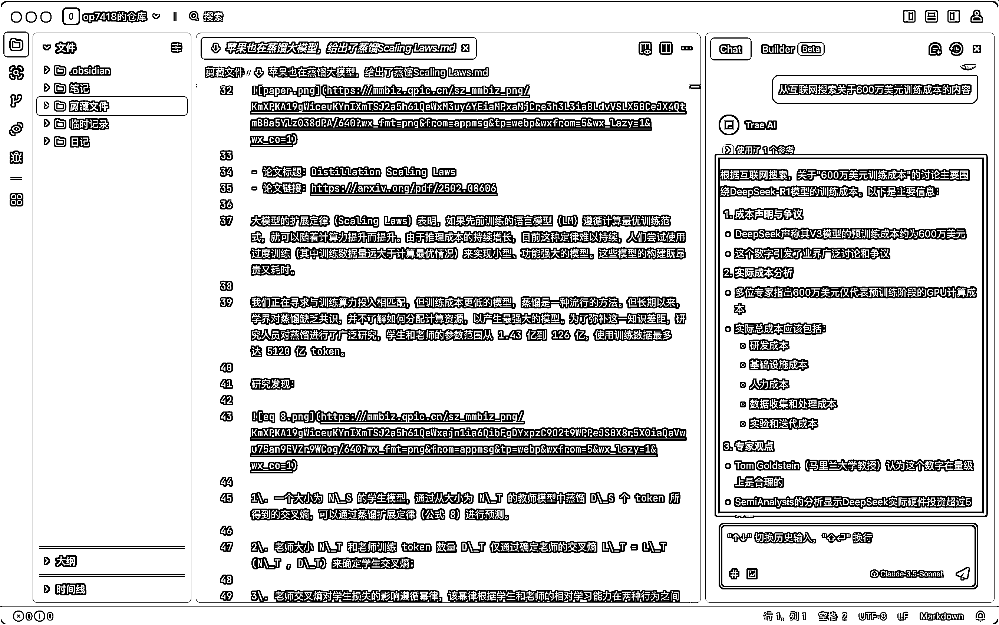
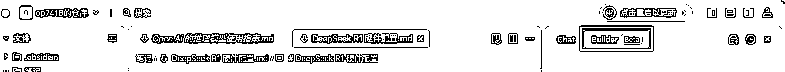
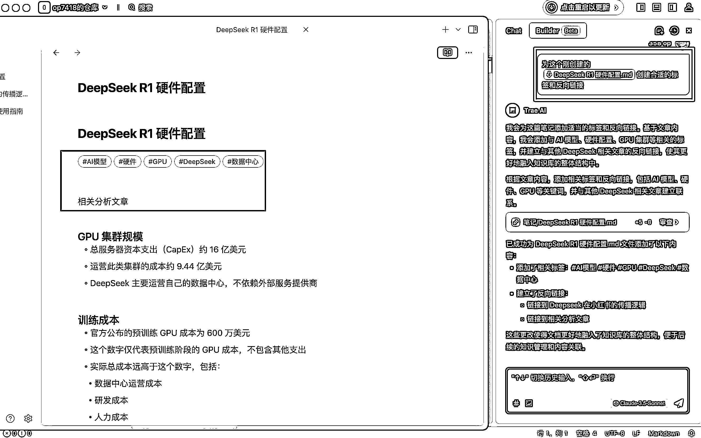
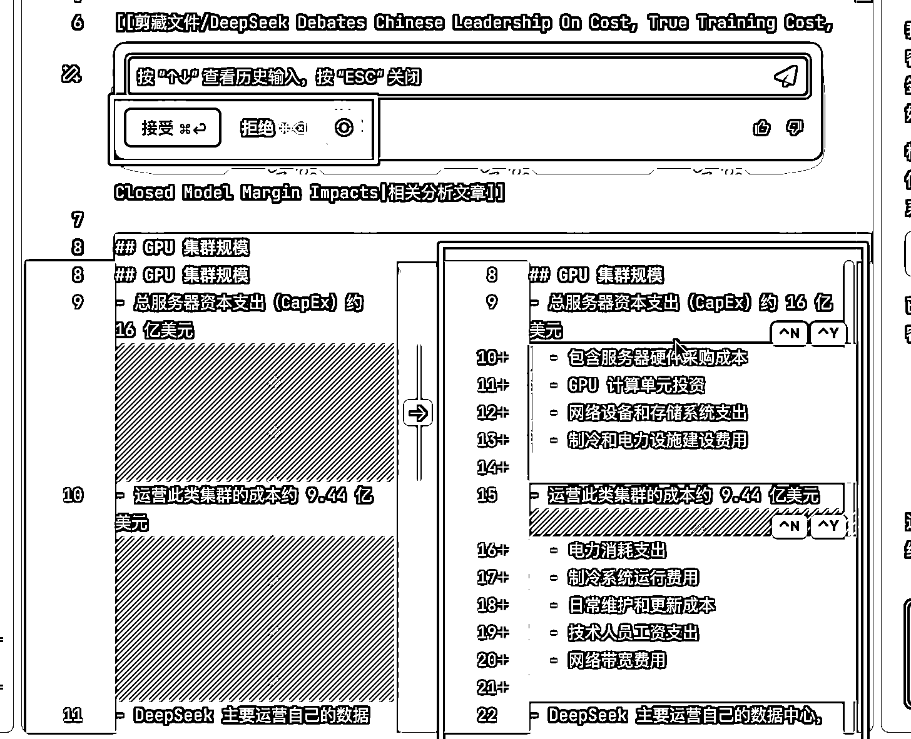

# Obsidian 加 Cursor 就是最强 AI 知识库：藏师傅教你从零学习 Obsidian 01

> 原文：[`www.yuque.com/for_lazy/zhoubao/ssryg0d43p8ps9vc`](https://www.yuque.com/for_lazy/zhoubao/ssryg0d43p8ps9vc)

## (精华帖)(44 赞)Obsidian 加 Cursor 就是最强 AI 知识库：藏师傅教你从零学习 Obsidian 01

作者： 歸藏

日期：2025-02-21

这几天因为看到了 Obsidian 的浏览器剪藏插件的强大（这个下节讲）所以开始玩 Obsidian，想要搞一个符合自己要求的本地知识库再加上 AI
的加持。

也装了几个 Obsidian 的 AI 插件，结果发现配置非常复杂，体验不太行，想要顺畅使用的话得看文档，甚至还有看文档都无法结局的恶性
Bug，我得搜 Github 其他人的问题才能搞定。

这些插件的作用主要是内置在 Obsidian 里面的 AI 助手，可以帮你检索你的笔记和基于笔记生成新的内容。

然后我就想能不能用 Cursor 这些 AI IDE 解决这个问题，反正他解决的也是类似的问题，检索代码，回答代码问题，生成新的代码，HTML
是标记语言，Markdown 也是标记语言是吧。

**结果发现还真能用，而且非常顺滑，主要是三类作用** ：

1.  帮助你用模糊的问题检索你的笔记库，而不是关键字

2.  帮助你基于笔记库进行研究，可以结合多个笔记软件给出建议

3.  帮你生成和修改笔记，比如生成整个笔记文件或者修改你写的笔记文案

教程里为了照顾大多数人我会用默认中文而且免费的 Trae 演示，但是由于现在 AI IDE 都大同小异所以你用 Cursor 或者 Windsurf
也可以看懂甚至，快捷键和按钮位置都一样的。

## **什么是 Obsidian**

首先为没有用过或者不知道 Obsidian 的用户解释一下什么是 Obsidian。

Obsidian 是一款功能强大的笔记软件，专为知识管理设计，**支持 Markdown 格式、双向链接和本地存储** ，可以助你构建个人知识体系。

首先就是对 **Markdown 格式的支持，** 这是一种轻量级标记语言，简单易学且功能强大。用户可以轻松创建格式化的文本。如果你不太了解
Markdown 语法的话可以看页面最后的文档。

然后就是他独特的**双链笔记，允许用户在笔记之间建立关联，形成一个动态的知识网络** 。例如，你可以在一篇笔记中链接到另一篇相关笔记，双向链接会自动显示反向引用。这种功能非常适合整理复杂的想法或构建知识体系。

最后 **Obsidian 笔记是完全在本地储存为 Markdown 格式的文件** ，你可以用任何方式打开和迁移，你的数据完全属于你，这也是我们用
Cursor 帮助你整理和生成笔记的基础。

## **准备工作：用 Trae 打开 Obsidian 文件**

Obsidian 的所有文件都储存在你本地的一个文件夹里，你可以在左边侧边栏的仓库名点击「管理仓库」之后在新开页面的三个点这里选择「显示仓库文件夹」。

然后我们打开刚才下载的 Trae 软件，一路下一步之后选择「打开文件夹」，这里的文件夹选择你刚才找到的 Obsidian 笔记文件夹就可以了。

## **用 Trae 查询笔记内容**

Obsidian
虽然支持各种方式（标签、反向链接）组织和搜索你的笔记，但是大部分还是基于关键字的搜索，但在一个很大的笔记系统上记住检索用的各种关键词基本上是不可能的任务，我们下意识总是想到问题，而不是相关关键词。

所以很多人笔记库大了以后也是因为这个原因放弃了 Obsidian，如果要组织调理实在太耗时间，但是不组织又找不到自己的笔记。

AI 最擅长的就是寻找模糊的内容和问题，比如我需要找到笔记库剪藏文件夹里面保存的一个关于苹果的蒸馏研究，只需要在 Trae 右侧的 Chat
输入框输入「#」然后选择剪藏文件夹，提问苹果关于模型蒸馏的内容就行。

可以看到结果里面 Trae 不止给了我们这个文章的介绍，而且给了原始的笔记文件链接可以直接打开，甚至还从文章提取了论文的网址。

## **用 Trae 和 Obsidian 辅助研究**

我们经常需要对多个不同的笔记文件进行比较或者综合整理进行研究，这个时候也可以用刚才类似的方法引用我们指定的笔记文件或者文件夹进行多轮的问答。

比如我想要知道两个关于 Deepseek 的文档都提到的概念和信息有哪些，就可以在 Chat 输入框提问的时候用「#」分别引用这两个文档。

可以看到结果的对比是非常详细的。

如果你对总结的内容有新的想法或者疑问也可以直接与 AI 进行新的讨论，比如我这里就询问了 Trae 关于 Deepseek R1 600
万美元的训练成本问题，他也从网上找了一些信息进行参考。

你们也可以根据自己的需求和内容发散更多类似的用法，比如：

1.  用来学习和复习，可以根据你的笔记生成测验、抽认卡或复习总结，帮助你巩固知识。

2.  如果你的笔记包含结构化数据（比如表格或日志），AI 可以帮你分析这些数据。

## **用 Trae 生成或者修改笔记**

我们已经讲了两个关于检索和沟通的用法，接下来看一下生成和编辑。

首先是生成，我们跟 AI 讨论的内容有时候挺有价值的想保存成一个新的笔记怎么办，这个时候我们可以将 Trae 切换到 Builder
这个模式，在这个模式下他可以操作你的文件，比如修改和新建。

比如我想要让 Trae 基于我收藏的一个文档提取指定信息要点并且新建为一个新的笔记，可以在 Builder
模式的输入框里面发出指令并且用「#」引用这个文档。

可以看到 Trae 已经帮我们在笔记文件夹新建了一个新的笔记，你只需要审查这个笔记内容之后没问题的话点击「接受」就可以完成新建。

我们知道 Obsidian 的精华是标签系统和反向链接系统，所以在笔记新建之后我们还可以要求 Trae
为我们新建的笔记创建合适的标签和反向链接方便我们后面检索。

上面的用法是让 Trae 直接创建整个文档，那有时候我们只是想要局部编辑怎么办？

其实也可以的，比如我想要让某一段描述变得更详细，就可以在打开的文件里选中我们想要让 AI 编辑的内容。

可以看到上面有个悬浮的按钮，我们可以选择这个 「编辑按钮」。

然后在里面输入我们想要对这段文字进行的操作，比如“对这段文字进行扩写，更详细的描述，但是不要改变核心内容”。

可以看到 AI 很快给出了我们改写后的内容，还有前后的对比，如果你觉得改写 OK 的话直接点击接受，内容就会回填。

上面就是从全新创建和局部修改笔记的操作方式，基于编辑和修改我们还可以发散更多的使用方式，比如为多个笔记分类和打标签，建议笔记之间的关联链接，甚至为整个笔记库生成目录或索引等。

好了上面就是结合 Obsidian 和 AI 编程工具变为 AI 知识库的全部内容了，如果你基于自己行业或者工作流发散出了更有意思的可以在评论区分享。

AI 模型将原来需要非常复杂的开发工作的方案都没模块化和简单化了，从而让 Obsidian
这些自由度很高的软件重新焕发了生机，原来的缺点（学习成本高、管理复杂）甚至在 AI 加持下变为了优点（个性化、智能辅助）。

这种趋势不仅限于笔记软件，而是正在重塑整个软件生态。未来，AI 将在更多领域释放自由度高的工具的潜力，为用户带来更智能、更便捷的个性化体验。

## **附加链接：_**

1.  Obsidian 下载：[`obsidian.md/`](https://obsidian.md)_

2.  Obsidian Markdown 语法文档：[`publish.obsidian.md/help-zh/编辑与格式化/基本格式语法`](https://publish.obsidian.md/help-zh/编辑与格式化/基本格式语法)_

3.  Trae 下载：[`www.trae.ai/`](https://www.trae.ai)_

* * *

评论区：

西昂 : 大佬也来生财了[社会社会]

六只猫 : 是我推关注的那个歸藏吗[哇]一样的头像和名字

程序员赤小豆 : 歸藏大佬可以分享一下怎么在 Twitter 起号吗[调皮]

刘杰 : +1