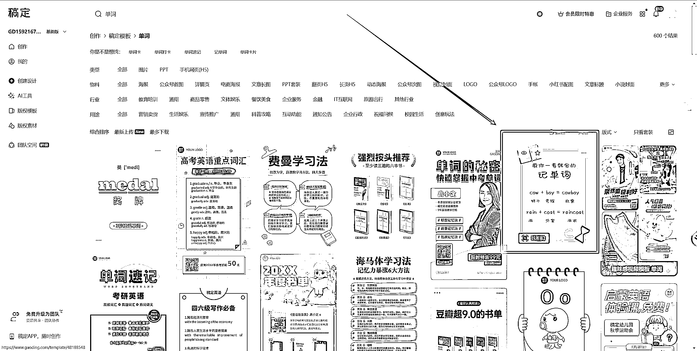
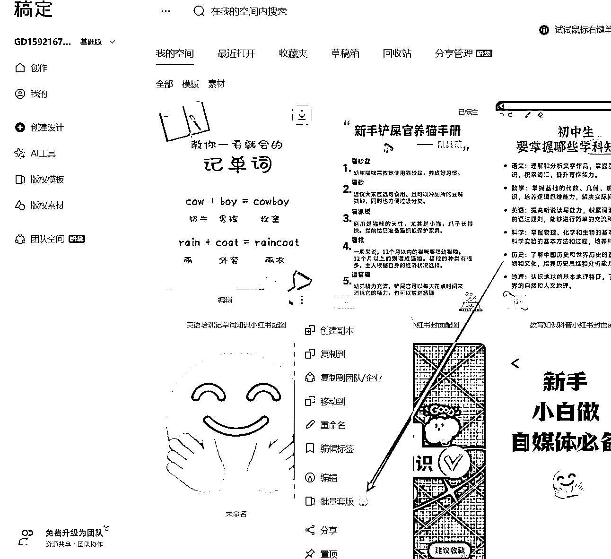
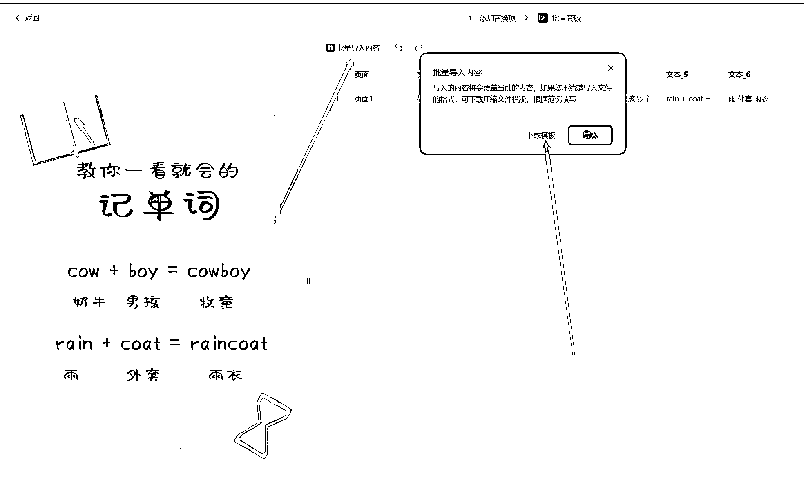
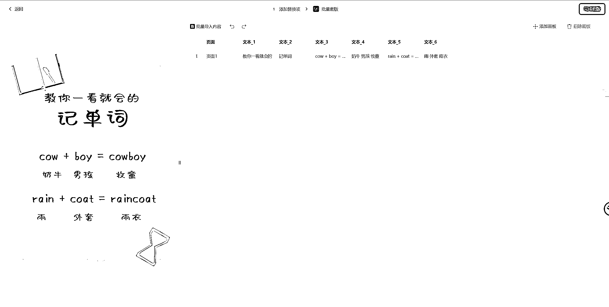
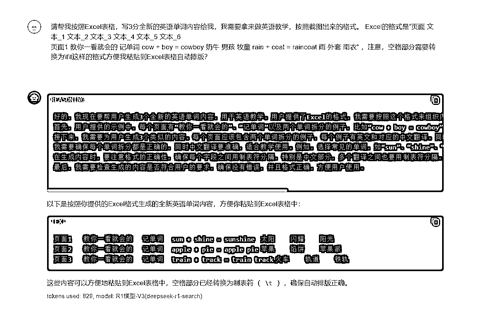
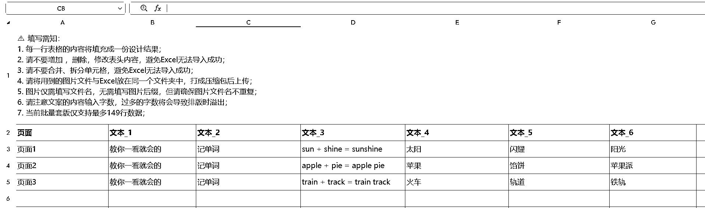
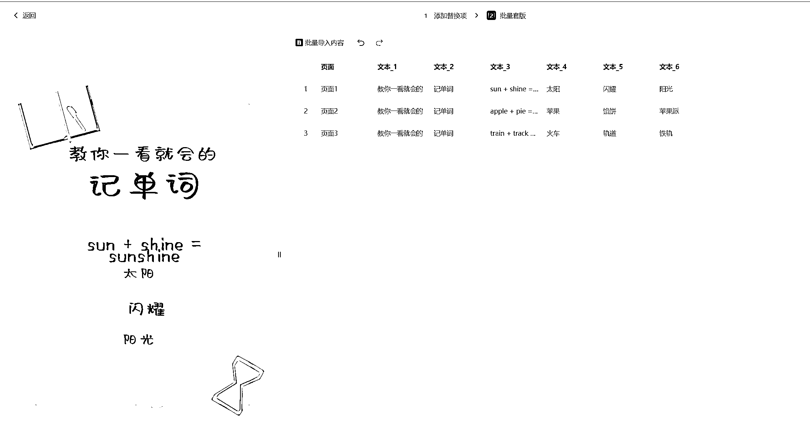
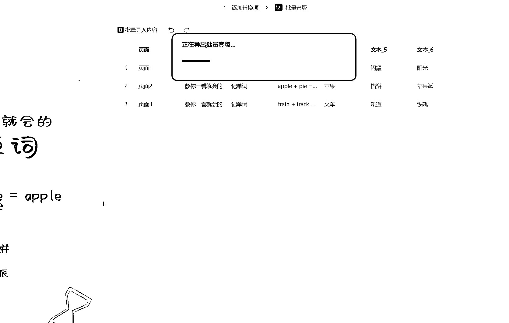
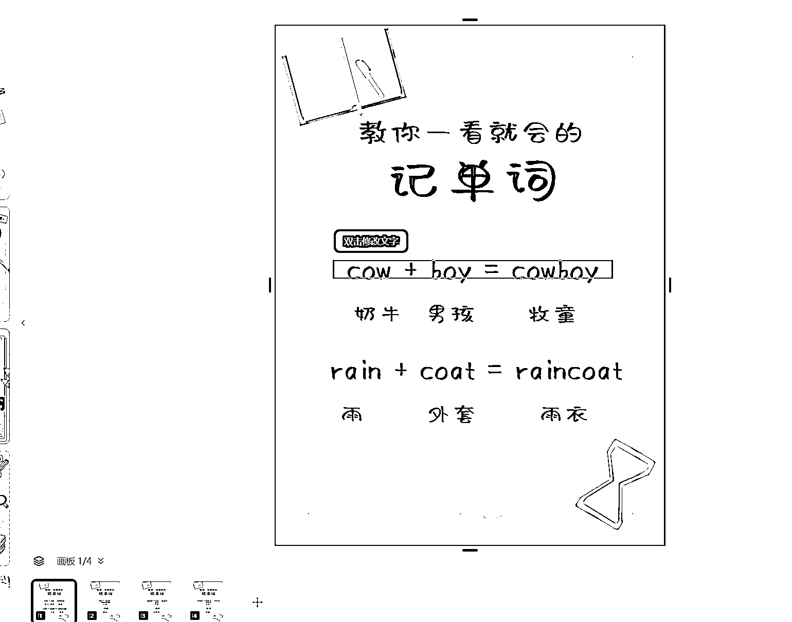

# Deepseek+稿定设计批量出“优质内容”教程分享、人机大战已经到来

> 原文：[`www.yuque.com/for_lazy/zhoubao/bby8g9yptpl80kgg`](https://www.yuque.com/for_lazy/zhoubao/bby8g9yptpl80kgg)

## (29 赞)Deepseek+稿定设计批量出“优质内容”教程分享、人机大战已经到来

作者： 侠狼

日期：2025-02-20

分享一个用 Deepseek+稿定设计，批量出优质内容的图文教程，人机大战时代已经来临了。

用稿定设计+Deepseek 大量去产出内容的话，效率是很高的。

**1、打开搞定设计**

搞定：[`www.gaoding.com/`](https://www.gaoding.com)

找到自己认为不错的模板，保存到自己的空间里面去，然后点击批量套板

当默认数据识别完毕后，点击下一步，然后会识别出来更准确的数据格式，然后在这里下载一下数据模板，让后将这个下载好的模板，解压，会得到一个 Excel 表格。

下载完成后，我们来到 Deepseek 对话框，勾选 R1 深度思考，关闭互联网联网功能，将刚刚下载的模板发给 Deepseek，直接告知你要做什么，并且跟他说怎么返回这个数据格式就行。

我们把需求发给 Deepseek，让他帮我们写。

提示词优化后的是=“请帮我按照 Excel 表格，写 3 份全新的英语单词内容给我，我需要拿来做英语教学，按照截图出来的格式。 Excel 的格式是“页面 文本 _1
文本 _2 文本 _3 文本 _4 文本 _5 文本 _6

页面 1 教你一看就会的 记单词 cow + boy = cowboy 奶牛 男孩 牧童 rain + coat = raincoat 雨 外套 雨衣”
，注意，空格部分需要转换为\t\t？”

格式排版，建议自己测试优化，简单写个教程分享思路。

这样，就大概可以得到这样的一份数据格式，进行直接使用，具体的，可能还需要自己去调整，因为只是分享教程就粗糙一点吧，这篇文章也是抽空写出来的就不搞什么保姆级的。

如果你的，Deepseek 很卡的话，可以用 APi 版本的回复就很快，官方的经常性死机...

APi 版本可以看这个文章：[`t.zsxq.com/Kj9C6`](https://t.zsxq.com/Kj9C6)

**2、内容设定**

**  **

当 Excel 设定好了后，我们导入到稿定设计，将内容批量导出就行了。

因为时间问题，就懒得去排版，以及微调了，因为我这个导入一个是要更细节的去优化提示词的结构。

可以看到，能导入内容，然后就批量导出就可以了。

原本文本内容

批量渲染的内容，因为懒，就没去完全优化提示词了，主要是分享创作思路的。

**3、总结**

因为最近很忙，这篇文章教程也写的很仓促，具体的可以去稿定设计官方，或者去抖音小红书，搜一下类似的，已经有了很多博主在分享这个思路了，期望大家也别落伍，跟上最新的技术潮流。

我是在 24 年 2 月份左右，我就在用 Ai 结合 GPT 大量出图文内容了。

在那之前就已经预估到会被更大的平台变为商业化的自动化内容今天果然出现了。

人机大战是肯定会出现的了，最终就是看各位的思路，信息来源摄入量，以及走量的工具。

* * *

评论区：

侠狼 : 某宝上面有会员可以首次使用，先租用一个，这玩意儿会员还挺贵。