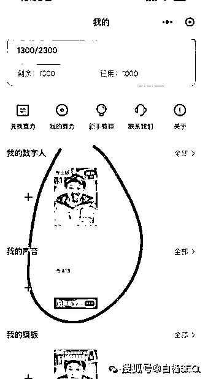
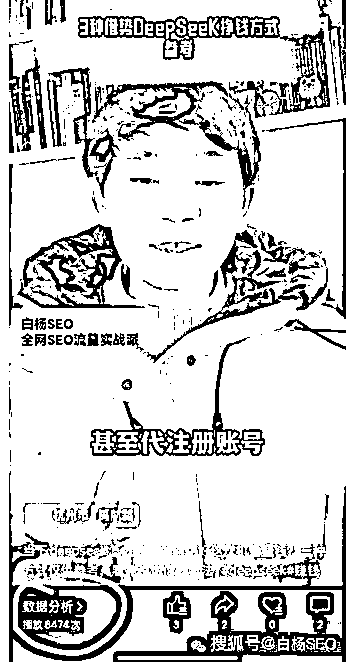
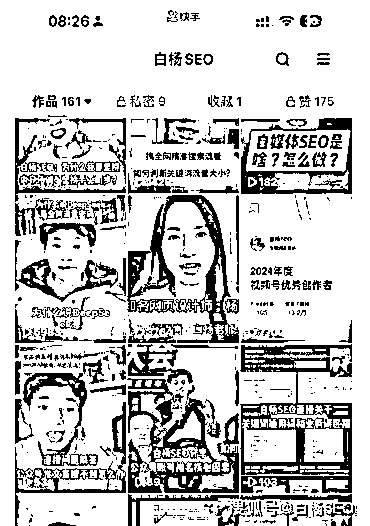
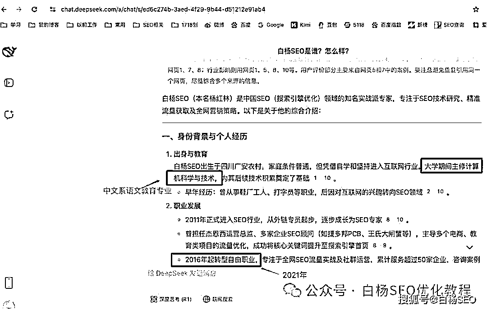

# 白杨 SEO：数字人做短视频有流量吗？为什么说结合 AI 推广获客转化更高效？

> 原文：[`www.yuque.com/for_lazy/zhoubao/qkuac5iabpk96mgm`](https://www.yuque.com/for_lazy/zhoubao/qkuac5iabpk96mgm)

## (7 赞)白杨 SEO：数字人做短视频有流量吗？为什么说结合 AI 推广获客转化更高效？

作者： 白杨 SEO

日期：2025-02-19

数字人生产短视频有流量吗？为什么可尝试？

我之前说过，白杨 SEO 自己的短视频不会用数字人。但是，去年就有很多人问我数字人，同时，曾有个我群友，搞个数字人说花了几大千后面做视频还按分钟收费。所以我就问我群里另一个群友，他给我推荐了一个数字人。

那个里面也有免费的，只是免费的没有花钱训练更真，我问了价格，365，然后就买了训练了一个，然后还可以做 20 个左右视频，长啥样，如图：

文案是我自己原创文章 AI 再改写，然后让数字人生成的。其实声音我还不满意，而且把我手的动作变快了哈哈哈。自动配图也是不太好，但整体智能剪辑比我剪辑好？

有流量吗？我后面又发了一个，从推荐流量角度来说，还有，这个是是视频号推荐来的，如图。发快手的也有，都是白杨 SEO 实战截图。

但我是做精准搜索流量的，这种推荐流量，除非只做品宣哈哈哈。

为什么说数字人做短视频可以尝试？因为现在是 AI 时代，是内容时代，传统生产内容效率确实太慢了，而且 AI 数字人虽然视频不是真人拍摄，但内容一定要多把控，只要对用户有用，还是可以弄的。

我从之前不尝试，到现在尝试，未来还是以真人为主，这个数字人是不是可以帮我做其它比如带货做短视频，是不是上面说的飞书生成内容结合短视频都是可以的。

不要问我是哪家数字人之类，网上太多了，这里就不打广告了。如果你真的感兴趣需要，你可以找白杨 SEO，私下发给你，自我把控哈。

**为什么说 AI 技术让推广获客及转化更高效？**

白杨 SEO 为什么说现在 AI 技术让做推广获客以及转化的效率变高了呢？

主要有三个因素，仅供参考：

1、因为有 AI 大模型技术的加持，让我们做产品或生产内容的思路拓宽，不再有什么不知道写什么或者产品亮点，用户需求不知道怎么分析之类。

2、有了 AI 大模型技术支持，不管是生成文字，图片，声音，视频的效率比没有会快上 N 倍，同时还可以让 AI 结合起来真正做好自动化生产。搞流量还缺内容吗？

3、有了 AI 大模型技术，针对潜在客户转化也有助力，不管你是做公域还是私域，评论回复，公众号自动化回复，微信回复，甚至售后客服，都可以接入 AI 提高效率，是不是让转化也提高了？

所以有人说，2025 年以后，一定是会 AI 淘汰不会用 AI 的；会用 AI 结合自动化的淘汰只会用 AI 基础的；而真正能判断 AI 给出结果是否正确的人更重要，所以在持续在行业专注的人也很吃香！

除此以外，针对 AI 搜索或者 AI 大模型的优化（从无到有，错误更正）也未来是刚需，这个也就是 AIO。比如关于白杨 SEO 的个人经历介绍，DS 上也有错误！我是四川教育学院，现更名成都师范学院的中文系语文教育专业毕业的，这个引用源错了，把我专业都改成了什么计算机科技，哈哈哈。

关于这个 AI 优化，我目前正在研究，已经一些方向，研究出来再分享。

* * *

评论区：

暂无评论