# 想出海靠产品赚美元？你的第一个网站教程来啦！

> 原文：[`www.yuque.com/for_lazy/zhoubao/cx4g84qikcfgai0m`](https://www.yuque.com/for_lazy/zhoubao/cx4g84qikcfgai0m)

## (精华帖)(212 赞)想出海靠产品赚美元？你的第一个网站教程来啦！

作者： 彩笺

日期：2025-02-19

今天亦仁老大官宣了一个重磅消息，小排老师要出山教大家做产品赚美刀啦！

再加上昨天联合办公第一天从生财的一个小伙伴那里了解到，马上要有一个类似于“出海第一站” 的航海要搞

再加上，我最近有想过写一篇很详细基础的出海做网站的帖子，**不为别的；就为了能吸引到更多的同道，一群人才好玩！**

我会尽可能的，详细的，小白也能看得到的；把第一站的路给大家呈现一下。同时涉及到的东西比较多，我做不到事无巨细每个坑都能提前帮你写出来解决方案，但是我会把内容控制在，前一步和后一步，只要你垫垫脚，够一够，就能摸到。

## 前言

网站，是产品的一种形态，我对出海做网站的理解总结为八个字是：**找到需求，满足需求** 。

在过去，做网站是一件很难的事情，普遍意义上的做网站；大家的视线会更多的聚焦于**满足需求** ；而满足需求，需要拥有特定的有难度的技能 ---写代码。

所以在过去，程序员们混的都还不错；因为他们掌握在大多数人没有掌握的技能。那些大一点的公司，他们拥有很多的部门和很多的产品；他们是怎么做产品的呢？可以简单概括为：

**产品经理负责前半句：找到需求**

**程序员负责后半句：满足需求**

当时间线走到今天，25 年春；随着 AI 的能力提升，后半部分**满足需求** 变得越来越容易。小排老师在之前的帖子中也有说过：

> 只靠想法就能赚钱的时代到来了！

## 变现方式

在详细的第一站之前，先给大家真实的描述一下赚钱的前景。

我见过有光靠流量带来的广告费月入近 **$5w** 的网站

我还见过，依靠满足用户的付费需求，通过订阅日入 **$1k** 的 AI 工具站

出海，几乎是变现天花板最高的，甚至可能没有之一。

我们生财，就有很低调的大佬，0 编程经验；去年月入万刀。

而想赚到这么多钱，你只需要：**找到需求，满足需求**

## 找到需求

抛砖引玉一下，分享几个我会的发现需求的方式（带案例），这些所有的案例，我都做过网站练过手。

有其他的奇技淫巧也欢迎大家在评论区分享。

### 自己的需求

自己的需求是一个很有意思的事情，他很可能只有少部分，甚至只有你自己是这个产品的用户，不过那又有什么关系呢？

#### 案例：

我之前在聊天的时候，有时候需要保存一些截图，我用 windows 自带的截图工具，每截一张都需要手动的点开，然后点击保存。我如果使用微信自带的截图工具，也需要在聊天框中右键-
另存为，为了解决我的这个需求，我做了这么一个网站：

[`bulkscreenshotdownload.com/`](https://bulkscreenshotdownload.com/)

核心功能是：截图后打开当前网页，然后 ctrl-v 粘贴，我把我想保存的所有图片粘贴上去，然后一键保存。

### 抄来的需求

你可以看看别的网站在做什么，然后**“很好，现在他是我的了”**

#### 案例：

这个世界上有各种各样的网站，我们随便在 google 搜一个**play game online** , 你会发现有很多可以让你在线打游戏的网站。

那么怎么判断这些需求的大小呢？

推荐一个国人朋友做的免费插件**AITDK** ，我们搞出海的几乎人手一个，并且免费。

他的一个功能是在你的搜索结果中，显示网站的流量。

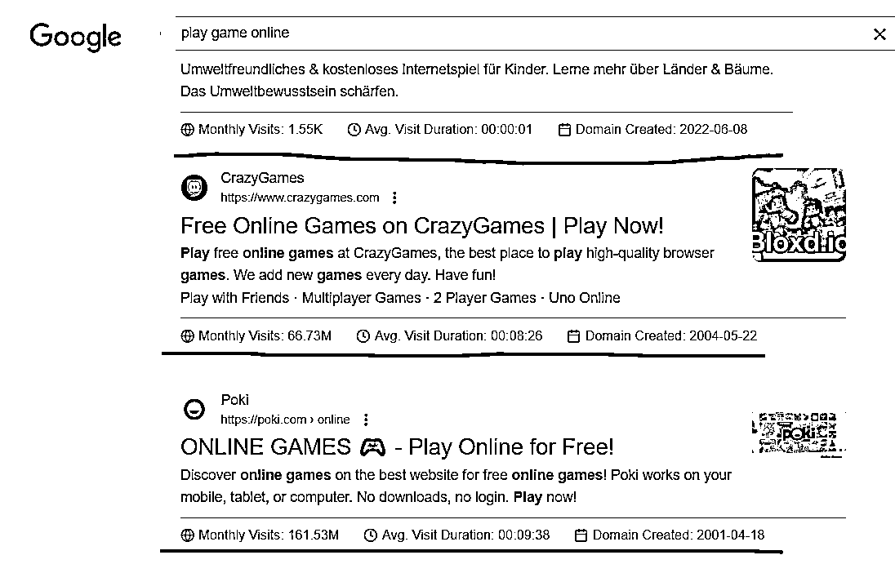

找到一个别人在做的，有流量的网站，抄一个类似的网站，或者比他做的更好！

### 身边人的需求

前两天一个朋友做私域发售，有一件事情引起了我的注意。在那些天里，他有一个重复性的工作就是，把要说的话，复制，然后多选转发到多个微信群聊，然后重复此过程。我问他，如果有个工具，

**可以让你选择好要发送到哪些群或者哪些好友，然后上传要发送的消息；然后可以间隔 1-3s 一条条发送**

你会付费吗？ 她说她一定会。

### 用工具找需求

有两个工具，出海人用的比较多：**semrush， simlarweb** ，这两个网站上有个功能是：可以基于你给的关键词，拓展一些相关的关键词。

#### 案例：

我们在工具中搜索：**generator**

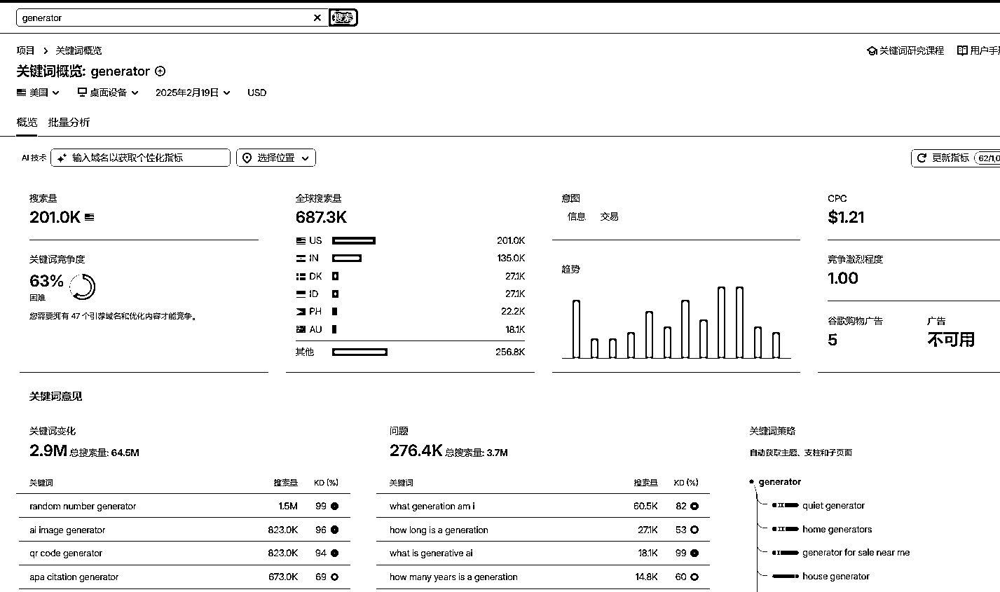

图中的信息有：

*   generator 这个词在全世界和一些国家的**月搜索量**

*   这个词的竞争难度，代表了如果你做了一个相关的网站，你的排名能做到比较靠前的难度。（不敢保证一定准）

*   CPC 点击成本，他在某种程度上代表了你的网站广告值不值钱

**重点说一下：**

*   **关键词变化** ：这个列表列举了，generator 都有哪些相关搜索；图中我们可以看到，有很多人在找：随机电话号生成，ai 图片生成，二维码生成等等，这些就是需求。

*   **问题** ：你可以看到，比较多的人会搜什么和这个词相关的问题

一张图的信息量，已经浮现了很多的需求了。

我在刚开始出海的时候，会寻找一些低难度的，并且有一定流量的词，**练手** 。

### 新需求

这个世界上，每天都会出现超级多的新事物（例如微博热搜经常会有一些 xx 和 xx 结婚/离婚），他带来了很多新词的搜索。

按照我的经验，新需求，是出海能拿到最快正反馈的！

#### 案例：

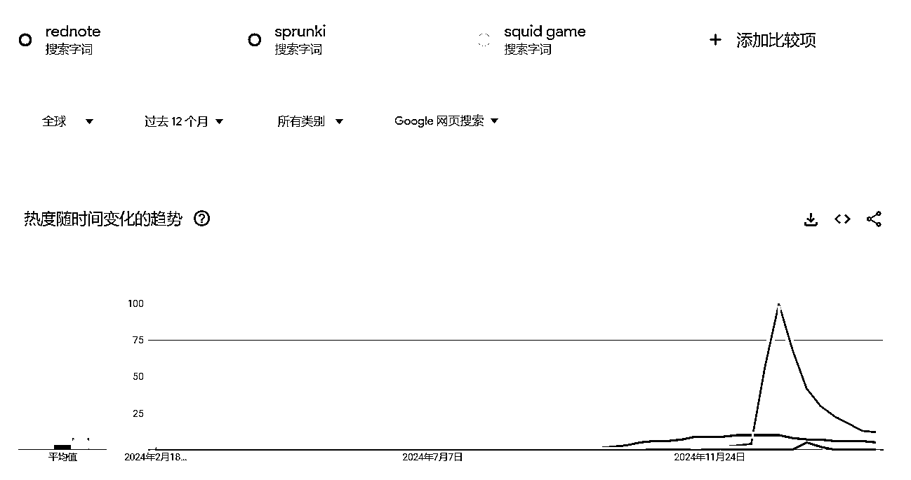

上图我展示了三个词，他们在去年某个时间点之前，是没有人会搜索的，但是突然就旱地拔葱了，对于没有人搜索的词，google 结果中自然是没有什么网站内容可以满足这些搜索的；那么你抓住机会大概率会拿到一个很靠前的排名。

分别介绍下三个词

**rednote**

之前 tiktok 面临封禁，大量 tiktok 用户涌入小红书，很多海外的人就都在搜 rednote

**sprunki**

这个词是一个在线游戏词，去年，只要是做了这个词的，拿到排名的，都赚了个盘满钵满。

**squid game**

鱿鱼游戏，相信很多人都不陌生，为什么他突然有这么多人搜呢？ 因为前段时间鱿鱼游戏在奈飞上 上映了，大家都在搜这是什么电视剧。

有的朋友看图可能会问，除了鱿鱼游戏，其他两个词看着量级也不大啊，值得注意的是：大和小是比较概念，他们的趋势大小和自身流量无关，而是和比较对象有关。

### AI 相关需求

随着 AI 的逐渐成熟，我觉得他值得单开一栏来介绍。新技术的出现，带来了很大的变革，有很多以前不能做的事，现在能做了，有很多之前的需求，现在可以做的更好了。

#### 案例 1：

今天发的风向标：

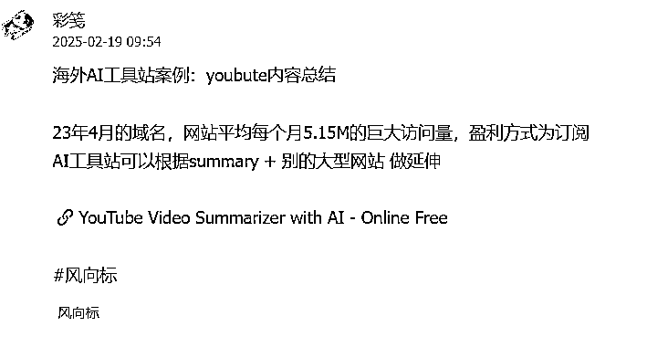

#### 案例 2

上一个中标，分享了 api 服务商的一个榜单，榜单介绍了那些使用了 AI 的网站：

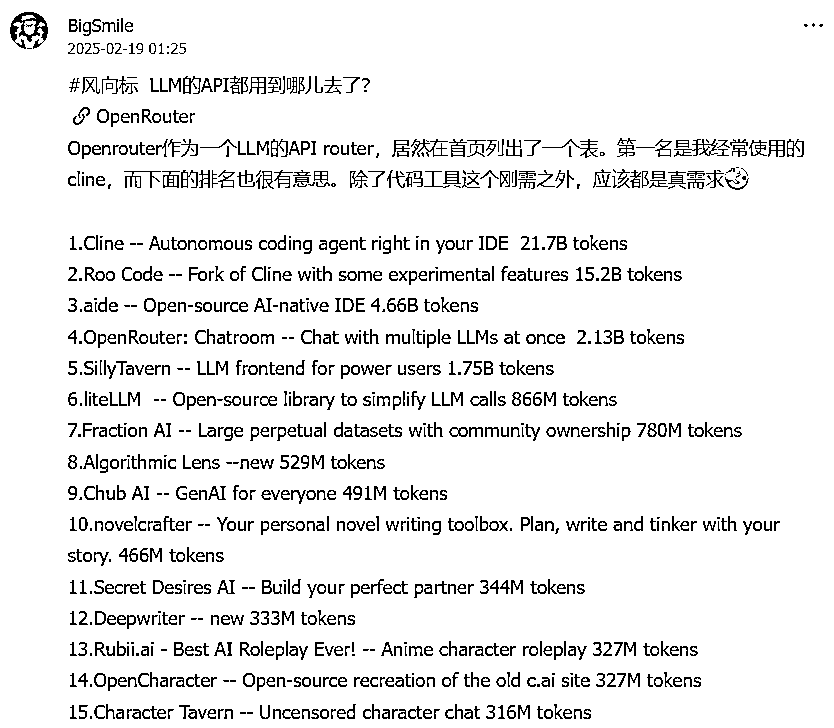

#### 案例 3：

AI 导航站，我们社群的朋友做的 AI 导航站：[`www.toolify.ai/`](https://www.toolify.ai/) 本身就很能赚钱了，然后还能让我们看到很多的 AI 站

上面有个好几个 top 榜单，从好几个维度向你展示那些别人做的 AI 站。

#### 案例 4：

我们生财内部就有孵化类似的 AI 项目，感兴趣的自己去浏览生财的相关帖子吧！

### 找到需求的最后

是不是我挖到了需求，实现了需求，就能赚到钱呢？当然不是。工具如果没有带来价值，那就是垃圾。在你满足需求之后，你还要想办法，让用户知道你的工具的存在，并且用起来，这样才能赚到钱。

关于上面提到的一些工具，篇幅原因我无法一一列举其中的所以功能，诸君自行探索；有时候，初见最为美妙。

## 满足需求

此部分会包含比较多的实操信息。

找到需求， 我们需要满足需求，也就是到了上手写代码，干活的时候了。

这一部分涉及到的编程相关概念，我会尽可能的让你能听明白。并且容易实操

### 网站的构成

一个网站包含以下部分：

域名

服务器

代码

#### 什么是域名

域名就是大家口中的网站，baidu 就是百度的域名，这是你网站的外部入口，想一想，人家得知道你的地址才能找到你吧？

域名就是全球唯一的，通过这个名字能找到你，也只能找到你的“地址”。

#### 域名在哪购买

我推荐你上 cf（cloudflare) 上去购买，世面上有很多家卖域名的，cf 的对于第一站最方便。域名可以在你的网站实现之后，再来购买不急。

#### 什么是服务器

服务器就是放你运行的代码的地方。你自己家有地址，但是也得有对应的房子对吧。现在有很多的免费的地方给你部署代码，像是 vercel，cloudflare，netlify 等等。

### 如何写代码

在分享如何写第一个网站代码之前，我比较推荐你花时间学一下编程

会编程才能更好的驾驭 AI，cao 大（caoz 的梦呓）不止一次的提到这件事情：

[`mp.weixin.qq.com/s/1zM94DlcrcMsU7Y8vz6ifQ`](https://mp.weixin.qq.com/s/1zM94DlcrcMsU7Y8vz6ifQ) （置顶评论区）

上次 cursor 航海之后，我最大的感受是：

**很多没有编程经验的朋友，最大的困难是，对于编程没有通识性的概念，未曾看过全貌，所以会很懵。**

那么对应的解决方案是：

学会主动搜索，对于编程中的有着确定概念的事情，你可以直接问 deepseek，给的答案基本都是准确的

遇到不懂的概念，主动搜索。

去学习通识性的课程，了解全貌，你可以自己找一些公开课（优先找国外的经典课程），也可以追着 deepseek 问。

在这个基础上，去翻阅上一期的 cursor 航海手册，相信你可以很快的入门编程，**拥有 自己创造杠杆的强大能力。**

下面是正文：

#### 最简单的方法

我们知道网站用的编程语言是 html，网上会有很多的开源的网站代码模板。所谓的模板，指的是一个比较基本的网站，你可以基于模板修修改改来制作你自己的网站。借助模板可以帮你省去大部分时间。

google 搜索**html web template** ，找了一个有大量的免费的网站模板网站：<[`www.free-`](https://www.free-) css.com/free-css-templates>

找一个你喜欢的风格，打开之后点击 download：

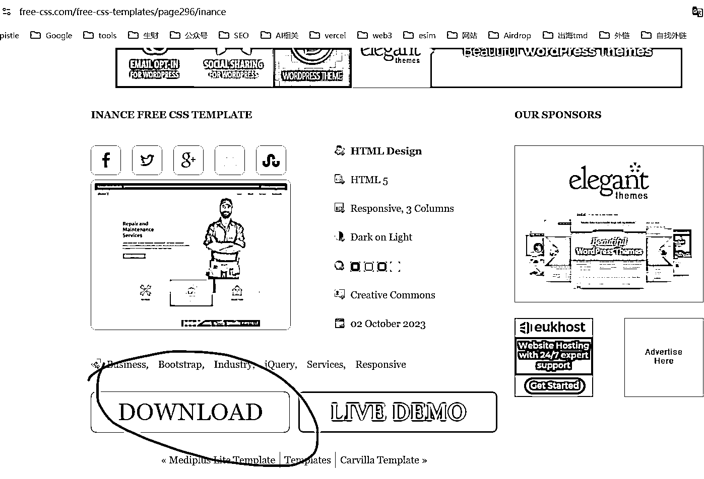

下载好之后是一个压缩包，解压之后你大概率会看到这么一个文件夹：

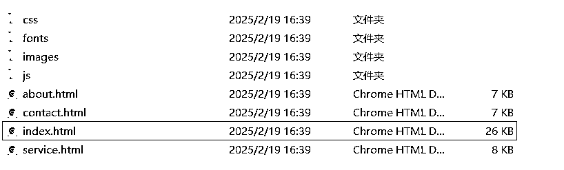

你打开这些 html 文件，就是对应的网站页面了。

至于不同的后缀，目录名，分别是什么意思，你大可以请教 AI 老师。

##### 快速部署

打开你的 cloudflare，找到这个页面，然后点击**创建** 。

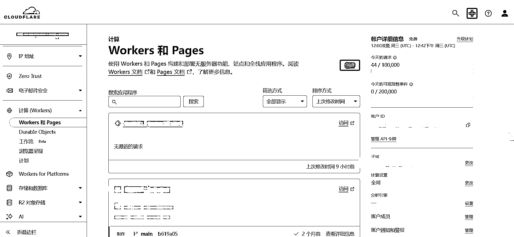

然后选择 pages，滚动到靠下的部分**使用直接上传** ，点击**上传资产**

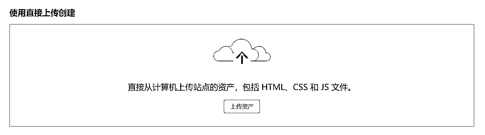

起个项目名字，然后点击**创建项目**

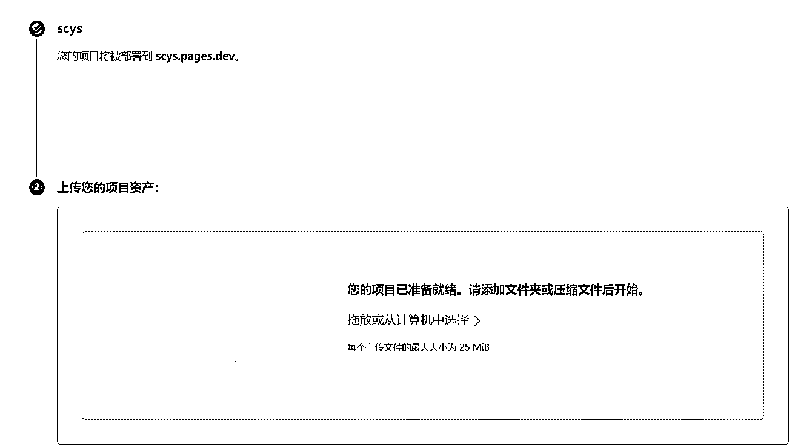

**然后把你的代码文件夹拖进去**

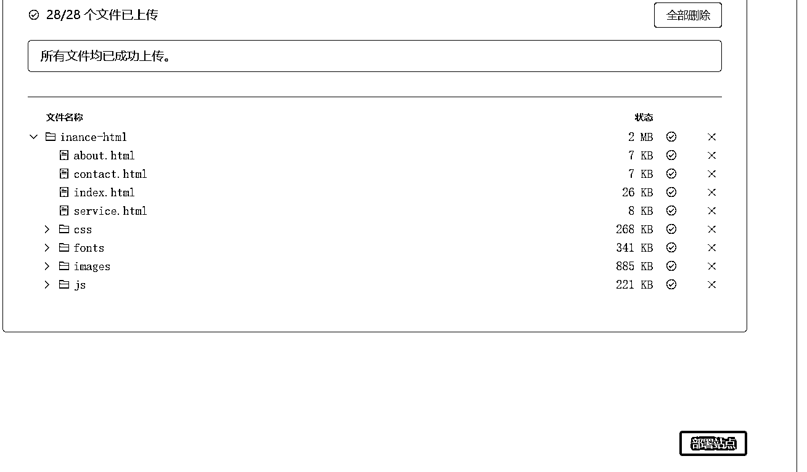

然后点击**部署站点**

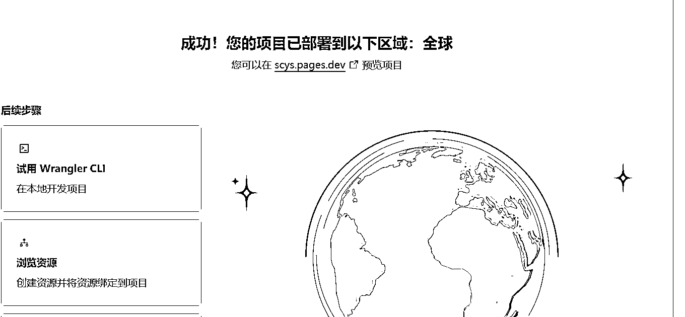

等待一会域名就可以访问了：[`scys.pages.dev/`](https://scys.pages.dev/)，自此

如果你想修改代码，让他有更多的你期望的元素进去，欢迎询问 AI，你甚至可以直接把 html 文件，或者代码拷贝给 AI，然后告诉他你要修改页面上的哪些内容；更深入的玩法可以直接翻阅上一期的 cursor 航海：

[`scys.com/view/docx/YIvBdL38ConF89xdBvAckZBPn5e#RrpfdE4ZuojTLlxEuzscv5FsnXf`](https://scys.com/view/docx/YIvBdL38ConF89xdBvAckZBPn5e#RrpfdE4ZuojTLlxEuzscv5FsnXf)

cursor 航海中有稍微进阶一点的网站制作方法，此处不再赘述。

#### 方法 2

通过使用自然语言描述，搭配 [`bolt.new/`](https://bolt.new/)

具体方法可以参考小排老师的文章：

[`scys.com/articleDetail/xq_topic/4848511545851418`](https://scys.com/articleDetail/xq_topic/4848511545851418)

#### 方法 3

这里介绍一种，有些复杂，但是基本可以满足大部分网站需求的做网站方式。**如果你愿意持续的在出海这件事情上深耕，那么你可以看看这个方法。**

拿我自己举例：

我会先准备一份类似于方法 1 中的模板；不同的是，我会选择一些更高级的编程语言，像是 astro，nextjs。

你可以使用 bolt，让他给你生成一个简单的模板代码；有最基本的 layout，header，footer 等

然后把生成的代码存储到 github 仓库。

具体操作路径在这里有提到：[`scys.com/articleDetail/xq_topic/4848181215212848`](https://scys.com/articleDetail/xq_topic/4848181215212848)

你也可以去网上找一些现成的，免费或者付费的模板，比如你可以去搜索 astro template, nextjs template.

存储到 github 之后，把代码下载到本地；在这一步你需要本地安装一个 git 工具，git 工具可以让你操作本地和远程的代码仓库。

这里我使用**git bash** 命令行的方式。 你也可以去问下 AI，还有哪些别的方式。

安装 nodejs，有了 nodejs 大部分事情都会变得简单起来。

textjavascripttypescriptcsshtmlbashjsonmarkdownpythonjavaccpprubygorustphpsqlyaml
Copy

```
好的，我用最简单的大白话告诉你 Node.js 是什么：
​
**Node.js 就是一个能让 JavaScript 在电脑上运行的工具。**
​
- 以前，JavaScript 只能在浏览器里运行，用来做网页上的动态效果（比如点击按钮弹出窗口）。
- 有了 Node.js 后，JavaScript 就可以在电脑上运行了，可以用来做服务器、处理数据、操作文件等等。
​
举个例子：
- 如果你想做一个网站，以前需要用 PHP、Java 等语言写服务器代码，现在用 Node.js 就可以直接用 JavaScript 写服务器代码了。
- 它特别适合做需要快速响应的事情，比如聊天软件、实时更新的网页等。
​
总结：**Node.js 就是让 JavaScript 从浏览器里跑出来，变成可以在电脑上做更多事情的超级工具！**

```

项目初始化

进入你的代码目录，此时是一个简单的模板，他没有任何的功能，就是个空壳

运行以下命令安装相关依赖，意思就是把你的网站会用到的一些别人写好的代码，不会改变的，下载到项目中，听不懂让 AI 说大白话把！

textjavascripttypescriptcsshtmlbashjsonmarkdownpythonjavaccpprubygorustphpsqlyaml
Copy

```
npm i  

```

然后运行以下命令启动本地预览：

textjavascripttypescriptcsshtmlbashjsonmarkdownpythonjavaccpprubygorustphpsqlyaml
Copy

```
npm run dev

```

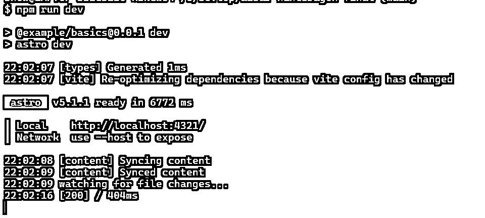

在浏览器输入： [`localhost:4321/`](http://localhost:4321/) 来预览查看你的效果

这时你的雏形网站已经可以运行了，需要根据你解决的需求，添加对应的功能，打开 cursor 编辑器，在 cursor 中打开代码目录

愉快的使用 AI 辅助你编程把！

当你觉得差不多了，可以使用 git 把代码提交到远程仓库

在 vercel，或者 cloudflare，或者其他平台上线你的网站，绑定你自己购买的域名

在 google 上线

[`scys.com/view/docx/HA9gdKmiLodgznxfwCYc44GtnDf#KUMHd1C23ox5XHxejoccukBRnOf`](https://scys.com/view/docx/HA9gdKmiLodgznxfwCYc44GtnDf#KUMHd1C23ox5XHxejoccukBRnOf)

想尽一切，正规的办法，获取流量。

写在最后：

本文的主题主要围绕**做出第一个站而来** ，所以两部分，**第一部分需求挖掘来解决做什么站的问题；第二部分解决实现的问题** 。

如果想针对做出网站，快速拿到正反馈，可以尝试前两种方法；如果你愿意花费一些精力和功夫，并且有精进下去的打算，那么大概率你会在实践途中遇到第三种方法。

至于你的网站能不能赚到钱，和你做了什么、用了什么技术没有关系；

核心是 **有人用** 。 即 你满足了需求，也被人看到了。

至于如何被他人看到，拥有更靠前的 google 排名，有很多的方法，可以参考下之前的工具站航海。

身边大多数出海做网站的朋友，大多数都会在一开始选择 SEO

这是一种免费的，有效的，但是短期看不到太多效果的做法，但是你大概率绕不开他，最基础的 SEO 是一定要走的路。

最后，欢迎有想法的朋友，翻阅生财的帖子和航海手册，或者直接来生财找我，保证知无不言言无不尽。当前的信息量+持续有效的实践，足够你一步步完成最开始的实践了。

另外，小排老师马上要分享如何出海做产品了，如果你想报名，期望可以在小排布道师的分享中，尽可能的汲取知识；那么先实践起来吧！期待未来的相遇。

* * *

评论区：

潇潇荷 : 行动力真杠杠滴

黑帽子 : 用 Wordpress 其实比 Ai 开发门槛还低，也可以满足多数的网站类型

彩笺 : 没用过 wordpress ，我觉得用 AI 已经很方便了，像是方法 1，一个雏形网站，基本不需要很多操作就能实现

黑帽子 : Wordpress
一分钟就能实现前端➕后端➕数据库，以及后台有海量的模版以及第三方插件，可以实现内容、电商网站，如果是社区的话可以用 discuz 这些都是存在一二十年的开源程序了，国内的比如织梦、帝国 cms，我还以为很多人都知道😂

彩笺 : 是个很不错的上站路径，不过应该确实有很多人不知道 wordpress，另外有个差异是 wordpress 确实功能很齐全，但是站在做第一个站的朋友视角来看，或许数据库的概念都不清楚。面对 Wordpress
众多的功能，插件可能会头晕，话都说到这了有空分享下 wordpress 上站呀[呲牙]

彩笺 : 有很多形态的模板，html，各种技术框架的，wordpress 我没用过，你说的这种第三方模板是不是也要依赖于 wordpress？学习成本是不是要比直接用 html
的模板要高一些？ 不过确实提供了一种新的比较容易上站的可能，至于哪个更好用，各花入各眼吧，这种争论一直都存在

黑帽子 : 学习一点 html 也好，但是 wordpree 确实很成熟了，而且过去二十多年还没有 Ai 的时候，很多草根站长就是靠 wordpress 以及帝国、织梦 CMS 建站的，不用懂任何代码，后台插件、模版可以一键安装，配合宝塔面板，极其简单

知行 : 写得太好了，通俗易懂，这几天下场试试[666]