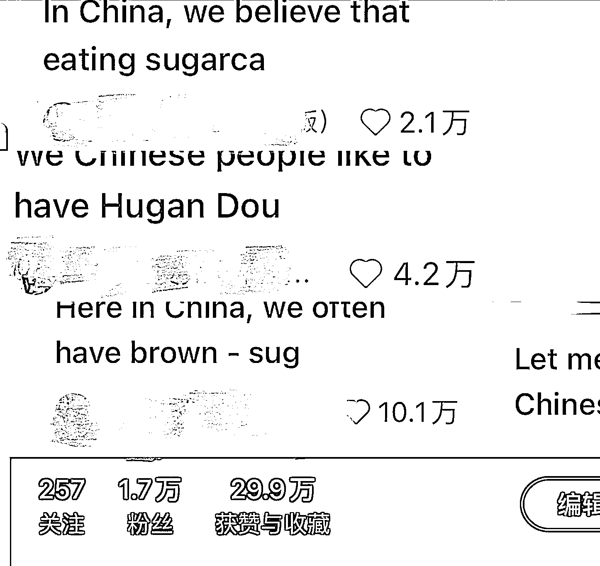

# tiktok 难民这波让我 10 天涨粉 1 万 5，一个奇奇怪怪的小红书起号方法！

> 原文：[`www.yuque.com/for_lazy/zhoubao/tdwlrwn4g6gi8gdl`](https://www.yuque.com/for_lazy/zhoubao/tdwlrwn4g6gi8gdl)

## (20 赞)tiktok 难民这波让我 10 天涨粉 1 万 5，一个奇奇怪怪的小红书起号方法！

作者： 酒酿圆子

日期：2025-02-20

各位生财伙伴好，我是星星，base 杭州，前抖音电商运营狗，主要做自媒体和达人运营，去年裸辞创业（主阵地不在小红书）。目前在寻找一些中医朋友以及亳州中药材相关供应链，希望在过程中能交到一些相对不那么功利，一起成长的朋友～

小红书是我 25 年重点规划布局的平台，目标是做 ip 账号，后期做个人品牌及电商变现。今年年初，由于其他平台业务进入淡季，专门抽出时间集中做这块，主要和中医相关。

先说结果以及晒图，有图有真相。借助 tt 难民这波，**我 10 天成功起号涨粉 1 万 5，做出了 1 个 10 万赞视频，1 个 4.2 万赞，1 个 3.9 万赞，1 个 2.1 万赞。已经可以接广，报价 700 多，** 但目前还没有想接，打算再精进下内容。

简单分享下这次的经验以及目前自己看到仍然有效的起号方法。好久没有写复盘，自己不太喜欢太复杂的东西，写得很简单，有问题可以留言交流哈～

## 1. 过程

当我发现 tt 难民上了热点后，就在思考
“热点怎样助力自己的业务？”这期间也被周围人质疑过，如果小红书管控怎么办，积累了外国粉丝不利于变现怎么办。但我当时想的是，两种情况，第一种：管控限流我尝试损失也不大，本人就是非常爱尝试的类型，哈哈哈！另外一种：积累了外国粉丝，不利于变现，没关系，我要的是粉丝量基础和内容初步互动数据，通过这些爱评论爱点赞的外国友人粉丝，在算法中放大我的内容。事实证明，这一步还是走对了。

**第一阶段：内容形式优化-视频加上英文字幕，** 便于老外阅读。效果有但不多，因为信息流中封面+标题用英文显示而非英文讲解，还是太不够直接了。

**第二阶段：配音优化-视频用英文配音，** 刷信息流的时候，发现一个老哥一条非常简单的视频，只是用英文讲解，快 5 万赞。立马改成视频用英文配音，然后第一条就爆了 3000 赞，第四条爆了 10 万赞。

**第三阶段：选题优化-视频切大众痛点。** 在 tt 难民火爆期间，我就一直在关注平台动作。毕竟之前一直在平台，深知平台引导的内容方向就是流量方向所在。当时教外国人做鸡蛋羹大爆，我就围绕着鸡蛋羹相关做视频。以及所有女性共同的痛点，姨妈痛为切入点，也是我第一条 10 万赞视频。以及熬夜，泡脚相关的共同痛点或者猎奇视频，都继续几万赞的爆量。

## 2. 反思及可复制起号方法

**1）反思**

1.  **在该努力的时候，没有更努力。** 应该趁热打铁多更新多拉升账号权重及流量，但我只更新了 10 条左右，倒不是懒，而是临近过年一些乱七八糟的事儿太多，早知道就不回家过年了（摊手 ing）。创业还是应该专注聚焦。

2.  **账号结束第一阶段起号后，应该优化内容形式，进入第二阶段吸引中国粉丝，提高账号商业价值。** 自己之前也意识到了，但是没有做到比较满意的程度。

3.  **商业变现思路不算特别清晰。** 在账号曝光度最强的时候，周围人劝我挂小清单，但是我没做。老外留言要买各种东西，我没店铺资源和人力。之前也纠结要趁热打铁做国内店铺，我知道如果我做，肯定能做起来，但是苦于人力不够，小红书不是我主业，而是为未来做准备的第二曲线。思考再三还是放弃了。目前是打算先接广盈利，做长线内容和 ip，明年再大力入局电商。

**2）可复制起号方法**

1.  **观察 1:** 目前虽然平台这波热点风向过去了，老外的数量可能降低，但是依然有老外活跃在平台，点赞评论转发消费内容。而平台类似内容供给较少，**如果是视频起号，依然可以尝试用英文解说+老外感兴趣的内容，通过他们喜欢的点赞评论转发行为来起号。** 先把号起了，后续再变现。

2.  **观察 2:要想起飞一定要跟着平台的风向走，** 以前跟合作方一个 mcn 的老板聊天，他说：凡是账号能起来一定是跟着一些红利起来的。比如前几年其他 mcn 没落了，大主播消失，1 比 1 模仿对标账号很容易起来。对比现在，去年部分头部主播消失或者减少开播，必然带动相关类型小主播的崛起。我这波能起来也是跟着平台热点走。

3.  **观察 3:所有自媒体的本质就是抄。** 我本来以为抖音同质化挺严重，没想到小红书比抖音同质化治理得更弱一些。但是客观说，算法层面，小红书对比抖音对普通人更友好。自媒体没想的那么难，如果实在不会就 1 比 1 拆解，拆了 100 条视频总会知道怎么拍。

以上是简短复盘，甲流恢复期写的可能有点乱～希望能有一些些启发。**  **

**  **

* * *

评论区：

暂无评论