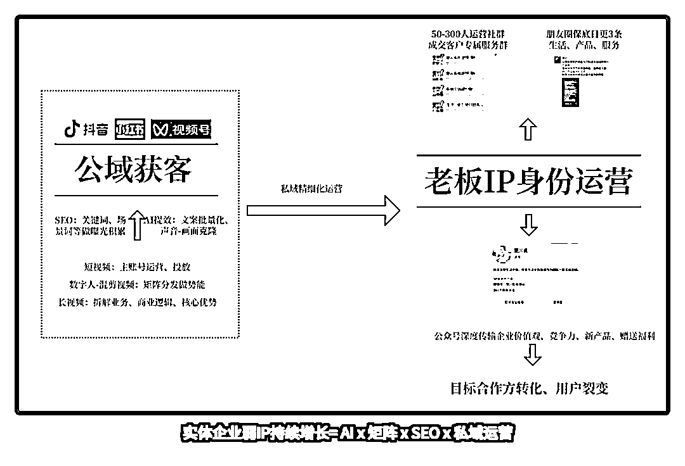

# 实体老板必看：弱 IP+SEO+AI+矩阵+私域，2025 年低成本持续增长的核心公式（附实操指南）

> 原文：[`www.yuque.com/for_lazy/zhoubao/yofe293vsfw36u8f`](https://www.yuque.com/for_lazy/zhoubao/yofe293vsfw36u8f)

## (精华帖)(71 赞)实体老板必看：弱 IP+SEO+AI+矩阵+私域，2025 年低成本持续增长的核心公式（附实操指南）

作者： 楚川

日期：2025-02-20

短视频时代，实体企业老板们陷入两难：不做 IP 会被时代抛弃，但强 IP 又需投入巨大精力。2024 年我的客户曾坦言：“每天拍视频、写脚本，比管 10 家店还累！” **楚川自己在做 IP 拍视频，做直播的时候也吐槽过：我被这种强消耗的打法“摄魂”了，啥事都不想干** 。

这种困境背后，**是传统“强 IP”模式的失效** 。而 2025 年的破局关键，在于一套新公式：**AI+短视频 SEO+矩阵+私域运营=实体企业弱 IP 持续增长** 。

**这种运营细节的迁移本质，是流量世界从“人格依附”向“系统基建”的迁移。**

旧秩序：老板 IP=流量入口=品牌信任=用户转化

新规则：算法基建×内容产能×私域网络=商业生存权

本文将穿透表象，通过拆解**“AI-矩阵-SEO-私域”弱 IP 的四维模型** ，揭示三个残酷真相：

1、强 IP 模式再难有出路，不是天选之子就要选择确定性的增长路径，个人 IP 正在从资产变为负债；

2、这是一个 AI 崛起的时代，也是算法殖民时代，必须是用 AI 提效，用短视频 SEO 保持存在和露出；

3、未来企业核心竞争力=内容产能×私域密度。

**Part1 强 IP 困局：实体老板的三大认知误区**

**  **

1.  **"必须精致完美"的执念**

**  **

我的朋友 R 姐，在杭州做高端女装设计品牌，她的经历很有代表性：为拍摄"高级感服装搭配"视频，每次都要重新布置展厅、请专业团队打光、拍摄正能量口播视频，结果 1 个月很难保持 10 条视频。这种电影级的内容生产模式，让账号变成展示橱窗而非流量入口。

1.  **"老板必须是主角"的迷思**

楚川被 IP 运营公司说服做"楚多鱼"人设，开大 G、出差、吃泡面、嬉闹文化却让老客户直言"假得看不下去"。当账号评论区开始出现"戏精老板不务正业"的嘲讽，我才惊觉企业 IP 不等于老板真人秀。当客户是大 KA 的时候，做泛娱乐视频、低干货的视频根本无法触达到业务决策人、老板层。

1.  **"一条视频吃一个月"的幻想**

我们参与服务的爱可索妇科门诊，打造百万播放量的爆款，结果到诊客流暴涨当月就出现医生数量不够、服务跟不上的乱象。运营团队开始反思："流量脉冲式到来时，团队承接能力反而暴露了经营短板。”

**Part2 弱 IP 战略落地五步法**

### **第一步，弱 IP 顶层设计，体系化运营，规划好框架就把执行力拉满。**

**公域获客层** ： 抖音/小红书/视频号 ← SEO 关键词+场景词曝光 ← AI 数字人+混剪矩阵

**私域转化层** ： 公众号（深度内容） → 社群（分层运营） → 朋友圈（日更最少 3 条） → 专属服务群（高转化）

**第二步，****建立内容生产"最小闭环"。**

1.  每日收集：门店/工厂 10 个真实瞬间（顾客互动/产品使用/工作场景）

2.  剪辑原则：保留环境原声，用字幕替代配音

3.  分发策略：同一素材拆分横竖版，分别投放不同平台

**第三步，****公域爆破：用 AI-矩阵打“人海战术”。**

1.  **账号矩阵：** 10 个账号起步，3 种类型必须覆盖品牌号

（1 个）：发布企业价值观、产品研发故事（参考“楚川说”模式）场景号

（N 个）：按用户需求拆分，如“XX 家具-小户型改造”“XX 餐饮-宵夜档”员工号

（全员）：用 AI 克隆老板声音/形象，批量生成标准化内容

1.  **执行清单：**

账号命名规则：品牌+核心词+地域（例：XX 餐饮｜小龙虾｜广州）

内容模板库：每月建立 10 套脚本模板，含产品痛点、解决方案、福利钩子（[DeepSeek 深度拆解：高转化视频如何用 AI 批量复制，“内容工业化”SOP，单条成本 1.8 元](https://mp.weixin.qq.com/s?__biz=MzU1NTE0MjQyNw==&mid=2247484910&idx=1&sn=a9027f56a6e3284561f9071565d8b7f8&scene=21#wechat_redirect)）

风险防火墙：主账号与矩阵账号用不同手机/IP 注册

1.  **AI 提效：把人力成本压缩到 1/10**

文案批量生成：DeepSeek-腾讯元宝（输入行业关键词，自动生成 100 条标题）

SEO：植入“本地长尾词+场景词”（例：“天河区办公室装修避坑指南”）

数字人：朋友圈很多，技术相差不大（上传老板 2 分钟视频，生成数字人分身）

成本对比：真人拍摄单条 500 元 → AI 制作单条 50 元

数据验证：数字人是可以诞生爆款，可以参考视频号（楚川实体增长）

**第四步，****短视频 SEO：抢占搜索流量红利。**

曾经的百度、58 同城等平台诞生了很多伟大的互联网公司，也证明 SEO 永不过时。当下阶段的所有自媒体平台，以抖音、小红书、视频号为主的都有绝对的搜索红利，这是企业必抓。

1.  **关键词布局**

工具：巨量算数+DSO114，挖掘“品牌词+需求词+地域词+场景词”（例：“佛山家具批发”）

密度控制：话题/标题/封面/字幕重复核心词 3 次以上

黄金 7 要素：账号昵称、简介、合集、标题、文案、字幕、话题均需含核心词

1.  **长尾词截流**

教育行业：挖掘“XX 岁孩子厌学怎么办”

餐饮行业：截流“广州凌晨三点营业的餐厅”

案例：天鹅到家抖音保洁 1 亿 GMV，搜索核销率是推荐的 2 倍；楚川团队夏令营平均 50 播放量的矩阵视频，线索加微率 94%，均价 4000 元的成交率 35%。

**第五步，私域分层——把流量变成“留量”，终身价值运营。**

**  **

1.  **三级引流体系设计**

**公域 → 私域漏斗** ： 短视频评论区 → 企业微信（领券） → 社群（50-300 人） → 专属服务群（高客单转化）

**钩子设计** ：初级钩子可以为资料包/优惠券；高级钩子为线下体验资格（筛选高意向用户）。

1.  **社群分层运营**

**内容：** 产品教程+限时秒杀

**激活：** AI 外呼提醒未核销用户

**特权：** 闭门直播+优先试用新品

**裂变** ：推荐好友入群享“期元奖励”（例：推荐 1 人得 200 元抵扣券）

1.  **朋友圈人设打造**

**内容三板斧：生活类，仓库实拍/团队故事（增强信任）；产品类，客户使用前后对比（场景化展示）；促销类，倒计时优惠（紧迫感设计）**

### **Part3 一切回归商业的本质**

当某天深夜，你关掉补光灯，放下提词器，用手机对准正在理货的员工、擦拭设备的技师、晨起装车的司机师傅...你会发现：**那些曾被忽视的经营日常，才是最具生命力的内容。**

**弱 IP 战略不是技术革命，而是认知革命** 。它要求我们相信：

1.  **真实比完美更有力量**

2.  **系统比个人更可持续**

3.  **沉淀比爆款更有价值**

2025 年，愿所有实体企业主放下表演焦虑，**启动弱 IP 引擎——****把老板从镜头前解放出来** ，**让企业本身成为最好的内容，让经营日常自然生长为流量森林** 。

* * *

评论区：

浅笑 : 感同身受[机智]那些曾被你忽视的经营日常，才是最具有生命力的内容。

易芝 AI|RPA 版 : 做 ip 是需要的，但需要的是生命力，而不是夸张

希声 : 先赞后看

神奇的桑桑😄😄😄 : 那些曾被忽视的经营日常，才是最具生命力的内容[强]