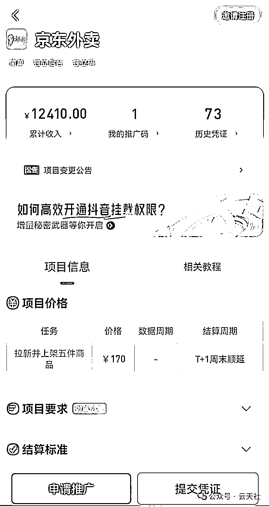
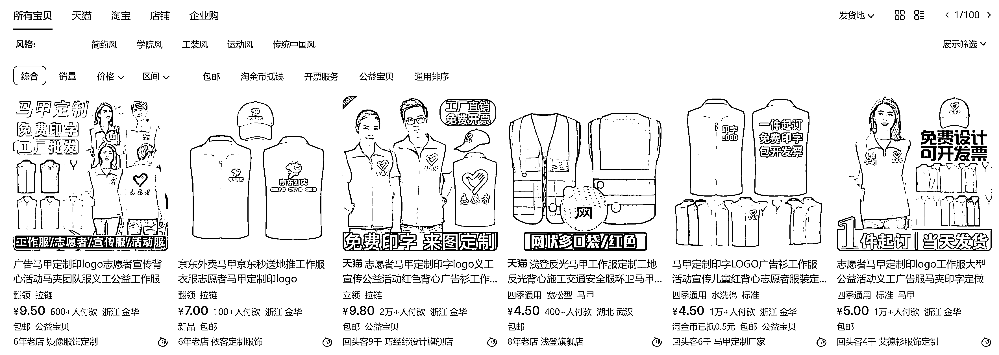
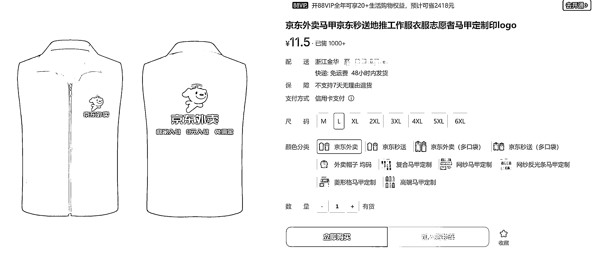

# 信息差项目，京东外卖推广，一单 170 元

> 原文：[`www.yuque.com/for_lazy/zhoubao/myd2nkkx5xg6u7nw`](https://www.yuque.com/for_lazy/zhoubao/myd2nkkx5xg6u7nw)

## (精华帖)(114 赞)信息差项目，京东外卖推广，一单 170 元

作者： 云天

日期：2025-02-19

最近京东外卖入局了，免佣金，并且不抽商家佣，推广一单奖励 170，目前属于蓝海空白。

准备工作：

当地或者淘宝定制推广马甲，就可以去做了。

具体的开通和操作流程，我发在了飞书文档，方便大家参考学习。

[`bzpjac2aeq.feishu.cn/docx/APKNdX6Jcos8TTxCfPXc0jFrnjf?from=from_copylink`](https://bzpjac2aeq.feishu.cn/docx/APKNdX6Jcos8TTxCfPXc0jFrnjf?from=from_copylink)

**2 月 20 日更新 _**

结合圈友的问题，下面是官方的答疑

# **推广问题答疑**

**Q1：全国可做还是 39 城可作业？**

答：39 个城市为重点推广地区，但是全国均可推广。

**Q2：商家评分看哪里？**

答：大众点评 APP 里，只看评分 3.8 以上或 3.8 的餐饮店，低于的请放弃。

**Q3：用户是怎么点京东外卖？**

答：在京东 APP 首页最上方点击“秒送”。

**Q4：商家入驻后是否入需要上架商品？**

答：需要，至少上传 5 个。

**Q5：是否需要对公账户？**

答：需要，若个体商家没对公账户，可以使用法人银行卡。

**Q6：有的城市点不进去什么情况？**

答：检查商家是否操作流程错误。

**Q7：基础配送费多少？**

答：3 公里内 3 元(可商家承担或用户承担)。

**Q8：商家提现及到账时间？**

答：3+1，3 天后到账商家端，提现到账 T1。

**Q9：商家资料提交后，审核时长多久？**

答：京东人工审核，前期不能保证（建议加商家微信，告知通过后提醒，二次回店协助上商品营业）。

**Q10：商家需要操作到哪个环节才属于成功有效，算可结算数据？**

答：商家入驻后，上线 5 个商品或以上，开启商家营业后，就算成功有效。

**Q11：商家接受度怎么样?**

答：根据市场调研，大部分商家都会同意入驻（相较于其他外卖平台抽成、服务费高等情况，京东上线就是 0 佣金，推广起来有优势。)

**Q12：店铺装修采单需要推广员上传么？**

答：不需要。

**Q13：推广员有独立后台吗？**

答：没有，后续可能也不会有，需返回“任推邦”平台京东外卖项目详情交单。

**Q14：连锁门店算几家门店的佣金?**

答：按照门店数量算（例如连锁店有 10 家那么佣金*10 倍，目前同一品牌连锁店最高可以享受上限 100 个店铺推广金）。

**Q15：商家的店铺管理后台是哪个？**

答：手机 APP 端：手机应用商店搜索【京东秒送商家】

电脑端网站：[`store.jddj.com`](https://store.jddj.com)

* * *

评论区：

卢道然啊 : 审核通过要多久 一家店做完需要几天

挖哈的阿抓 : 只做外卖的档口也能申请入驻成功吗

云天 : 结算期大概 7 天，如果审核失败还要重新去填

磨人的小妖精 : 地推对接的是上一级还是京东哇

林子 : 请教下，我这边小城市，京东外卖还没开放，能做吗？

云天 : 先去推，全国可做

云天 : 京东审核严，找有店铺的，美团外面上去看谁开了就找谁

卢道然啊 : 嗯嗯 感谢