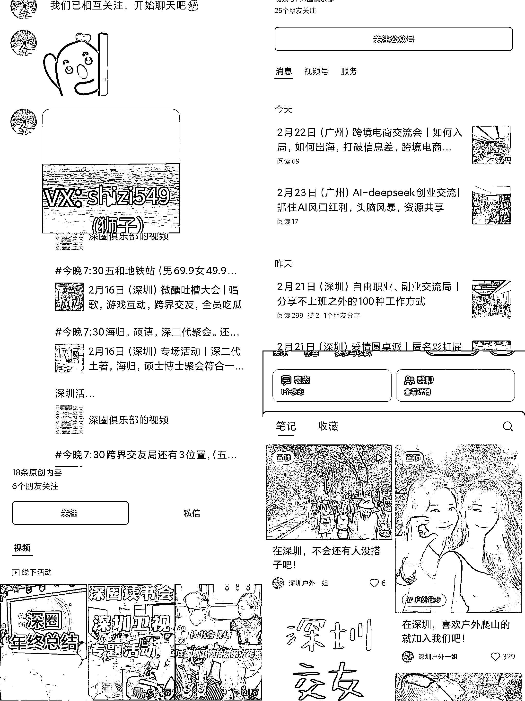

# 组局能力变现之同城活动

> 原文：[`www.yuque.com/for_lazy/zhoubao/kxc2d84ecviyy5b8`](https://www.yuque.com/for_lazy/zhoubao/kxc2d84ecviyy5b8)

## (21 赞)组局能力变现之同城活动

作者： 刘一笔

日期：2025-02-19

想写这篇文章主要源于周末参加了一个类相亲的活动，获得一些对这个业务模式之前没有的观察和认知，想和大家分享一下。

## 观察

开始接触到组局者是在小红书，发的是爬山相关的活动，后面引导加了微信。

加了微信才发现又是另一番洞天。这个号的朋友圈每天会转发大量活动，大量，真的是大量。主要由公众号文章和视频号视频以及活动照片构成。后面拉活动群的时候，也观察到他们有很多个同名微信。我想，多个微信的必要性在于，一是分流从各平台加私域的人，避免某个号承受过大流量；二是防止某个微信号短暂或永久被封，分散这种风险。

具体到某个活动，比如我参加的相亲大集，群里总共 94 人，实际到场的人数应该有 80+，男女比例应该是 5:3 左右（没实际计算，总之就是到的女生不算多）。场地是在一个露天的营地，场地有挂用 A4 纸打印好的每个人介绍信息，说是 3 点开始，实际晃悠到 4 点才稍微组织了一些，玩了几个简单的小游戏。然后继续自由活动，没有组织，一些轱辘话来回说。我印象比较深的一句话是，你们想想花这几十块买微信号，每个号算下来可能不用一块。总之，没啥核心交付，全靠个人发挥。

就体验来说，他们的活动毫无体验而言，按照我们生财的组局标准，我觉得可以吊打市面所有同行。

## 一些数据

到场后有和组织者简单聊了几句，一些信息如下：

1.  年流水 300W 左右（作为参考，上面提到的相亲活动男生 59.9，女生 39.9），其实利润率很高

2.  他们有合伙人，她一直强调合伙而不是员工，主要兼职形式，（我猜可能这样成本少一些

3.  微信号 12+，每天加微信的人 700 左右

4.  深圳是主战场，今年在发展广州

5.  各平台都有在获取流量

## 一点思考

这个团队的流量很好（简单对比小红书看到的其他团队得），不怕一个号没流量，堆号出奇迹，他们小红书应该有专门一个团队负责，就是给微信导流，小红书发的那些内容和实际活动可能有很大偏差，也可能完全不相关。

小红书上也确实存在各种搭子群（小红书群/微信群），但几乎都没有门槛，这种群其实没太大意义，对运营者来说不好做变现，全靠热爱驱动。对加群的人来说，没有过滤，各种人可能良莠不齐，对于目的明确的加群来说，效果大打折扣。

我觉得这个组织者，已经实现了自己的二元飞轮，**流量和活动** ，流量越多可以撑起的活动越多，活动越多加到私域的用户选择就越多，从而实现和其他竞争对手的差异化（同样的活动我这就是有更多人参加/内容更丰富）。

就好比八爪鱼二手书回收这个生意，我们都知道这个需求确实存在，但可能我们确实不知道其背后真实的利润空间以及规模性。八爪鱼是从一个 EXCEL 表格开始起家，这类活动组织我觉得也可以完全有一场场的小组局开始。

他们变现模式很简单，参加活动就要收费。此外还有会员，成为会员一定期限内参加活动不收费。说到底，这也是流量变现，只不过换了个类实物的交付方式。和八爪鱼一样，这个生意不性感，赔率低，但是胜率高。

## **真的热爱组局的朋友可以试一试这个模式，零成本，很好止损。**

#风向标

* * *

评论区：

胖大魔（AI 提效版） : 同城群质量很差的，起码筛选两轮[旺柴]常年在各种同城群吃瓜

刘一笔 : 不收费的确实很差很差

胖大魔（AI 提效版） : 每次组局，体验感一直很差。因为男女都是钓鱼的。之前朋友去参加她说的，别人开宝马可以现场所有女生都会加。开不认识车标就只有几个人会加。

亦仁 : 主要还是流量是免费获取的吧

刘一笔 : 对，这是重点，甚至这一点比组局能力还重要。我观察他们的小红书号，具体到每一个，可能会觉得流量不算好，粉丝也不多，但是胜在号多。就看个人怎么选择了，要么堆号，要么投流。
加微信之后，可能第一次没转化，但是朋友圈发的内容都是很真人，所以后续在私域还有很大被转化的可能，用户的试错成本也低（几十到小几百）。
我觉得这个项目值得高的一个必要性在于，市面上好的活动供应还是不足。 (谢谢亦仁哥点赞和评论的鼓励