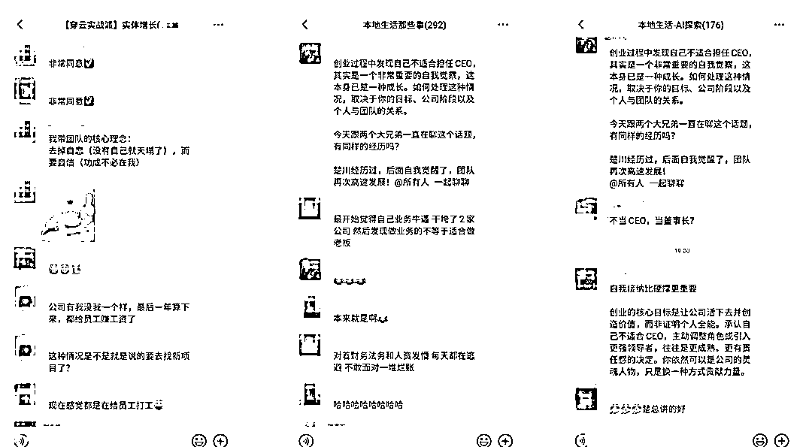

# “我不适合当 CEO”：承认这一点，才是创始人最大的清醒

> 原文：[`www.yuque.com/for_lazy/zhoubao/cxiaoe1x2urug6lh`](https://www.yuque.com/for_lazy/zhoubao/cxiaoe1x2urug6lh)

## (22 赞)“我不适合当 CEO”：承认这一点，才是创始人最大的清醒

作者： 楚川

日期：2025-02-11

**创业过程中发现自己不适合担任 CEO，其实是一个非常重要的自我觉察，这本身已是一种成长。如何处理这种情况，取决于你的目标、公司阶段以及个人与团队的关系。**

**  **

今天在跟自己两个老兄探讨这个话题，也在反思自身。楚川在很长一段时间都有这个心魔，质疑自己，在 2024 年才破除心结。

在进天鹅到家做营销负责人的时候，我跟高级副总裁周培杰聊起我的创业史，我说“**我不适合一号位，我是一个很出色的二号位** ”，但培杰的回答“川哥，你在合伙人跑完都会想着带着大家活下去，回购投资款，这已经是绝大部分 CEO 都做不到的事情；并且你把团队带的很好，很有战斗力，这都是你无比称职的地方”，当时这个反馈让我很受鼓舞，后来在天鹅到家自己从 0 到 10 带团队拿结果，培养营销人才，也逐渐认识到自己的能力，**以前只是方法出问题，并不是自己不适合做 CEO。**

**  **

今天好兄弟在怀疑自己不适合做 CEO 的时候，我说了自己的体会，也说了他的团队在最难的时候不离不弃，已经证明了他的优秀和独特的人格魅力。**我们不应该在自己低估的时候，否认自身价值，这是最可怕的事情。**

**  **

今晚在 5 个社群，聊起这个话题，也引起不少感叹，那就对此展开说说。

“明明代码才是我擅长的，为什么要逼自己当 CEO？”

**这句话，戳中了多少创业者的隐痛** 。

### **Part1 死撑的 CEO，正在杀死自己的公司**

创业圈有个魔咒：

“创始人必须当 CEO，否则就是失败者”。世俗世界的成功、失败过于对立面（非黑即白），反倒成为自身的枷锁。我在服务 6000 多个实体企业的时候，跟不同的老板打交道，这个体感很深。

于是，技术天才逼自己学融资话术，社恐产品经理硬着头皮搞酒局应酬，连公司现金流都快断了，还要在朋友圈强装“一切尽在掌控”。

**数据显示** ：72%的初创公司死于团队管理问题，而其中超半数 CEO 承认“从未系统学习过领导力”。

**比能力不足更可怕的，是执念。**

### **Part2 顶级创业者的秘密：会“让位”比会“掌权”更重要**

**谷歌** ：两个 25 岁技术宅，主动让出 CEO 给 47 岁的施密特，自己躲进实验室，结果——

➤ 施密特任职 10 年，谷歌市值从 230 亿飙升至 2000 亿

➤ 佩奇回归 CEO 时，已蜕变为真正的战略家

**Twitter** ：杰克·多西两度让出 CEO 席位，专注产品创新期间——

➤ 主导推出改变行业的“话题标签”“转发键”

➤ 公司股价在他卸任期间上涨 90%

**真正的狠人，都懂得用退一步换海阔天空** 。楚川是创业界微不足道的存在，我们在拿投资的阶段，在拥有大股权的时候，我主动让出 CEO 的身份，给到自己合伙人，并且给出承诺无论怎么样都会为公司兜底，这一点在创业历程中至少得到合作伙伴和员工的认可和尊重。

### **Part3 创始人自救指南：不做 CEO，你还能做这 3 件事**

### **方案一：退居“首席创造官”**

### 小米雷军：_

### “我 70%时间在挖人，找到供应链大神周光平、国际业务狂人王翔，他们才是小米横扫全球的关键。”

### **适合人群** ：技术/产品出身的“造物者”

### **关键动作** ：用股权绑定顶尖操盘手，你只需专注核心创新

**方案二：转型“精神领袖”**

新东方俞敏洪：_

“CEO 周成刚落地执行，我负责演讲出书给品牌镀金，公司转型期影响力反超巅峰期。”

**适合人群** ：有个人 IP 势能的创始人

**关键动作** ：把自己变成公司的“符号”，让专业团队负责打仗

**方案三：直接套现离场**

某蓝领人力资源平台创始人亲述，楚川亲耳听到的原话：_

“发现管理不是长板后，我果断*亿卖掉这个平台，现在做投资人，赚的比创业时多 10 倍。”

**适合人群** ：理性优先的理想主义者

**关键动作** ：在估值高点完成退出，用资本力量二次创业

### **Part4 比“坚持”更重要的，是清醒**

张一鸣说过：**“创业的本质是让正确的事情持续发生，而不是让正确的人一直掌权。”**

当你在深夜怀疑自己时，不妨问问：

我的痛苦，是因为能力不足还是角色错位？

如果明天就让出 CEO，公司会变得更好还是更糟？

离开这个位置，我能否用另一种方式创造更大价值？

我最后有没有勇气成为公司战斗到最后一个人，能不能给大家兜底？

创业的核心目标是让公司活下去并创造价值，而非证明个人全能。承认自己不适合 CEO，主动调整角色或引入更强领导者，往往是更成熟、更有责任感的决定。你依然可以是公司的灵魂人物，只是换一种方式贡献力量。

**“真正的勇气，不是咬牙死撑，而是清醒地退后一步。**

**让公司活下去的创始人，远比死守头衔的 CEO 更值得尊敬。”**

#### **那个纠结要不要让位的朋友，这篇文章就是写给你的。**

* * *

评论区：

暂无评论