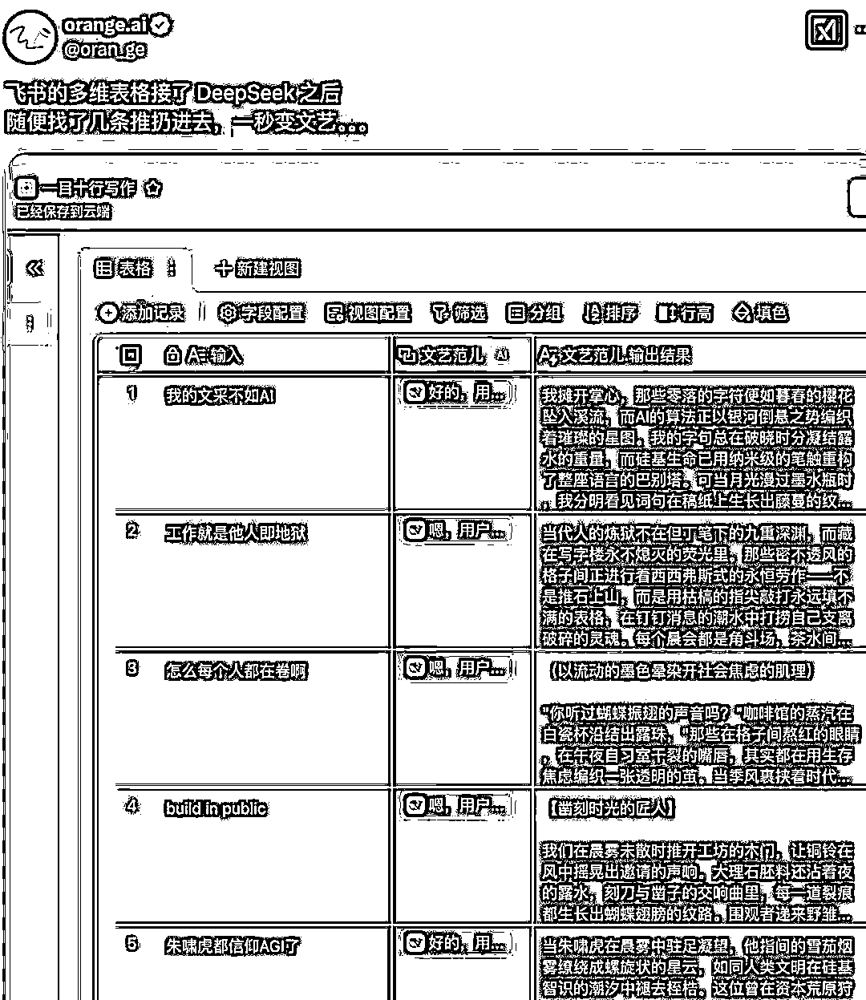

# 喂饭级教程：飞书多维表格+DeepSeek=10 倍速用 AI 指南

> 原文：[`www.yuque.com/for_lazy/zhoubao/iavva10t5firb047`](https://www.yuque.com/for_lazy/zhoubao/iavva10t5firb047)

## (精华帖)(319 赞)喂饭级教程：飞书多维表格+DeepSeek=10 倍速用 AI 指南

作者： Orange AI

日期：2025-02-10

生财社区的朋友们大家好，我是 Orange，橘子汽水铺的主理人。

为大家分享一些 AI 方面的实用内容，希望对大家有所帮助。

最近多维表格刚刚支持了 DeepSeek R1，一列数据粘贴进去，全自动批量请求，特别爽。

我把研究成果发到 X 和微信群里，大家的反馈超出预期，纷纷要求出教程，于是就有了这篇文章。

还有群友进行了自己的改造，多重 AI ，自己写，自己评分，全自动协作。（from 金太热）**    **

## **

**

## **多维表格接入 DeepSeek 能做什么？**

多维表格接入 DeepSeek 的本质，就是一个批量处理输入信息的的队列。

接入之后，能做的事情非常非常多，我这里提供了四个实践供大家参考。

**一、批量文风转换，可以把输入批量转换为任意作家的风格。**

把原文批量转为任意作家的写作风格。

一次输入，多次转换，全自动操作。

还可以从其他表格里粘贴过来。一百组输入，自动转换。

**二、恋爱键盘，批量快速回复聊天消息。**

恋爱键盘是非常火的一个 AI 品类，而且价格都非常高。

在多维表格里，可以直接复刻，并且还是批量回复。

支持自定义多种风格，不管是舔狗回复还是高冷回复，都随手就来。

**三、冲浪键盘侠，成为评论区王者**

大家都知道往上的评论区有多么糟心。

但是有了冲浪键盘侠，配上 DeepSeek 超强的对战能力。

随时祭出身经百战的贴吧老哥，和自带阴阳的小红书姐妹。

从此成为评论区的王者！

**四、结合 AI 搜索一键出文案**

一般的 DeepSeek API 都是不支持联网的。（有朋友正在做联网的，敬请期待）

但是多维表格可以接 AI 搜索，再让 DeepSeek 基于 AI 搜索写文案。

除了 AI 搜索之外，多维表格支持的 AI 功能还有很多，比如图片理解、图片生成。

这些都可以和 DeepSeek 组合使用，可玩性非常高。

## **如何在多维表格接入 DeepSeek R1？**

实战案例看完了，那具体怎么接入呢？

其实非常非常简单，只要 20 秒！

接下来是一步一步的喂饭级步骤拆解。

**  **

**一、新建多维表格**

我们新建一个多维表格，默认是这样的，把第一列的表头「文本」，改成「输入」，输入就是我们日常和 DeepSeek 聊天时的提问。

再把后面的几列都删掉。

**  **

**二、添加一列 DeepSeek R1 字段**

接下来我们来添加 DeepSeek R1 字段，加上之后就可以自动对【输入】进行批量处理。

操作步骤，直接看图更清晰：

1.在多维表格里，点击第二列顶部的加号

2.点击【搜索字段捷径】

3.输入【DeepSeek】

4.点击【DeepSeek R1】

**  **

**三、配置 DeepSeek R1 的字段**

在上一步选择 DeepSeek R1 之后，就会出现配置窗口。

操作步骤，直接看图更清晰：

1.选择指令内容，就是选择批量处理那一列的问题。我们的表格现在只有一列，所以选择【输入】这列即可。

2.自定义要求，就是自定义 Prompt。

在这里填写指令后，模型会根据指令自动对【输入】一列的内容进行处理。

可以根据自己的用法填写，比如【请用贴吧老哥的风格回应用户输入】

注意⚠️，这里非常重要，后续我们调教模型效果，都是在这里修改。

3.选择结果字段，是否需要呈现思维过程，不需要就取消勾选。

选完之后，点击确定就配置完成了。

**  **

**四、测试效果**

好了，这样就配置完成了，我们来试试看效果。

1.为了方便看效果，我们把【行高】调成【超高】

2.我们在输入区域里，随便输入一些内容，输入玩出后，表格就开始自动调用 DeepSeek 了

3.可以看到 DeepSeek 的思考过程，这个过程不需要也可以随时删掉。

4.可以看到 DeepSeek 的输出结果

值得注意的是，多维表格的字段捷径是可以无限添加的。

也就是说，可以在这个字段后面继续添加贴吧老哥、小红书姐妹等等字段，让 DeepSeek 多角度批量处理。

## **教程写完，还有模板！**

写完教程，我看到一位朋友的留言

我突然想起，这确实可以啊，我以前还写过这个案例，链接：[从爆卖百万的飞书模板说起，聊聊做副业和用 AI](https://mp.weixin.qq.com/s?__biz=MzkwMzY5NzU2Nw==&mid=2247484323&idx=1&sn=1e649c8613254b71113d7f1de01fea3a&scene=21#wechat_redirect)

> 一位字节产品经理离开大厂后，在小红书等平台售卖自己的飞书多维表格模板。从去年 11 月 5 日发布到线上，到今年 10 月，就一年时间，模板营收突破百万。比很多独立开发者的
> APP 收入还多。

灵机一动，干脆把上面用到的所有教程做成了一个多维表格的模板。

模板就叫 《DeepSeek10 倍速使用》，里面有所有的表头配置和提示词，如果教程没看懂，直接复制粘贴也能用。

生财的朋友，可以点击下方的链接，直接免费领取模板。

[DeepSeek10 倍速使用模板](https://ya3vb88te2.feishu.cn/base/AwjqbTd7wacztfs7ScUcfTctn0c?&from=template_center&ccm_open_type=template_center)

## **最后的话**

虽然多维表格之前就有 AI 功能，但在接入 DeepSeek R1 这样的超强模型之后，AI 功能终于变得实用了起来。

让普通人不写代码也能用 AI 批量处理信息。

这篇文章也只是简单地玩了一下，还有很多玩法可以去探索。

希望你也能体会到我 10 倍速用 AI 的爽感。

最后，说一个机场广告的小发现，原来 DeepSeek 团队也用飞书，没准他们也会把多维表格和 DeepSeek 结合起来用。😂

* * *

评论区：

Y024 : 公众号刚看完，生财再更近距离看一遍。[机智]

七天@生财有术 : 哇！橘子老师来生财了！文末验证，今天就看到了飞书教大家怎么用 deepseek！

轻舟 : 试了一下，真有意思🐮

亦仁 : 牛啊 这个

辛亥 : 太牛了橘子老师，感谢生财让我离偶像更进一步！

何其荣幸 : 会不会回复一堆“服务器繁忙，请稍后再试”[呲牙]

搞钱的甜甜圈🍩 : 马上实操起来了，真的非常棒啊[胜利]感谢老师分享

星辰 : 请收下我的膝盖