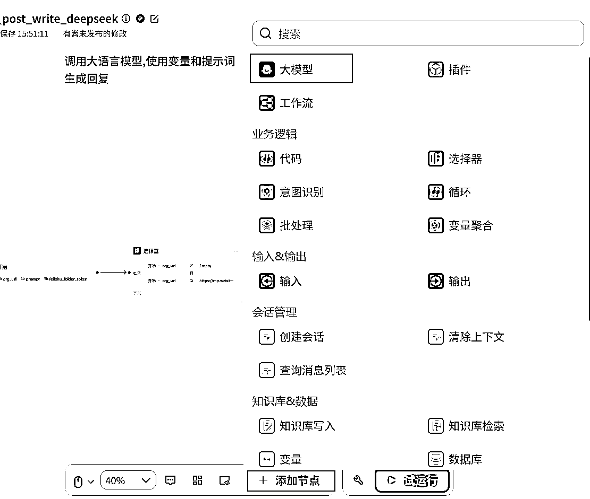

# 1 分钟生成 98%原创爆文！Coze×DeepSeek 写作智能体分享

> 原文：[`www.yuque.com/for_lazy/zhoubao/oe8ip2v94ngoxngz`](https://www.yuque.com/for_lazy/zhoubao/oe8ip2v94ngoxngz)

## (精华帖)(193 赞)1 分钟生成 98%原创爆文！Coze×DeepSeek 写作智能体分享

作者： 码农飞哥|RPA 定制

日期：2025-02-11

各位生财圈友，大家好，我是码农飞哥，专注于 DeepSeek+RPA 赛道的大龄程序员。今天分享下我基于 DeepSeek x Coze 开发的公众号写作智能体。

**只需要一个提示词就可以生成一篇原创度高达 98%的公众号文章，并且会自动将文章同步到飞书文档上。**

**  **

## 一、怎么使用

获取智能体之后，打开智能体链接 [`www.coze.cn/store/agent/7469690291126157348?from=bots\_card&amp;bid=6falf5svs300f`](https://www.coze.cn/store/agent/7469690291126157348?from=bots\_card\&amp;bid=6falf5svs300f)

### **一）设置提示词和飞书文件夹的 token**

在自己的飞书文档上创建一个飞书文件夹，操作路径是 我的空间==>新建===>文件夹。

这里我创建了一个名为 公众号写作的文件夹

**  **

**然后在浏览器地址栏复制 XYbLfwIS3lIIGodl6b5cy4VvnWd 即可，这就是飞书文件夹的 token。**

**  **

修改提示词或者飞书文档的 token。Token 需要换成自己飞书文档的 token。

点击发送之后，即可等待文章生成。

让我们打开链接看看最终的成品吧。

我们把文章拿到腾讯的原创检测网站上检测一下吧。 原创比例高达 98%，就问你牛不牛逼。

## 二、怎么实现的呢？

### **一）怎么创建工作流**

在网页端输入：[`www.coze.cn/`](https://www.coze.cn/) 打开 Coze 平台。在主页最醒目的位置 Coze 平台就说了已经支持了 DeepSeek-R1 模型。

点击工作空间>点击资源>点击工作流

即可创建一个工作流。这里我已经创建好了，直接看完整的工作流。

下面我就分别介绍下各个节点的含义。

#### 1. 开始节点

开始节点是默认就会有的，这里我设置了三个参数

1.  org_url 是我们期望仿写的公众号原文链接，这字段可以不用传，如果传的话则需要传入类似 [`mp.weixin.qq.com/s/`](https://mp.weixin.qq.com/s/BhPQ5fmYKeMYC8CalMQ7Nw)xxxxx 这样的地址。

2.  Prompt 是我们这边写的提示词，只需要传入很简单的提示词，比如：请用大白话生成一篇 DeepSeek 的科普文。

3.  feifshu_folder_token 是飞书文档的 token

#### 2. 选择器节点

选中器节点主要是为了判断 org_url 字段是否传入，如果传入的话则走仿写分支，如果没有传入的话则走创作分支。

点击底部的添加节点===》选择器 即可添加选择器。

这里选择器的判断也很简单，主要就是判断 org_url 是否为空以及是否是个合法的公众号文章链接。

#### 3. 提取公众号文章内容

如何传入公众号文章链接，则首先调用链接读取插件。这里添加此插件的方式是：

添加节点===》插件===》链接读取==》添加。

这里只需要引用开始节点的 org_url 参数即可，这里我将节点重命名为 解析公众号链接内容。

#### 4. 调用 DeepSeek 大模型节点

接下来就是调用大模型节点生成内容了。同样的还是 点击 添加节点==》选择大模型

这里模型选择 DeepSeek-R1 模型。系统提示词指定其人设角色是公众号创作专家，以 Markdown 的格式输出文章。

无原文的创作节点也是类似的逻辑，在此就不赘述了。

#### 5. 变量聚合节点

变量聚会节点是对多个分支的输出进行聚合处理，正好适用在我们这个场景下。选择好无原文写作输出和有原文写作输出。

#### 6. 生成标题节点

因为第 4 步 DeepSeek-R1 大模型节点在生成文章之后会自动生成一个标题，我们这里要做的就是提取这个标题。

直接使用豆包大模型就好了。

#### 7. 创建飞书文档插件

选择创建飞书文档插件，用于创建飞书文档并且文档中写入内容。添加方式同第 3 步。在此就不在赘述了。

在插件里搜索 飞书文档，选择 飞书云文档==> create_document ==>添加。

这里传入大模型写好的内容以及飞书文档文件夹的 token。

#### 7. 输出节点

输出节点就打印最终成型的飞书文档。

#### 8. 测试工作流

点击试运行，输入必填参数，然后点击运行。

仅仅 2 分钟一篇文章就生成好了。

让我们打开链接看看最终的成品吧。

我们把文章拿到腾讯的原创检测网站上检测一下吧。 原创比例高达 90%，就问你牛不牛逼。

我们只需要简单的配个图就可以发了。工作流调试好之后，点击发布即可。

这时候有小伙伴就说了，工作流我不能直接使用呀，该怎么办呢？

办法当然是有的，创建一个智能体呗，这点事还能难道码农飞哥不成。

### **二）创建智能体**

#### 9. 创建智能体

创建智能体，选择 项目开发==> 点击 创建

在弹框中选中 创建智能体 卡片，点击创建。

填写智能体名称和智能体的功能介绍。

#### 10. 用 AI 生成人设与回复

如果你不会写人设与回复逻辑的话，没有关系，点击 优化，输入智能体的主要内容，让 AI 帮你生成。

#### 11. 设置快捷指令

这里参数比较多，我们可以设置快捷指令，这样的话方便快速使用。

这里如果出现一个授权的提示，则按照要求进行授权。

智能体调试没问题之后，点击发布即可让小伙伴们使用了。

DeepSeek 已来，新的一年我们各位圈友一起在用 DeepSeek 生财

* * *

评论区：

龙哥 : 飞哥牛逼带我飞

码农飞哥|RPA 定制 : 我一直默默关注龙哥

小萤 : 感谢分享[太阳]

码农飞哥|RPA 定制 : 圈友有兴趣可以试用下[嘿哈][嘿哈]

简单小医 : 晚上有时间实操一下，感谢

码农飞哥|RPA 定制 : 嗯嗯，搞起来这个还是比较简单

天天 : 这个好啊，很牛逼

码农飞哥|RPA 定制 : [握手][握手]用起来用起来