# “太好用了！”DeepSeek+YouTube 油管影视解说变现

> 原文：[`www.yuque.com/for_lazy/zhoubao/ugfxfarcomtgxigd`](https://www.yuque.com/for_lazy/zhoubao/ugfxfarcomtgxigd)

## (精华帖)(62 赞)“太好用了！”DeepSeek+YouTube 油管影视解说变现

作者： A 😇路途

日期：2025-02-14

我想过年大家应该都被 DeepSeek 暴打全球 AI 的各种新闻刷屏了吧，应该没有人还不了解吧哈哈

对于一个出自咱们国内，免费还好用的 AI 工具，咱们普通人最先应该思考的是，如何更好的利用好 deepseek 这个工具，来帮助你的工作和学习。

所以过年我就用上了！结论是：太好用了！！！

今天就跟大家聊聊我是如何利用 DeepSeek 来优化我的工作流程的。

## 一、 **我们借助 AI 如何帮助变现**

其实说到现在的 AI 产品有非常多，有文字输出为主负责聊天的比如 Chatgpt，有画图的比如 Midjourney，以及各类的竞品等等。

假设你是一个短视频创作者，比如说做抖音、或者油管 youtube，那这些 AI 的用处就很大了。

比如，它可以帮你直接写文案  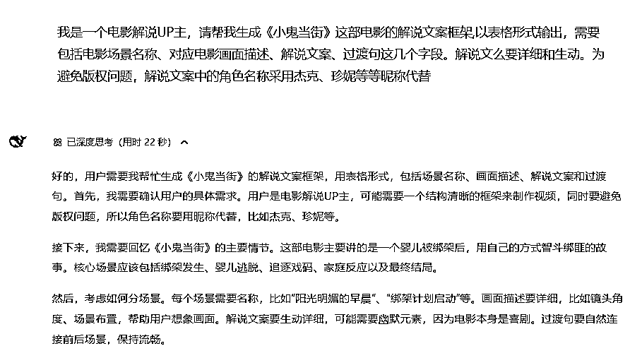

或者帮你做好翻译工作，或者润色文案

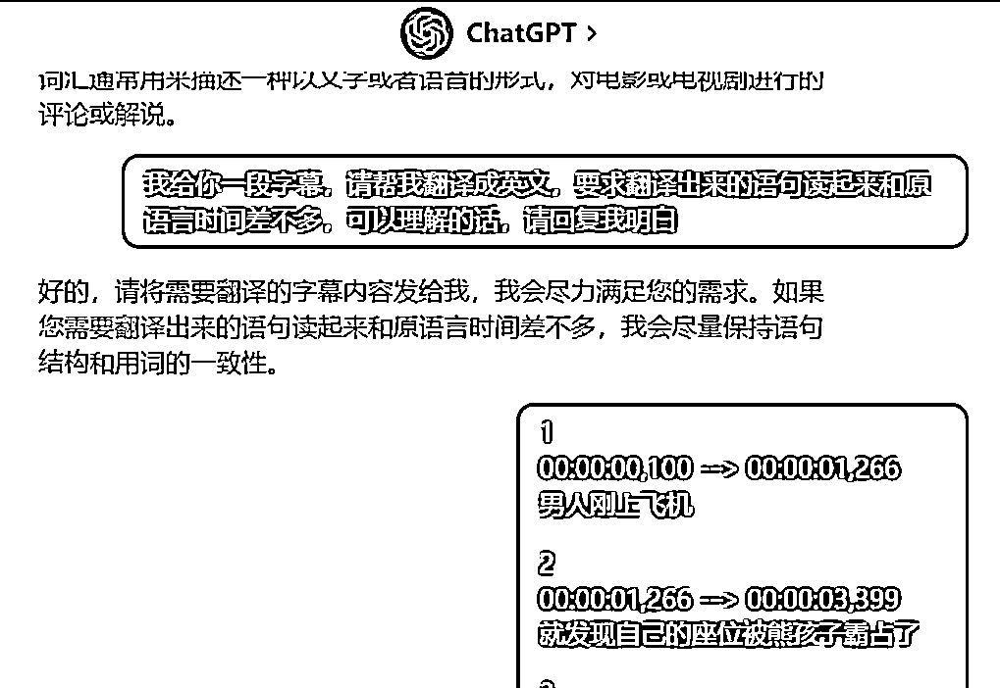

也可以做数字人讲故事，文生图功能生成一个人物形象并且用它来讲诉一段故事，做一个故事型的作品

同样是文生图，除了讲故事，也可以类似插画一样，通过 AI 生成不同的画面剪辑在一起就是一个内容非常丰富的作品

还有最近很火的 AI 动物救援类，则是文字转视频，通过文字描述让 AI 去生成你的内容。

目前我们用的最多的，还是让 AI 去帮我们完成文字上的工作，比如说我们想做一个影视剪辑的作品，我们会给 AI 投喂一些爆款文案，然后让它给我们去改写润色，或者翻译成地道的当地能听懂的语言，而不是生硬的翻译。

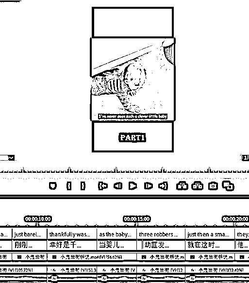

之后把这些作品发布在 youtube 上，做油管 YPP 或者音乐版权分成。变现的具体操作可以看下我之前的文章哈。

## 二、 **目前做影视解说流程的小问题**

我这里简单的梳理一下我们做影视解说的基本步骤，具体的可以看我之前的文章哈，有从 0 到 1 影视剪辑的非常详细的教学。

步骤大致就是：  首先呢，我们通过投喂 AI 生成一个解说文案，而投喂的文案我们是通过一些爆款的文案去翻译生成，之后生成配音，在把配音和作品融合剪辑在一起。

这个流程目前有一个什么问题呢？那就是同质化太严重了。随着做的人越来越多，大家生成的内容差异化也越来越小，同一个提示词，AI 的翻译结果也是大差不差。

我的想法是，如果 AI 的文案翻译能够更加有个性一点，不再是千篇一律就更好了，这样就可以避免随机性了，我们来试试看 DeepSeek 能不能做到？

## 三、 **DeepSeek VS ChatGPT**

我们先来试试看 deepseek 能否直接给我们写一个文案和分镜头呢方便我直接剪辑呢

结果呢，DeepSeek 果然跟其他的 AI 一样喜欢胡编，我又尝试先给他一段剧情简介让后再让它按着写，依然还是一如既往的“自由发挥”。

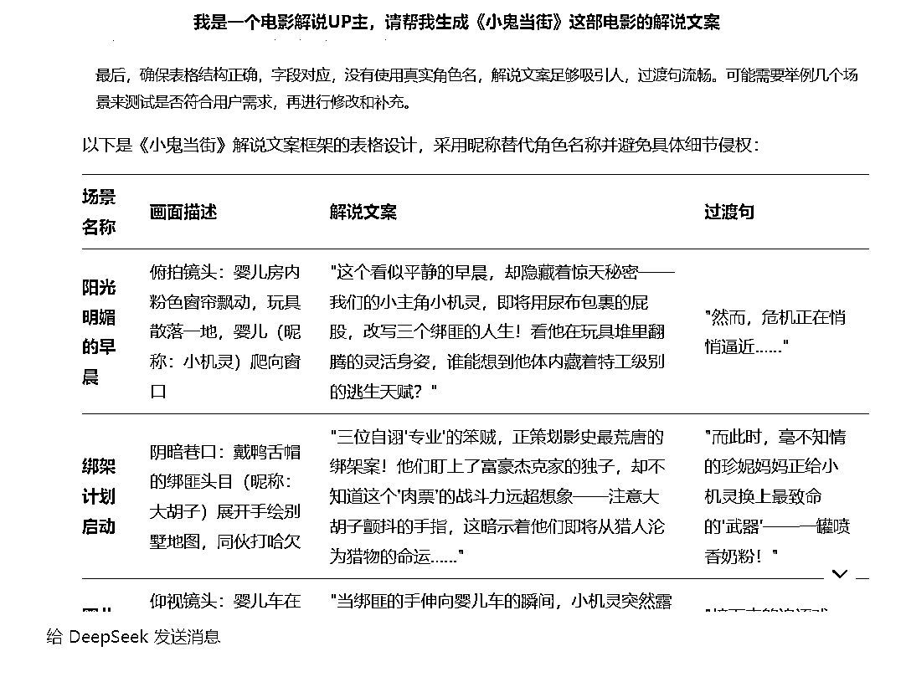

那我们还是试试老方法，先准备一个影视解说的爆款文案，找一个你要做的视频

之后呢，我们就把这个视频的文案提取出来。

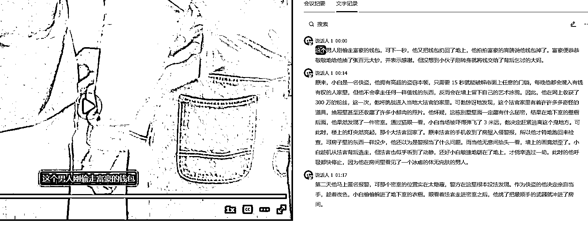

提取文案的方式之前讲过很多种，可以使用剪映等软件提取，也可以使用飞书妙记直接上传视频就可以导出了。

这里我想把文案分别投喂给 Deepseek 和 Chatgpt，我们来看看效果上有什么区别

**投喂给 CHATGPT：**

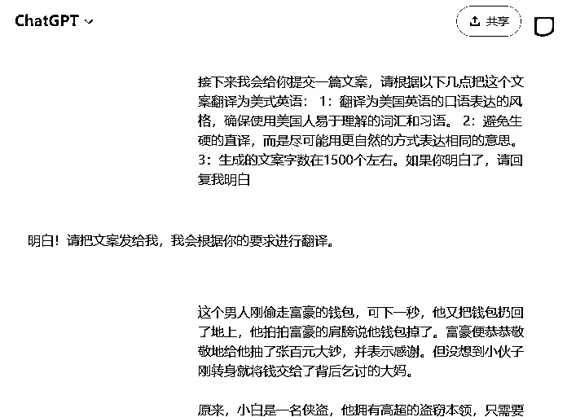

**投喂给 DeepSeek：**

**（一定要打开深度思考）**

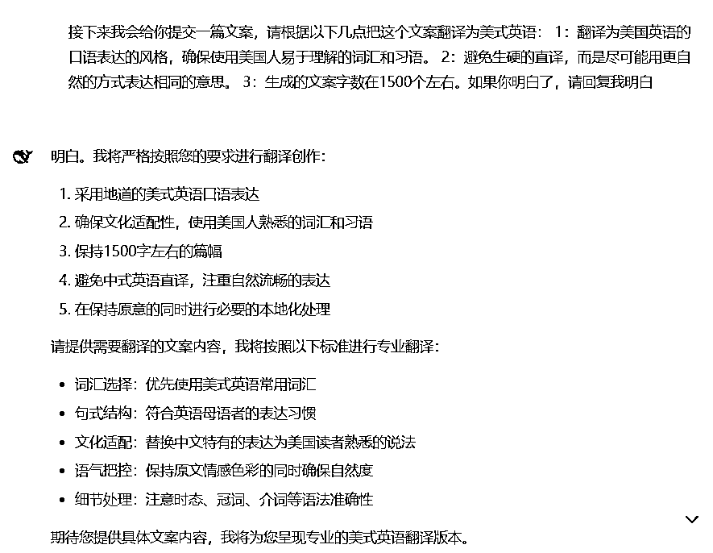

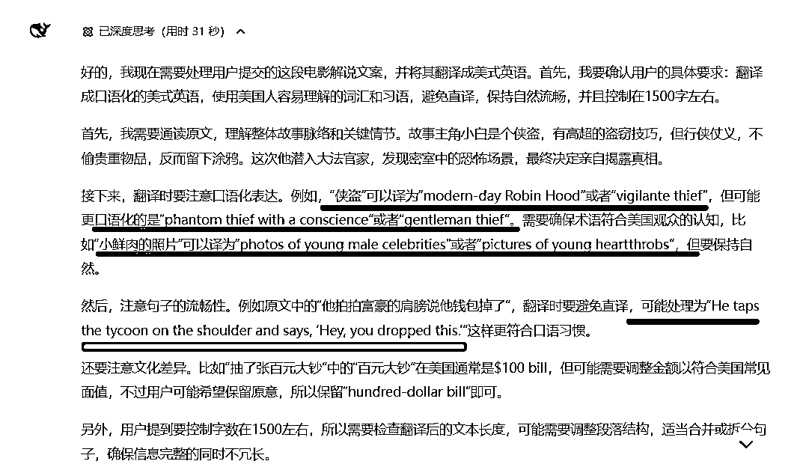

从消息回复上来看，DeepSeek 的深度思考过程感觉它真的理解了我们想要的，并且认真的讲给我们听，比如说它特地跟你说了某一些词更加本土化的改法，比如说“小鲜肉”，要换做以前的翻译工具给我们翻译成一块新鲜的肉就好笑了。还把主要修改的地方都给我整理出来了。

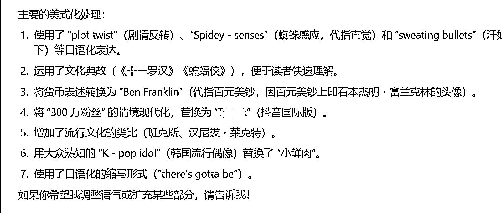

感觉挺不错的，那得到的译文和文案具体是什么效果呢？这里我做的是英文，方便大家理解，我把译文重新翻译成中文以后，大家跟原文做一个对比看看。为了公平起见，这里我是用【豆包】来做翻译哈哈。

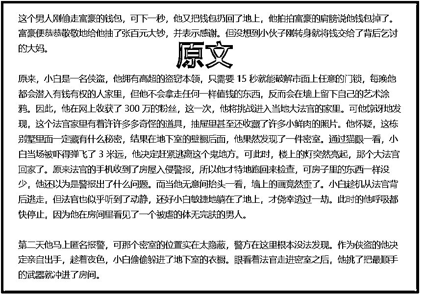

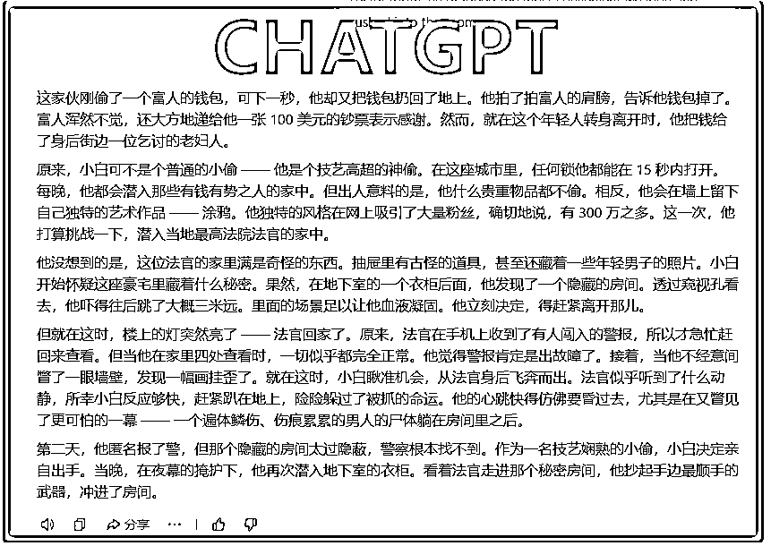

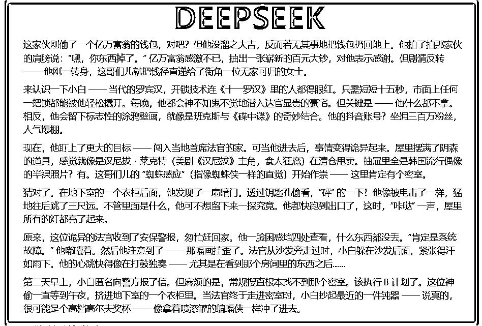

对比以后你会发现，Chatgpt 在外文领域确实道行很深。你会发现翻译后的译文跟原文几乎没有什么太大的差别，相反的 DeepSeek 有点像个戏精。比如说，原文说他是一个侠盗，它就说主人公是当代罗宾汉。就好比说，最新的唐探电影里，就有一个案例是跟开膛手杰克的作案手法很像，所以也会把凶手比作开膛手杰克。这种文案就一下子感觉生动很多。

此外，仔细阅读下来，你会发现这个文案除了故事脉络和原文很像，内容和表达上则有很多本土化的表达，或者 DeepSeek 戏精发作的一些表演。

而这！恰恰是我们想要的！

前面说到，我们的影视解说，现在比较大的问题就是同质化太严重，而大家都是用 chatgpt 则会得到基本大差不差的译文文案，你想让他给你改动文案呢？那它就可能胡编乱造给你改写成完整不同的东西。

而做完的文案，DeekSeek 在润色上同样也会给你提出很多很有价值的意见，就可以更进一步的优化修改自己的作品。比如说当我把上面的文案重新投喂给它，它会给我一些音效、文案开头的一些更优质的建议。

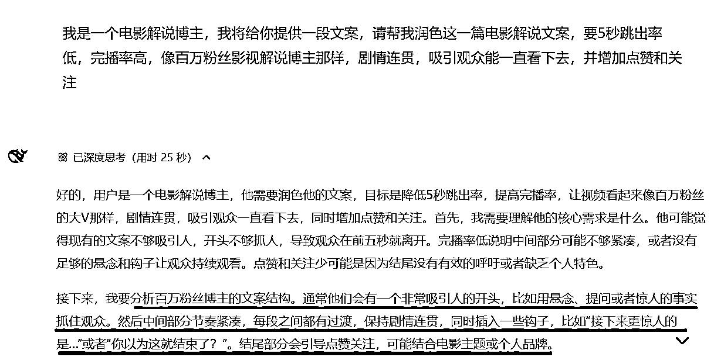

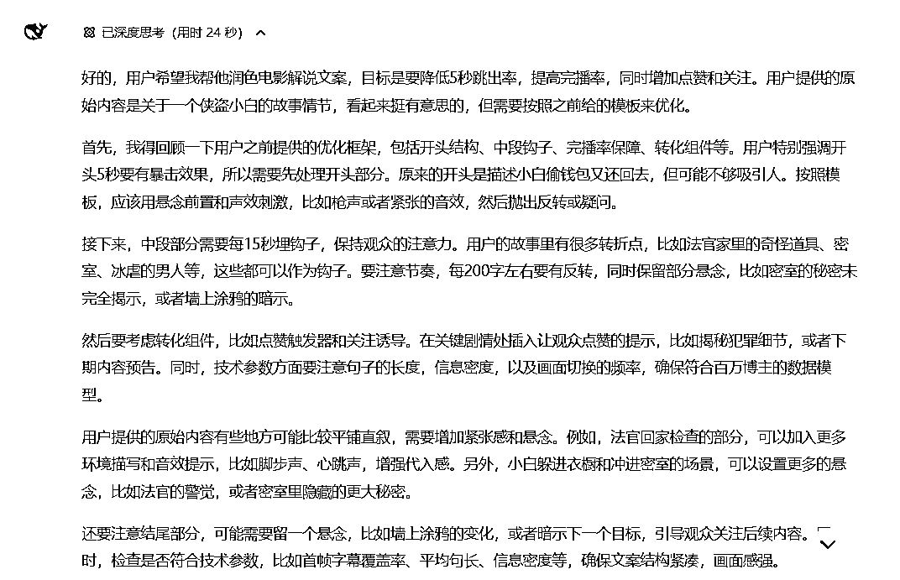

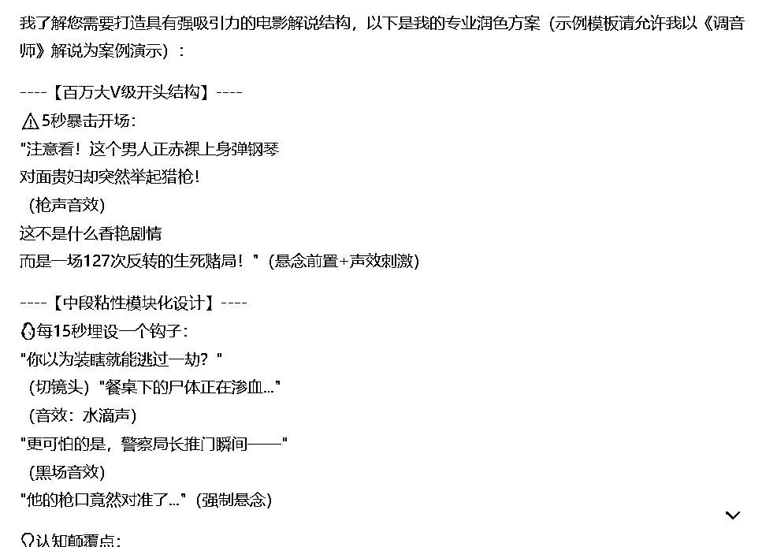

## 四、 **如何解决 deepseek 访问频繁问题**

怎么样，听我分析了一通还不错吧？大家可以尽快去试试咯~~

不过大家在使用过程一定会遇到这样的问题，那就是服务器繁忙，无法生成答案。

众所周知的原因，DeepSeek 除了访问量特别大以外，还一直在被攻击。

那我们怎么解决这个问题呢？这里大家可以试试这个插件。

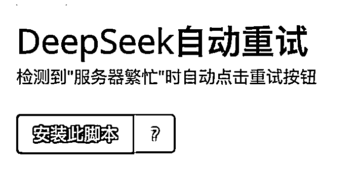

当服务器繁忙，它就会帮你自动重试，解放你的双手。

插件我放下面  deepsee 自动刷新插件  链接:[`pan.baidu.com/s/1kavAa0lk8M1bQ4pH3K5Ssg?pwd=pa5a`](https://pan.baidu.com/s/1kavAa0lk8M1bQ4pH3K5Ssg?pwd=pa5a)  提取码:pa5a

如果重试 10 次以后依然没有成功，这里应该高峰期了，只要刷新一下网页，就又会重新帮你重试，一般很快就会出答案。还是很好用的。 images.zsxq.com/Fr-mwoGfS7rNjTRd7EAnfo1Z5xql)

## 五、 **如何白嫖满血版 DeepSeek 呢**

怎么样搞一个反应速度极快，又可以私人用的 Deepseek 呢，大家就可以试试这几个平台，很多服务器都部署了 DeepSeek 的推理模型，大家可以直接调用，每个网站都有赠送一定的 TOKEN

1、硅基流动

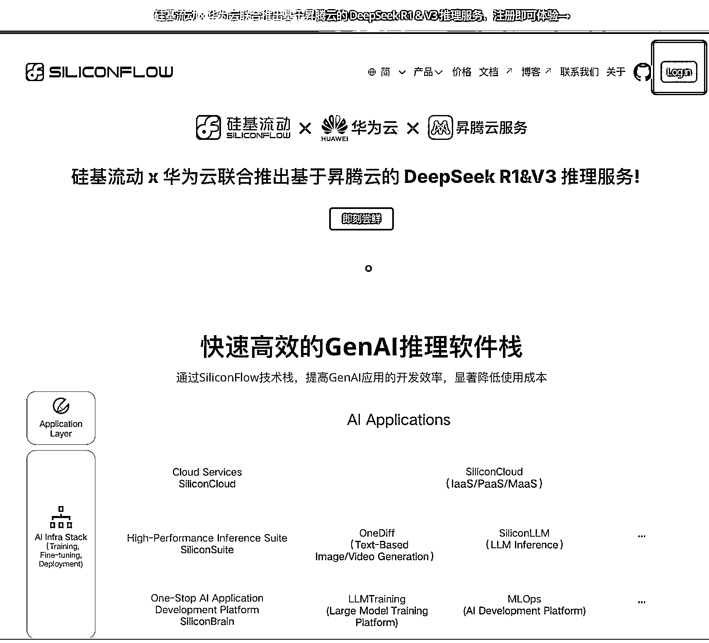

在模型广场这里找到这个 deepseek 的 r1

注意，一定选择下面标记【671B】的，这个是满血版

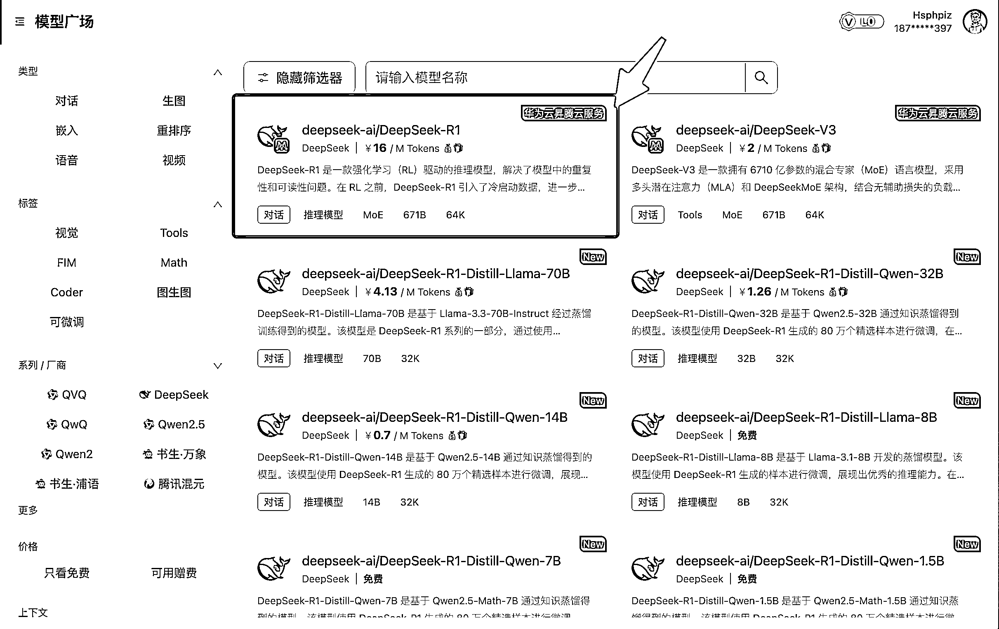

我们点【在线体验】

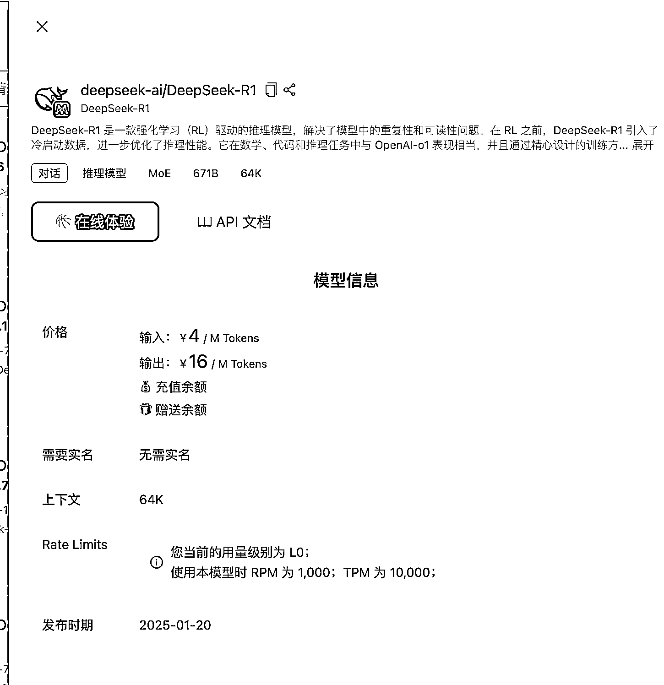

就可以直接在网页端使用（手机电脑都一样）

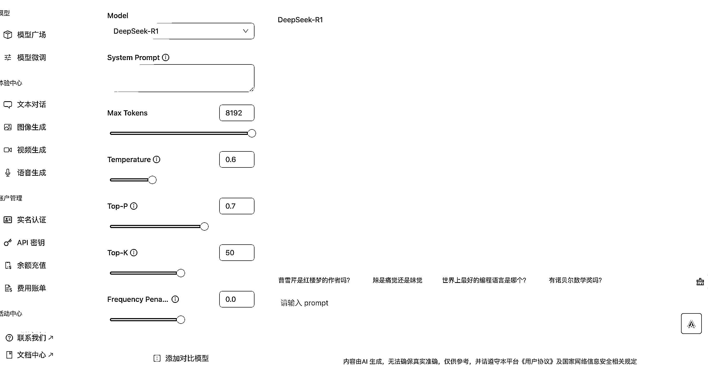

2、百度千帆

新用户要注册账号哈，并且百度家要想使用，需要实名认证一下

百度他们家是一直免费使用到 2 月 18 日

大家可以猛薅一下

18 日之后收费是这样（很便宜，百度终于做一次人事）

2 块钱/百万 token 输入

8 块钱/百万 token 输出

模型广场这里找到 deepseek-R1，点击【体验】 images.zsxq.com/Fs67pRBkD13b7NKw7c-7Sw1bbn9W)

实名认证以后，就可以在线使用了

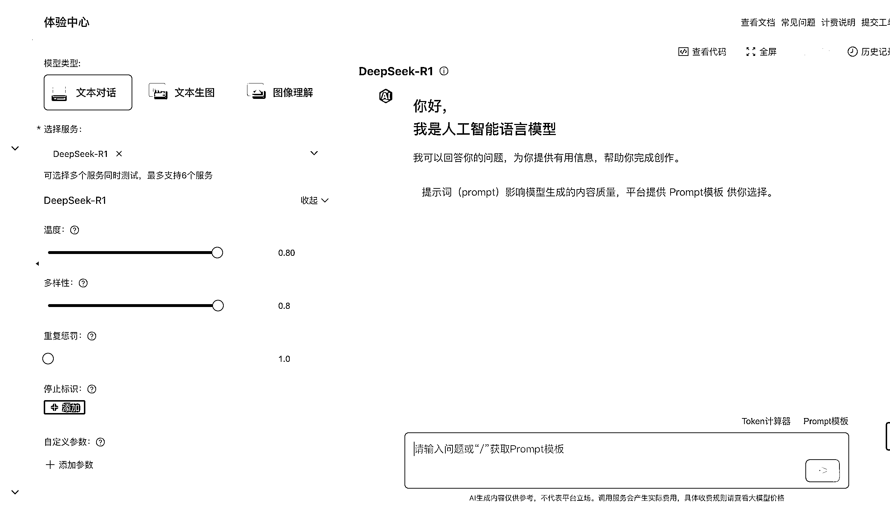

3 火山方舟

字节他们家是新用户每个模型赠送 50W 的 token

后续收费跟百度一样

2 块钱/百万 token 输入

8 块钱/百万 token 输出

选择左侧模型广场，找到 R1，点【立即体验】

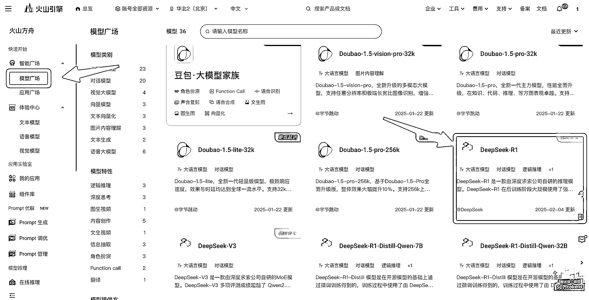

然后就可以网页版使用了

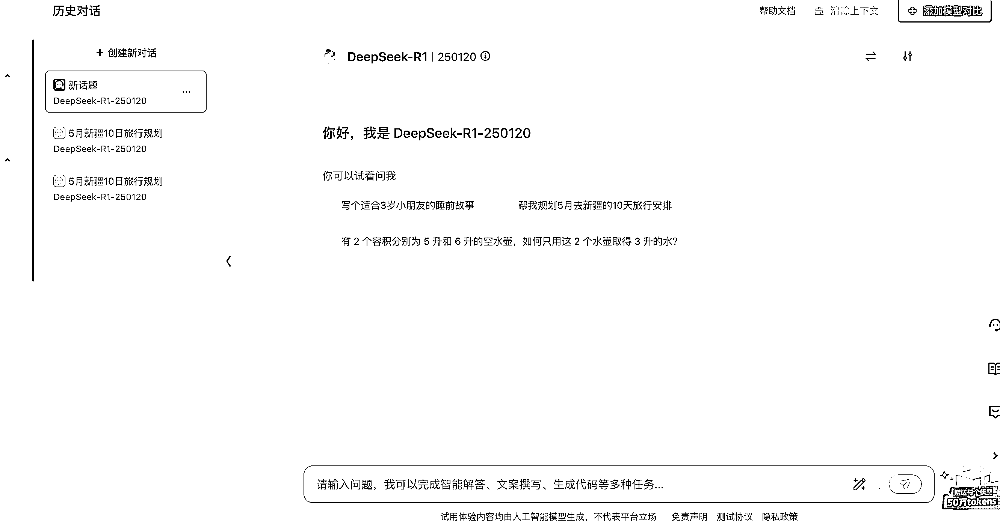

感觉有用记得给我点一个赞！

* * *

评论区：

大米 : 玩得好深，谢谢分享。

靠岸 : mark