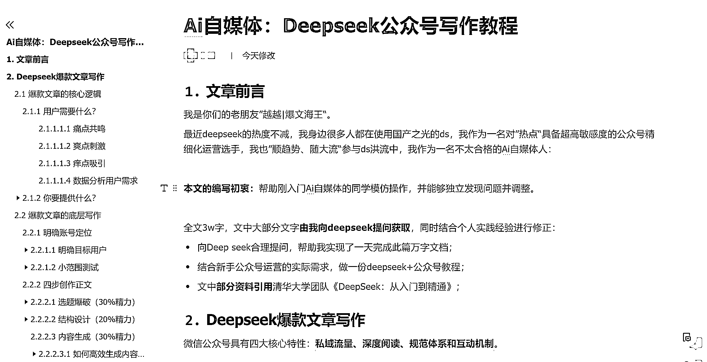

# Ai 自媒体：Deepseek 公众号写作教程

> 原文：[`www.yuque.com/for_lazy/zhoubao/rrh1grwaqtw2mbgt`](https://www.yuque.com/for_lazy/zhoubao/rrh1grwaqtw2mbgt)

## (48 赞)Ai 自媒体：Deepseek 公众号写作教程

作者： 越越

日期：2025-02-10

我是你们的老朋友：**越越|爆文海王**

最近 deepseek 的热度不减，我身边很多人都在使用国产之光的 DS，

我作为一名对”热点“具备超高敏感度的**公众号精细化运营选手** ，

我也”顺趋势、随大流“参与 ds 洪流中。

在传术师群中，我看七天老师的提问很有意思：

**作为 Ai 自媒体人，可能会面临哪些问题？**

我想这也是我的问题，那么我就做了这个一个文档，反思回顾了做公众号的整个流程。

我作为一名合格的 Ai 自媒体人，我将自己的《公众号精细化运营指南》结合 Deepseek 进行融合使用，旨在帮助大家提高 Ai 自媒体变现效率。

**本文的编写初衷：** 帮助刚入门 Ai 自媒体的同学模仿操作，并能够独立发现问题并调整。

全文**3w** 字，文中大部分文字**由我向 deepseek 提问获取** ，同时结合个人实践经验进行修正：

1.  向 Deep seek 合理提问，帮助我实现了一天完成此篇万字文档；

2.  结合新手公众号运营的实际需求，做一份 deepseek+公众号教程；

3.  文中**部分资料引用** 清华大学团队《DeepSeek：从入门到精通》；

内容较多，请使用电脑端阅读飞书教程。

**飞书链接：**  [`txt6wm3b04b.feishu.cn/docx/SYn4df1CPok82bxhxVQcTe4Dntb?from=from_copylink`](https://txt6wm3b04b.feishu.cn/docx/SYn4df1CPok82bxhxVQcTe4Dntb?from=from_copylink)

* * *

评论区：

易芝 AI|RPA 版 : 越越老师可以通过鱼丸链接一下么