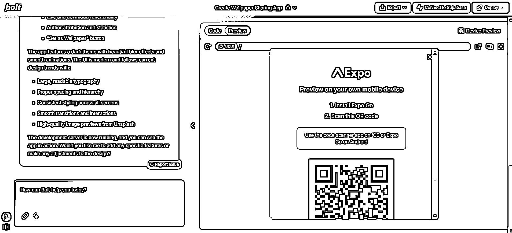
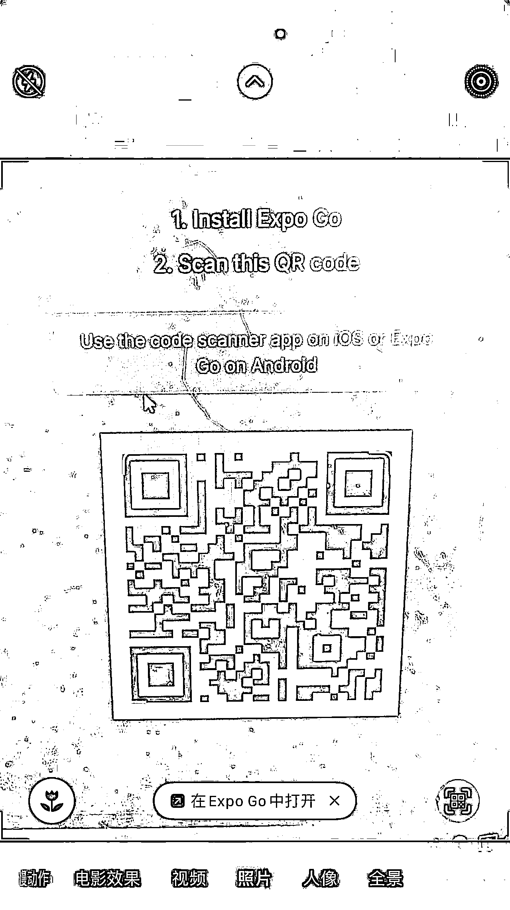
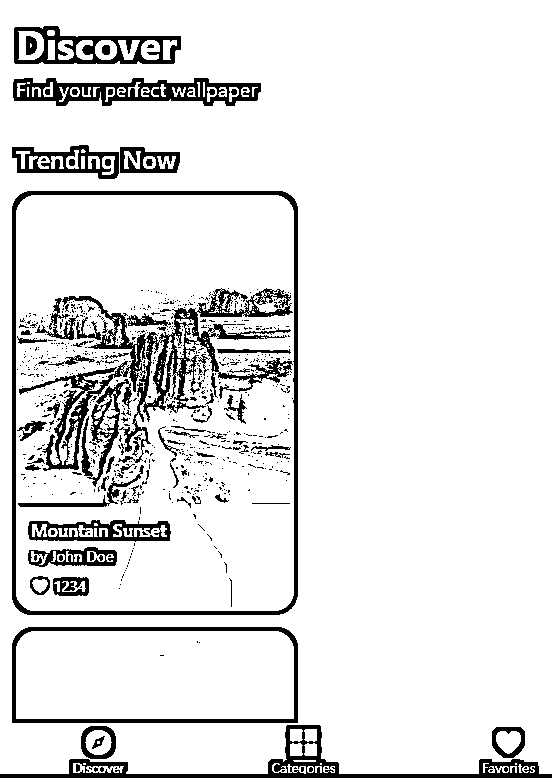
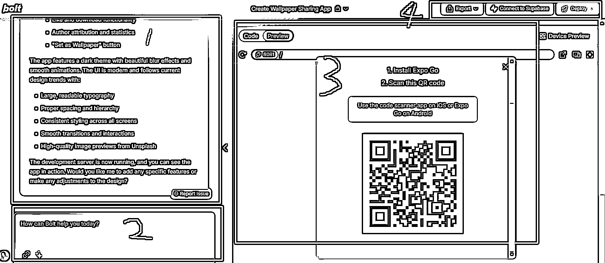
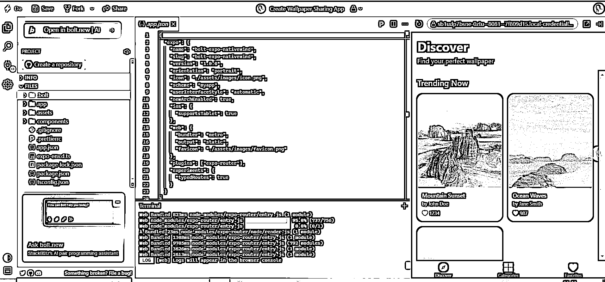

# 5 分钟做个 app bolt 教程

> 原文：[`www.yuque.com/for_lazy/zhoubao/nec44frm0mvxie5x`](https://www.yuque.com/for_lazy/zhoubao/nec44frm0mvxie5x)

## (49 赞)5 分钟做个 app bolt 教程

作者： 彩笺

日期：2025-02-13

我讨厌在标题中使用类似于“炸裂”等情绪词来诱导点击，除非我此刻真的觉得很炸裂。

另外“5 分钟做个 app”
参考自小排老师的一篇使用 bolt 的文章。推荐大家阅读：[`articles.zsxq.com/id_4dus5o2w72rc.html`](https://articles.zsxq.com/id_4dus5o2w72rc.html)

**正文：**

今早，想对比下 deepseek 和 bolt.new 在前端代码生成下的表现；当我打开 bolt 之后发现了这个东西：

这个 AI 工具已经强大到可以直接可以生成 app 了？？ 那岂不是，利好三月份的**ios 出海！**

以下内容分为两部分：

app 生成流程

bolt 简明使用教程

## 先知

官网：bolt.new

账号：左上角 sign in,我一直使用 github 账号登录比较方便

手机所用 app：Expo Go（当前文章所用设备：iphone，国内商店）

价格：一定代码量内免费，体验完全够用

## prompt

先一句话试一下，让他生成一个壁纸分享的 app，然后坐等奇迹发生

说好的预览呢？别着急，沿着它的指引再走一步。

打开手机相机，手机安装好 Expo Go 之后，是没有扫码选项的，这个时候需要打开相机，然后扫描二维码；他会自动出现在 app 中打开的选项：

成功之后，稍作等待就可以在手机上预览了

 images.zsxq.com/Fht4fbuEseEqVnrIdhXwye19KIOb)

 images.zsxq.com/Fs1iv4dR2Qs49tTXgDqu7OFBju5p)

效果还是蛮不错的，有些地方应该是有图标的，我的手机在深色背景下没有良好显示，可以换成浅色背景，或者在一个支持的 ide 中查看：

怎么样，有没有被震撼到？！

更复杂的需求和代码生成不再赘述，代码能力不会由编程语言，产品形态的不同而有显著差异。

## bolt 简明教程

### 页面信息

**左边 1** 大量文字部分，是 bolt 生成代码过程中的输出，做了什么事情，生成了哪些代码，运行了哪些命令；你可以理解成和 cursor 一样的回复。

**左边 2** 是继续对话的窗口

**右边 3 部分** ，主要是一个在线的 IDE，他有两个最主要的功能：

代码预览和编辑（**Code**)

效果预览(**Preview**)

你可以实时的编辑代码，并预览效果。

**右边 4 部分** ：

**导出代码：** 生成代码之后，左上角 Export 里面有两个选项，一个是 download 下载代码到本地；另一个是**Open in
StackBlitz** , 这是一个在线的 IDE，我更喜欢在这里面直接把代码导入到我的 github 仓库。

上图是：**Open in StackBlitz** ,
你可以将你的项目，从这里导入，然后在 bolt.new 中打开；也可以 bolt 生成代码之后，点击“**Create a repository** "
他会自动的打开你的 github 建立仓库。

在线 ide 甚至可以预览手机 app 的页面（上图右）。

**连接到数据库：** Connect to Supabase 支持项目连接到数据库（Supabase）

**部署：** deploy 分为两部分，**deploy to web / deploy to App Store**

其中第一个是将你的网站或者项目部署到 netlify 这个平台，他会给你一个子域名供你访问。

第二个是将 app 上传到应用商店，下面是点击后的教程链接：

[`docs.expo.dev/deploy/submit-to-app-stores/`](https://docs.expo.dev/deploy/submit-to-app-stores/)

个人习惯：

我更喜欢在 bolt 中生成项目的雏形，例如大致的前端样式，基础的简单的组件功能，然后将代码上传到 github 仓库；之后在本地关联 github 仓库，然后在 cursor 中进行更深入的功能开发（雕花）。

* * *

评论区：

书虫 : 真的快

嘉应岛主 : 真是炸裂

辛亥 : 立马学习了

一兮｜小缨 : 感谢分享！晚点实践一下