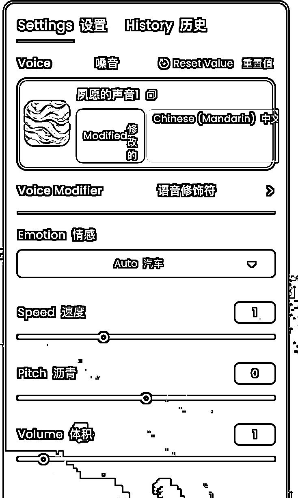

# 声音克隆拯救口播，高效 AI 录视频工作流指南

> 原文：[`www.yuque.com/for_lazy/zhoubao/bnga4cm526vmmu03`](https://www.yuque.com/for_lazy/zhoubao/bnga4cm526vmmu03)

## (38 赞)声音克隆拯救口播，高效 AI 录视频工作流指南

作者： 夙愿学长

日期：2025-02-14

大家好，我是夙愿学长， 最懂 AI 工作流的 00 后，擅长用 AI 来全方面赋能工作和生活。

最近这鬼天气，一不小心就中招感冒了。

更要命的是，我这嗓子一哑，还得硬着头皮录教程视频的话，简直是雪上加霜。

说实话，那感觉真是太酸爽了，脑袋昏昏沉沉，嗓子像吞了刀片，别提多难受了。

就在我快要绝望的时候， 朋友给我推荐了一个神器——海螺 AI 的声音克隆。

早就听说了海螺 AI 它们家的声音克隆模型做得不错，但一直没有机会尝试。

这次抱着试一试的心态发现，效果真的是太太太牛逼了，用完忍不住想爆粗口。

**不得不说，这 AI 声音克隆技术，简直就是感冒星人的救命稻草啊～**

不仅声音非常逼真，而且现在居然还是免费使用，太良心了。

**现在已经已经把它嵌入到了我的 AI 录视频工作流当中。**

以后哪怕是感冒还是环境音不好，都能解我的燃眉之急，而且不仅仅是录制教程视频，任何需要说话音频的场景都可以用得上这个。

例如做短视频、做剪辑等等，但千万不要拿来做坏事就是了。

**如果你苦于表达能力不好，不敢在镜头前说话，或是担心自己的口音太重，声音不够专业，AI 声音克隆技术都能帮你解决这些困扰。**

今天把这套的海螺 AI 声音克隆方法和工作流分享给你，简单易学，一看就会～

# 一、海螺 AI 声音克隆教程

### **1、 注册登录：开启 AI 声音克隆的第一步**

首先，咱们得打开海螺 AI
海外版官网：[`hailuo.ai/audio/voices`](https://www.google.com/url?sa=E&q=https://hailuo.ai/audio/voices) （需要特殊网络环境）

注意，一定得是海外版，海螺 AI 有国内版本，也有海外版本。

国内版本目前是无法克隆声音的，可能是怕用户使用声音克隆的技术做违法的事情吧。

国内网址是：[`hailuoai.com/audio/voices，你可以在这里先熟悉一下界面，然后再使用网页版。`](https://hailuoai.com/audio/voices，你可以在这里先熟悉一下界面，然后再使用网页版。)

### **2、 直奔主题：找到声音克隆功能**

登录之后，你会看到海螺 AI 的首页，功能还挺多的，但是咱们今天主题的声音克隆。

在导航栏里找到 “audio” 这个选项。

### **3、 录制/上传声音样本： 让 AI 学习你的声音**

接下来是关键步骤。 在声音克隆 （voice） 页面，可以看到上传声音样本的提示区域。 这里有两种方式：

**1.现场录制：**

点击 “record audio” （录制音频） 按钮。 系统会弹出录音提示，按照提示，用清晰的声音朗读一段文字。 建议在安静的环境中录制，以保证录音质量。

**通常录制 10-60 秒的声音即可。**

**2.直接上传：** 如果之前有录制好的音频，也可以直接上传使用。

### **4、 提交训练，等待模型生成**

录制或上传完成后， 请检查录音质量，确保声音清晰，没有明显杂音。

确认无误后，点击提交按钮，上传声音样本。

系统会开始训练专属的 AI 语音模型。 **模型训练时间通常较短，只需几十秒，请耐心等待。**

### **5、 测试微调， 优化声音效果**

模型训练完成后， 可以在页面下方的文本输入框中输入文字， 然后点击 “生成语音” 按钮。 系统会生成一段用你的声音朗读文本的音频。

然后就可以试听生成的音频，检查声音的相似度。

**当我试了之后我发现，海螺 AI 的声音克隆效果真特么牛逼啊，太自然了。**

如果你觉得还有提升空间， 海螺 AI 还贴心地提供了微调功能。

**但是， 这里我要划重点了！ 微调的时候， 强烈推荐只调整第一个选项！**

我亲测过了， 其他选项要么没啥效果， 要么调了之后声音会变得怪怪的， 反而不如默认的好。

然后外面的这个设置，也不要调，保持默认是最自然最符合自己音色的。

### **6、 生成使用： 方便快捷的声音工具**

完成上述步骤后， 就可以开始使用 AI 声音克隆功能了。

将文字稿粘贴到文本框中， 点击右下角的生成， AI 会用克隆的声音朗读文本。

**不过， 单次生成文字上限为 5000 个字符，超过限制时，需要分批生成。**

如果对生成的声音效果满意， 可以下载音频文件保存到本地。

这样， 就可以在需要用到声音的场景中使用 AI 克隆的声音了。

以上就完成了海螺 AI 声音克隆的使用教程，如果你只是想学习海螺 AI 的用法，看到这里就够了。

但真正精彩的其实在后面。

# 二、AI 录视频工作流

我们回到录教程视频这个场景，使用声音克隆的第一步是准备输入文本，对吧。

但这里有个关键问题：如何获得准确的文本内容？

一种方式是提前写好文稿再录制，但这样可能会导致音画不同步。

你的视频画面操作节奏很可能跟预先写好的文稿不匹配，剪辑时会很头疼。

所以我采用了一个更实用的工作流：即使嗓子状态不好，我也会边操作边录制讲解。

**此时就算是环境音不好、口癖、口音也没关系，无所谓，海螺 AI 声音克隆会出手。**

具体步骤是：

1.  完成视频录制

2.  将 mp4 视频转换成 mp3 音频

3.  把音频上传到通义听悟进行语音转文字 （这里不限于通义听悟，飞书妙记、讯飞听见都可以，关键是要能方便导出文字内容）

但这时会遇到第二个问题：AI 语音识别的准确度。

比如把"夙愿学长"识别成"素月学长"，把"文风"识别成"文峰"。如果全靠人工校对，工作量会很大。

既然是 AI 工作流，这一步当然要用 AI 来处理。

这时你可能会想到 ChatGPT、KimiChat、豆包、DeepSeek 等工具。

但这里我要分享两个重要经验：

"选择能解决这个问题的 AI" - 不是所有 AI 都适合处理这个任务

为什么这么说？因为在接下来的 AI 对话中，我们不只是要提供 9000 多字的转录文本，还需要提供大量上下文信息来帮助 AI 理解视频内容。

**就像那句老话："巧妇难为无米之炊"。**

如果不告诉 AI 正确信息（比如"夙愿学长"而不是"素月学长"），它是无法准确修正的。

这时你可能会想：提供这么多信息也很麻烦啊，还不如自己改？

其实不然。让我解释一下如何高效地让 AI 理解内容：

我这个视频是在教"快速写一篇 AI 工具类文章的工作流"。整个视频包含三个部分：

1.  操作前的初始状态

2.  工作流程的具体细节

3.  最终完成的文章

所以，要让 AI 完全理解视频的内容，我会提供三样东西：

1.  初稿（1k 字）

2.  终稿（2k 字）

3.  工作流程文档（几千字）

这些内容加起来超过 1 万字，约 2w 个 token。

这就引出了选择 AI 工具的关键：我们需要一个足够聪明的 AI。

虽然 KimiChat、豆包都能接收这么多文本，但它们的处理能力可能跟不上。

因为 AI 模型的性能会随着 token 增加而下降，说人话就是"内容太多，AI 变笨了"。

所以我选择了 Gemini 2.0 Pro，它支持 200w 上下文 token，性能非常强。

有了合适的 AI 工具、完整的初稿终稿、详细的工作流文档和需要校正的文本，接下来就是如何跟 AI 沟通了。关键是要让 AI 准确理解你的需求。

现在，好的 AI 模型有了、初稿终稿有了、工作流文档有了、校正完的长文本也有了。

就可以把所有内容都塞给 AI，然后说清楚 AI 我在做什么，我需要 AI 帮我做什么。

可以参考我的使用提示词：

我在操作的时候这个一套方法的时候，同时录了一个视频，上面是我录视频时的语音转文

字稿，里面会有一些错别字、卡顿、停顿，例如把 DeepSeek 识别成

了其他内容，我需要你帮我修改优化，输出去掉卡顿、停顿、口癖，

修改了错别字和重复的版本：

为什么我图片中要把“重要的事情说四遍”呢？

因为，AI 一开始曲解了我的意思，误以为我是想让它使用这一套工作流来生成最终的文章。

所以，我在提示词中把我的任务背景和目的重复了四遍。

**（这是一个提示词技巧：“重要的事情说三遍”，就是当我们把大段内容发给 AI
时，由于注意力机制的原因，我们的指令会被其他文本所“淹没”，于是就忽略了一些指令）**

但是我发现，不管我怎么强调这件事情，都没有用。

那这个时候，就得在新的一轮对话里强调了，在 AI 开始试图写文章的时候，就点击“停止”来打断施法，指出 AI 的错误。

然后再重新强调我们的任务就可以了：

不得不说，Gemini 2.0 Pro 还是牛逼的，通义听悟把“CurSor”识别成了“咳嗽”，这都能修正回来。

但牛逼的前提是，我们提供了足够的信息量给 AI。

因为，巧妇难为无米之炊。

等 Gemini 2.0 Pro 生成完毕之后，再人工检查一轮就完成了文本校正。

接下来就是把这一段文本，再塞给海螺 AI 声音克隆来生成音频，把音频文件导出，然后再使用剪映来剪辑匹配画面即可。

总结一下这一套工作流：

以上，就是这一套 AI 工作流的全部内容，如果对你有帮助的话，记得点个赞告诉我～

这里是夙愿学长，全网首个 AI 工作流搭建 SOP 作者，AI 生活黑客，用 AI 助理构建了一套早睡早起的系统，现已经运转成功，过上了我理想中的生活节奏。

我不喜欢跟风，只分享经过验证的、真有用的 AI 实战经验。

我相信，AI 应该帮助我们更好地生活，而不是更“卷”地工作。

我希望，每个人都能通过 AI 提效，拥有更多时间去休息、去陪伴家人、去享受生活。

* * *

评论区：

暂无评论