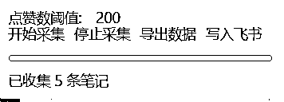

# 0 编程基础，用 gpt 制作小红书信息采集器

> 原文：[`www.yuque.com/for_lazy/zhoubao/wg1p5fbsxn8xciku`](https://www.yuque.com/for_lazy/zhoubao/wg1p5fbsxn8xciku)

## (21 赞)0 编程基础，用 gpt 制作小红书信息采集器

作者： 宋老师

日期：2025-02-10

见贴欢喜，新年快乐！大家好，我是宋老师（账号：宋老师帮你做课），3 年的时间，培训了 2w 多位的知识付费赛道的博主

多平台多账号矩阵，带来了近 10w 的私域好友，在内卷的自媒体时间，“抄超钞”技法，远大于原创起号变现速度，发了几千条短视频，我的心得就是，爆款选题是稳定流量的核心。不追求爆款，但是拍的内容，最好是有人爆火过的。

拍过短视频的朋友都知道，爆款是重复的，但是怎么找爆款，一直是老大难的问题，看过我之前的帖子的都知道👇常用的采集器是“八爪鱼&后羿采集器”，但是反爬虫的机制越发的高级，比较难使用了

最近也是看到 ai 的广泛应用，让我的团队的**04 年的小伙伴** ，自行学习并开发了一个插件《小红书信息采集器》

解决了这个老大难问题，简单好用，代码放在了后面，感兴趣的朋友，可以测试使用。我们还在不断的迭代更新，力争将 AI+知识付费+团队，深度结合。不只是教学 ai，自己也要是 ai 的体验官、深度用户。

附使用开发教程：[`b16xnqwk20.feishu.cn/docx/DQqvdWm7ToGbfYxv0SKc4CwjnQe?from=from_copylink`](https://b16xnqwk20.feishu.cn/docx/DQqvdWm7ToGbfYxv0SKc4CwjnQe?from=from_copylink)

* * *

评论区：

小熊 : 代码没法复制用 有办法下载吗

宋老师 : 我开个权限