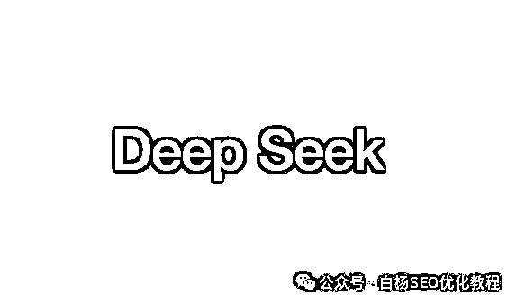
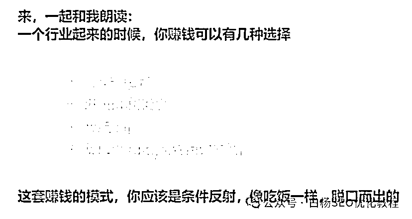
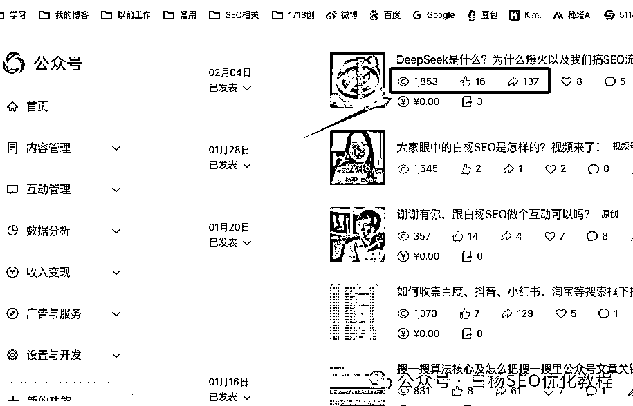
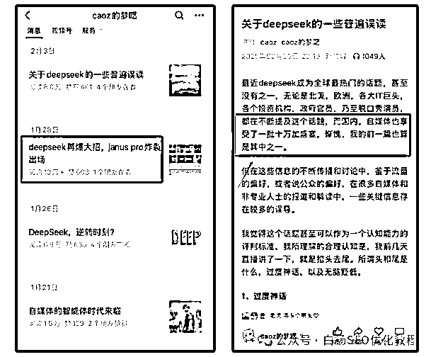
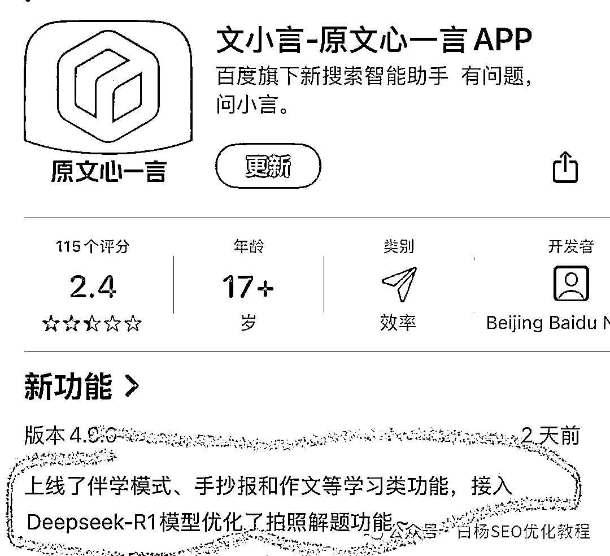
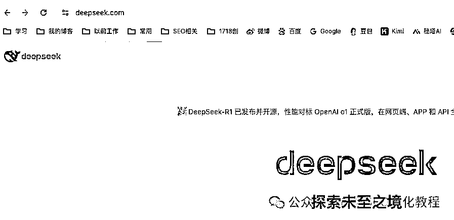
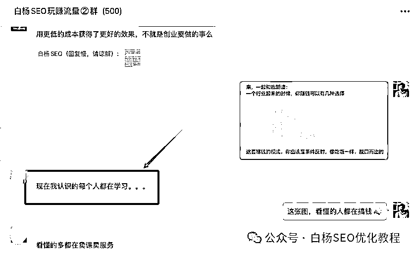
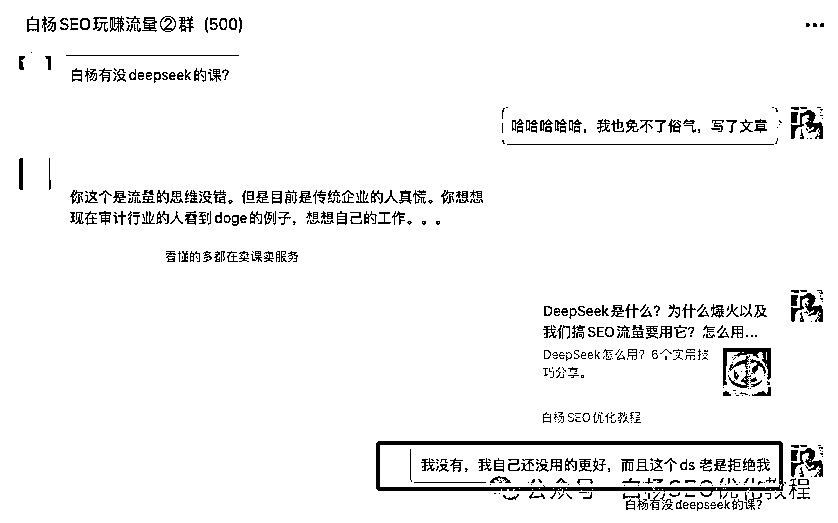
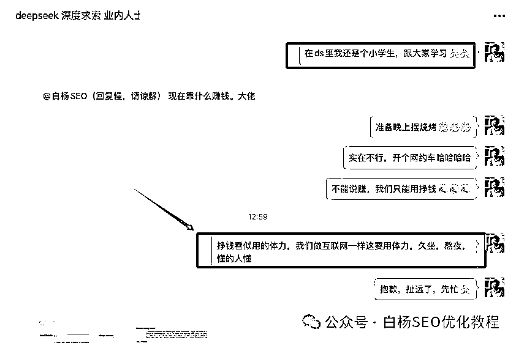
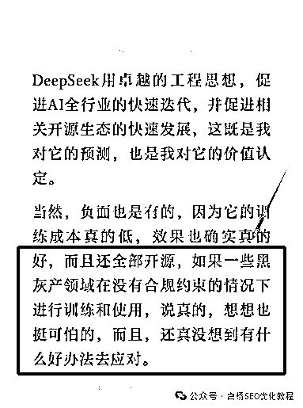

# 白杨 SEO：为什么说 deepseek 就是当下流量密码，也是挣钱密码？

> 原文：[`www.yuque.com/for_lazy/zhoubao/qu71zyb94wx0estn`](https://www.yuque.com/for_lazy/zhoubao/qu71zyb94wx0estn)

## (7 赞)白杨 SEO：为什么说 deepseek 就是当下流量密码，也是挣钱密码？

作者： 白杨 SEO

日期：2025-02-14

我们先看 3 张图：

第 1 张是本文章封面开始图片，

第 2 张是来自网上一段话的图片，

第 3 张是我上周二发的一篇 DS（deepseek 简称）公众号文章数据图片，

看完你有什么感受？

正如本文标题中 deepseek 就是流量密码，以及后面写的 deepseek 也是挣钱密码，这不是标题党！为啥？看我慢慢说来。

关注白杨 SEO 的粉丝朋友，大多数都是互联网从业者，对于流量二字肯定不陌生。如果还有朋友把我写的流量当成手机流量之类，那就太外行了，对吧。

**我为啥说 deepseek 就是流量密码？**

因为 deepseek，或者是 DeepSeek（最正确写法，但在用户搜索里没这么在意）本身就自带流量了。因为不管你是搞关键词搜索流量，还是搞平台算法推荐流量，带了 deepseek，你就有流量！

你还不信？去微信搜一搜搜下“deepseek”这个词，点文章，点下最热，看看带了 deepseek 有多少篇 10W+。去抖音，去视频号，去小红书，甚至去百度搜带有 deepseek 的内容，都是如此！

就拿白杨 SEO 自己的实战举例来说，我上面第 3 张图，也就是上周写的《DeepSeek 是什么？为什么爆火以及我们搞 SEO 流量要用它？怎么用？【必看】》这篇，阅读量和转发也比平时发的一般的多，是不是？

而且我没有告诉你的是，我的文章其实发的算晚的了，早些那些发公众号文章带 deepseek 早在去年（农历）过年前都很多人发了，比如我关注的互联网百晓生大佬曹大老师自己都说带 deepseek 确实有流量，如图。

其实年前我就在曹大的核心群看他们讨论 DS 了，哪怕大年初一他们都讨论得热火朝天，所以那时就下载了 DS 的 APP 体验，尤其那个深度思考（R1）模式，确实比我之前用的豆包，KIMI 感觉还好。

啥，白杨，你一个从事 SEO 的居然不提百度的文心一言（APP 叫文小言）？不是我不提，我今天看到文小言接入了 DS 模型优化，你就说你啥感受？

有人说百度在 AI 领域是起了早，赶了晚集，不管怎么样，事实上并不是谁早就谁一定弄得更好。据说阿里新的大模型与 DS 不相上下，只是热度赶不上 DS。

不管怎么样，不说全民，只要互联网上的人，大多数人都在讨论 DS 了，哪怕有些人甚至都还没下载 DS 的 APP，甚至连网页版网站都没打开过。

只在一些文章，一些视频里看到，然后自豪什么中国超越米国之类。其实对于我们每个人来说，如果你懂技术，你可以看这个 DS 开源了，你怎么去接入做本地部署来提效，甚至也可以对外收费服务；如果你不懂技术，你可以看看这个 AI 工具可以为你写文章，写报告，扩思路等等能有什么帮助。

我们作为 SEO 从业者来说，我们是搞搜索精准流量的，那么这个 DS 的 AI 工具可以为我们做 SEO 需要的内容可以做哪些事，甚至给哪些建议，是不是用上了？

白杨 SEO 以前说过，搜索流量与推荐流量两个不是非此即彼的二选一的对立关系，这两个是互相作用的关系。你去看各个平台，比如微信，抖音，小红书，哪个不是两者互相作用。

比如抖音短视频的推荐视频下面有看后搜小蓝字，比如小红书如果你做推荐用对了关键词，同样推荐流量更好。

所以 DS，准确的说是 deepseek 这个词，不管你是从用户搜索角度去写，还是从推荐角度去写，只要你的内容不是太拉夸，都会有流量。如果你还有一些有点新意的见解，或者有实用的分享，大家都很愿意收藏或转发的，不是吗？

再说回来，

**为什么 deepseek 也是挣钱密码？**

再想想上面最开始第 2 张图里内容，我把它打出来：

一个行业起来的时候，你赚钱可以有几种选择：

直接卖货

买它的股票

做导航

做周边的服务或者培训

这句话我最开始好像是从小北那里看到的，现在到处在流行，我不知道你看懂多少？

买它股票，对于没有更多的原始资金的朋友，这条可以忽略，你做不到有钱人那样看到新趋势能够让钱生钱！（当然也更有胆量，哈哈哈）

那剩下 3 种呢，你是不是可以去想想？白杨 SEO 再一一讲一下，仅供参考，毕竟目前我自己也还没有通过 DS 赚到啥钱，哈哈哈。

**1、直接卖货**

啥意思，还记得二年前那个 chatgpt 爆火时，很多人是不是在卖 chatgpt 账号？你有买过吗？那现在这个 DS 卖啥？不是免费下载使用吗？看到个笑话，有人说卖空气，卖信息差，帮你下载，哈哈哈

放心，DS 现在官方也有 TOKEN 卖（很便宜），有些人集合 DS 的 TOKEN（啥，不懂 TOKEN，自己去搜）就在卖了，毕竟并不是每个人都懂能接入 DS 开源这个模型。

比如，我年前写那篇《推荐下朋友搞的公号矩阵运营管理系统》这个朋友，他们的那个软件也新加入了 DS 的这个。

上面百度文心加 DS 不也是如此，更别说据说很多科技公司说接了 DS 模型，然后股票也起飞了哈哈哈。

**2、做导航**

这个意思是指，我们去做卖水的人，不要做挖金的人。大家都要去用 DS 这个，你看现在各个群都流行所谓的什么 DS 提示词手册大全之类。

我就奇了怪了，一个工具，你还需要学习才能提问，才能用，这个 DS 才是个悲催，哈哈哈。

别看手册，很多人发了 DS+各行各业什么提示词，讲真我觉得焦虑的成份明显大于真正去用的成份，很多收藏起来就吃灰，哈哈哈！

说白了，用好了 DS 就是说人话，你有啥需求提啥，如果你连提问都不会（真的很多人不会，比如直接问怎么赚 100 万，不交代背景之类），那好好去学下怎么提问吧。

之前 AI 火的时候真的出了很多 AI 导航，当然你问 AI 导航怎么赚钱，嗯，挂广告，或者卖广告位，这个已经二十多年的商业模式了。

**3、做周边的服务或者培训**

说到这个，你别说，还真有，某“大佬”联合 XXX，居然搞出几万的培训，然后在我的付费群也有人问我有没有 DS 培训课？我真想一口老血吐出来，这是多想交钱吗？？？

唉，你看嘛，虽然我没做，但并不代表这不是一种赚钱方式，对不对？

说到这里，你知道我为啥那里用挣钱，而不是用赚钱吗？其实两者意思差不多，我在另一个群的回答，如图：

好了，又写了两千多字了，这篇不是什么干货，希望能给你搞流量或者搞钱一些启发，如果你觉得这个对你有用，请继续关注我或者全网搜索找白杨 SEO，看我写的去学怎么搞精准流量哈。

哦，忘了。我上面说曹大关于 DS 误度里有这么一段，圈住的，看你能看懂多少？

唉，DS，和 CHATGPT，甚至 SEO 一样，都是一个工具，**工具本身无对错，就看用工具的人。** 针对 DS 这个 AI 热点事件一样，你说呢？

**作者介绍：**

白杨 SEO，专注 SEO 十年，全网 SEO 流量实战派，对互联网精准流量有深入研究。全网同名：白杨 SEO。

* * *

评论区：

暂无评论