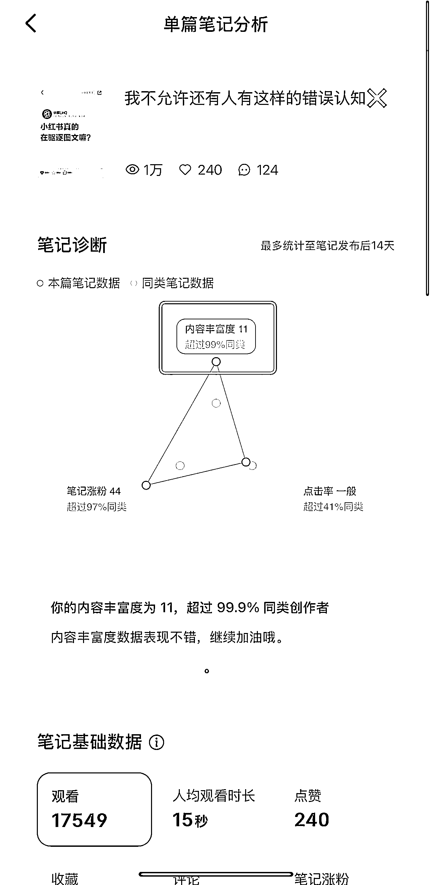
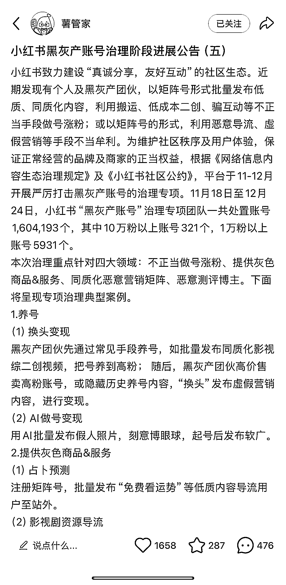

# 2025 年小红书经营趋势预测及解读

> 原文：[`www.yuque.com/for_lazy/zhoubao/uyxcrdfvmtp878v7`](https://www.yuque.com/for_lazy/zhoubao/uyxcrdfvmtp878v7)

## (精华帖)(53 赞)2025 年小红书经营趋势预测及解读

作者： 林卿 LinQ

日期：2025-02-13

**Halo，生财有术的各位圈友好，见字如面，我是林卿 �***

**从 2020 年开始我就聚焦在小红书领域，持续精耕细作；**

**在甲乙方待过、也孵化过博主，自己也运营过账号，除了没有入职过小红书之外，小红书的其他商业生态位基本上尝试了一遍，所以看待小红书的视角会综合一些。**

**在 2024 年年初，我有对小红书 2024 年的经营趋势做出过一些预判，命中率还挺高的；**

**而现在 2025 年了，我也同样对小红书 2025 年的经营趋势做出了一些预测，在这儿分享给大家，通过我的视角，一起看看小红书在 2025 年会发生哪些变化，涌现哪些机会……**

**最后，希望我的预测可以给大家提供一些许灵感，这样就够啦！**

**内容有点长，全文 2 万字，推荐点赞支持后，再沉浸式阅读！**

**当然，也可以根据目录内容，针对性地阅读�***

**小红书 2025 年经营趋势预判**

**01.大趋势**

**1.1.存量时代：流量竞争从注意力（曝光）转向记忆力（心智）**

**1.2.“小”**

**1.3.小红书商业化进程加速（深化）**

**1.4.小红书产品基建强化，偏向抖音化、阿里化**

**1.5.小红书商业生态开放化**

**1.6.小红书外溢电商或许会再次面临一刀切**

**1.7.AI 嵌入小红书**

**1.7.1.AI 嵌入小红书 APP**

**1.7.2.AI 嵌入小红书工作流**

**1.7.3.AI 是把双刃剑，机会与危机并存，但是未来 AI 一定是必修课！**

**1.8.内容深度化**

**1.9.“人感”**

**1.10.小红书向下沉和海外用户渗透**

**1.11.在小红书“出海”**

**1.11.1.做“海外用户”的生意**

**1.11.2.“出口转内销”**

**1.12.小红书正式进入商业流量时代**

**1.13.小红书流量分发日渐精准**

**1.14.小红书内容治理规范化、严格化**

**02.品类趋势**

**2.1.产品向大众化突围，大众产品小红书化**

**2.2.产品品类及客单价两极化**

**2.3.AI+**

**2.3.1.AI+宠物：人宠 AI 写真**

**2.3.2.AI+玩偶**

**2.4.概念+**

**2.4.1.概念+手链：动物追踪手链**

**2.4.2.概念+酒馆**

**2.5.2025 年小红书重点策略方向**

**2.5.1.小红书电商重点策略方向**

**2.5.2.线索行业**

**2.5.3.本地生活**

**2.6.我个人比较看好的品类方向**

**2.6.1.游戏**

**2.6.2.APP**

**2.6.3.中华文化向**

**2.6.4.大健康**

**2.6.5.周边游**

**2.6.6.企业游学**

**2.6.7.家居细分**

**2.6.8.小众品类**

**2.7.我个人比较看好的商家类型**

**03.品牌商家**

**3.1.从流量思维转向人群思维**

**3.2.小红书矩阵账号运营+效果广告投放已经成为品牌商家经营小红书的标配**

**3.4.小红书买手笔记带货或许会迎来爆发**

**3.5.小红书商品卡或许会有新增长**

**3.6.小红书直播依然是趋势**

**3.7.小红书薯条又好起来了**

**3.8.从线上走向线下**

**3.9.预售模式常态化**

**3.10.2C 品牌 2B，2B 工厂 2C**

**3.11.经营精细化**

**3.12.从单点爆破走向系统经营**

**04.服务机构**

**4.1.官方服务商被小红书近一步剥削**

**4.2.单一业务极致化（纵向发展）**

**4.3.业务多元化（横向发展）**

**4.4.业务拼多多化**

**4.5.自营品牌、合作联营**

**4.6.AIGC**

**4.7.买手 MCN**

**4.8.选品服务商**

**4.9.本地生活服务商**

**4.10.团队精简化**

**05.新个体**

**5.1.承接商业广告变现**

**5.2.买手带货、开店卖货**

**5.3.广告+带货打包**

**5.4.万物皆可卖**

# **01.大趋势**

## **1.1.存量时代：流量竞争从注意力（曝光）转向记忆力（心智）**

**我们已经进入存量时代，所有平台的用户增长放缓、甚至接近瓶颈，流量红利（2025 年有且仅有的流量红利只有小红书和视频号）在以肉眼可见的速度流逝；**

**且随着渠道分散、信息过载，用户对于广告的免疫力增强，注意力变得分散且短暂；**

**这就导致流量竞争也发生了本质的变化，不再只是抢夺用户的注意力、争夺曝光，而是要让用户记住我们，在用户心智里留下深刻印象，这样才能促使用户在消费决策的过程选择我们，甚至忠诚于我们。**

**举个真实的例子，我们在浏览小红书的时候，也会看一些 Vlog 类型的内容，Vlog 里也有一些品牌/产品露出/植入，它也的的确确强制性地曝光在了我们面前，但是曝光之后呢，又有多少用户记住了呢，又有多少用户因此而改变消费决策了呢？**

**寥寥无几，对嘛？**

**除非品牌/产品在内容里有记忆点；**

**除非品牌/产品在内容里反复多次露出、曝光；**

**但是这不就是心智占领嘛？！**

**所以后续的内容策略只会有 2 种，**

**要么品牌/产品内容极具记忆点、穿透力，让用户看一遍就记住了；**

**要么品牌/产品内容足够多，且可以做到反复多次触达同一用户，做到洗脑式记忆；**

**不然就等于白白浪费时间精力和金钱。**

**其次，心智占领也需要渗透到用户的消费决策路径里，过去用户可能是看到广告就直接购买，但是现在用户会在多个平台进行验证，比如看小红书笔记查口碑、看淘宝比价等等，这个时候就需要品牌商家在每个触点提供一致的信息，强化记忆点（心智），促成最终转化。**

## **1.2.“小”**

**“小”其实代表着很多，**

**首先是规模，不管是品牌商家，还是服务机构等，TA 们已经不再盲目追求所谓的企业规模、生意规模，而是回归“利润”，而真正有利润的企业大多是小企业，真正有利润的生意大多是小而美的生意，所以今天有不少企业在缩减规模，在逐渐变小。**

**当然，如果是赚 VC 的钱、是赚二级市场的钱，那就另当别论啦，但是就现在的大环境来说，这样的机会已经少之又少，可能性也微乎其微。**

**其次是“钱”，就这 2 年以及可以预见的未来 5 年，中国市场基本上没什么普通人赚大钱的机会了，这个“大钱”指的是年利润千万级，甚至上亿级。**

**“大钱”虽然没有了，但是遍地是“小钱”，今天作为一个普通人、作为一个新个体、作为一家初创企业，是可以通过自己的个人努力、团队杠杆等相对轻松地实现年百万级利润的。**

**最后，今天所有人创业、所有人去做小红书、所有人去选择赛道，已经不再去看大需求了，而是关注小需求、关注细分赛道，近几年所崛起的品牌也基本上是从小需求、从细分赛道里一点点长起来的。**

**综上，我有个不成熟的偏见，即今天的中国市场、中文互联网正式进入小生意时代！**

**而小红书就是为小生意而生，是小生意的最佳经营场域，没有之一。**

**基于此，也分享我最近在阅读小红书《rise100 经营实录》里看到的一句话，望共勉！**

**所有的伟大都源于一个小小的开始，把自己所擅长的一个小领域做好，把一个小概念从构想到落地，最后就能做成一件有壁垒的事情。**

**——《rise100 经营实录》**

## **1.3.小红书商业化进程加速（深化）**

**“商业化”是小红书这几年最大的课题，没有之一，所以从小红书在 2024 年的各种商业化动作里，**

1.  **小红书外溢电商趋于成熟**

2.  **小红星、小红盟、小红链、CID 的上线**

3.  **小红书蒲公英平台和聚光平台的各种功能更新**

4.  **小红书闭环电商蓬勃发展**

5.  **小红书生活方式电商概念的提出**

6.  **小红书乘风平台的上线**

7.  **小红书千帆平台的各种功能更新**

8.  **小红书线下选品会的组织撮合**

9.  **小红书闭环电商市场规模**

1.  **小红书私域电商初步放开**

2.  **从花钱投流才可以私信豁免到私信获客工具的上线和使用门槛的放开**

3.  **延伸阅读：**[私信获客工具整体产品说明及操作手册](https://doc.weixin.qq.com/doc/w3_AfIAXwbzAE83pnWQd9DS86ChBS3D0?scode=ANAAyQcbAAgDc0Zhknz-iMCi7cAL0)

4.  **小红书官方培训支持**

5.  **小红书种草学和电商学习中心各地培训中心的落地**

6.  **小红书种草训练营和招商会的组织巡回**

7.  **……**

**不难看出即便是 2025 年，它也一定会继续加速和深化商业化进程，而且现在也已经有了一些具像化的体现**

1.  **小红书灵犀平台预计在 Q1-Q2 全量放开**

2.  **笔记评论区支持添加商品链接**

3.  **……**

## **1.4.小红书产品基建强化，偏向抖音化、阿里化**

**随着小红书商业化进程的加速、深化，小红书的产品基建也在不断完善、强化，比如**

1.  **小红书网页版的上线**

2.  **小红书 APP 端的功能更新，甚至是改版**

3.  **小红书蒲公英平台、聚光平台、乘风平台、千帆平台的功能更新及 APP 上线**

4.  **……**

**至于偏向于抖音化、阿里化，纯粹是因为“天下产品一大抄”，不是你抄我，就是我抄你；**

**而抖音作为内容电商、兴趣电商的先驱，阿里作为货架电商的先驱，自然避免不了被小红书抄，甚至小红书团队里有不少员工就是原来字节跳动（抖音）团队、阿里（淘宝）团队的成员，所以小红书在产品上其实或多或少是有抖音和阿里影子的。**

**举个最真实的案例就是前段时间小红书 APP 端视频观看界面的改版，不能说跟抖音一模一样，但是至少有 80%的相似度。**

**其次，在投流产品上，所有平台的投流产品设计逻辑基本上就是抄的淘宝直通车、百度 SEM、抖音千川的逻辑，除此之外，就没有别的逻辑存在了。**

**最后，回到小红书产品基建强化上，我自己得到的信息是小红书会侧重在搜索产品和电商产品上发力，而每一次产品迭代、功能更新或多或少都会带来一些小红利，所以可以关注一下，多多尝试！**

## **1.5.小红书商业生态开放化**

**从小红星、小红盟、小红链、CID 等产品的上线，其实是可以看出小红书开放商业生态的决心，再结合品牌商家对于小红书的全域价值定位就是种草，我相信小红书在未来一定会进一步开放自己的商业生态，和更多平台链接。**

**而小红书最近准备放开的就是本地生活，**

1.  **POIx 小程序：**[【客卿 KeQ】小红书 POIx 小程序产品介绍.pdf](https://keqteaml.feishu.cn/file/K9QTbwNR5olhtHxUgBmccdIznRg)

2.  **小红团：打通小红书阅读和美团交易转化数据（类似于小红星、小红盟，利好本地生活）**

## **1.6.小红书外溢电商或许会再次面临一刀切**

**这儿所说的“一刀切”不是说直接砍掉小红书外溢电商，而是可能会跟之前一样，阶段性暂停小红书外溢电商相关工具的使用，比如小红星、小红盟、小红链、CID 等，借此来发展自己的闭环电商。**

**而之所以会有这个判断，纯粹是因为小红书闭环电商在蓬勃发展，如果横向参考抖音闭环电商的发展，再结合小红书之前也的确有暂停过小红星和 CID 这些，是有这个可能性存在的。**

## **1.7.AI 嵌入小红书**

**当然，也不只是小红书，还有经营小红书的各种工作流。**

### **1.7.1.AI 嵌入小红书 APP**

**小红书 APP 现在虽然已经有 AI 嵌入，但是嵌入程度不高，甚至还只停留在灰度测试阶段。**

1.  **小红书 APP 端搜索结果页嵌入搜搜薯 AI 总结经验**

** **images.zsxq.com/FuRZBGVrWdL219-ExnirAsskN180) **images.zsxq.com/FrmqXpk7hnhdtttQt_PHGeltUddz)**

1.  **小红书 APP 端搜索灰度测试嵌入自己旗下的 AI 工具“点点”，搜索相关关键词后，会出现相关提示**

** **images.zsxq.com/FseZb9YmesrbTYzWHHnE_HfaBQBG) **images.zsxq.com/FjFrpafB08ODPzQW1sHC7eIrPJct)**

**大家如果在做小红书、在创作小红书内容的话，强烈推荐去使用小红书旗下的这个 AI 工具“点点”，它是基于小红书的数据进行 AI 对话，可以比较方便快捷的帮助我们整理出小红书里相关的内容，辅助创作。**

### **1.7.2.AI 嵌入小红书工作流**

1.  **小红书 APP 端 - >** **➕** **-> 右上角「发文字」 -> 输入文案 -> 一键生成大字报封面**

**在小红书里，或许你看到的、不少大字报类型的封面就是它生成的；**

**它极大程度上降低了普通人去小红书上发布内容的门槛，以及我们创作某些简单内容的成本。**

** **images.zsxq.com/FoKLo11LEajAkYgAenTbP9MLd0fP) **images.zsxq.com/FrnXwjYMrGZhnJLjTqcgSKOKg63Z) **images.zsxq.com/FrCBnt4p6hfrIpexx3y0kpPDJXco)**

1.  **小红书千帆平台 - > 笔记 -> 笔记发布 -> 智能批量创作**

**生成的内容质量有点一般，但是有些创作角度和描述是可以参考借鉴的。**

**上述这 2 个还只是小红书官方自己把 AI 嵌入工作流，从这个角度也不难看出小红书其实是支持，甚至鼓励我们使用 AI 嵌入工作流来创作内容之类，实现降本增效的。**

**所以在小红书工作流里，有哪些环节可以嵌入 AI 来降本增效呢？**

**根据我们自己的实践，以及所接触到、看到的案例，大抵有这些**

1.  **收集数据、洞察需求，辅助产品研发迭代**

**延伸阅读：**[AI 调研篇之批量分析小红书评论区数据，懂客户心之所想才能更好的成交客户](https://u604y5x4sg.feishu.cn/wiki/DQOYwUlPhi6GxAkbllfcwnQ3nXf?from=from_copylink)

1.  **设计产品及包装等视觉**

**案例：AI+玩偶**

** **images.zsxq.com/Fh_55uSHb65xHb0uuj1xyO83wLEk) **images.zsxq.com/FinUU3uAExhVm2Hojm0K93258lju)**

1.  **制定策略，提供框架思路作为补充延伸，进而辅助决策**

**如果使用 AI 来制定策略的话，它是有一定局限性的，即它有些内容及数据对也不对，甚至是凭空编造的，所以需要辩证地看待，现阶段来说，还是仅限于提供框架思路作为补充延伸，辅助决策。**

1.  **分析账号、分析内容**

工具：豆包

调教流程：

01.你会分析小红书的爆款内容文案嘛？

02.好的，我给你提供一下我自己分析小红书爆款内容文案的案例，麻烦你学习参考这个案例来分析小红书爆款内容文案，可以嘛？

03.小红书爆款内容文案分析案例

小红书爆款内容文案：

谁懂口红对人设的冲击力啊。。

MAC 这两支🍂秋冬真的涂不腻！

.

🩷826 BRICK-O-LA 光涨粉

豆沙粉简直是富家千金的代名词！它既不像正红色那么张扬、也不像裸色那么低调，恰到好处的粉色调，给人一种温柔气质的感觉～

这支是 MAC 家新出的【轻缎光】质地上嘴超润，而且高覆盖力深唇也完全无压力！秋冬不喜欢水光镜面、又想让嘴唇看起来饱满透亮的姐妹，它包让你满意的！

.

🤎683 CAFÉ MOCHA 大玩咖

秋冬太太太适合涂奶咖色了！它不全是土色，而是调进去了一丝红调，所以涂上还是很提气色的！百搭也不挑皮！

哑光的质地更是给足了高级感！我是属于沙漠大干唇，但大子弹头的哑光不会显得嘴唇很干，反而很有质感！

小红书爆款内容文案分析结果：

01.小红书爆款内容文案撰写公式

情感式引人好奇开头 + 口红推荐（颜色描述+质地介绍）

02.小红书爆款内容文案内容结构分析

- 情感式引人好奇开头

用具有吸引力的情感表达或者引人思考的问题开篇，引起读者好奇

- 口红推荐（颜色描述+质地介绍）

颜色描述：使用形象生动的词汇和对比手法来描述口红颜色，如用 “富家千金的代名词”，与其他颜色对比，让读者更清晰地想象出口红颜色的独特之处和风格

质地介绍：详细介绍质地特点，并结合使用场景和不同唇况说明效果，如针对深唇、干唇等情况的表现，增加读者对口红质地的理解和判断

04.你现在学会我所提供的这个案例的分析方式和分析结果了嘛？

05.好的，那麻烦你按照我所提供的案例的分析方式和分析结果呈现形式，帮我分析一下这篇小红书爆款内容文案吧！

平时完全不喝酒，看了@🐱喵喵咪子🐱 的帖子马上就去买来喝了。原来啤酒还可以有这样的味道，一丁点苦味都没有，完全就是芒果小蛋糕的味道，可以当甜品来品尝了。不愧是顶尖精酿品牌，太太太绝了

入口是浓郁的芒果椰子香味，口味是酸的，口感是绵密细腻的气泡，一口气喝完了一整罐不喜欢酸的人可以避雷了

请问还有别的口味推荐吗，准备都尝试个遍

后续：这个帖子意外爆火了 30w 人看过了，纯喝完开心了个人分享补药说我是广告啊（one drop 看到了请打钱）

果泥啤酒评价很两极化，喜欢的人觉得很好喝，不喜欢的人会觉得从口感到口味都难以下咽。大家谨慎尝试，好奇的可以先买一瓶试试

06.分析得很好！在后续的分析里，可以再融入一些独特的见解和相关文案撰写技巧及应用建议

调教到这儿基本上就可以达到我截图的效果啦，可以再根据自己的实际诉求针对性调整。

1.  **创作内容，比如标题、文案，甚至图片**

2.  **……**

### **1.7.3.AI 是把双刃剑，机会与危机并存，但是未来 AI 一定是必修课！**

**我自己对于 AI 有个相对客观的见解，即 AI 是把双刃剑，机会与危机并存。**

**首先，AI 所带来的机会我们是有目共睹的，不管是我上述所说的 AI 嵌入小红书工作流的降本增效，还是和具体赛道结合，诞生新的解决方案，又或者是简单粗暴的“卖铲子”等等，机会是一定存在的，且遍地充斥着或大或小的机会。**

**但是危机也是显而易见的，随着 AI 的普及和商用程度提高，一定会颠覆不少行业及岗位，所以未来 AI 一定是必修课，这是不可逆的既定趋势！**

**哪怕现在你的岗位可能用不上 AI，但是并不代表以后用不上！**

**未来会使用 AI 与不会使用 AI 一定会在效率上拉开巨大差距！**

**其次，当你凝视深渊的时候，深渊也在凝视你。**

**随着 AI 智能程度、普世程度提高，一定会有人依赖 AI，而一旦对 AI 产生依赖，不再自己洞察、自己思考、自己实践、自己创作……AI 就会一点点把你蚕食，你的所有能力就会退化，然后变得一文不值！**

**这才是 AI 时代最最最可怕的危机！！！**

**AI 只是工具，它最大的价值是降本增效、是让所有人在陌生领域从 0 分达到 60 分、是第二大脑，辅助延伸拓展……而非其他！**

**所以请保持思考，持续锻炼自己的软实力，比如网感、美感、洞察力等等，拒绝被 AI 奴役！！！**

## **1.8.内容深度化**

**这是基于“AI 嵌入小红书”所延伸的趋势洞察及观点。**

**基于现在小红书内容同质化严重，以及 AI 盛行之后，一定会有不少垃圾（低质）内容产生，所以今天我们再去创作内容的时候，就需要深度化！**

**深度化不是专业化，而是在保障内容可读性、吸引力和易于消化的基础之上，提高信息密度（内容丰富度），避免过于学术化，这也是小红书在流量推荐上对于笔记的衡量指标之一。**

**回到实际执行上，我觉得最最最直接的方式就是适当延长文案长度和视频时长，这样也可以变相筛选出忠实用户，和 TA 们建立更深度的链接。**

## **1.9.“人感”**

**跟“内容深度化”一样，“人感”诞生的原因也是因为小红书内容同质化、模版化严重，以及 AI 盛行之后，加速了垃圾（低质）内容的生产，所以“人感”孕育而生，包括小红书自己也一直在提倡“人感营销”。**

**而“人感”究竟指的是什么呢？**

**我自己所理解的“人感”其实就是不把用户看成“流量”，而是看成“人”、看成“朋友”！**

**是做自己，多表达自己的真实情绪和感受；**

**是持续给予外界反馈、持续给外界汇报！**

**这样阐述可能会有一点点抽象，我们可以回想一下，哪些内容、哪些账号，让我们感觉它有“人感”，让我们感觉到有“人感”的点是什么……**

**比如养成系的账号、养成系的内容是自带“人感”的，因为我们可以感受到 TA 在持续给予我们反馈、持续给我们汇报成长进程；**

**比如老乡鸡这个账号，我们之所以感觉有“人感”，不就是因为 TA 把用户看成了朋友，在表达自己的真实情绪和感受……**

**其次，我们之所以如此强调“人感”，有很大一部分原因是因为**

**PEOPLE FOLLOW PEOPLE,NOT COMPANIES**

**人们更愿意追随一个活生生的人，而非一家公司**

**以及“人感”在某种程度上创造了新 IP、新情绪（温度）、新故事，**

1.  **人感+个人账号=新 IP、新故事**

2.  **人感+品牌账号=品牌人格化=新情绪（温度）、新故事**

**而新 IP、新情绪（温度）、新故事在某种程度上又创造了新增量！**

**所以不只是账号需要“人感”，品牌也同样需要！**

**最后，基于“人感”也侧面说明了品牌主理人、创始人 IP 正在进行时！**

## **1.10.小红书向下沉和海外用户渗透**

**这是一个既定的事实，也是既定的趋势。**

**小红书连续 2 年和春晚合作，春晚覆盖的是全国“人民”，所以下沉是不可避免的！**

**其次，小红书从 2024 年 8 月份左右开始对外花钱拉新，因为小红书覆盖的基本上是一二线城市用户，所以想赚小红书拉新的钱，最简单的方式就是去三四五六七八线城市拉新。**

**至于小红书向海外用户渗透，这是一次机缘巧合，起因是 TikTok 在美国被封禁了，有不少海外博主使用小红书之后，宣传了一下，导致很多 TikTok 的用户来到小红书，迎来了一轮海外用户的增长，以及用户的全民狂欢！**

**不过，TikTok 最后也没有被封禁，所以有不少用户也重新回到了 TikTok，至于究竟有多少用户真正留存下来了，这个就不得而知啦。**

**其次，我在 TikTok 难民事件爆发的时候，用小红书聚光平台看了一下小红书海外用户的体量，大概是 622 万，这个数据估计还在持续增长。**

**最后，从小红书官方招聘放出的多个海外岗位，结合近期宣布开始招募海外 MCN 机构的消息，也不难看出小红书向海外用户渗透的决心。**

## **1.11.在小红书“出海”**

**这是基于“小红书向海外用户渗透”所延伸的趋势洞察及观点，不过这儿所说的“出海”其实有多层含义，**

### **1.11.1.做“海外用户”的生意**

**这儿所说的“海外用户”不一定非得是外国人，也可以是海外华人华侨，像我有个好友就在做海外房产业务，主要针对的就是海外华人华侨，客单价偏高，但是结合小红书聚光平台的投放效果还不错，淡季的获客成本可以做到 10-20 元，即便是旺季也可以控制在 50 元左右，ROI 极高！**

**还有个让我感到震惊的案例是有人竟然在推特上教海外华人华侨怎么做小红书，需求还挺多，这是让我没想到的，所以海外用户绝对是我们所忽略的人群，绝对存在不少没有被挖掘的生意！**

**不过这儿也有一个矛盾点，即小红书海外用户就只有 622 万，所以在做海外用户生意的时候，就需要提前了解清楚目标市场的人群规模有多大，这个可以通过
小红书聚光平台 - > 新建计划 -> 定向 来查看。**

**而具体的经营逻辑其实和在小红书上做本地生活的逻辑是类似的。**

**其次，这儿所说的海外华人华侨也不一定非得是现在在海外的，也可以是准海外华人华侨，比如准备去海外留学、旅游、工作的用户。**

### **1.11.2.“出口转内销”**

**我之前在 TikTok 难民事件发生的时候，就有调侃说，这其实是一个“出口转内销”的好机会。**

**这儿所说的“出口转内销”指的是我去国外买个海外品牌，然后把国内的货出海走一圈，再卖回国内。虽然这样有点不太地道，但是国内平台对于海外品牌在宣传侧有点太宽容了，尤其是保健品、护肤品之类，有些功效海外品牌可以在内容里宣传，但是国货品牌不行，所以有不少相关品类的商家都愿意这样操作。**

**其次，有不少国家的个别品类是国内用户比较认可的，且国内也有不少用户的的确确会比较信任海外品牌，这也是“出口转内销”这个策略诞生的原因之一。**

## **1.12.小红书正式进入商业流量时代**

**如果自己有运营小红书账号的话，可能会有个比较明显的体感，即从 2024 年 9 月 26 日之后，小红书的流量迎来了史诗级下滑，甚至截止到今天也没有恢复太多，而导致这个变化的本质原因就是小红书自然流量不够用了。**

**小红书的流量虽然在缓慢增长，但是依然是相对恒定的，自然流量既要给视频内容和商品笔记倾斜，又要给直播扶持，还要被商业流量挤压，且随着在小红书花钱买流量的商家越来越多，挤压程度也变得越来越激烈……这样瓜分完之后，留给所有常规内容的自然流量就不够用了，何况小红书的笔记体量还在持续增长，所以就更不够用了。**

**在这种情况下，如果我们想要恢复原来的流量显然是不现实的，要么在原有基础之上，增加内容发布数量，用内容数量换自然流量；要么花钱买流量。**

**但是用内容数量换自然流量虽然也是一个解决方案，可依然是看天吃饭，鬼知道每篇内容可以获得多少流量，何况内容创作成本也是个问题，所以与其这样，还不如花钱买流量，起码它是持续稳定且可预知的！**

**综上，小红书已经正式进入商业流量时代，想要持续稳定地获取流量、想要寻求更多的确定性和安全感，付费是最好的选择，没有之一。**

**当然，有些品类是依然可以继续走自然流量的逻辑，比如服饰、比如本地生活等。**

## **1.13.小红书流量分发日渐精准**

**继续“流量”这个话题，我不知道大家跟我有没有一样的体感，就是小红书的流量分发变得更精准了，最最最直观的案例就是，用以前的数据来横向对比现在的数据，就会发现好像在同样的小眼睛数据下，互动数据变高了、转化数据也变高了；**

**过去可能 100 个小眼睛才有 1 个互动，但是现在 30 个小眼睛就有 1 个互动；**

**过去可能 1000 个小眼睛才卖 1 单，但是现在 100 个小眼睛就可以卖 1 单；**

**而导致这个现象的本质原因就是小红书的流量分发变得更精准了！**

**而变得更精准的本质原因其实也是因为小红书自然流量不够用了，只有把流量分发变得更精准，流量利用才会变得更高效、更有价值！**

## **1.14.小红书内容治理规范化、严格化**

**这是既定的趋势，再加上小红书的的确确很重视自己的社区生态，所以未来小红书对于内容的治理一定会变得越来越规范、越来越严格。**

**举 2 个例子就知道了，**

1.  **小红书在 2024 年 11 月 18 日至 12 月 24 日，小红书“黑灰产账号”治理专项团队处置了 1604193 个账号，且在持续不断治理！**

1.  **小红书在 2024 年 12 月 13 日上线了“原创保护”功能，粉丝量门槛也从一开始的 50 万降低到现在的 1 万，后续可能还会再降低，降低到和小红书蒲公英平台入驻条件一样的门槛。**

# **02.品类趋势**

## **2.1.产品向大众化突围，大众产品小红书化**

**产品向大众化突围指的是小红书闭环电商里的产品品类在向大众化突围，因为小红书闭环电商发展时间并不长，依然存在不少品类缺失，尤其是大众化产品，可以去深度研究一下补充小红书闭环电商的品类空缺。**

**大众产品小红书化则是因为小红书平台特征和用户偏好所导致的，并不是所有的产品均适合小红书，所以大众产品在小红书上卖得好，就需要小红书化。**

**而我所理解的“小红书化”，可以从 4 个方面体现**

### **2.1.1.高颜值**

**小红书是一个审美驱动的平台，颜值即正义，所以大众产品想在小红书上卖得好就需要提高产品颜值。**

**当然，有些产品因为自带 BUFF，所以也不一定需要高颜值，比如地方特产，地方特产之所以是地方特产不就是因为它具有地方属性、是地方特色嘛，而大多用户判断地方特产是否正宗的，最最最直观的方式就是通过产品包装来判断，所以就需要保留跟地方相关的属性元素，而不是一味地高颜值，高颜值说不定会带来反效果，让用户觉得商业化、不正宗。**

### **2.1.2.情绪化**

**小红书是一个大女主平台，70%的女性用户决定 TA 们是比较看重情绪价值的，所以大众产品想在小红书上卖得好，就需要让产品情绪化。**

**这样理解可以会有点抽象，举个例子：**

**我之前在小红书上有看到一个文创品牌“山川海海”，它的爆款内容封面就是自己的快递纸箱撕开呈现出情绪化的文案“重要的，从来都是那些有回应的细节”，再结合它主要针对的就是送礼场景，所以通过这个“情绪化”的产品包装设计撬动了不少 UGC 自发传播及爆款内容，带来不错的 GMV 增长。**

### **2.1.3.仪式感**

**小红书是一个大女主平台，70%的女性用户决定 TA 们是比较喜欢仪式感的，所以大众产品想在小红书上卖得好，就需要让用户在使用产品的过程里有仪式感。**

**这样理解可以会有点抽象，举个例子：**

**最近在小红书上有个爆款产品“火烧贺卡”就是通过“仪式感”爆火，这个贺卡有赠送一个火柴，火柴可以在贺卡的一面摩擦点燃，然后把一面的薄纸烧掉，火边烧，底下的内容边呈现，这就是一种仪式感！**

### **2.1.4.创意化**

**“创意化”可能不仅仅是在小红书，我想在全部平台也是如此，在产品同质化的今天，创意化可以让自己的产品直接脱颖而出，且创意即内容！**

**我也有个偏见，即 所有大众产品都值得用创意重新设计一遍，重新在小红书上爆一遍！！！**

**而什么是创意化？**

**举个例子，我之前在小红书上有看到一款抽纸盒，它跟传统抽纸盒不一样，它是把动漫 IP“阿呆”和抽纸盒结合在一起，设计了一款“阿呆”形象的抽纸盒，抽纸的位置恰好就是在阿呆鼻子的位置，有抽纸的样子就像是阿呆流鼻涕的样子。**

**其次，通过在产品重量上的一些巧妙设计，一旦抽纸用完了，阿呆就会失去平衡直接迎面倒下去，以此来提醒我们补充抽纸，这不就是一个很棒的好创意嘛！**

**最后，回到产品创新上，我觉得今天的产品创新真的不取决于硬核科技层面的创新，比如发明什么专利、什么技术，而是基于用户在使用产品过程的洞察，所延伸的人性化设计创新，是基于细分人群、细分需求的微创新！！！**

## **2.2.产品品类及客单价两极化**

**如果是小红书深度用户或者自己在经营小红书的话，就会发现在小红书上卖得好的产品品类和客单价是呈现两极化的。**

**产品品类的两极化，即大众刚需和小众非标！**

** **images.zsxq.com/FtKnUPiDUsp7IE534WCjf4EfL8JJ)**** **images.zsxq.com/FiAJXylwk4BtayMj-dhs_TzNak2E)**

**产品客单价的两极化，即极致质价比（低客单价，比如 9.9 元、19.9 元）和品质生活（高客单价，比如 1000 元，甚至是 10000 元）！**

** **images.zsxq.com/FncxueNuBzvzzuDxmVKiKwsrqXot) **images.zsxq.com/FjpaJdkCXQu7Fy2VxbTPDnmxerPR)**

**它本质上是符合小红书自己所提出的“M 型消费模型”的，即用户会在不同品类上有不同的消费预期及追求，在某些品类（日常刚需）上是追求极致质价比的，而在某些品类（自我取悦）上则是追求品质生活的。**

**如果用一句话通俗易懂地解释一下的话，就是骑着单车去酒吧，该省省、该花花。**

**基于此也就延伸了另外一个品类趋势，即“习惯性自悦品类持续增长，耐用消费品更替周期变长。”**

**习惯性自悦品类指的是茶、酒、咖啡、医疗保健、动漫、IP 玩具、游戏和娱乐服务等。**

## **2.3.AI+**

**AI 浪潮下，一定会有越来越多的品类和 AI 结合，也一定会有全新的、AI 相关的品类诞生，简单分享一下我所接触到、看到的 AI+品类。**

### **2.3.1.AI+宠物：人宠 AI 写真**

**因为宠物比较好动，不一定会配合拍摄，以及有些养宠人之前养的宠物可能去世了，想要有照片之类的念想留存等原因及需求，所以人宠 AI 写真诞生了。**

** **images.zsxq.com/FhV0k7e92Zt7EhwHVpJemRLnV83y) **images.zsxq.com/FgF2rkW-VOKARkCcn1rPNxhbC-PL)**

**像宠物摄影、宠物殡葬等品类就可以学习一下，提供相关服务。**

### **2.3.2.AI+玩偶**

**现在已经有一些品类开始使用 AI 来设计产品、创作内容，就比如玩偶品类；**

**像“抱抱计划”就是使用的 AI 来设计产品、创作内容，然后根据用户的反馈，在确定产品有一定需求量之后，反向去联系工厂研发、生产。**

** **images.zsxq.com/Fh_55uSHb65xHb0uuj1xyO83wLEk) **images.zsxq.com/FinUU3uAExhVm2Hojm0K93258lju)**

## **2.4.概念+**

**中国的广告人、营销人还是比较擅长创造各种各样的新概念，然后把它和品类、和品牌结合，进而刺激用户消费的，所以概念+品类是一个品类趋势，近 2 年也有不少品牌商家通过把概念和品类结合一路崛起，最最最典型的不就是玄学+各种品类嘛？！**

**我上述所说的概念指的比较宽泛，比如环保、女性议题、公益、动物保护、玄学等等。**

### **2.4.1.概念+手链：动物追踪手链**

**它其实就是把动物保护这个概念和手链这个品类结合在一起，打着动物保护、云养动物的幌子在卖手链。**

**核心的概念就是购买这个动物追踪手链之后，就可以云养一只动物，通过小程序查看所云养的这只动物的动向和近况等等。**

** **ri_KwGBM4n5RHIqCt) **images.zsxq.com/FqtZYZ0mtFe3pZmUMBQrKXtbqdMF)**

### **2.4.2.概念+酒馆**

**杭桃里通过一些微小的门店经营细节来体现“女性友好”，结合这个概念来做内容传播和用户的深度链接。**

** **images.zsxq.com/Fp8rnVAX8ULtVimfXl_AXXjKghM7)**** **images.zsxq.com/Fu_q7zVqjqicdkSPK2FZxOvcH8Xa)**

**回到“概念+”上，我们的的确确可以通过概念结合来建立良好的品牌形象，通过相对低成本的方式撬动增长，但是如果想真正意义上建立品牌、想得到持续稳定的增长，就需要我们真实地把这些概念贯彻到品牌的日常经营里，做好概念相关的一系列小事儿，而非空喊口号，光有概念。**

## **2.5.2025 年小红书重点策略方向**

### **2.5.1.小红书电商重点策略方向**

**时尚潮流、家居、家具、美食、健康、美妆、个护、文玩、手工艺、母婴**

### **2.5.2.线索行业**

**线索行业指的是教育、生活服务、婚庆等以客资线索为营销目标的行业。**

### **2.5.3.本地生活**

**2025 年小红书本地生活有黄金，在上述的内容我就有提到小红书最近在准备放开本地生活的商业生态，**

1.  **POIx 小程序：**[【客卿 KeQ】小红书 POIx 小程序产品介绍.pdf](https://keqteaml.feishu.cn/file/K9QTbwNR5olhtHxUgBmccdIznRg)

2.  **小红团：打通小红书阅读和美团交易转化数据（类似于小红星、小红盟，利好本地生活）**

**而随着小红书本地生活商业生态的放开，本地生活一定会迎来一轮新的增长，就像抖音之前本地生活团购、团长及分销放开、上线一样，小红书同样存在类似的机会！！！**

**延伸阅读：**[【客卿 KeQ】小红书商业 WILL 大会高层访谈内容.docx](https://keqteaml.feishu.cn/file/IP4Ab6DPKoQtXox3aelcVJfTnDg)

## **2.6.我个人比较看好的品类方向**

### **2.6.1.游戏**

1.  **女性向游戏**

2.  **情侣双人游戏**

3.  **乙女游戏，比如恋与深空**

### **2.6.2.APP**

1.  **女性向 APP**

2.  **个人成长、精致主义、精英主义、实用主义相关的 APP**

### **2.6.3.中华文化向**

1.  **非遗**

2.  **新中式**

### **2.6.4.大健康**

1.  **中医食疗**

2.  **宠物保健品**

### **2.6.5.周边游**

**今天的用户本质上没有那么多时间去长途旅行，而且看得见的长途旅行节假日就是中秋、国庆、春节等，何况这个时间段出去旅游大概率就是人挤人！**

**所以有越来越多的人更倾向于短途旅行，尤其是周边游，比如周末去所在的城市周边逛逛，2 天 1 夜，玩完就回来继续工作！**

**其次，周边游又在某个程度上解决了用户的社交需求，因为是周边游，所以一起玩的人大概率就是周边城市，甚至是同城的人。**

**像 2024 年就有个爆火的周边游“溯溪露营”，有不少人在小红书上组团、找搭子一起去溯溪露营。**

### **2.6.6.企业游学**

**我自己在 2024 年的时候，组织了 2 次线下游学，一次是去义乌，一次是去郑州；**

**去义乌，纯粹是见识一下世界小商品中心，看看产品的多样性和工厂；**

**去郑州，则是去深度了解一下小红书郑州帮，学习交流、增长经验；**

**组织完，用户反馈还不错，而且我也在小红书上看到了不少游学相关的需求和案例，比如去胖东来游学，比如义乌游学已经有不少人（****🌰****：只讲真话的大厂小洋姐 **MF43ao3P-8p4yjn0cDHBRWWEe3Vx2M=&xsec_source=app_share&xhsshare=CopyLink&appuid=6534b79b000000000d004780&apptime=1739430165&share_id=d43f160a39b6431d9d21db68b2e81887)）在持续做了……**

**所以企业游学也是我看好的品类之一，像不少产业带就可以延伸出这样的游学业务。**

### **2.6.7.家居细分**

1.  **床上四件套**

2.  **抱枕**

3.  **家居装饰画**

### **2.6.8.小众品类**

1.  **宠物羊毛毡仿真画/玩偶**

***�：**[是只屿手作工作室](https://www.xiaohongshu.com/user/profile/62c533d900000000020005df?xsec_token=AB3f2flSikgQ00utIQF4k4jhLFQfLy1IOHWZ8PIxlBW1E=&xsec_source=pc_note)

1.  **高定胸衣**

***�：ZIWU_Artemis **KTD7nxmZJdbwK932nTxopb0RXJI0F_9dsK5wrw=&xsec_source=pc_note)**

1.  **原创设计项链、腰链、身体链**

***�：**[🦋我是神奇蝴蝶🦋](https://www.xiaohongshu.com/user/profile/629613630000000021028168?xsec_token=ABC2X3tjwXMxiok147BpYJmhRlANej3I6WJ6CQHAN4meE=&xsec_source=pc_note)

1.  **高定绳衣**

***�：**[罗缺氧](https://www.xiaohongshu.com/user/profile/5fe43079000000000100bac3?xsec_token=ABpkf6pWJArmQSrs2rKhY81k4zyHXR3dpZSuS4TuVUoZE=&xsec_source=pc_note)

1.  **木雕装饰画**

***�：高祥 **sR8NKV2gGr7KKMNs=&xsec_source=pc_note)**

1.  **火漆印章**

***�：**[不知名飞飞鱼](https://www.xiaohongshu.com/user/profile/60f755090000000001006ff8?xsec_token=ABYTnLppTeLkkHOVHPZBLIF9oMBoUm6tegmh8Un92F4Rs=&xsec_source=pc_note)

1.  **娃衣**

***�：**[叁叁猫衫](https://www.xiaohongshu.com/user/profile/676d53ed000000001801eac1?xsec_token=ABn6wV7kVqrpoSQUksx91FqUYCpUcNVgpPF_j4pztuS-k=&xsec_source=pc_note)

## **2.7.我个人比较看好的商家类型**

1.  **原创设计师品牌**

2.  **品牌主理人是设计师**

3.  **有线下实体门店，且产品是可销售全国**

4.  **自有工厂，且有一定产品研发能力**

**自有工厂是真·优势、真·壁垒，但是工厂的产品研发、成本管理、品控和产能等才是核心竞争力！**

# **03.品牌商家**

## **3.1.从流量思维转向人群思维**

## **3.2.小红书矩阵账号运营+效果广告投放已经成为品牌商家经营小红书的标配**

**小红书矩阵账号运营+效果广告投放已经成为品牌商家经营小红书的标配，且这是所有品牌商家经营小红书最低成本完成冷启动的方式，没有之一！**

**今天经营所有平台的本质是一样的，即通过内容触达用户达成目的。**

**而之前之所以有如此多的品牌商家愿意花钱投放博主；**

**纯粹是因为 TA 们认知有限，看到的成功案例大多是通过博主投放成功的，所以愿意花钱投放博主；**

**纯粹是因为 TA 们没有生产内容能力，所以只能通过小红书博主来生产内容。**

**但是在投放之后，又会发现今天有 60%以上的博主是不具备品牌商家所需要的内容生产能力的，TA 没有办法基于品牌、基于产品、基于人群去创作内容，只会简单地套模版！**

**既然内容没办法通过博主来生产，那就只能自己做；**

**除非团队里有人具备一定的内容能力可以提供内容策划、把控博主合作内容；**

**除非真·有钱，愿意花钱持续试错。**

**其次，随着信息差被抹平，品牌商家也知道了自己运营账号的价值，以及通过简单地算账之后，也发现了自建内容团队的性价比远高于投放博主，所以越来越多品牌商家开始自己运营矩阵账号、自己创作内容，再配合效果广告投放来短平快地测试内容模型，最后借助投放博主来放大效果。**

**且随着自建内容团队，品牌商家开始具备一定内容能力之后，可以相对轻松地识别出哪些博主是具备内容能力的，这些博主就可以一起共创内容；而那些没有内容能力，只会生产模版化内容的博主，就根据之前所测试出的内容模型，继续生产模版化内容就好。**

## **3.4.小红书买手笔记带货或许会迎来爆发**

**这是我自己在接触到、看到一些案例，横向参考抖音电商发展，得出的结论。**

**先说说案例，我自己接触到的是丸妃和暴肌独角兽，TA 们通过跟小红书买手深度绑定，让买手来运营 KOS 账号，合作分佣，撬动了至少千万级 GMV 的增长。**

** **SF)**

**而我自己看到的案例是小红书在《rise100 经营实录》里提到的“**[小文梨子](https://www.xiaohongshu.com/user/profile/5f422f1500000000010027cc?xsec_token=YBX3z51TIouEFcvXKS-3zBNY0Ik4fyFNZN8n7ltrOQKVE=&xsec_source=app_share&xhsshare=CopyLink&appuid=6534b79b000000000d004780&apptime=1739436141&share_id=6bedc51974f046a0b13cb3755726cfdd)**”。**

**再说说，小红书买手笔记带货在 2024 年之所以没有爆发，原因有这些**

**一是小红书在 2024 年侧重在扶持买手直播带货，而非笔记带货；**

**二是小红书博主没有看到相关的标杆案例，所以在算账的时候，天然会觉得，我合作广告，起码还有个广告费，但是我发买手笔记，不仅收益没有保障，还给品牌商家免费曝光，完全不划算……这就是小红书博主现阶段最最最真实的内心 OS；**

**三是品牌商家也没有注意到，且没把它当回事儿，不愿意花钱试错。**

**而现在小红书官方已经把小红书买手笔记带货作为重点项目，**

**针对外部，给到 MCN 机构、选品服务商等流量扶持和投流激励；**

**针对内部，给到小红书买手运营 KPI（非直播的小红书博主通过小清单产生月 GMV10 万+的案例）；**

**除此之外，小红书平台也在近期上线了“小清单好物”，提供可以拿样的高佣货盘。**

**最后，如果现阶段想做好小红书买手笔记带货的话，推荐**

**1️⃣** **优先级把小红书店铺运营好；**

**2️⃣** **跟过往合作过的小红书博主沟通，让 TA 们尝试买手笔记带货；**

**如果不愿意的话，可以考虑先用原有合作内容去投放效果广告跑出一定销售效果之后，用结果说服 TA。**

**3️⃣** **近期投放的博主可以考虑先沟通合作买手笔记，不愿意之后，再沟通投放，然后用上述套路，再合作结束之后，去说服 TA。**

## **3.5.小红书商品卡或许会有新增长**

**所有电商发展到一定阶段之后，一定会孕育“货架电商”，因为当一个平台的用户习惯在这个平台购物之后，就一定会出现“人找货”的行为，而“人找货”本质上不就是货架电商逻辑嘛？！**

**所以一定要运营自己的小红书店铺，用传统电商的逻辑重新迭代一遍！！！**

## **3.6.小红书直播依然是趋势**

**小红书现在依然在扶持直播，且已经有层出不穷的案例出现，所以它依然是趋势，依然值得去做！**

**从店铺自播来看，比起抖音店铺自播，小红书店铺自播更值得选择，因为它客单价更高、利润更高，也更稳定，不像抖音一样存在太多不确定性，以及低价内卷。**

**但是，如果决定做小红书店铺自播的话，那就不能照搬抖音店铺自播的经验，因为它俩的逻辑完全不一样！！！**

**从买手直播带货来看，它依然在持续增长，虽然规模体量比不上抖音、快手，但是好在稳定、有利润。**

## **3.7.小红书薯条又好起来了**

**以前我经常吐槽说，小红书薯条是个垃圾产品，一点儿作用也没有，但是从最近得到的反馈来看，它颠覆了我原来的判断，它好像又好起来了！**

**现阶段反馈比较好的使用场景是**

1.  **客资线索型商家在投流成本偏高的时候，可以考虑使用薯条，获客成本说不定会有惊喜；**

2.  **笔记自然流量下降的时候，可以考虑使用薯条撬动一下。**

## **3.8.从线上走向线下**

**我发现越来越多的品牌商家开始从线上走向线下，这个线下指的不是开设线下实体门店，而是在线下组织各种各样的快闪活动、社群活动，通过线下活动和品牌忠实用户建立更深度的链接，这是一个趋势！**

**因为线上还是很难建立深度链接的，**

**品牌商家没有跟真实的用户在一起的话，还是很难得到更真实的反馈、更真实的心声；**

**也很难培养出自己品牌的 KOC、自己的品牌挚友！**

**但是线下可以，我们可以通过一系列的线下活动，近距离地和典型用户、和忠实用户打成一片，建立更深度的链接，来完成上述所说的 2 件事儿。**

## **3.9.预售模式常态化**

**随着小红书上越来越多的养成系品牌出现，越来越多品牌商家和用户一起共创产品，预售模式也变得常态化。**

## **3.10.2C 品牌 2B，2B 工厂 2C**

**2C 品牌 2B 有 2 个逻辑，**

**一是为了有更稳定的 GMV 和知名度，有些 2C 品牌开始支持 2B 采买，或者针对 B 端需求定制化产品，比如某香薰品牌就支持酒店之类的线下门店低价采买，一方面是为了更稳定的 GMV，另一方面也是为了通过线下场景提高自己的知名度；**

**二是为了有更好的现金流和能力最大化利用，有些 2C 品牌在某些版块做得相对突出之后，就开始对外服务有相关需求的 B 端，比如某品牌通过抖音达人分销起盘，有相对突出的抖音达人 BD 能力，就开始服务一些品牌做抖音达人分销，这样不仅可以有更好的现金流，还把团队能力和资源最大化利用起来了。**

**2B 工厂 2C 则是在各个平台看到工厂品牌发展不错之后，为了更高的利润开始尝试自己 2C。**

## **3.11.经营精细化**

**我之前就断言过，小红书的经营逻辑并不难，所有品牌商家均可通过所谓的方法论等等在小红书上做到 60 分，而在这个时候，想要取得更好的效果，唯一的突破点就在于精细化，即在经营过程里的精细化程度和执行颗粒度！**

**举 2 个例子：**

**1️⃣** **凯乐石 MONT X 冲锋衣**

**它基于攀登 67 座名山的不同人群的不同需求，精细化创作与之适配的内容来实现种草转化！**

**2️⃣** **某品牌烘干机**

**因为有烘干机购买需求的人群大多所在地区长期降雨，导致衣服没办法自然晾干的人群，所以它根据不同地区的天气情况精细化创作与之适配的内容，通过效果广告精准定向投放目标人群实现种草转化！**

**这就是经营精细化的体现！**

**在未来随着小红书官方培训的深入，信息差逐渐被磨平，最后比拼的就是对于用户和内容的洞察，以及在经营过程里的精细化程度和执行颗粒度了！**

## **3.12.从单点爆破走向系统经营**

**我发现越来越多品牌商家在经营小红书的逻辑上，从单点爆破走向系统经营！**

**因为越来越多品牌商家发现单点爆破虽然可以帮助自己短平快地完成冷启动，甚至建立领先优势，但是随着经营的持续、竞争的激烈，想要建立在小红书上自己的竞争壁垒就一定要系统经营。**

**举个例子来感受一下，**

**我是个服饰品牌商家，因为之前自己没有内容生产能力，所以只能投放小红书博主，每个月花钱投放小红书，随着花得真金白银越来越多，对于博主投放也越来越有经验，投放效果也在持续提高，通过单点爆破（博主投放）建立了自己在小红书上的领先优势。**

**但是博主投放的效果是有阈值，不是我投放越多，效果就越好；**

**而且竞争对手在得知我通过博主投放取得不错效果之后，也开始投放，还是盯着我投放，导致我和竞争对手的差距越来越小，投放效果和 GMV 也受到了一定影响。**

**这个时候，我如果我继续死磕博主投放的话，效果提高大概率是有限的，且被学习模仿的成本有点太低了，竞争对手可以直接通过第三方数据分析工具看到我投放了哪些博主、哪些内容……所以我开始系统经营，开始覆盖小红书的其他经营版块，比如效果广告投放、账号运营、直播带货等等。**

**在系统经营一段时间之后，我发现我在小红书上的规模体量上去了，且竞争对手好像也没办法学习模仿我了，因为很多经营动作是隐性的，比如我给笔记投流花了多少钱、哪些笔记是持续有效、在持续投流；比如我运营了几个矩阵账号、每个矩阵账号效果怎么样；比如我店铺自播效果怎么样、有没有投流；比如我的团队架构是怎么样的、内部是怎么分工协作的、人效怎么样……**

**随着系统经营的深入，各个经营版块的衔接配合也越来越好，我真正建立了自己在小红书上的竞争壁垒。**

**从这个例子里，我们就会发现单点爆破所带来的 GMV 增长是相对有限的，想要有更高的规模体量就需要系统经营；**

**其次，单点爆破是很容易被竞争对手学习模仿的，而系统经营是很难的，因为竞争对手很难通过表象去深入判断某些东西，以及想要学习模仿的各项成本是高的。**

# **04.服务机构**

**在阐述我对于服务机构在小红书 2025 年经营趋势预判之后，先分享一下服务机构所需要面临的市场变化。**

**1️⃣** **品牌商家的合作诉求从品牌宣传变成品效合一，甚至更直接的卖货！**

**2️⃣** **不少品牌商家在小红书上的投放预算开始缩减**

**3️⃣** **中小商家变得更偏向于自己搭建团队去经营小红书，而不是找外部机构合作**

**因为中小商家投放预算有限，只有自建团队才能把有效的预算效果最大化！**

## **4.1.官方服务商被小红书近一步剥削**

**从我所得到的信息来看，小红书针对各个端口的合作政策均在收缩，但是对于各个端口的服务商 KPI 要求并没有降低，这也就导致小红书官方服务商在被小红书近一步剥削。**

## **4.2.单一业务极致化（纵向发展）**

**聚焦于某一项业务，十年磨一剑，做到极致化，成为行业 TOP；**

**这样口碑会好、转介绍会多，也有自己选择客户和议价的权利。**

**当然，这样规模体量大概率做不大，但是利润相对会好不少。**

## **4.3.业务多元化（横向发展）**

**比如从小红书平台业务拓展到抖音平台或者其他平台；**

**比如从小红书平台的某些业务拓展到小红书平台的全版块，成为小红书全案服务机构，提供小红书经营一站式解决方案……**

## **4.4.业务拼多多化**

**把收费降低，低价走量，在走量的同时，也筛选出优质商家深度绑定；**

**但是这个方向比较适合在三四线城市的团队，这样各项硬性成本才会得到质的降低，业务才可以盈利。**

## **4.5.自营品牌、合作联营**

**我自己是比较推荐服务机构做自营品牌的，不一定需要做多大，而是自己跑通品牌经营的全链路，以及把它作为合作背书和案例之一。**

**其次，如果暂时没有时间精力去搞定后端这些的话，也可以考虑找比较靠谱的后端一起合作联营，把自己的流量营销能力赋能给后端。**

## **4.6.AIGC**

**AI 浪潮下，AIGC 一定会是新趋势，且现在已经有不少机构在通过 AI 创作内容、运营账号，然后通过这些账号去承接商业广告等。**

**其次，这样的账号在某种程度上是可以批量化复制的，所以值得去探索一下！**

## **4.7.买手 MCN**

## **4.8.选品服务商**

## **4.9.本地生活服务商**

**买手 MCN、选品服务商、本地生活服务商全部是小红书 2025 年的重点策略方向，所以一定存在赚钱机会！**

## **4.10.团队精简化**

**小红书服务机构在团队上的真实变化就是精简化，即**

1.  **从一二线城市去到三四五线城市**

**像有些岗位实际上是不需要人才的，只需要根据 SOP 流程听话照做，有执行力就行，所以有些服务机构就会把这部分团队从一二线城市迁移到三四五线城市，通过这种方式来降低人力成本。**

1.  **从线下团队转向部分线上兼职合作**

# **05.新个体**

## **5.1.承接商业广告变现**

**虽然今天有不少人在唱衰小红书商业广告变现，但是运营小红书账号、成为小红书博主，承接商业广告变现依然是现在新个体在小红书上主流的变现（赚钱）方式，依然吃香、依然相对简单，门槛也依然相对低。**

**我把所有通过商业广告变现的账号，分成 3 种，**

**一种是有人设，有真人出镜、有生活方式、有情感链接、有故事；**

**一种是没有人设，纯粹推荐产品、好物种草；**

**一种是没有人设，纯粹凭借乱七八糟有流量的内容运维。**

**而我也梳理了这 3 种账号在不同维度的区别，可以参考一下，**

**其次，因为小红书自然流量不够用了，所以现在小红书账号的起号难度也在逐渐变高；**

**是否有商业广告也受账号近期内容数据波动影响比较大；**

**0-10 万粉丝的账号是最容易接到商业广告的，10 万粉丝以上反而比较难接到商业广告，除非账号有人设，且近期内容数据不错；**

**再加上品牌商家在小红书上的投放预算缩减，以及变得更加精明；**

**所以商业广告变现的门槛也在持续变高，且赚且珍惜吧。**

**最后，如果非得推荐一下赛道的话，建议在热门内容赛道里继续挖掘细分赛道，在新兴内容赛道里融合其他赛道。**

## **5.2.买手带货、开店卖货**

**小红书买手带货、开店卖货成为新个体小红书掘金的新趋势；**

**但是我个人还是比较推荐优先级考虑买手带货，而非开店卖货，因为开店卖货意味着有干不完的琐碎小事儿，比如选品、测品、找货源、上下架、客服、打包发货等等。这些琐碎的小事儿极其消耗时间精力，但是又不得不做。**

**其次，普通人很容易在开店卖货的流程里碰到一些自己解决不了的问题，**

**比如产品问题，尤其是在找货源上，因为是一件代发，或者订货量不高，所以很难有议价权，没有议价权就没有价格优势。这还不包括囤货问题，一旦囤货就会有卖货焦虑和资金压力，导致经营动作变形。**

**比如客服问题，个体时间精力有限，压根就没办法长时间回复客服消息；回复吧，可能就没什么时间精力去做其他事情了；不回复吧，可能没办法达成小红书商家自主客服考核，导致处罚；**

**可能导致客户流失，甚至产生差评；**

**外包吧，预算有限，且新客服还需要花时间精力培训，自己没有承接过客服的话，还不知道怎么培训……**

**这还不包括售后和退货率问题****😂****，尤其是像服饰这种售后问题比较多、退货率比较高的品类。**

**比如打包发货问题，小红书现在已经不允许无货源模式啦，一经发现直接封禁，所以要么自己打包发货，要么联系供应链，接入 TA 们的 ERP 系统，让 TA 们合规发货。**

**当然，在现在埋头捡钢镚的时代，不论做什么，都一定会遇到问题，只不过我一直以来秉承的赚钱理念就是**

1.  **可以躺着赚钱，就别站着赚钱；**

2.  **可以站着赚钱，就别跪着赚钱；**

3.  **除非钱给得太多了……**

**所以与其这么麻烦，苦哈哈地赚钱，不如试试更简单的赚钱方式，比如买手带货，因为买手带货本质上就是笔记或者直播带货，它是开店卖货的简易版，不需要自己吭哧吭哧地负责后端那些琐碎的小事儿，只需要选好品，做好内容和直播就够了！**

## **5.3.广告+带货打包**

**从我自己过往的经验来看，买手带货是小红书博主的进阶归宿。**

**市场的变化让品牌商家开始疯狂谋求确定性增长、谋求看得见的 GMV 增长、利润增长，而纯粹的商业广告是没办法给品牌商家带来直接的确定性收益，没有确定性收益就没有安全感。**

**但是对于品牌商家来说，带货是可以的！！！**

**所以对于小红书博主来说，尤其是高粉丝量的博主，成为买手去带货已经成为趋势，甚至是标配，不带货就没有性价比、就没有竞争力，除非这个赛道还没有开始内卷。**

**因此，广告+带货打包已经成为既定趋势。**

## **5.4.万物皆可卖**

**对于新个体来说，小红书上遍地是小钱，是赚钱的机会，只要选好赛道、有执行力，基本上可以通过小红书赚到钱！！！**

**在小红书上，万物皆可卖，再小的需求也值得被看见！！！**

**最后，所有新个体都可以在小红书上探索各种赚钱的可能性，找到属于自己的“小生意”！！！**

* * *

评论区：

小智 : 感谢！学到了好多！对小红书又有信心了哈哈哈

鱼丸|亦仁助理 : 建议修改标题，尽量少写“万字长文”这种表述哦

林卿 LinQ : 好啦，已修改