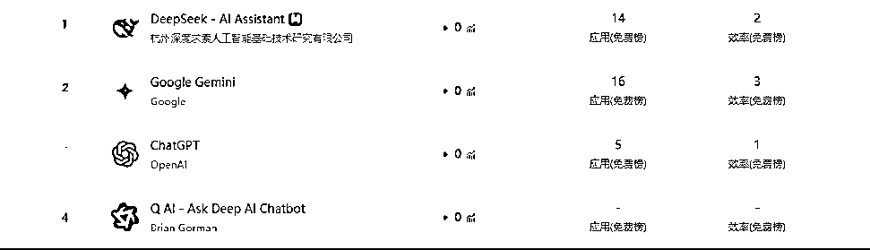
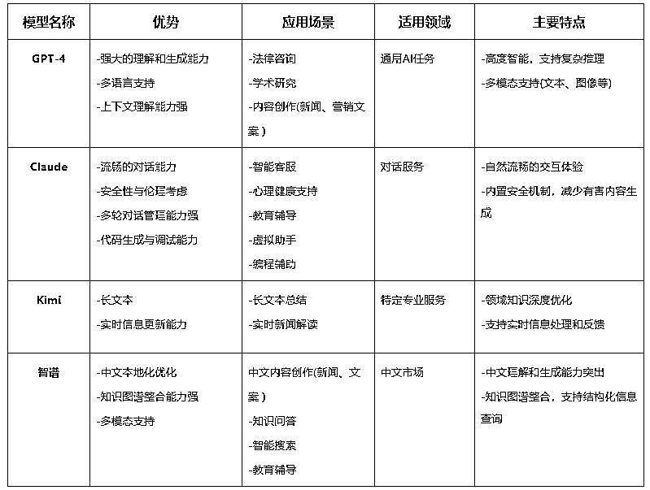
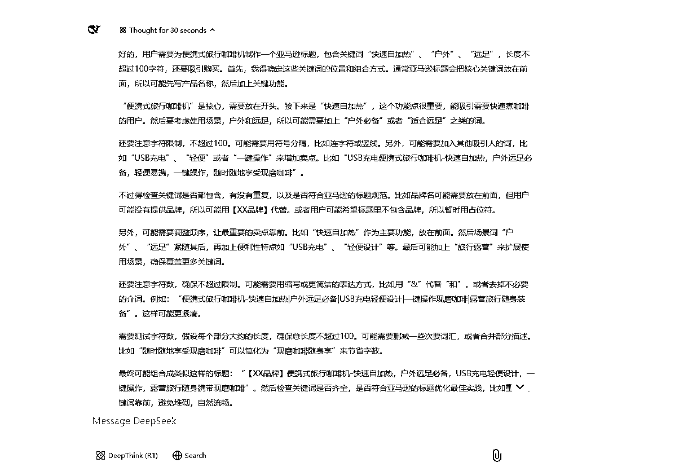
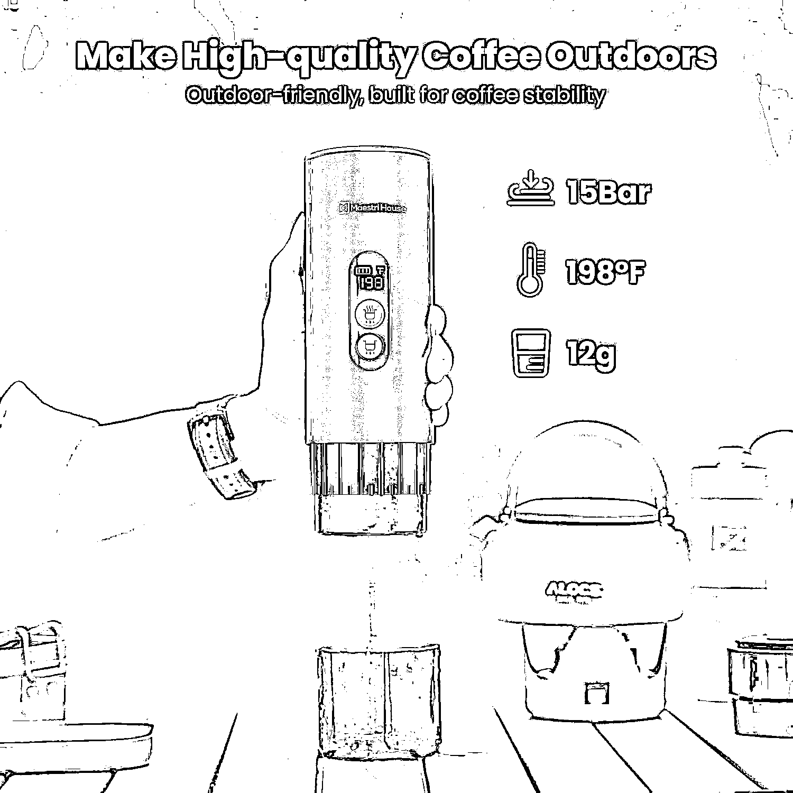
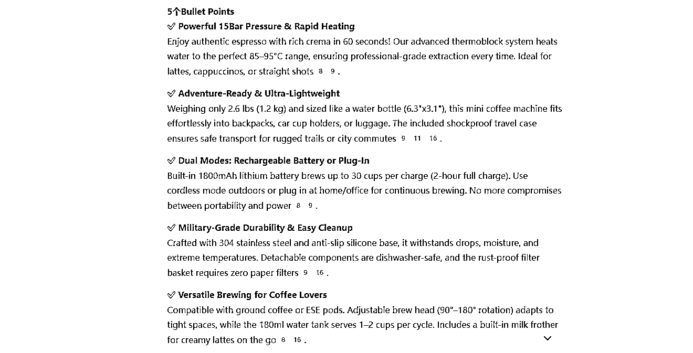
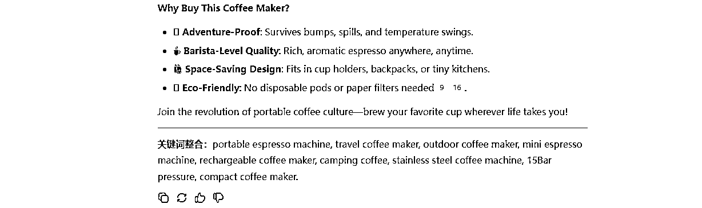
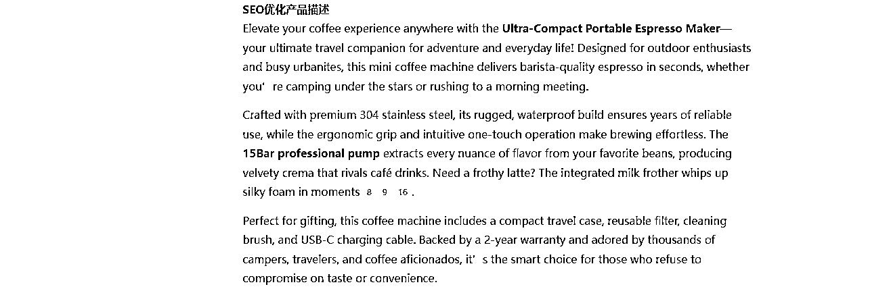

# 2025 跨境生死局：不用 DeepSeek 优化 Listing 的卖家，正在被淘汰！

> 原文：[`www.yuque.com/for_lazy/zhoubao/vg9ipez9x7pxkwv7`](https://www.yuque.com/for_lazy/zhoubao/vg9ipez9x7pxkwv7)

## (10 赞)2025 跨境生死局：不用 DeepSeek 优化 Listing 的卖家，正在被淘汰！

作者： 国民弟弟的跨境十年

日期：2025-02-10

**为什么 DeepSeek 这么火？**

1 月 27 日刚开始的数据显示，DeepSeek 应用登顶苹果美国地区应用商店免费 APP 下载排行榜，在美区下载榜上超越了 ChatGPT。

同日，苹果中国区应用商店免费榜显示，DeepSeek 成为中国区第一。

为什么我们要知道一个大模型为什么爆火?是因为我们要了解它的技术优势、应用场景、局限性与风险，让我们可以全面认识一个大模型火爆的原因及其背后的价值，有助于我们在实际应用中更好地利用这些工具，形成自己的工作流。

比如我们在操作的时候，不同的大模型的优势是不同的，那对应我们的应用场景就不一样，比如：

大家都知道 DeepSeek 这款 AI 工具火爆全网，不仅科技圈、写作圈在用，跨境电商圈也开始疯狂入坑！

作为一名跨境电商从业者，深知运营中 Listing（产品页面）的重要性。

为什么？很简单，Listing 写得好，流量翻倍、转化率提升、广告费都能省一半！

但写好一份 Listing 并不容易，它需要兼顾 SEO 优化、用户吸引力和市场需求，而 DeepSeek 恰恰是解决这些问题的得力助手。

今天，我就来深入分析一下，如何利用 DeepSeek 生成高质量的 Listing，提升你的跨境电商运营效率。

> **01****.** **Listing 写作的关键要素**

在跨境电商平台（亚马逊、eBay、Shopify 等），Listing 质量直接决定了产品的流量和销量。

一个优秀的 Listing，至少要满足以下几点：

**标题（Title）——精准吸引点击**

- 关键词要靠前，确保被搜索引擎抓取。

- 语言简洁直白，突出产品核心卖点。

- 适当加上品牌名+主要功能+适用场景，提升信任感。

**核心卖点（Bullet Points）——快速打动用户**

- 每个 Bullet Point 都要直击用户痛点，告诉他们为什么选你的产品。

- 适当使用数字，提高可信度（如"99.9%杀菌率"、"30 天长效续航"）。

- 语气亲和、强调产品的独特价值。

**产品描述（Product Description）——深度种草，促成转化**

- 详细介绍产品规格、功能和使用场景。

- 可以用故事化方式引导用户想象使用后的体验。

- 结合用户痛点，强调产品的差异化优势。

**关键词（Search Terms）——提升搜索排名**

- 添加长尾关键词，让 Listing 覆盖更多搜索需求。

- 分析竞品的热门关键词，并合理布局。

- 结合 Helium 10、Jungle Scout 等工具，找到市场上最有效的搜索词。

这就是 Listing 的基本框架，掌握了这些，才算真正入门！

> **02****.** **如何用 DeepSeek 生成高质量 Listing？**

DeepSeek 的核心能力在于快速、高效、精准生成 Listing，但要用得好，最关键的就是 Prompt（提示词）。

简单来说，AI 生成的质量，取决于你给的指令。

想要 DeepSeek 写出一份完美 Listing，一定要明确你的要求。

比如：

✅ 语气风格：正式、亲切、专业？

✅ 目标人群：年轻女性、科技爱好者、户外玩家？

✅ 关键词布局：哪些是核心关键词？哪些是长尾关键词？

✅ 文字长度：标题多少字符？Bullet Points 多少条？描述要多详细？

**给大家演示如下：**

**DeepSeek 的回答：**

**高效 Prompt 模板：**

"请为一款适用于户外旅行的便携式迷你咖啡机生成一份亚马逊 Listing，包括：精准标题、5 个 Bullet
Points、SEO 优化的产品描述，语气亲切，突出耐用性和便携性，符合北美消费者的购买习惯。"

**关键优化点：**  ✅ 带数字量化 —— 让数据增强可信度，例如：“30 秒快速萃取，随时随地享受浓醇咖啡。”  ✅ 突出痛点解决 —— 强调用户需求，例如：“无需插电，无论是露营、徒步还是长途旅行，都能轻松冲泡美味咖啡。”  ✅ 悬念结构 —— 激发用户兴趣，例如：“你一定想不到，这款迷你咖啡机居然可以...”  ✅ 加入社交标签 —— 提高品牌曝光，例如：“#咖啡自由 #户外必备 #便携咖啡机”

**Bullet Points 的生成：**

DeepSeek 按照这个 Prompt，就能生成一份结构完整、SEO 友好、转化率高的 Listing。

重点来了：AI 能帮你写，但不能 100%替代人工优化！

> **03****.** **AI 生成的 Listing 如何优化，才能最大化转化率？**

DeepSeek 的生成能力很强，但要让 Listing 真正带来订单，还需要你进行人工优化。

**1️⃣** **关键词优化，提高搜索排名**

竞品分析：用 Helium 10、Jungle Scout 等工具，看竞品用的关键词有哪些？

长尾关键词：例如，“咖啡杯机”可以拓展成“户外旅行 USB 充电式随身咖啡机 ”。

**实操技巧：**

在 DeepSeek 的 Prompt 里，直接指定关键词，让 AI 帮你合理分布在标题、Bullet Points 和描述里，避免关键词堆砌。

**2️⃣** **语气调整，匹配目标用户**

不同产品的目标用户群不同，Listing 的语气也要相应调整。

科技产品 → 需要更专业的描述，比如：

搭载最新 AI 算法，精准识别用户需求。

**实操技巧：**

在 DeepSeek 的 Prompt 里，可以加上一句：请用亲切的语气撰写产品描述，增强用户代入感。

这样 AI 就能生成更符合用户喜好的文案。

> **3️⃣** **A/B 测试，提高点击率和转化率**

即使是 AI 写出来的 Listing，也可以做 A/B 测试，优化效果最大化。

测试不同标题，看看哪个带来的点击率更高。

调整 Bullet Points，尝试不同的卖点排序，看哪个更吸引用户。

优化描述，让内容更生动，激发用户购买欲望。

有时候，一个小小的调整，就能让转化率翻倍！

> **04****.** **DeepSeek 帮跨境卖家提升 Listing 质量的核心优势**

提高效率：AI 秒出内容，省去繁琐的手写过程。

优化 SEO：自动布局关键词，提升搜索排名。

提升转化：流畅的表达、精准的卖点，更容易打动用户。

灵活调整：Prompt 可以设定不同语气风格，适应不同产品类型。

AI 的确强大，但 AI 只是助手，它不能替代你对市场的理解、对用户需求的洞察。

最好的做法是——让 AI 写初稿，你来优化调整，才能打造最优 Listing！

> **总结：**

DeepSeek 的出现，确实给跨境电商 Listing 写作带来了极大的便利。

但别忘了，AI 只是工具，真正的竞争力，还是取决于你的策略、优化能力和对市场的把控。

所以，正确的方式是：

AI+人工优化=最优 Listing！

DeepSeek 写初稿，你来润色+调整，Listing 效果直接拉满！

各位跨境电商卖家们，赶紧试试吧！

以上！

**国民弟弟相关创业的故事文章推荐：**

**跨境电商认知分享，个人创业者从 0 到 1000w+**

[`articles.zsxq.com/id_8n2o7gax71fr.html`](https://articles.zsxq.com/id_8n2o7gax71fr.html)

**3 分钟搞定美国公司，150 美金，超简单**

[`articles.zsxq.com/id_exggkcb30j69.html`](https://articles.zsxq.com/id_exggkcb30j69.html)

**3 分钟，如何远程开美国实体银行,送 2340 入金奖励。**

[`articles.zsxq.com/id_ubk2osmj6wzb.html`](https://articles.zsxq.com/id_ubk2osmj6wzb.html)

**美国收款工具：**

美版支付宝 Venmo:[`articles.zsxq.com/id_x73bbkhkkzau.html`](https://articles.zsxq.com/id_x73bbkhkkzau.html)

* * *

评论区：

暂无评论