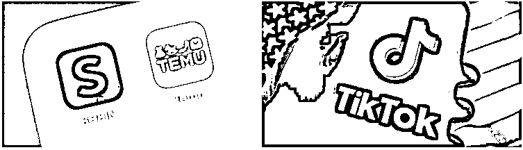
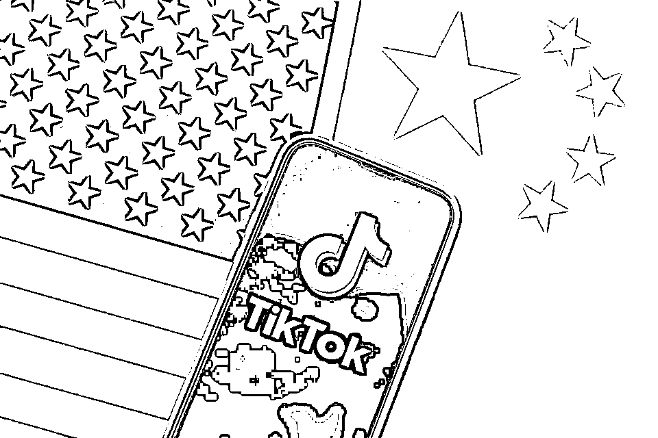
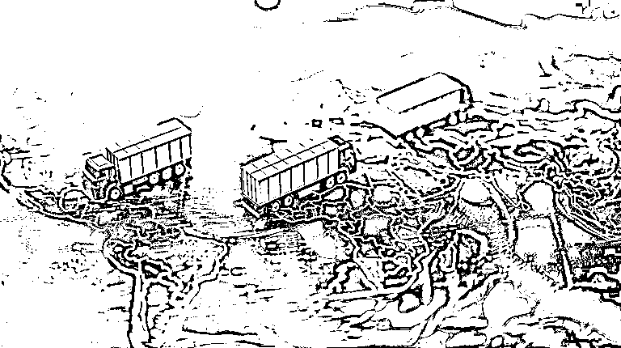

# 2025 年 TikTok 跨境卖家不转型私域，无法存活？

> 原文：[`www.yuque.com/for_lazy/zhoubao/otpkxa477nqn7eyf`](https://www.yuque.com/for_lazy/zhoubao/otpkxa477nqn7eyf)

## (2 赞)2025 年 TikTok 跨境卖家不转型私域，无法存活？

作者： 国民弟弟的跨境十年

日期：2025-02-14

今年，对于所有跨境电商卖家，特别是做 TikTok 电商的玩家来说，将是前所未有的挑战。美国虽然暂时恢复了 800 美元以下的免税政策，但未来仍然充满变数。接下来，美区的商品无形中都会多一层关税，这意味着成本直接上升。

过去靠低价策略冲市场的模式——无论是 Shein、Temu，还是 TikTok 电商——接下来都很难再玩得动了。与此同时，欧盟虽然暂时恢复邮件接收，但美国却在加速调整政策。与墨西哥、加拿大的贸易谈判正在进行中，未来绕道进美的机会恐怕也要被彻底堵死。

这一系列操作看下来，美国这次是铁了心要对跨境卖家进行围剿。本来，市场经济已经在下滑，再加上平台的风控升级，现在又叠加了政策的打压，可以说，2025 年将是跨境电商卖家最难熬的一年。

### 2025 跨境修罗场：三把屠刀悬顶

关税绞杀战升级  当所有人还在庆幸"800 美金免税政策复活"时，白宫早已埋下后手——所有发往美国的包裹都将叠加"数字服务税+环保税+反倾销税"。某头部物流商给我算过账：去年走墨西哥绕关的 3C 产品，现在综合成本暴涨 47%。

北美闭环围剿  美加墨三国海关数据互联，意味着那些"温哥华贴标""蒂华纳换箱"的经典骚操作彻底失效。上个月，我亲眼见证同行一柜价值 80 万美金的蓝牙耳机，在洛杉矶港被 AI 扫描出"Made
in China"激光暗码，直接整柜扣押。

平台生死劫  TikTok 电商美国区日均 GMV 已暴跌 60%，内部流出的《应急预案》显示，若 9 月前无法完成数据本地化，中国卖家的流量权重将被强制下调 30%。更可怕的是，某 TikTok 官方小二私下透露："新团队上任后，可能要推行'白名单卖家'制度。

### TikTok 电商，未来走向未定

TikTok 目前的情况更是充满不确定性。特朗普提出的 75 天缓冲期很快就要到期，TikTok 内部和美国方面仍然在谈判。但谁都不知道最后的结局——最有可能的情况是，美国要求 TikTok 进行重大调整，甚至更换一部分管理团队。如果新团队上台，他们是否还会欢迎中国卖家？这一点谁都说不准。

所以，现在所有做 TikTok 电商的卖家，都必须考虑如何规避风险。如果你把全部身家都压在一个美区 TikTok 店铺上，一旦政策变动，你可能连“跑路”都来不及，就像年前的美区店铺大封禁一样。

### 2025 年跨境卖家如何破局？

今年，像我们这些老卖家，早已经开始转型做跨境私域。如果你还在公域卖货，那么你永远都要跟平台比价，陷入价格战。而且，公域的流量并不属于你，平台可以随时调整规则，让你从巅峰跌入谷底。

**如果你也正在经历：**

→ 平台流量越来越贵，ROI 却越来越低

→ 仓库里堆满"食之无味弃之可惜"的滞销款

→ 每天焦虑政策变动却不知如何破局

### 绝地求生：私域流量的"诺亚方舟"，完全不一样的私域：

私域的价格有更大的波动区间，可以拥有更高利润，抵消关税上涨的影响。

流量进入私域后，完全属于自己，可以持续二次转化，提高长期收益。

规避平台风控，减少对单一平台的依赖，让生意更稳定、更可控。

所以，如果你还在执着于公域电商，2025 年对你来说一定是一场寒冬。但如果你愿意拥抱变化，提前布局私域，就能在这场行业震荡中找到新的出路。

以上！

**国民弟弟相关创业的故事文章推荐：**

**跨境电商认知分享，个人创业者从 0 到 1000w+**

[`articles.zsxq.com/id_8n2o7gax71fr.html`](https://articles.zsxq.com/id_8n2o7gax71fr.html)

**3 分钟搞定美国公司，150 美金，超简单**

[`articles.zsxq.com/id_exggkcb30j69.html`](https://articles.zsxq.com/id_exggkcb30j69.html)

**3 分钟，如何远程开美国实体银行,送 2340 入金奖励。**

[`articles.zsxq.com/id_ubk2osmj6wzb.html`](https://articles.zsxq.com/id_ubk2osmj6wzb.html)

**美国收款工具：**

美版支付宝 Venmo:[`articles.zsxq.com/id_x73bbkhkkzau.html`](https://articles.zsxq.com/id_x73bbkhkkzau.html)

* * *

评论区：

暂无评论