# 留学行业在抖音一天免费搞几百条精准线索！

> 原文：[`www.yuque.com/for_lazy/zhoubao/hattxkr2dg6dt3qe`](https://www.yuque.com/for_lazy/zhoubao/hattxkr2dg6dt3qe)

## (53 赞)留学行业在抖音一天免费搞几百条精准线索！

作者： 波波@抖查查@爱盈利

日期：2025-02-16

今天聊聊留学行业的抖音搜索获客！

基于投放，可以稳定获取线索，生产素材，出价，然后私域承接。问题主要是流量太贵，大部分情况下跑不正，而且就算跑正了，维护一个素材+买量团队成本不低，流量稍微一波动就会亏钱。

基于搜索的自然流获取，成本会更低，能够避免绝大部分竞争。需要客服起量速度并没有那么快，需要稳步经营，深耕 DSO 内容，吃掉行业里面的主力搜索词，且慢慢稳固更多的长尾词。这部分工作其实不需要太多人手，而是要把战线拉长，持续做，越做越精！

就像每天挖战壕，挖一点，但是，日积跬步，最终积累下来大量的新增流量。在当下能够把流量生意做慢其实也是本事。

在抖音搜索数据工具里面输入：**留学+钱**

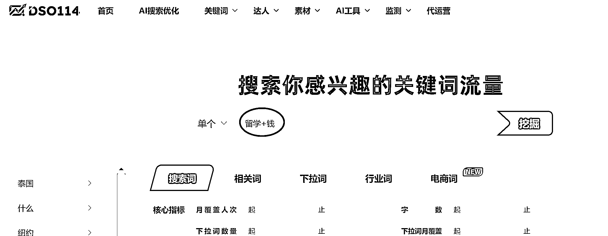

就能够找到，正在思考出国留学的人群，而且已经到了考虑多少费用的阶段，这部分人，成交的可能性比较高：

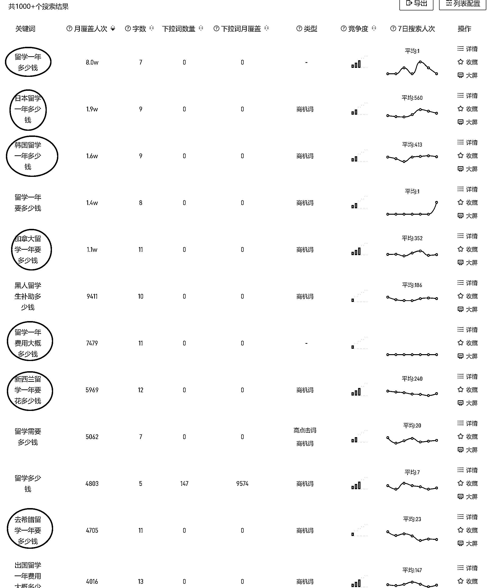

找到有价值的关键词，通过干货内容去触达这部分人群。让他们对你的内容感兴趣，或者对你的账号感兴趣，或者你真人出镜，让他们对你感兴趣。逐渐建立信任，产生成交。

通过下拉词还能够找到更多相关的选词，比如：日本留学申请条件，这个词也是想去日本留学的人群会去搜的词，不过他还在查看条件是否符合的阶段，比查看费用的人群，需要决策的周期更久。

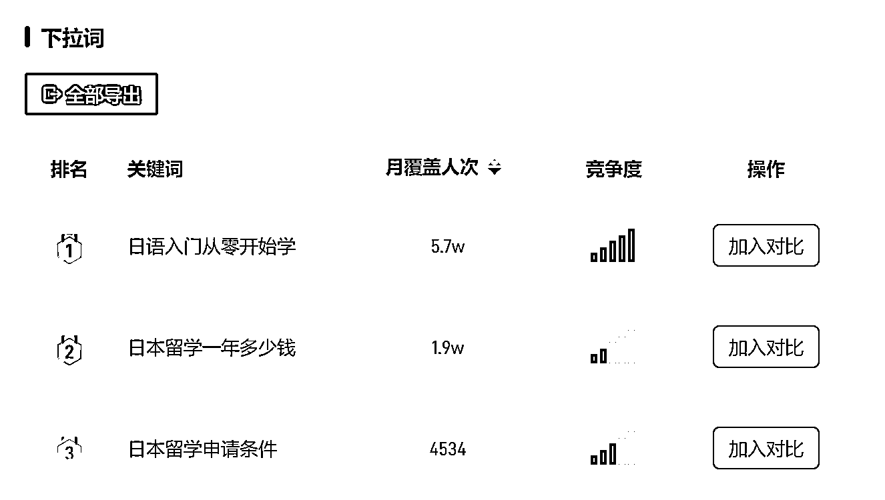

我们再回来看“日本留学一年多少钱”这个词，最新出来的内容占据的搜索排名的前列，而且好多账号正在获取这个词的流量中。

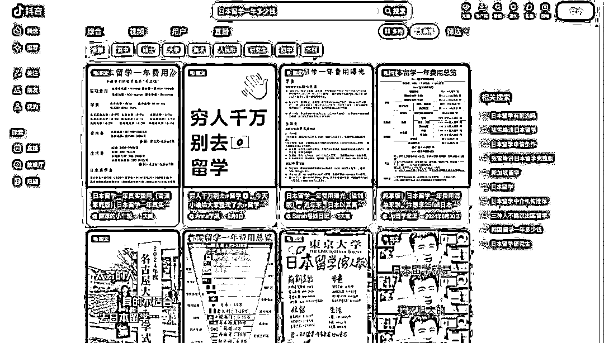

这个时间节点排在第一的账号，粉丝只有 300 多，明显是一个专门来做留学相关的 DSO 账号，基本上全是图文内容。

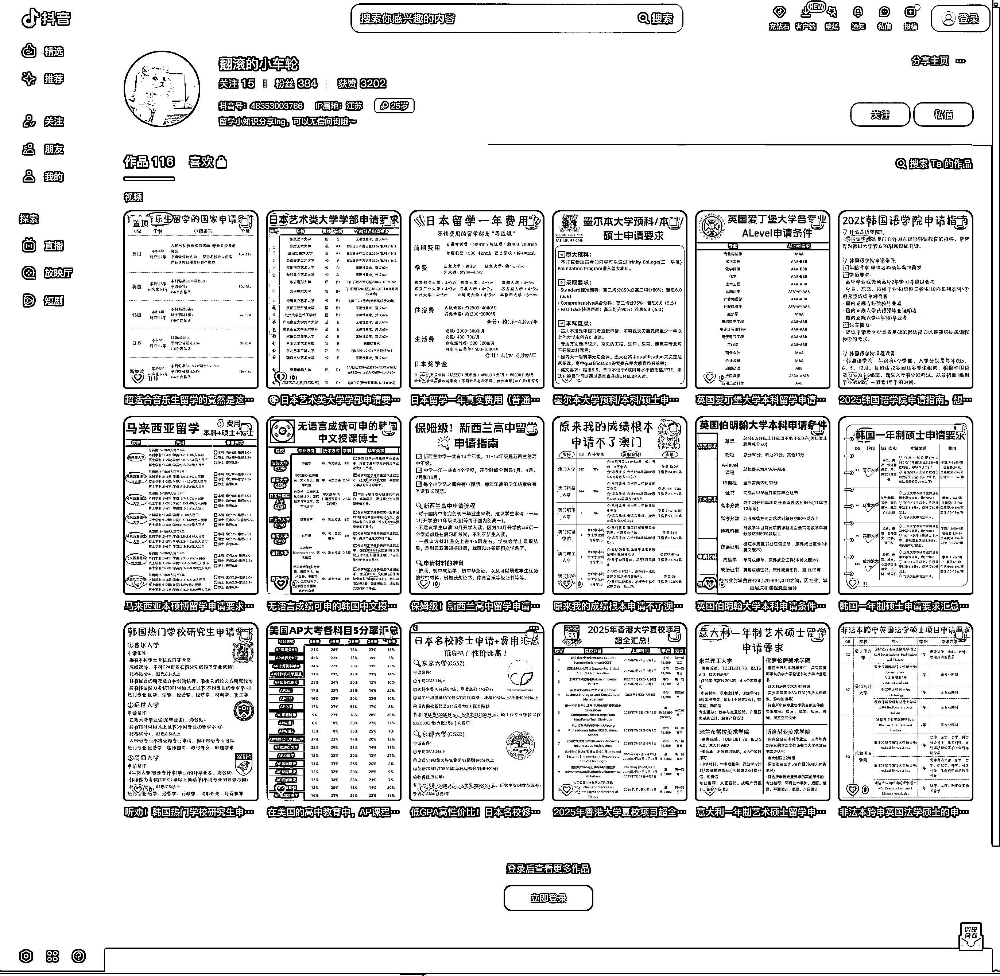

波波给出抖音搜索优化（DSO）的核心概念，

目标：提高视频在抖音搜索引擎中的排名。

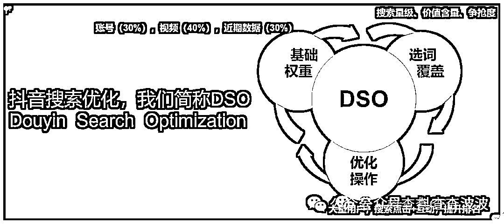

上图还给出了权重占比以及 DSO 主要需要做的事情。

主要策略包括：优化视频结构，提高用户体验，优化视频内容，提高搜索引擎算法的认可度和信任度。

一旦掌握了关键词搜索覆盖以及排名优化的技巧，那么剩下的就是去更多的做相关内容的账号，稳定生产优质内容。

我们来看下仅这一个关键词下面，就有大量的矩阵 DSO 账号：

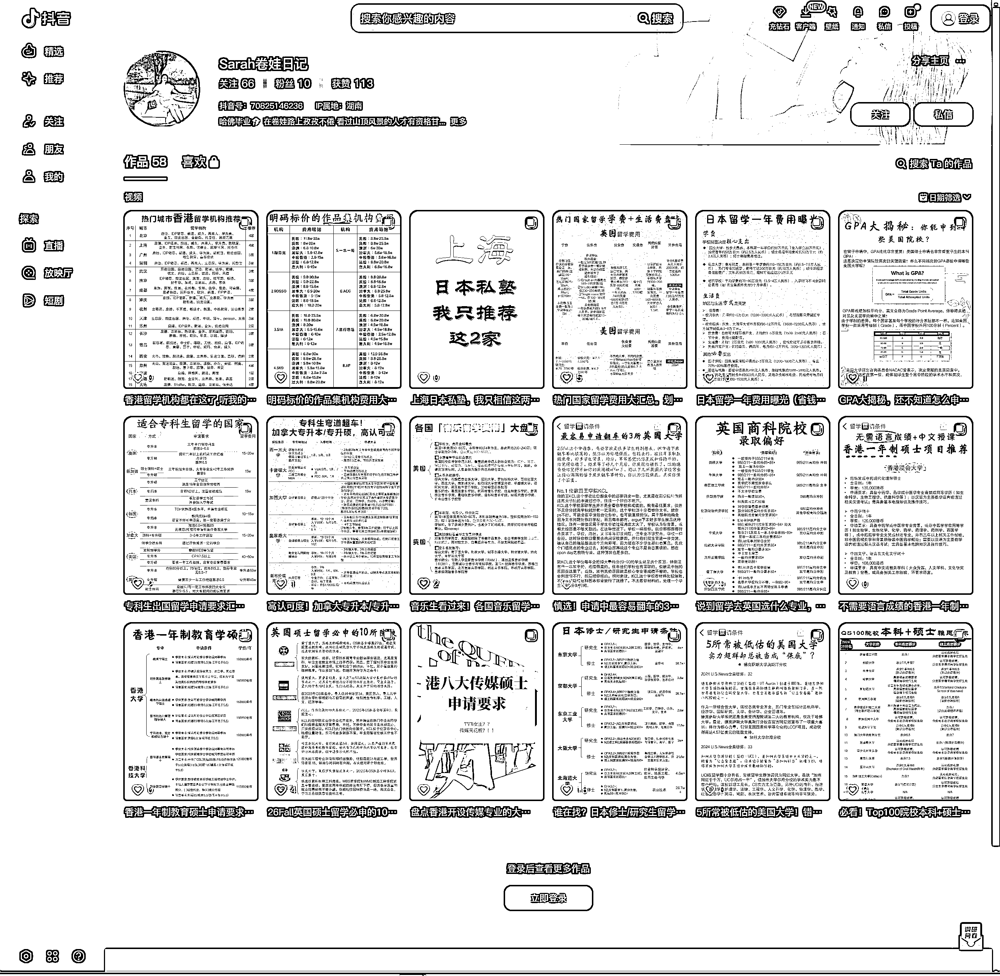

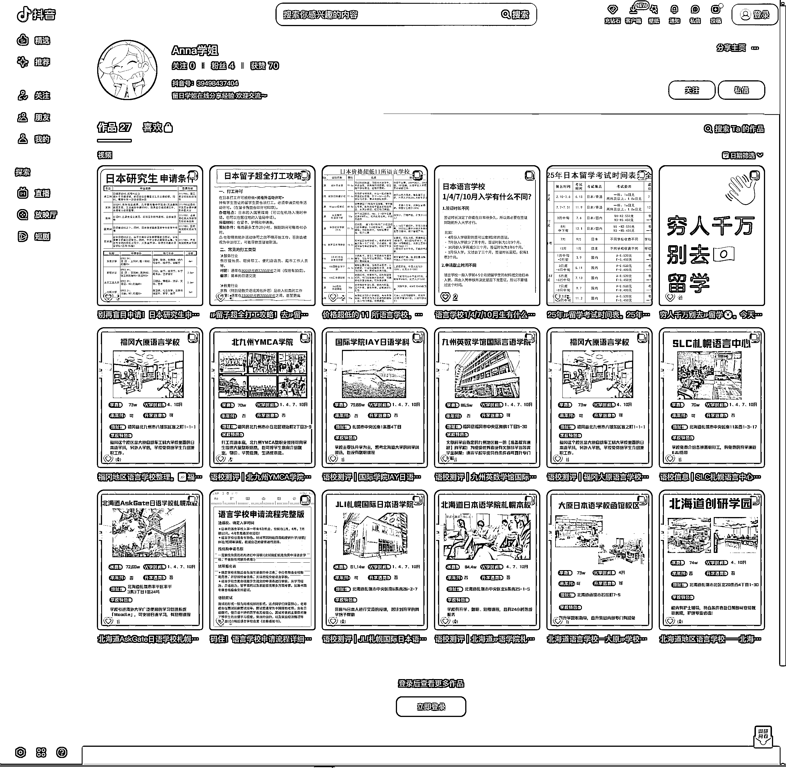

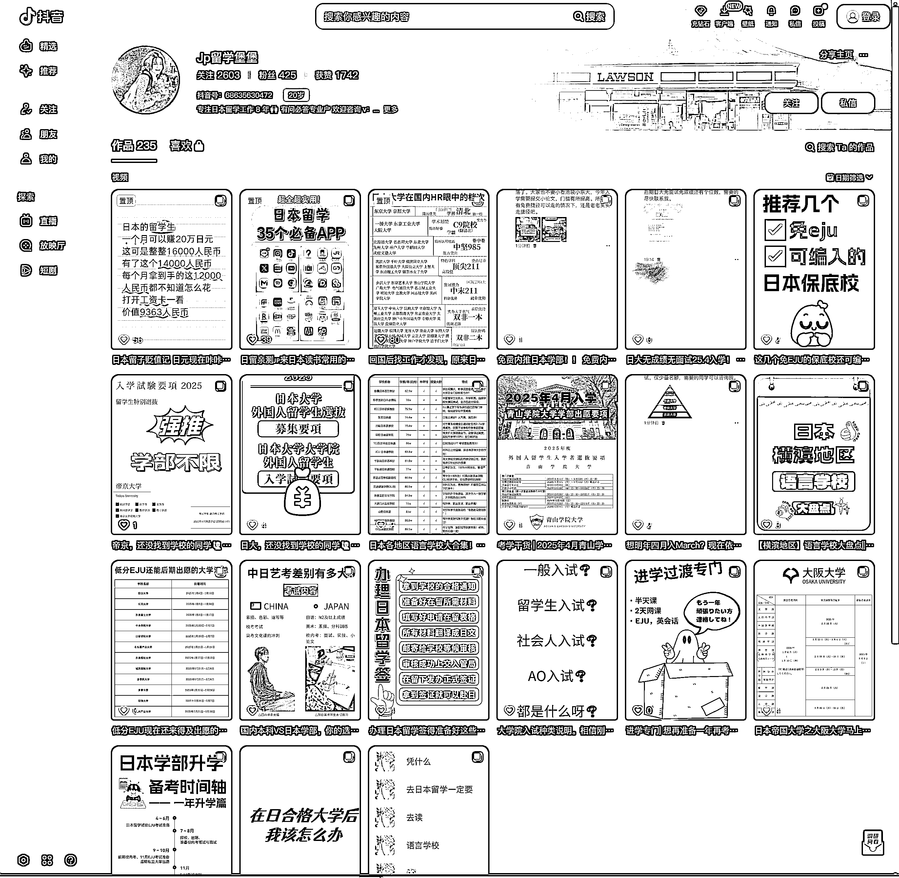

出国留学赛道非常适合做搜索！^_

还有其他的视频内容可以选择，比如：出国留学的一些坑点、报价以及流程去做优质的内容，覆盖上相关的关键词，那么一个月之内就会有大量线索，从而带动若干个高客单的成交。

目前这个赛道长尾关键词，还有不少争抢并不是非常激烈的。需要通过搜索数据工具慢慢去挖掘出来。

当然如果 DSO 的内容水平已经非常强大了，抢夺大词依然是最快的来钱方式。比如英国留学、德国留学这样的词，最直接。

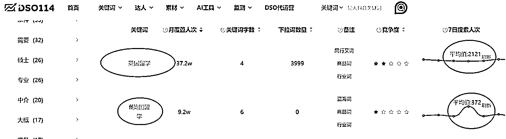

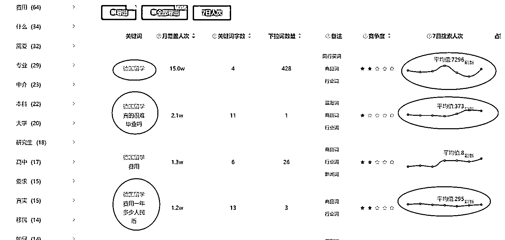

这样的词平均一个月的搜索人次也在十万以上，每天的搜索人次也有几百人。如果我们霸榜前三，量将会被你封锁，钱自然就是你赚得多。

**高客单线索赛道** 值得大家用 DSO 重新搞一遍！

广告投放虽然可以抢夺搜索结果首位，但是自然流量其实可以覆盖到整个关键词 top10 的位置，那这些位置都是有流量的，广告是不能完全封死自然流量的，自然流量的体量却可以比广告流量大很多倍。

之前一篇关于律师行业抖音搜索引流的文章：包含怎么做蓝 v 号

[律师、法律行业利用抖音搜索（DSO）做号：自家实战案例](https://articles.zsxq.com/id_xhuiu54b43lt.html)

* * *

评论区：

快印老司机唐应群 : 波波老师，搞期航海[愉快][愉快][愉快]