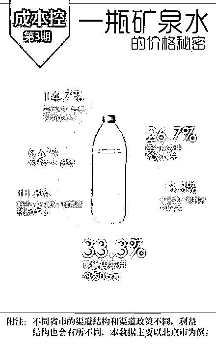
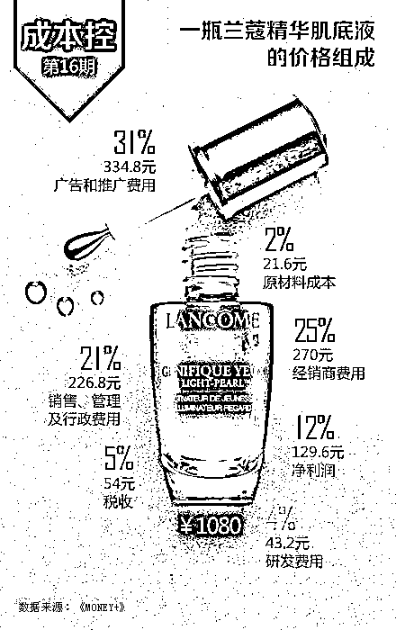

# 能不能不打价格战？

> 原文：[`www.yuque.com/for_lazy/zhoubao/rr3i23k63gn9q2a8`](https://www.yuque.com/for_lazy/zhoubao/rr3i23k63gn9q2a8)

## (6 赞)能不能不打价格战？

作者： 张凯

日期：2025-02-07

**能不能不打价格战？“红米 499 元”与“低价豪车”：商业套路背后的“甜蜜陷阱”**

**案例一：小米红米 499 元手机背后的真相：**

1、成本控制的奥义：

（请自行脑补单口相声语气）

“咱这手机啊，是小米供应链团队在工厂门口蹲点薅的羊毛——听说螺丝刀都是从隔壁五金店借的，流水线工人加班费靠老板画饼充饥。但您放心，电池绝对没抠，毕竟炸了赔不起！”

2、定价策略的玄机：

“雷总一拍大腿：年轻人第一部手机不能贵过他们一学期丢校园卡的总金额！499？这叫「价格刺客」战术——先让用户用红米学会网购，再用小米全家桶收割钱包，这波在大气层！”

3、零件的奇妙物语：

“屏幕？LCD 永不为奴！处理器？发哥（联发科）家的祖传芯片超频再就业！摄像头？扫码比眼神儿快就行，反正年轻人自拍都用美颜 APP——要啥自行车，能上王者就是神机！”

4、商业逻辑的暴击：

“你以为小米亏了？天真！这手机壳贴个 LOGO 成本 5 毛，卖你 49；预装 APP 收厂商保护费；开机广告能播完一部《甄嬛传》——雷总微微一笑：用户不是消费者，是咱的数字韭菜田！”

5 、友商的崩溃现场：

“听说友商连夜改 PPT，把‘性价比’仨字抠了换成‘轻奢’。山寨机老板抱头痛哭：这价格比我华强北进货价还低！雷总，你是来砸场子的吧？

红米 499，买不了吃亏买不了上当，但可能买到——

“手机界的拼多多，价格屠夫的入室弟子，以及雷总「让全球 50 亿人用上小米」野望的第一块板砖！”

**案例二：拼多多“先用后付”——当代年轻人的“白嫖经济学”**

（请自动代入脱口秀演员浮夸手势）

心理战术的绝杀：

“你以为拼多多在搞慈善？不，它在玩人性！‘先用后付’这招比亲妈还贴心——‘孩子，饿了先吃饭，钱下月再给！’
结果你拆快递的速度比分手后删照片还快，等还款日到了才醒悟：原来‘零元购’是资本主义的糖衣炮弹！”

数据收割的阴谋：

“付款犹豫？不存在的！只要你敢点‘确认收货’，拼多多立马化身大数据算命先生：你买纸巾必选 6 箱装，薅羊毛上瘾度 99%，下次弹窗直接推‘痔疮膏+保温杯’养生套餐——别问，问就是算法比你妈懂你！”

商业闭环的鬼才：

“你以为它图你那 15 块？天真！商家付了‘先用后付’通道费，用户养成‘闭眼下单’肌肉记忆，最后赖账的人还得被平台催收队问候——这哪是电商？这是当代互联网《威尼斯商人》，割肉不流血！”

要知道，拼多多微微一笑：“亲，你用不是重点，先用才是关键！毕竟这年头，年轻人心态就两条：

『工资就像大姨妈，一月一次一周没』

『消费就像呼吸，停了就感觉要窒息』

**案例三：宝马 MINI 14.9 万——豪车圈的“扮猪吃老虎”**

（想象汽车销售甩着钥匙链说单口相声）

价格的障眼法：

“宝马拍板定价时一定喝了假酒：14 万 9？这价格买 MINI，不如去抢老头乐！结果一看配置——方向盘得自己摇，音响是广场舞同款，车标镀金另加 8 万 8。宝马：我们卖的不是车，是社交通行证！挤地铁的 Lucy，开 MINI 的 Lucy 能一样吗？”

中产焦虑的精准爆破：

“你以为买 MINI 是为了代步？不，是为了在闺蜜局轻描淡写一句：‘哦，我那辆小 MINI 停车倒是方便～’
顺便露出方向盘上的三色旗。14 万 9 买的哪是发动机？是朋友圈九宫格 C 位出道资格！”

后续收割的连环计：

“首付 3 万开回家？4S 店销售嘴角疯狂上扬：精品贴膜 2 万 8，保养套餐买十年送两年，维修零件按克计价——德国工艺，金子做的！等你发现养车费比彩礼贵，宝马早已在慕尼黑举杯：感谢中国中产，你们的贷款，我们的财报！”

总结：

**宝马 MINI 的终极奥义：**

“14 万 9 是入场券，

14 万 9 是遮羞布，

14 万 9 是告诉你——

当贵族，得先学会为车标呼吸！”

（友情提示：车贷还完日，MINI 变宏光，二手价跳水姿势请参考 A 股）

商业世界真相定律：

拼多多说“先用后付”是爱你，

宝马说 14 万 9 是宠你，

只有你的钱包哭着说：

“信了你们的邪！” 💸🚗

**回到正题：能不能不打价格战？——价格构成的“宫斗剧”里，从“互相捅刀”到“互相戴高帽”谁活到最后？**

**一、价格战：商业竞争中的“囚徒困境”**

价格战是企业通过降低产品售价来争夺市场份额的一种竞争策略。然而，这种策略往往导致“双输”局面，具体表现为：

**利润侵蚀：**

企业通过降价吸引消费者，短期内可能提升销量，但长期来看，利润空间被大幅压缩。

**行业恶性循环：**

价格战引发行业内其他企业的跟随降价，最终导致全行业利润水平下降。供应链上下游企业为降低成本，可能采用低质量原材料或简化生产工艺，进一步损害产品品质和品牌声誉。

**消费者价格敏感度提升：**

频繁的价格战使消费者对价格更加敏感，品牌忠诚度降低。消费者倾向于选择价格更低的产品，而非品质或服务更优的产品，导致企业难以通过差异化策略建立竞争优势。

**二、价格构成的“核心要素”：优化成本结构，构建竞争壁垒**

价格构成是决定企业盈利能力和市场竞争力的关键因素。通过优化价格构成中的各个要素，企业可以有效避免价格战，实现可持续发展。

**1****.** **基础成本：成本控制与技术创新**

案例：特斯拉通过一体化压铸技术大幅降低生产成本，传统车企面临巨大压力。

（参考：[`36kr.com/p/2440440694378887）`](https://36kr.com/p/2440440694378887）)

启示：企业应通过技术创新和供应链优化降低基础成本，而非单纯依赖降价竞争。

**2****.** **附加价值：品牌溢价与差异化**

案例：戴森吹风机以高端技术和设计感为核心，定价远高于行业平均水平，但仍受到消费者追捧。

启示：通过品牌建设、产品创新和服务提升，企业可以创造附加价值，避免陷入价格战。

**3****.** **利润分配：渠道优化与会员制模式**

案例：Costco 通过会员制模式实现稳定的利润来源，商品毛利率控制在 14%以内，可仍保持高盈利能力。

启示：企业可以通过优化渠道结构和利润分配模式，降低对单一价格策略的依赖。

**三、避免价格战的战略路径**

**1****.** **价值创新：从价格竞争到价值竞争**

案例：喜茶通过推出副品牌“喜小茶”覆盖中低端市场，同时保持主品牌的高端定位。

策略：企业应专注于产品创新和服务升级，满足消费者多样化需求，而非单纯依赖低价策略。

**2****.** **生态系统构建：增强用户粘性**

案例：小米通过智能家居生态系统绑定用户，提升用户转换成本。

生态绑定：让用户“逃不出五指山”

策略：通过构建产品生态和提供增值服务，企业可以增强用户粘性，降低价格敏感性。

**3****.** **情绪价值：满足消费者心理需求**

案例：泡泡玛特通过盲盒模式满足消费者的情感需求和收藏欲望，实现高溢价销售。

泡泡玛特盲盒

成本： 塑料小人 9.9 元

售价： 79 元（附赠“赌狗快乐”）

用户心理： “我买的是惊喜，你跟我谈性价比？俗！”

策略：企业应关注消费者的心理需求和情感体验，通过情绪价值提升产品溢价能力。

**四、价格战的负面影响与行业教训**

1. 反面案例：生鲜电商的价格战

结果：部分生鲜电商通过低价补贴吸引用户，最终因资金链断裂导致破产，投资人和消费者均遭受损失。

教训：单纯依赖价格战无法建立可持续的商业模式，企业应注重盈利能力和长期发展。

2. 正面案例：老干妈的定价策略

策略：老干妈坚持不降价、不上市，通过稳定的产品质量和品牌信任度赢得市场。

启示：企业应通过品牌价值和产品质量建立竞争壁垒，而非依赖价格竞争。

**五、替代价格战的竞争策略**

**1****.** **认知竞争：塑造品牌价值**

案例：苹果通过高端品牌形象和技术创新，使消费者愿意为其产品支付溢价。

策略：通过品牌故事、技术领先性和用户体验，企业可以提升消费者对品牌的认知价值。

比如：把成本变故事

矿泉水： “长白山 30 年玄武岩过滤” → 成本+0.1 元，售价+2 元

T 恤： “新疆棉+道德认证” → 成本+5 元，售价+100 元

**2****.** **效率竞争：优化运营与供应链**

案例：SHEIN 通过大数据分析和柔性供应链实现快速反应和高周转率。

策略：企业应通过技术手段提升运营效率，降低成本并快速响应市场需求。

比如：把用户变“帮凶”

众筹定价： “你们说卖多少就多少！”（实际成本早算好）

会员等级： “黄金会员专享价”（用户为身份标签上头付费）

**3****.** **持久竞争：研发投入与长期布局**

星际战场：华为通过持续的技术研发投入，建立强大的技术壁垒和品牌影响力。

高端战场： 茅台：“别和我比价格，有本事比谁更让领导开心”

下沉市场： 蜜雪冰城：“别和我比便宜，有本事比谁更土味”

**价格构成决定商业模式的可持续性**

价格构成不仅是企业定价策略的基础，更是商业模式优劣的关键决定因素。通过优化成本结构、提升附加价值、创新利润分配模式，企业可以有效避免价格战，构建可持续的竞争优势。

**“价格解析的大江湖”，看从矿泉水到茅台，价格背后的路径让人捧腹。**

**1****.** **矿泉水——最便宜的“清流”**

矿泉水，一瓶几块钱的水，咋就这么神奇？有人说，它是大自然的搬运工；但换个角度，矿泉水的价格从一开始就给你设置了“水深火热”的迷局。

原料成本：它就是水

矿泉水最大的成本其实就是“水”本身。你去山泉水源地挖一口井，然后装瓶，这样的成本低得可怜。但别高兴得太早，瓶子的成本可不能小瞧。一瓶塑料瓶可不便宜，加上封盖、标签，这一系列操作，也不是你想象的几块钱就搞定的。

1. 矿泉水的价格构成

矿泉水价格看似简单，但其实背后有一系列的成本和策略。以下是它的几个关键构成部分：

a. 原材料成本（在总成本里占比极低，但不可忽视）

矿泉水的核心原材料就是水，乍看起来似乎没什么成本。事实上，水的获取、净化和品质检测，都会增加一定的成本。

水源选择：不同水源的成本差别很大。天然山泉水、地下水等高质量水源的开采成本较高，有些水源的开采需支付资源使用费，而普通的自来水源成本则非常低。

水处理与净化：即使是普通矿泉水，通常也会经过过滤、消毒、矿物质添加等工艺。高端品牌如依云（Evian）或富士山泉（Fiji）可能会特别注重水的矿物质成分和净化流程，这需要额外的设备和检测，增加成本。

b. 包装成本（大头之一）

水的包装成本看似简单，但实际上是矿泉水定价中不可忽视的一部分，特别是在环境保护的压力下，很多高端品牌都追求环保和创新的包装方式。

瓶子材质：普通的矿泉水瓶子多为塑料瓶，成本较低；但高端品牌可能会使用玻璃瓶、可回收材料，甚至采用特殊设计的瓶身，提升品牌形象。包装设计也可能会非常精美，这直接影响到成本。

标签与瓶盖：矿泉水瓶的标签设计、印刷和瓶盖（尤其是防伪瓶盖等特殊设计）的成本也不容忽视。

c. 生产与分销（较高）

矿泉水的生产相对简单，但分销渠道却是一笔不小的费用。

生产工艺与设备：虽然瓶装水的生产看起来比较简单，但流水线设备的维护、消毒、检验等，都会导致额外的生产成本。

物流与运输：水本身重量大，运输费用不可低估。运输到各地的成本，尤其是通过零售商的分销渠道，再加上存储、配送等，都会提高价格。

d. 品牌溢价（尤为关键）

品牌溢价是矿泉水定价的一个关键因素。

品牌效应：高端矿泉水品牌如依云、富士山泉的水源、包装、生产过程和品牌背书等，都会让其定价远高于普通品牌。消费者不仅是在购买水，还是在购买一种生活方式或者象征某种身份的商品。

市场定位：有些矿泉水不仅仅是为了“喝水”，更是为了提升个人形象。例如，在餐厅、酒店等高档场所，依云矿泉水常常被作为身份的象征来提供，售价自然水涨船高。

e. 渠道费用与销售（一定成本）

矿泉水的销售渠道也是其成本的一部分。

零售商和平台的加价：如果你在超市、便利店或者电商平台购买矿泉水，渠道方也会加收一定的费用。这是因为零售商和电商平台不仅要支付租金和人力成本，还会收取一定的分销佣金。

**2****.** **兰蔻精华肌底液——贵妇的“肌肤修复神器”**

a. 原材料成本（精致与高端）

兰蔻精华的核心成分决定了其成本，而这些成分都是经过精挑细选的高端原料。

高端成分：兰蔻精华液可能包含透明质酸、维生素 C、神经酰胺、植物提取物等多种高端护肤成分，这些成分的采购成本非常高。例如，透明质酸和维生素 C 等抗老化成分的提取成本很贵，且需要高纯度的原料才能保证效果。

定制化配方：每一款精华液的配方往往由专门的科研团队精心设计，以确保其对不同皮肤类型的适应性。研发配方的成本往往不亚于原料本身。

b. 研发与技术支持（高投入）

兰蔻作为奢侈护肤品牌，其研发投入非常大。

实验室与科研：兰蔻背后有全球顶级的科研团队和实验室，这些实验室不断进行新产品的研发和现有产品的改进。每一次新产品的研发都需要巨额的资金投入。

技术创新：例如，兰蔻的“肌底液”系列往往强调通过最新的生物科技技术提高肌肤的吸收效率，这些技术的研发和应用同样需要大量的资金和时间。

c. 包装设计（奢华与体验）

兰蔻的包装设计是其品牌形象的重要组成部分。

包装设计：精致的包装、透明的瓶身、高质量的瓶盖和瓶口设计，往往是消费者体验的一部分。这些包装往往并不便宜，而且大部分是定制化的设计，以保证视觉上的高端感和触感上的奢华感。

防伪技术：高端品牌往往会加大包装的防伪措施，如激光防伪标识、防伪标签等，这些都大大增加了包装成本。

d. 品牌溢价（巨大的溢价效应）

兰蔻的价格很大一部分来源于其品牌价值。

品牌价值：兰蔻作为全球知名的奢侈护肤品牌，其品牌溢价直接体现在售价上。消费者不仅为产品本身买单，更是为其“奢华”标签和“明星代言”买单。

广告与代言：兰蔻的营销宣传无处不在，从高端杂志到社交平台，明星代言人、名人效应都为品牌的溢价提供了支持。

e. 渠道费用与零售溢价

兰蔻精华液通常通过高端商场、专柜以及线上平台销售，这些销售渠道会带来额外的费用。

专柜销售费用：专柜租金、人员培训和服务都需要成本，而且奢侈品牌常常在专柜中提供高端服务，这也是品牌体验的一部分，必然反映到售价上。

电商平台的渠道费用：即使在电商平台，兰蔻也通常会选择一些高端平台进行销售，这些平台通常会收取较高的佣金。

**3****.** **李佳琪的眉笔——你的化妆台上的“秘密武器”**

眉笔，不仅仅是化妆工具，它在李佳琪的世界里，已经成为了一种“社交货币”。

原材料：看似简单，实则巧妙

李佳琪的眉笔，原材料就是简单的笔芯、外壳和颜料，但你能想象它的“颜值”有多高吗？为了让每一支眉笔都能画出完美弯曲，生产工艺得多精细！而且它的包装设计、色调、手感，通通都要考虑到。

品牌溢价：卖的不是眉笔，是“李佳琪的签名”

你以为李佳琪的眉笔价格是因为它有多神奇？错！它价格的背后，是李佳琪这个超级“流量明星”的代言费和流量溢价。你买的是眉笔，但其实你在买“李佳琪推荐”背后的信任感和号召力。

渠道费用与营销：直播带货，能忍？

李佳琪每次直播，眉笔的销量简直让人目瞪口呆！直播平台的佣金，营销预算，再加上李佳琪为推销这些产品所做的“全网轰炸”，这些都直接影响了价格。你是不是在想，“啊，原来这个眉笔背后藏了这么多的..”

**4****.** **茅台——中国白酒中的“奢侈品”**

最后说到茅台，啊，这可是一瓶“酒香藏匿的高端文化”。你知道的，茅台的价格波动，往往超出你的想象。

原材料与生产：贵酒，贵在工艺

茅台的生产工艺可是神秘又复杂，麦曲、高粱这些材料都不是随便就能找来的。而且茅台酿造需要的时间堪比“耐性测试”，酒的每一滴都是酿出来的时间与汗水。

品牌溢价：光是名字就贵

茅台的价格有多少来自品牌？这个问题的答案就像“问天”，大家都知道。茅台酒是中国的文化象征，也是“国酒”级别的存在。你买茅台，是为了喝酒吗？不，买茅台的人，喝的是“尊贵”与“历史的味道”。它的价格就像你戴上了黄金的身份象征。

市场需求与稀缺性：供不应求的“茅台情结”

茅台的价格还受供需关系的影响，需求大于供给，导致它的市场价就像蹦蹦跳的“股市”，时高时低。再加上茅台酒每年限量生产，很多人为了“手中有一瓶茅台”，愿意花高价买到它。这种稀缺性，直接把价格炒得动辄上万。

**“贵”有其道：从六必居、可口可乐到美乐家，产品定价与成功背后的秘密**

**案例一：六必居为什么贵？**

在北京，有个历史悠久的地方叫大栅栏，这里曾经是“吃货的圣地”，如果你从那儿路过，肯定能看到一家叫六必居的老字号酱菜铺。

话说在明朝嘉靖年间，北京城里有个叫赵存仁的小伙子，祖上三代都是做酱菜的。有一天，他突发奇想：“为啥咱们的酱菜不能像皇帝的御膳一样，让人吃了就忘不了呢？”于是，他拉上兄弟，开了家小店，取名“六必居”。

这“六必”可不是随便取的，而是他们的“祖传秘方”：**黍稻必齐、曲蘖必实、湛炽必洁、陶瓷必良、火候必得、水泉必香** 。说白了，就是“**产地必真、瓜菜必鲜、甜酱必醇、水必香、罐子必需干净、发酵必需到位** ”。这六条规矩，成了六必居的“金字招牌”。

时间一晃几百年，六必居从一个小作坊变成了“酱菜界的爱马仕”。为啥它这么贵？咱们得从一个小故事说起。

某天，一位年轻的老板去六必居买酱菜，一看价格，差点没把下巴惊掉：“这酱菜是金子做的吗？这么贵！”店员笑眯眯地解释道：“先生，您别看这小小一罐酱菜，它可是经过 365 天发酵、18 道工序、6 次质检才出厂的。您买的不是酱菜，是时间、是匠心、是历史啊！”老板一听，若有所思：“原来我买的不是酱菜，是‘健康、环保与时间的味道’啊！”

**案例二：北冰洋和可口可乐为什么一败一胜？**

北冰洋和可口可乐的故事，堪称饮料界的“冰与火之歌”。一个是本土老字号，承载了几代中国人的童年记忆；另一个是全球饮料巨头，凭借强大的品牌力和营销手段征服了世界。它们的成败背后，隐藏着品牌战略、市场定位、资本运作等多重因素的博弈。下面，我们从几个关键维度来分析北冰洋的“败”与可口可乐的“胜”

**一、品牌定位：情怀 vs. 全球化**

**1****.** **北冰洋：本土情怀的局限**

- 北冰洋诞生于 20 世纪 50 年代，是新中国成立后第一批国产汽水品牌之一。它的橘子味汽水一度风靡全国，成为几代人的童年记忆。然而，北冰洋的品牌定位始终停留在“本土情怀”上，缺乏对年轻消费者的吸引力。

- 情怀固然能引发共鸣，但过度依赖情怀会导致品牌老化。北冰洋在 90 年代被外资收购后停产，直到 2011 年才重新回归市场。虽然回归时打出了“老北京的味道”这张情怀牌，可年轻消费者对“老味道”并不买账。

**2****.** **可口可乐：全球化的文化符号**

- 可口可乐自 1886 年诞生以来，一直致力于打造“快乐”的品牌形象。它的广告语“Taste the Feeling”（品味感觉）和“Open
Happiness”（畅爽开怀）传递的是一种普世价值观，而非地域性文化。

- 可口可乐通过全球化战略，将自己塑造成一种文化符号。无论是在美国、中国还是非洲，可口可乐都代表着“快乐”和“分享”。这种品牌定位让它能够跨越文化和地域的界限，赢得全球消费者的喜爱。

**对比分析** ：北冰洋的品牌定位过于依赖本土情怀，导致其市场局限于特定人群；而可口可乐通过全球化定位，成功将自己打造成一种文化符号，赢得了更广泛的市场。

**二、产品创新：单一 vs. 多元化**

**1****.** **北冰洋：产品线单一**

- 北冰洋的主打产品一直是橘子味汽水，虽然经典，但缺乏创新。尽管后来推出了其他口味（如酸梅汤），但市场反响平平。单一的产品线让北冰洋难以满足消费者多样化的需求。

- 此外，北冰洋的包装和口感多年来变化不大，未能跟上年轻消费者的审美和口味偏好。

**2****.** **可口可乐：多元化布局**

- 可口可乐的产品线极其丰富，除了经典的可乐，还推出了无糖可乐、零度可乐、樱桃味可乐等多种口味，满足了不同消费者的需求。

- 此外，可口可乐还通过收购和合作，拓展了果汁、茶饮、功能饮料等多个品类（如美汁源、酷乐仕维他命水）。这种多元化布局让它能够在不同细分市场中占据优势。

对比分析：北冰洋的产品创新不足，导致其市场竞争力逐渐下降；而可口可乐通过多元化的产品布局，成功覆盖了更广泛的市场。

**对比分析：** 北冰洋在资本运作上处于被动地位，错失了发展机遇；而可口可乐通过主动的资本运作，实现了全球化的快速扩张。

**五、总结：北冰洋的“败”与可口可乐的“胜”**

北冰洋的失败，归根结底在于其品牌定位的局限、产品创新的不足、营销策略的保守以及资本运作的被动。而可口可乐的成功，则得益于其全球化的品牌定位、多元化的。

**案例三：咱们来聊聊美乐家和威猛先生的“浴厕清洁大战”——一个走的是“天然小清新”路线，另一个则是“化学猛男”风格。**

什么？美乐家能用天然柠檬和茶树精油，而威猛先生却只能靠盐酸“硬刚”？这背后可不仅仅是清洁剂的较量，而是一场品牌定位、用户需求和市场策略的“神仙打架”！

**一、品牌定位：小清新 vs. 猛男**

1. 美乐家：天然派“文艺青年”

- 美乐家就像个热爱大自然的文艺青年，其使命是“环保、健康、可持续发展”。它的浴厕清洁剂用的是天然柠檬和茶树精油，闻起来像走进了热带果园，清洁的同时还能顺便做个“心灵 SPA”。

- 它的目标用户是那些注重生活品质、愿意为健康和家人生活的更好的消费者。说白了，就是那些买清洁剂还要看成分表的人。

2. 威猛先生：硬核“肌肉猛男”

- 威猛先生则像个健身房里的肌肉猛男，浑身散发着“强效、快速、硬核”的气息。它的清洁剂用的是盐酸，一喷下去，污垢瞬间“灰飞烟灭”，效果立竿见影。

- 它的目标用户是普通家庭主妇和忙碌的上班族，追求的是“便宜大碗、快速见效”。说白了，就是那些只想赶紧把厕所刷干净的人，而忽略化学成分带来身体上的损伤的那部分人。

对比分析：美乐家是“文艺青年”，威猛先生是“肌肉猛男”，一个走心，一个走肾，各有各的粉丝群。

**二、产品理念：环保 vs. 效率**

1. 美乐家：地球是我家，清洁靠大家

- 美乐家的理念是“对环境友好、对人体无害”，它的清洁剂不仅要把厕所刷干净，还要让地球妈妈开心。天然成分清洁力已经足够清洁干净~，安全又环保，用起来心里踏实。

- 不过，天然成分的成本也高，所以美乐家的价格也相对“高端”，但是和同类竞品相比，还略胜一筹，适合那些愿意为环保和健康买单的“精致生活家”。

2. 威猛先生：快狠准，不服就干

- 威猛先生的理念是“效率至上”，它的盐酸配方就像个“清洁界的灭霸”，一喷一刷，污垢瞬间消失。至于环保？危害？那是次要的，先把厕所刷干净再说！

- 盐酸成本低，清洁力强，所以威猛先生的价格也很亲民，适合那些追求性价比的“实用主义者”。

对比分析：美乐家是“环保先锋”，威猛先生是“效率狂魔”，一个为地球，一个为厕所，各有各的使命。

........看到这里

老爷们个个神色清醒，心思澄净..

（降价！降出个未来...结果呢？市场一片狼藉，消费者捧着 9 块 9 的奶茶冷笑："下次谁家 5 块我宠谁!"）

日子忽然缓慢而悠长..

价格战的本质是市场欺诈，野蛮，暴力。

其实，脱离了“附加价值“的交易市场，是退步的现象。

最终伤害的，是每一个消费者...

要知道..

敢对价格战说“不”的企业，都在偷偷做三件事：

把用户训练成“韭菜精”（如苹果用户自觉守护高价）

把成本写成“神话故事”（如依云矿泉水=阿尔卑斯眼泪）

把竞品逼成“碰瓷怪”（如特斯拉降价，其他车企只能骂“不讲武德”）

从运营的角度，价格战不过是个市场策略；

通过价格战，切入市场，再细分市场，拉高利润，最后实现利润最大化。

雷总玩的，就是这个。

不存在无止尽的价格战，因为价格战违背市场行为。

要知道，价格战没有赢家，只有幸存者。

商业零售价格构成的优势才叫降维打击，其他都叫营销方案！

致所有企业主：

“价格战是短期的市场争夺，价值竞争才是长期的商业胜利。”

（声明：转载请注明出处，否则律师函警告！）

文章尾声，送大家一句话~

“商业世界没有白嫖，只有‘你情我愿的套路’。

要么学会看穿套路，要么学会享受套路——

毕竟，‘人生如戏，全靠演技；消费如棋，落子无悔！

附上本人一张帅照 谢谢观看

* * *

评论区：

三三 akuri : 这是不是 deepseek[偷笑]