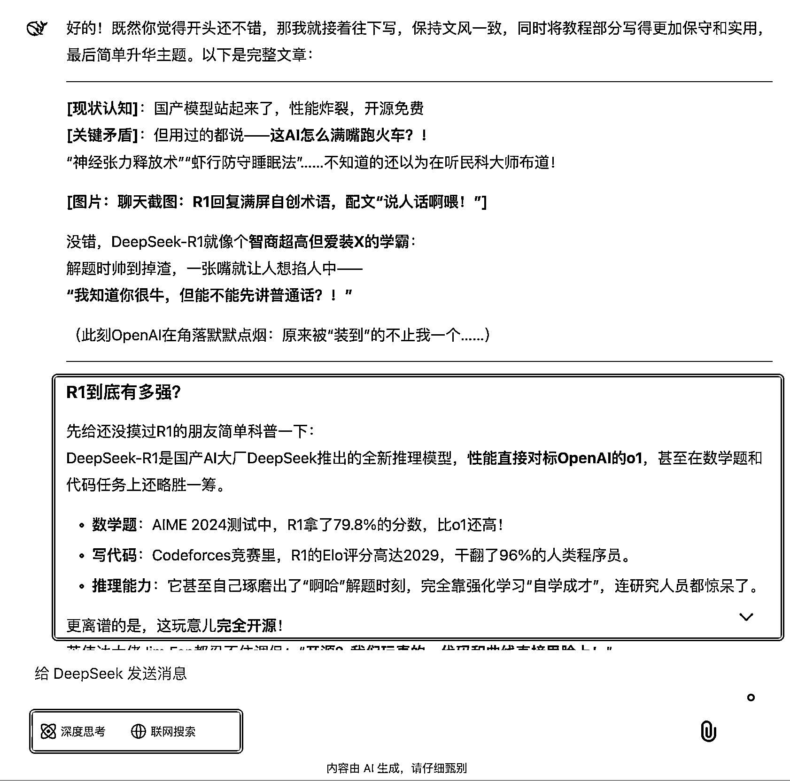

# 用 DeepSeek-R1 自媒体创作的工作流分享

> 原文：[`www.yuque.com/for_lazy/zhoubao/eyx8yprpzyqzhggt`](https://www.yuque.com/for_lazy/zhoubao/eyx8yprpzyqzhggt)

## (精华帖)(126 赞)用 DeepSeek-R1 自媒体创作的工作流分享

作者： 夙愿学长

日期：2025-01-23

大家好，我是夙愿学长，02 年大四在读，曾当过一期生财有术 ChatGPT 提效航海的教练，最近在正在探索 AI 工作流赋能提效。

最近 AI 圈又出了个朋友圈刷屏级产品 DeepSeek-R1，性能确实强悍：

1.  数学能力比 o1 还强，AIME 2024 测试拿了 79.8% 的高分

2.  代码水平能干翻 96% 的程序员，Codeforces 竞赛 Elo 评分高达 2029

3.  完全开源，还是靠强化学习"自学成才"的

这个被称为"中国版 o1"的新模型，最让我惊艳的是：**它真的不需要复杂的提示词，就能输出很好的结果。**

用了几天后，我发现了个有趣的现象：

它的「输出风格」跟 GPT、Claude、Gemini 等其他一众模型，完全是两个画风，好处是能给我一种惊艳感。

坏处是：很容易“用力过猛”，自己给一个概念起一个新的很出彩名字。

**动不动就甩出一堆"神经调节分层处理""营养动线优化"这种听都没听过的专业术语，整得我一愣一愣的。**

不过，经过这几天的摸索，我发现了个特别实用的技巧：**灵活切换 DeepSeek-R1 和 DeepSeek-V3 两个模型，就能完美控制 AI
回复的"飘"和"稳"。**

今天就来分享下我是怎么用这两个模型来写文章的，顺便教大家如何驾驭这个超强的国产 AI 大模型。

文章分三部分：

1.  实际案例演示

2.  两个模型的配合逻辑

3.  完整的 AI 写作调教工作留

看完这篇文章，你不仅能学会用 DeepSeek-R1，还能掌握一套实用的 AI 写作工作流。

（下面这个文章示例正是我用 DeepSeek-R1 写的文章。)

# 一、文章示例

最近的 AI 圈，真是比《甄嬛传》还刺激！

OpenAI 前不久刚发布 o3 模型，秀完肌肉，国内反手就甩出一张「王炸」——**DeepSeek-R1** ，直接把全网 AI 博主炸到集体失眠！

**“中国版 o1 开源了！性能对标 OpenAI，代码干翻人类！”**

**“这才是真正的 OpenAI 啊！”**

一觉醒来，朋友圈被这条消息刷爆。

好家伙，这可不是什么小打小闹——DeepSeek-R1 在数学题上拳打 GPT-4o，代码能力碾压 96%程序员，甚至**自己琢磨出了“啊哈”解题时刻** ，活脱脱一个 AI 界的“AlphaGo 重生记”！

更狠的是，这玩意儿**没靠人工微调** ，全靠强化学习“自学成才”。

先给还没摸过 DeepSeek-R1 的朋友简单科普一下：

DeepSeek-R1 是国产 AI 大厂 DeepSeek 推出的全新推理模型，**性能直接对标 OpenAI 的 o1** ，甚至在数学题和代码任务上还略胜一筹。

1.  **数学题** ：AIME 2024 测试中，DeepSeek-R1 拿了 79.8%的分数，比 o1 还高。

2.  **写代码** ：Codeforces 竞赛里，DeepSeek-R1 的 Elo 评分高达 2029，干翻了 96%的人类程序员。

3.  **推理能力** ：它甚至自己琢磨出了“啊哈”解题时刻，完全靠强化学习“自学成才”，连研究人员都惊了。

更离谱的是，这玩意儿**完全开源** ！

那这么厉害的 AI 到底怎么使用呢？

使用方法很简单，首先打开 DeepSeek-R1
的官网：[`chat.deepseek.com/`](https://chat.deepseek.com/。)

然后选上「深度思考」模式，然后直接对话即可。

深度使用了三天之后，感觉确实不错，分享几个让我比较惊艳的场景：

我把我的晨间 Routine 流程分别发给了 DeepSeek-R1 和 Gemini1206 这两个 AI 模型。

Gemini 毫无意外地先复述一下这个流程，然后给出一些「正确的废话」式的建议以及看腻的了鼓励。

而 DeepSeek-R1 给出了让我眼前一亮的建议。

虽然 DeepSeek-R1 的能力确实强，但我实际用起来总有一种“被 AI 教育”的感觉。

比如，我让它帮我优化晨间流程，结果它给我整出一堆“**神经调节分层处理** ”“**数字隔断** ”“**弹性缓冲带** ”之类的术语。

我：？？？

**“大哥，我只是想早起不赖床，不是要搞科研啊！”**

更离谱的是，它还会自创一些听起来很高级但完全没听过的概念，比如“**虾行防守睡姿** ”“**脑波重置术** ”。

**“这 AI 怕不是个民科大师吧？”**

经过几天的摸索，我终于找到了一个**简单的解决方案** ，分享给大家：

#### **1、先别开“深度思考”模式**

DeepSeek-R1 默认的“深度思考”模式确实容易放飞自我，动不动就拽出一堆专业术语。

所以，**先用普通模式（DeepSeek-V3）跟它聊几轮** ，让它“学会”用正常语言交流。

#### **2、再切回“深度思考”模式**

等上下文里有了正常对话的基础，再切换到 DeepSeek-R1 的“深度思考”模式。

这时候，DeepSeek-R1 就会收敛很多，**既能发挥它的推理能力，又不会满嘴跑火车** 。

#### **3、直接告诉它“说人话”**

如果 DeepSeek-R1 还是忍不住装 X，那就直接在提示词里加一句：

**“请用朴实直白的语言，不要过度发挥或创造新名词，避免使用过于专业的术语或自创概念。”**

# 二、DeepSeek 自媒体创作实战

以上的示例文章够情绪化吧？发到公众号这种公域平台就是得发这样的内容，被推流的概率更高。

回到前面的论点： DeepSeek-R1 是比较发散的，DeepSeek-V3 模型是比较收敛的，我们就可以在对话的时候，拿捏一下这个度来让 AI
写出更好的文案。

我让 DeepSeek-R1 帮我写本文的文章开头的时候，使用 DeepSeek-R1 的输出效果是这样的：

但是如果让 DeepSeek-R1 继续写后面的内容的话，会写出很多过于新潮的词汇。

（笑死，我有风湿病，看不得这么潮的东西）

但如果，我此时关闭「深度思考」模型切换到 DeepSeek-V3 模型来续写的话，现在就靠谱多了。

**你可能会问，为什么不一开始就用 DeepSeek-V3 模型来写作呢？**

因为如果一开始就使用 DeepSeek-V3 模型来写的话，它的文风会比较保守（收敛），如下图所示。

所以，灵活运用切换 DeepSeek-R1 和 DeepSeek-V3，才能更好地把握文章风格化的情绪化的度。

再创作让这哥俩创作标题试试：

DeepSeek-V3 模型的表现，虽然说有点情绪化，但是我觉得不太够，而且没什么新意。

相反，因为 DeepSeek-R1 模型更加“偏激”、想法更加天马行空，写出来的标题就更有情绪感和网感。

总结一下，这两天和 DeepSeek 这俩模型混熟了之后，我悟了：**DeepSeek-R1 是狂野艺术家，DeepSeek-V3 是沉稳工程师** 。

记住这个口诀——**DeepSeek-R1 炸开头，DeepSeek-V3 稳正文，混合双打改标题。**

1.  **炸开头** ：用 DeepSeek-R1 的“深度思考”模式狂飙情绪化文案，比如“AI 圈甄嬛传”“全网博主失眠”，瞬间勾住读者。

2.  **稳正文** ：切回 DeepSeek-V3 续写，防止 DeepSeek-R1 突然甩出“虾行防守式写作法”这种逆天术语。

3.  **改标题** ：让 DeepSeek-R1 生成 10 个离谱标题（越疯越好），再用 DeepSeek-V3 筛出人话版，保证“网感”和“人味”兼备。

DeepSeek-R1 和 DeepSeek-V3 的切换逻辑，本质是让 AI 在“创造力”和“执行力”之间无缝切换。

# 三、AI 写作调教流程

接下来分享一下我是如何调教 DeepSeek 让其帮我写这篇的。

### 1、了解 AI 写作核心公式

在 AI 写作领域，我总结出了一个公式：

**你提供给 AI 的信息量 + 你的写作文风特点 + AI 模型处理 = AI 写出符合你预期的文章**

1.  信息量：假如说我要写一篇 AI 编程的文章，如果我不跟 AI 说我要用 cursor，那 AI 写出来文章中不可能有 cursor，除非它会去搜索 AI 编程的工具有哪些，但现在的聊天机器人式的 AI 还做不到这一点。

2.  **所以，你能提供多少信息量，AI 就只能输出多少信息量的文章。**

3.  文风特点：如果 AI 不知道你想要的文风，那 AI 就无法写出符合你文风对的文章

4.  AI 模型处理：如果这个 AI 模型的能力不够强，那就无法把庞杂的信息量跟写作文风综合写出符合你预期的文章。

所以，以上三者缺一不可。

前面我们已经解决了用更好的 AI 模型，DeepSeek-R1 和 DeepSeek-V3。

### 2、输入写作文风特点

那写作文风特点呢？

很简单，只需提供文章示例给 AI 即可，使用下面这个提示词模板：

这里粘贴你之前写过的文章

-------

这是我之前写过的一篇文章，分析这篇文章的文风特点。

这里由于是要写 AI 教程类的文章，所以我把之前这篇 Gemini2.0 的文章粘贴发送过去。

DeepSeek-V3 的回答：（注意这里先别选 R1，否则分析得会比较乱）

这样，在这个对话窗口的上下文里，就已经有了我的文本示例以及风格特点。

再次回到这个公式：

**你提供给 AI 的信息量 + 你的写作文风特点 + AI 模型处理 = AI 写出符合你预期的文章**

### 3、学会「自由书写」，拿捏信息量

现在后面两个点都已经解决了，那什么是提供给 AI 的信息量呢？

下面我使用一个例子，来解释**如何在跟 AI 共创写作时，拿捏好信息量的收放。**

例如我要是一篇 AI 编程新手入门的文章。

我肯定不是一上来就用 AI 写的，这写出来内容不可能符合我的预期。

如果一上来就用 AI 写，那我的提示词可能是：

帮我写一篇关于解决 DeepSeek-R1 回复装逼的文章

我们看这个提示词，提供的信息量有多少？“DeepSeek-R1”、“回复装逼”，就只有这几点信息量。

我们来看一下 AI 写出来的结果是怎么样的，不用说，肯定不符合我的预期。

所以在跟 AI 协作之前，我们得先提供一定的信息量，AI 才知道我们要写什么样的文章。

**我的习惯是，先打开文档，把你脑子里想到的所有内容都写下来，不用管逻辑对不对、怎么去排版，通通都别管，就把你想到的内容都写出来，直到写不出来。**

在写的过程中，如果有的地方需求插入图片、加上案例，那就在附近打上一个标签。

就像是这样：

**我把这个步骤称为“自由书写”。**

在这个步骤中，我把想到的内容都写了出来，具体长下面这样：

这里写的这个玩意连初稿都算不上，毕竟初稿是文章逻辑通顺、没有错别字、没有遗漏内容的。

**而我这个只能算得上是初稿的一些片段。**

很多人写作憋不字出来的原因就是：完美主义作祟，总想着自己要一口气写出完美的内容，文字、逻辑、排版通通满分。

但就是因为这样，就越无法动笔。

所以，你看到了吧，夙愿写出了不少看起来还不错的文章，但这些文章一开始的时候都是一坨，所以当你写不出来的时候，不用自我怀疑。

只需要「自由书写」，把你想提供的信息量都一股脑“倒”出来即可，这一步一点都不难，会说话就会倒出脑子里的想法。

接下来，写完了足够多的信息之后，我们就可以直接开始跟 DeepSeek 协作完成这一篇文章了。

### 4、灵活切换不同 AI 模型

回到刚刚这个已经在上下文中输入了我的文本示例以及风格特点的对话窗口：

我们把我的自由书写的内容以及在网上搜到的 DeepSeek-R1 的信息组合到一起，然后发给它，提示词模板：

这里填写你自由书写的内容+你搜集的信息

---

这里写你下达给 AI 的写作任务

由于截图过长，我就不放“自由书写的内容+你搜集的信息”了，直接看我是怎么下达给 AI 的写作任务的。

**这个提示词够简单吧，没有什么结构化提示词，我只是把：****我做了什么、我想要什么、我需要你做什么****...这三点说出来，仅此而已。**

然后 DeepSeek-R1 就能输出还不错的文章开头出来：

接下来，再切回 DeepSeek-V3 写文章中间部分，稳一下这个风格的情绪度，不然写得太离谱了。

如此，我们通过给 AI 提供足够的信息、让 AI 学习我想要的文章风格、选择适合的 AI 模型，就得到了一篇还不错的文章。

下一次如果觉得 AI 写的内容垃圾的话，把这个公式拿出来回顾一下，到底缺了哪一步？

**你提供给 AI 的信息量 + 你的写作文风特点 + AI 模型处理 = AI 写出符合你预期的文章**

以上，如果对你有帮助，记得点个赞告诉我呀～

* * *

评论区：

木子白 : 谢谢，很有帮助

嘻嘻｜溪溪 : 完全都不懂的小白，可用么

夙愿学长 : 当然

夙愿学长 : 不客气 有帮助就好

周周来了 : 超级好用，感谢学长

小 Q : 还是有点习惯 Claude3.5

九里香 : 学长太牛了[强]

桐桐妈妈 : 这两天刚开始使用 Deepseek，从这篇文章中学到了很多知识点，感谢学长[奋斗]