# 三招应对 DeepSeek 服务器崩溃，畅聊 R1 不耽误

> 原文：[`www.yuque.com/for_lazy/zhoubao/pb2iofg4l1kf5s9e`](https://www.yuque.com/for_lazy/zhoubao/pb2iofg4l1kf5s9e)

## (95 赞)三招应对 DeepSeek 服务器崩溃，畅聊 R1 不耽误

作者： 夙愿学长

日期：2025-01-28

爆竹声中，又是一年除夕夜，祝各位生财圈友新年快乐。

DeepSeek 各位老板都用起来了吧？

**最近 DeepSeek 爆火后遭遇全球用户疯狂涌入，注册量爆炸，导致网页和 API 服务一度崩溃。**

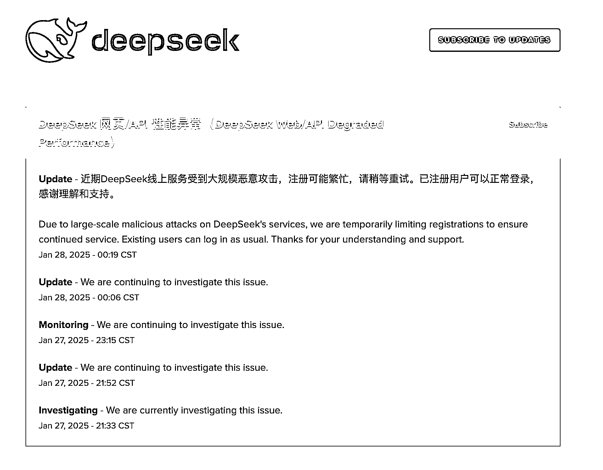

为保障服务，DeepSeek 团队限制新用户注册，目前仅支持 +86 大陆手机号。

为了防止服务过载导致无法使用，夙愿今天为大家准备了三种应对方案，解决 DeepSeek 因服务资源有限而无法使用的问题。

### **方法一：多注册几个账号，轮番上阵**

现在网页版用户每天只能使用 50 次深度思考模式（R1 模型），超过后会被限制。

不过，解决办法也很简单，可以换个账号使用。

趁着过年，用家人手机号注册一个新的 DeepSeek 账号，被限制了就再换一个。

### **方法二：调用 DeepSeek 的 API**

API 服务跟网页版服务的通道是不一样的，如果网页版崩了，API 还是可以调用的。

**第一步，打开注册 DeepSeek 开放平台后台。**

网址是：[`platform.DeepSeek.com/usage`](https://platform.deepseek.com/usage)

注册登录进来之后大概长这样。

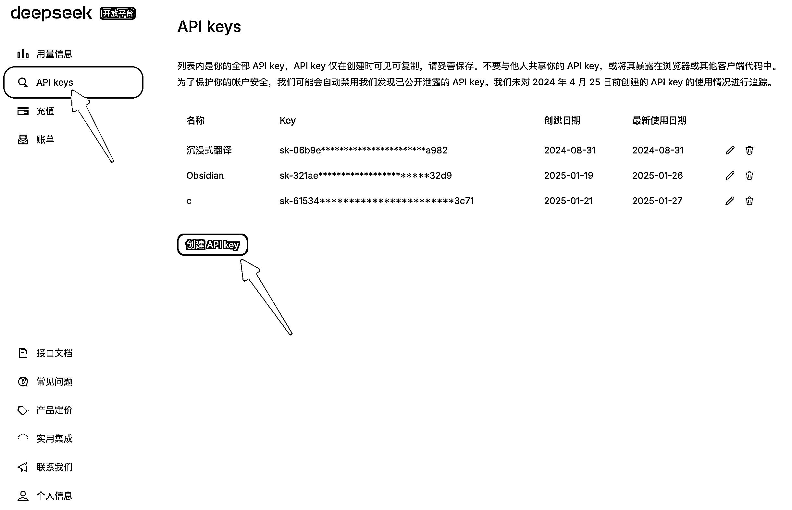

然后点击“API Key”创建一个 API。

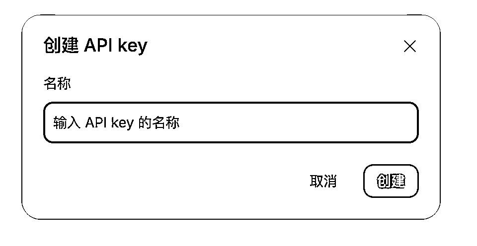

这里 API 名称随便写，然后复制这个 API key，你可以理解为访问密码，谁能拿到这个密码，谁就能“盗刷”你在开放平台上的余额。

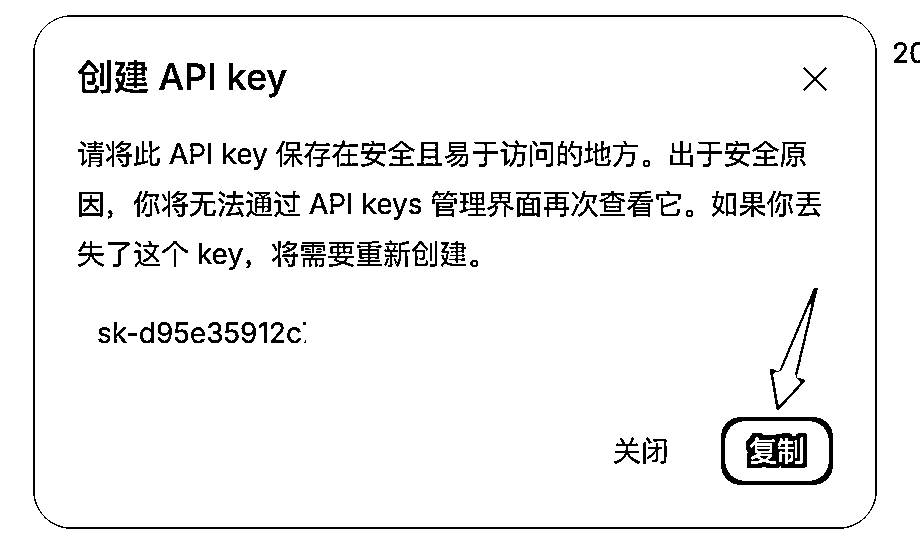

说到余额，调用 API 是要收费的，但是 DeepSeek-V3 和 R1 的成本非常非常低，充个 20 块钱基本可以随便造了。

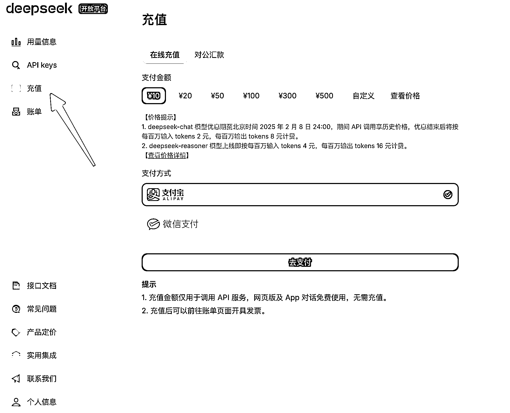

这样我们就拿到这个 API key，相当于拿到了密码，接下来我们要使用一个“壳”来承载我们跟 AI 的对话

我们在网页端或者 app 端使用 DeepSeek 时，这个网页或者 app 页面就是一个“壳”，但是官网的这种“壳”是不能填 api 的，

不过没关系，开源平台上有很多大神开发好的

**第二步，下载配置对话平台**

例如：CherryStudio

CherryStudio，是一款支持多平台的 AI 客户端，兼容 Windows、macOS 和 Linux 系统，未来还将拓展至移动端。

下载网址：[`cherry-ai.com/`](https://cherry-ai.com)

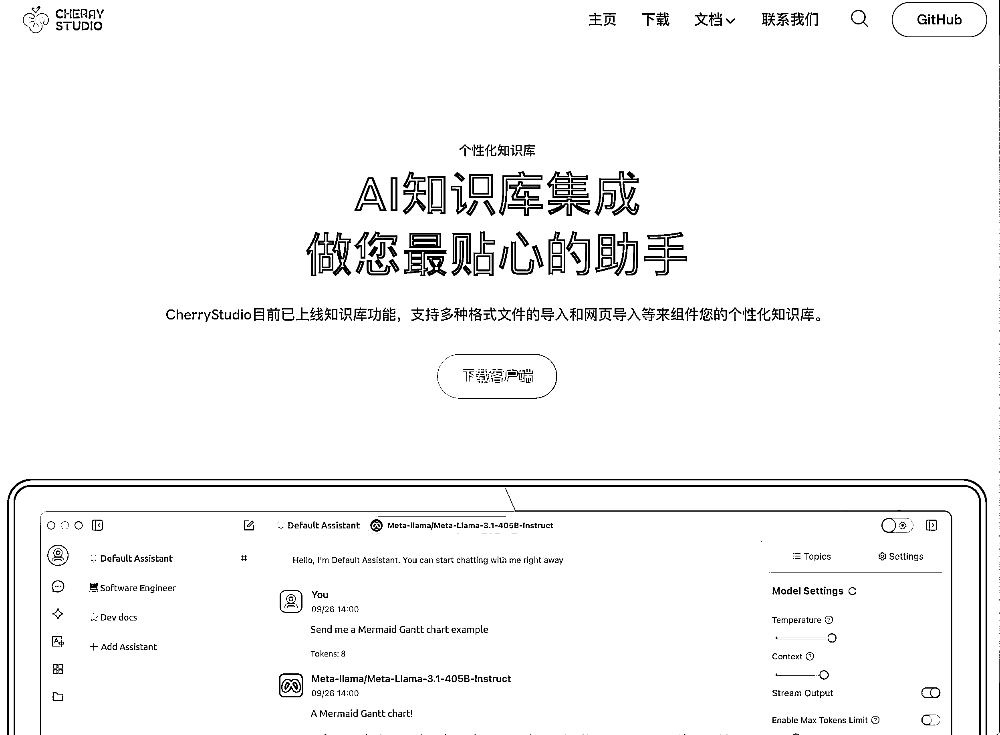

下载安装这个软件，接着，在这个软件里填写刚刚获取的 API。

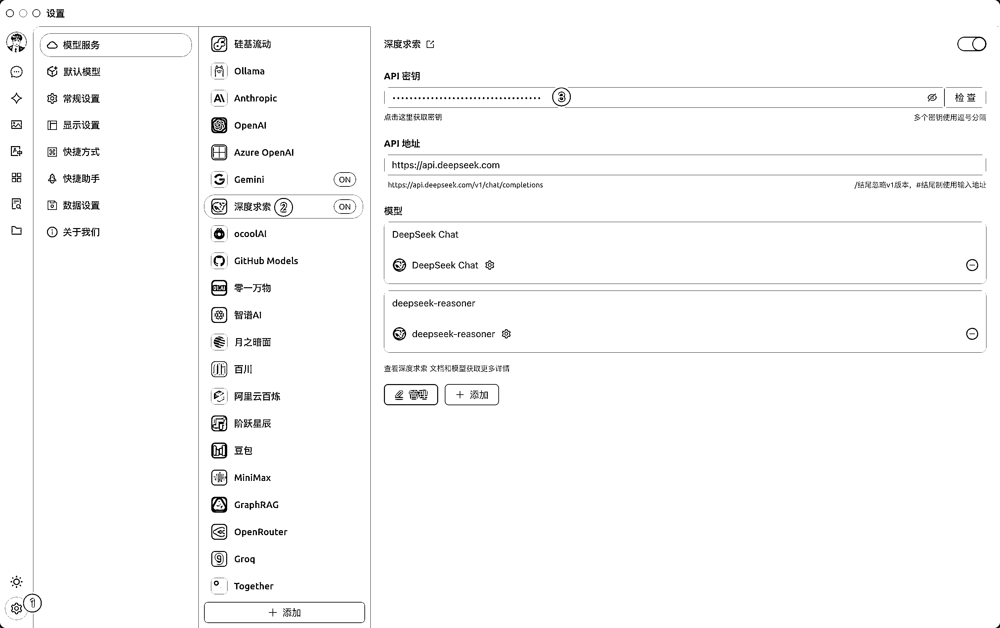

填好之后，就可以去跟 DeepSeek 聊天了

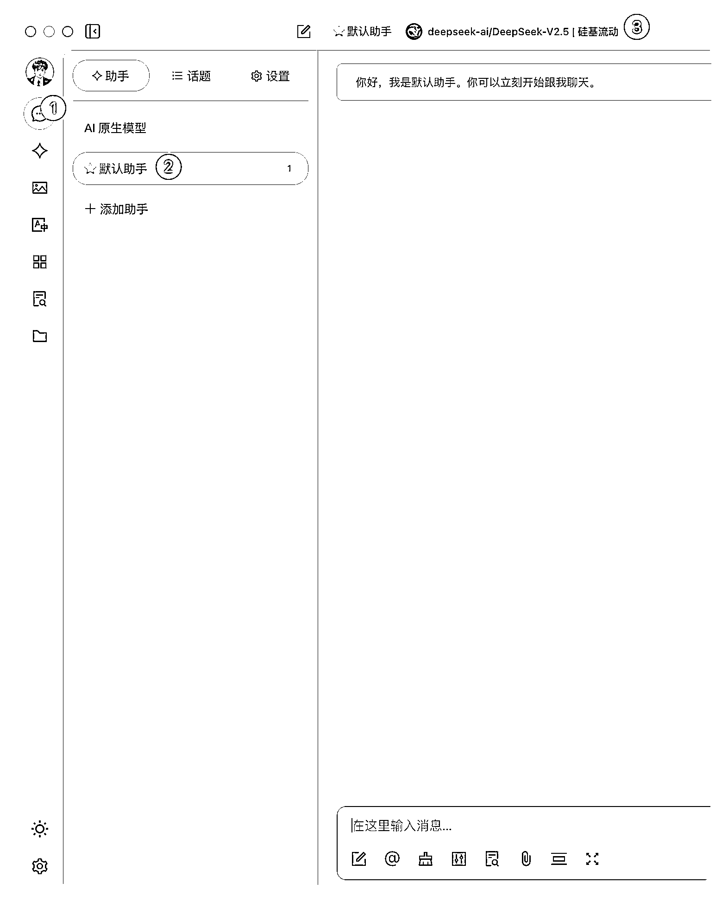

在聊天界面，选择 DeepSeek 模型

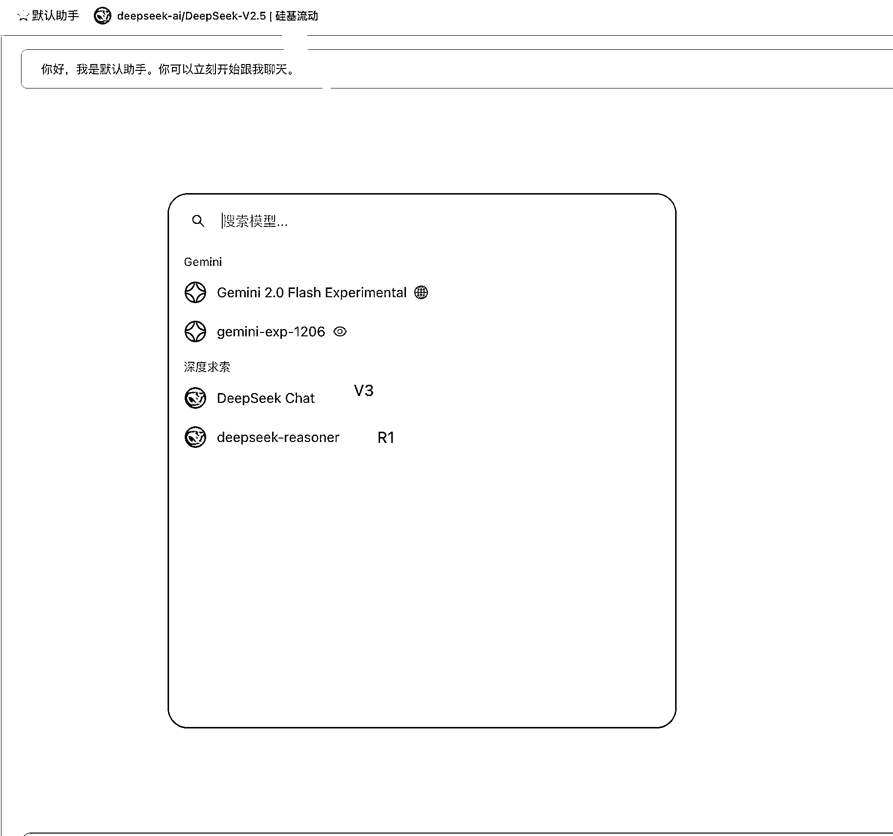

其中，DeepSeek Chat 就是 DeepSeek-V3 模型，DeepSeek-reasoner 就是 DeepSeek-R1 模型

然后就搞定了，就这么简单，接下来可以跟 AI 开始聊了。

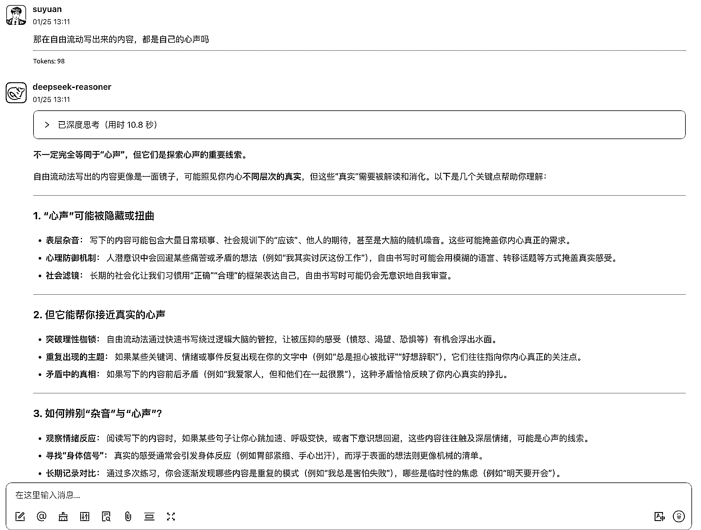

### **方法三：使用第三方部署**

由于 DeepSeek R1 是开源模型，已经有第三方平台在自己的算力平台上部署了这个模型。

比如 Together Al ，可以白嫖使用。

网址：[`www.together.ai/（需特殊网络）`](https://www.together.ai/（需特殊网络）)

打开注册登录之后，在后台的 Playground 里选择“Chat”，即可进入聊天界面，接着，选择 R1 模型就可以了。

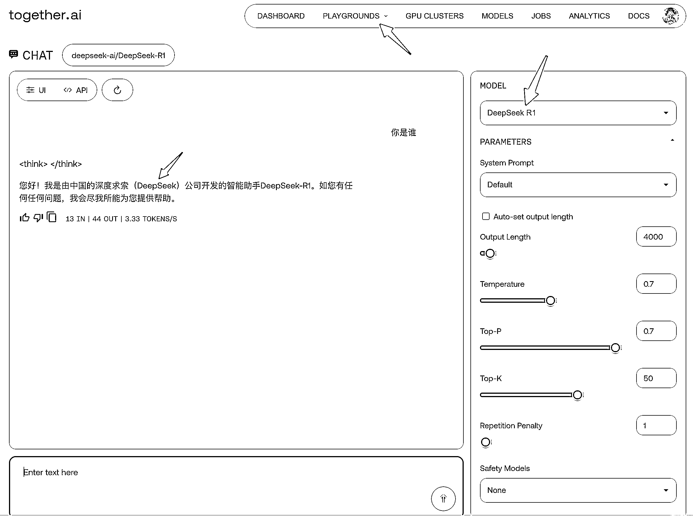

写在最后，我想说：

璀璨的除夕夜空下，我们见证着一个不平凡的时刻。

**DeepSeek，这个优雅的名字，承载着"探索未至之境"的承诺。**

它不仅是一个工具，更像是一盏明灯，照亮了 AI 探索的新航道。

**在这个时代，每个人都可以成为开拓者，无论你是开发者、创作者，还是普通使用者，都在参与定义 AI 的未来。**

正如游戏科学的冯骥所言，这或许是"国运级别"的突破。

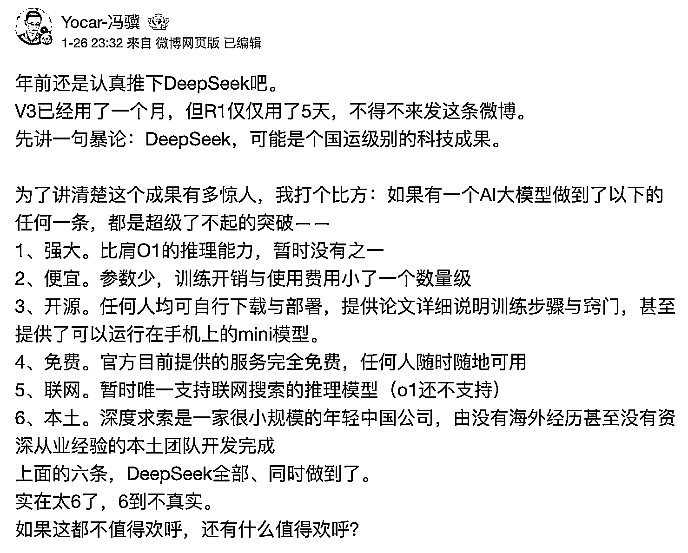

下面是他给的三个建议：

1、请马上用起来

2、使劲用，疯狂用，尝试用它基本取代传统搜索。请想象你已经认识每个领域的顶尖专家，而且他们都是你随时在线的好朋友，

把所有可能需要“请教别人”的问题，都拿去先问它——无论是构建一个复杂函数，搞清楚附近哪个游泳池最好，检查合同里的法律陷阱，让新写的歌词再押韵点，或者帮父母确认某个保健品是否真的有效

3、去看看别人是怎么用的，去试试其他大模型，了解 AI 擅长什么，不擅长什么，如何调教，然后继续解锁与迭代属于自己的用法与更多工具

除夕夜创作不易，如果对你有帮助的话，一定要点赞支持一下，求求了～

* * *

评论区：

柳新 : 有用，感谢。

美播星球共修会 : 第二种方法，那个网页崩了，能借用你的不密码不，可以付钱

夙愿学长 : 可以用硅基流动的 api，在微信搜一搜上搜一下“硅基流动 DeepSeek”，全是教程文章

夙愿学长 : 不客气，有帮助就好

夙愿学长 : 这篇文章发了快两个星期了，这期间又出了很多 DeepSeek 第三方服务的新渠道，可以看看圈友@熊猫
Jay 的这篇文章，[`t.zsxq.com/yM859`](https://t.zsxq.com/yM859)

美播星球共修会 : 好的，谢谢