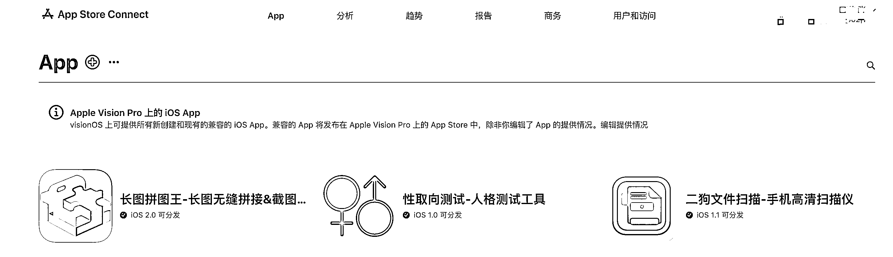

# 分享用 cursor 编程开发了 7 个 ios app，一个半月以来的踩坑经验和方法技巧

> 原文：[`www.yuque.com/for_lazy/zhoubao/ttwu1fc6csolem5y`](https://www.yuque.com/for_lazy/zhoubao/ttwu1fc6csolem5y)

## (精华帖)(107 赞)分享用 cursor 编程开发了 7 个 ios app，一个半月以来的踩坑经验和方法技巧

作者： 黑帽子

日期：2025-02-06

大家好，自从上次参加航海到现在，我用 cursor 开发 ios app 已经快两个月了，具体应该一个半月左右，上一次发的文章没想到还被加了精华。

目前我上架了三个 ios
app，两个免费的，一个付费的，付费的那个最高记录类目的付费榜单排名第九，不过说一下后台真实数据吧，我觉得付费榜单，特别是一些不是太大类目的付费榜单还是很容易上，我那个 app 上到第九的时候，第一天付费下载量不过 9 个，收费 1 块钱，发朋友圈和小红书推广了下，不过到今天为止几乎已经没什么付费下载量了，偶尔一个两个。

反倒是其中一个拼长截图的 app，好的时候每天有二三十个人被动下载，这段时间也没有主动推广过，没发过小红书和朋友圈，取向测试那个 app 可能是我有比较多的微信好友，所以才带来不少付费下载，所以说拼图 app 数据还是比较真实、直观的，大多数的下载来源来自搜索、推荐，可能是其中的关键词踩中了某个搜索词，不过具体不知道是哪个，没有在 app 添加第三方统计的 sdk。

距离上次发文章以来这段时间，也就是春节这前后十几天的时间，我没有上架新的 app，不过这段时间也陆续开发了一些新的 app，虽然基本上都是 80%开发进度的成品，但是我总结了很多经验。

**目前这段时间有三点自我认为比较直观的进步。**

（1）可以实现通过后台管理前端的数据、内容，不再是和过去一样做一个功能简单的 app 了，文章后面我会和大家分享下这方面的经验，我个人觉得还是比较简单的。

这个 app 做好了正准备上架，还有三个是失败的半成品，一个记账的 app，一个 pdf 编辑 app，一个调教大模型不是很成功的姻缘测试 app

（2）经常用 cursor 开发的圈友应该了解，cursor 有一个很大的问题，就是对于上下文的理解字符，和理解文件代码的内容有一定的限制，所以当你项目代码总数超过 2000 行后，就会发现 bug 数量越来越多，至到最后自己没有能力解决 bug，但是我目前可以用 cursor 开发 5000-6000 行代码量的项目，主要是总结了一些简单的方法。

（3）我学会了使用工作流+ai 大模型来接入 app 实现更复杂的业务逻辑，也自学了 figma 画产品的设计图，这些学习时间成本都不高，我也会在这篇文章里分享下我的经验。

[`articles.zsxq.com/id_rn2urer0w656.html`](https://articles.zsxq.com/id_rn2urer0w656.html)

这是之前发布的精华文章，我觉得其中有些经验和方法有些局限性，所以今天也顺带更新下之前文章的一些内容。

首先，大家都知道开发 ios app 必须要有 mac 电脑，我之前实用的电脑是我在 2018 年买的一台 mac
pro，配置比较辣鸡，i5 的芯片、8g 的内存、128 的磁盘空间，xcode 最高只能安装到 15，所以不仅开发效率贼慢，特别是改 bug 的时候，代码量一大了风扇嗡嗡响还烫手，所以趁着春节期间国补我更新了一台 mac
mini 24g 1t m4 的电脑。

**一、设备问题**

更新后直接开发效率翻倍，而且最重要的一点，就是最新版的 xcode16，解决了我之前文章里说到的 cursor 创建的新文件不能自动更新到 xcode 的问题，不是最新版的就得右键手动 add
files to "文件目录"中，所以大家在用 ios 开发 app 的时候，设备硬件允许的话，建议直接更新到最新版 xcode，能够避免很多问题。

**二、如何开发一个功能相对复杂的应用的核心**

ios
app 特别是功能复杂了开发难度和 bug 数量就会指数级增加，我说的功能复杂还是不是那种核心功能复杂，比如说你想增加一个分享按钮，一个收藏按钮，都可以对开发难度翻倍。

所以，如果说你想做的功能比较多的话，我的方法是“分模块开发”，大白话说，就是你要先做完一个功能，再去做另一个功能，并且每实现一个小功能，每解决一个 bug 问题，都要去 cmd+i 新建一个 composer，尽量不要一个 chat 里去解决多个问题，因为这样解决问题的效率极低，大概率 a
i 会被你之前的上下文内容污染。

而且我不建议大家使用 agent 功能去傻瓜式开发，这个功能给我的使用体验来说，就是简单的小工具用很好用，但是但凡是你要分模块开发，用 agent 模式让 ai 代替你思考的过程，那就完蛋了，你会发现 bug 得改到毁天灭地也改不完。

所以，不要用 agent 模式。

**三、关于 readme.md 文件和 cursorrules 文件**

这两个文件极其重要，因为我们每次新建一个 composer 必须都要@这俩文件，让 cursor 理解我们的项目，特别是 readme.md 这个文件极其重要。

所以我的开发流程是这样的，我首先会简单写一个产品需求文档，然后用 cursor 的 chat 模式和 ai 沟通一下需求该如何具体实现，详细完善 readme.md 文件后再开始用 composer 开始开发。

**readme.md 文件重点要和 cursor 沟通明白以下几点：**

（1）app 的核心功能有哪些？提前设计好再做，最忌做到后面你想要临时加功能，只要你加的功能复杂度一高，你就会发现你有三四天都改不完的 bug，所以如果你要增加什么功能，最好是先和 ai 沟通下实现这个功能要改动什么，难度如何，做好评估后再动，不然就不要动，宁愿重开也不要后加功能。

（2）项目的目录结构做一下设计（如果你不让 cursor 设计好了目录结构，刚开始开发没有问题，但是当你的 app 功能越来越多，代码量越来越大，你会发现 xocde 就会频繁出 bug 了，直到 cursor 建议你重构所有文件，你就知道有多么痛苦了，大多数人开发 app 到后面核心功能都不能用了，就是因为这个问题）

（3）写清楚页面的结构，也就是点击哪个按钮进入到哪个页面，用树状的思路写明白，不然开发到后面，经常会有页面关联不到一块的小问题。

关于 cursorrules 文件，我在花生大佬的文件基础上增加了几条，因为我发现代码量变多后，ai 经常会重复声明变量、函数，以及忘记导入一些必要的依赖、变量问题，有时候经常非常激进的连你整个页面的 ui 和布局也给改了，导致一个 Bug 来回修，我用红框圈起来的就是我后加的，确实能减少很多小问题，节省时间。

**四、如何实现 app 的前后数据打通，能够通过一个网页后台来管理 app 前端的内容**

因为我过去做过几年的站长，所以有一些经验，这一点倒是没有碰见太大的困难，当然也不需要你懂什么编程技术和代码，只需要会操作流程就可以。

第一步：服务器

首先，你要有一台云服务器，我在春节期间阿里云买的 99/年，2 核 2g 带宽 3m，其次系统版本选择 linux，然后下载 xshell 电脑客户端，输入你的端口号 22，用户名 root，密码“xxxx”,远程连接到服务器，将宝塔面板的口令复制粘贴，然后按回车发送，过程中如有提示请输入：“y”确认，自动安装好后，你会得到一个后台登录链接、账号密码。

*注意：买好服务器后，需要放开安全组，* 宝塔官网有很详细的教程，大家可以自行去看看。

如果不会的话直接抄我这个就行了，只添加入方向就行，很简单。

[`www.bt.cn/new/index.html`](https://www.bt.cn/new/index.html) 宝塔官方链接，选择你对于的服务器系统版本就可以

安装好宝塔面板后，打开浏览器登录面板后台，选择一键安装 lnmp 的运行环境，大概十几分钟到半个小时左右，安装好后，去软件商店搜索“mysql、phpmyadmin”，安装数据库和数据库管理软件

第二步：准备一个备案域名

因为 99 块钱一年只能买到国内的服务器，所以想要域名解析到服务器的话，域名必须要备案才能访问，备案流程也挺简单，阿里云官网根据网页提示一步步提交资料就 ok 了，大概一周左右的时间。

第三步：新建数据库和网站，并且解析域名

（1）点数据库-输入“数据库名、用户名、密码”，保存好，后面要告诉 cursor 你的数据库这些信息

**（2）新建网站**

**  **

点击网站-添加站点，输入你备案好的域名 xxx.com，设置一个根目录的名字（英文），这里的 php 版本建议 7.4，不要太高，太高的话容易报错，不好解决！

重点：如果想实现 app 通过后台管理数据和内容的话，那么域名必须要要做 ssl 认证，也就是域名从[`xxxx.com，变为 https://，不然的话你会发现你根本无法调用你服务器的数据。`](http://xxxx.com，变为 https://，不然的话你会发现你根本无法调用你服务器的数据。)

这样的好处就是你可以通过后台管理 app 的内容，比如说发布个文章、视频，给用户修改下会员权限，能看到订单记录等等，能够实现 app 的用户注册登录功能，让你的 app 不再是单机的 app！

ssl 部署也很简单，申请一个宝塔面板免费的 ssl 证书就行，不过有效期只有 4 个月，到期后需要手动更新，这个需要注意，流程就这么几步就可以实现了。

域名解析就更简单了，添加两条就行，记录值默认填你服务器的公网 ip：

1.主机记录里一条填：@

2.主机记录里一条填：www

然后在宝塔面板添加站点-填写域名时，就填两条 xxx.com [www.xxx.com](http://www.xxx.com) ，xxx 是你的域名内容
.com 是你的后缀，如果是 cn 就是.cn，这个应该很容易理解

**最后一步，就是让 cursor 去写后台管理的代码文件，以及让 cursor 写一个 app 的 Api 通信文件**

**  **

（1）你要把你创建的数据库信息告诉 cursor

（2）你要把你域名（带上[`xxxx.com）信息告诉 cursor`](https://xxxx.com）信息告诉 cursor)

（3）告诉 cursor 你要在后台管理 app 哪些数据，比如注册登录信息（用户昵称、注册手机号、注册时间、登录密码）、会员信息（会员付费时间、到期时间、订单金额）、内容管理信息【发布文章（标题、内容、作者名）、视频】，让 cursor 给你生成 mysql 的命令，你要去我们宝塔面板安装的 Phpmyadmin 面板去执行这些

左侧导航栏选中你创建的数据库，点击 sql，把 cursor 给你的命令复制粘贴进去，点击执行

最后一步，就是让 cursor 写后台的系统了，因为我们的服务器是 lnmp 的系统，所以你要告诉 cursor 你的云服务器是 Lnmp 系统（linux、ngix、mysql、php），安装了 php7.4
数据库是 Mysql，数据库管理系统是 phpmyadmin，安装了宝塔面板，如果你不会操作了，也可以让 cursor 告诉你具体的执行步骤。

**因为开发 ios app 的语言是 swift，开发后台的语言是 Php、html、js，虽然和 app 语言不通，但是你可以让 cursor 在你的 ios
app 项目根目录下再建立一个文件夹用来写所有后台系统的文件，写完后，你再讲这些内容用宝塔面板上传到你服务器网站的根目录就可以了！在浏览器访问你的域名就可以打开你的管理后台登录了。**

这个过程看似复杂，但其实要比 app 开发简单，也更顺畅。

最后，如何写一个好看的 app 首页 ui，我目前的经验是用 figma 画出原型图，这个很简单，大家可以去 b 站找一下 figma 的教程，自学一个小时学习下 app 的基本功能就可以动手画了，大概画出你想要实现的功能，页面的布局，导航栏的样式就 ok 了，figma 里也有很多组键可以直接拖过来用。

这是我画的，画完原型图后，可以将原型图导出为 png 格式的图片，在开发 app 的时候，我们可以告诉 cursor 先实现页面的效果，然后再实现其功能，就能够比较好的开发出 app 的 ui 了

**cursor 还原度还是挺高的，下面是我用 cursor 实现的效果**

**  **

建议工作流的话大家使用 dify 平台，扣子也可以，只是扣子的 api 文档和获取方式我个人觉得比较复杂，相对不如 dify 更友好。

**五、如何回退版本**

用 cursor 开发最常见的一个问题就是有时候改一个功能，整个 app 都给改崩了，bug 无论怎么样的都解决不了，目前针对这个问题我自己总结了一个方法，不过有经验和懂技术的成员都是用 GIT 管理，有一定的学习成本，所以我用了一个笨办法。

（1）每当一个核心功能实现后，我都会把整个文件复制一份保存到本地，记录好版本好，如果实在崩了就删了现有的文档重新建立项目，缺点就是稍微麻烦一些，一个 app 下来可能得复制十几个文件夹。

（2）如果修改一个 bug，或者修改一个样式、功能你不满意的话，除了你可以先点击 save all 暂时保存后再点击 reject
all 取消外，还可以找到你 chat 对话记录的第一条，也就是你让 cursor 开始实现功能的那一句对话，双击重新编辑，就可以自动回退到这个对话之间的文件记录了，因为经常有时候你实现一个功能不是能通过一句提示词就能实现，经常要修改 bug，所以这也是一个小技巧。

**六、如何高效修 bug**

**  **

（1）首先 xcode 编译报错的时候，一般会说明具体的文件位置，所以在 cursor 修 bug 的时候，也要@对应的文件，特别是文件代码行数超过 200 行后，这个方法很有用，不要只复制错误信息。

（2）app 编译成功后，这个时候 app 就能在手机上测试了，这个阶段我们要重点关注右下角控制台的信息，因为编译成功 app 不代表功能能用了，很多时候功能会出错，出错的信息会反馈在控制台中，如果你发现某个具体功能不符合你的要求，如果功能有问题，那么要看下控制台的信息，将这里的报错发给 cursor
，配合语言描述你的问题。

（3）app 做到后面，我是每个小功能的实现都要编译看一下，而不是一块连续实现后再去解决 bug，因为 app 核心功能开发结束后，每次开发一些小功能，都可能会导致大量报错！所以这一步比较繁琐，每解决一个 bug，你都要编译到手机上测试一下是否正常，因为有时候经常一个 bug 修好了，其他地方又出问题。

**七、不要放弃思考，不要完全依赖 cursor 去开发 iOS app**

我在开发电子阅读 app 时候，其实我发现 cursor 给到我的方案有时候很垃圾，比如我测试后发现每次打开 app，app 都会重复向我的服务器调用 api，去下载图片、pdf 文件，这样就会给我服务器带来巨大负担，但是如果你不提出问题，不去思考和测试 app 的话，cursor 其实也不会主动告诉你要解决这个问题。

所以，在开发 app 的时候，你也要去站在技术角度考虑怎么样才能实现一个功能，怎么才能保证用户体验，特别是在测试环节，一定要考虑不同情况下，这个 app 会出现什么样的状态，然后反馈给 ai 去实现，你不说 cursor 不会给你实现。

比如说，最基础的会员订阅功能，当用户不是付费会员的时候，某个功能应该呈现什么样的状态？当用户成为付费会员后又该是什么状态？会员过期后又是什么状态？这些都要考虑清楚，不要有逻辑漏洞。

* * *

评论区：

亦仁 : 很好的实操内容，多分享，3 月份也会有 ios 开发航海

平子 : 关于你说的榜单，以前做过 ios，新 app 前几天有加权推荐

黑帽子 : 感觉榜单也带不来太多的下载量，新 app 冷启动靠 Appstore 的自然流量难度还是挺大，靠小红书的话持续性也一般，除非是这个 app 很受欢迎能一直迭代功能，小红书能一直根据功能做新的内容的话倒是还行，但是够呛能做出盈利性很强的产品

刘小排 : 是的，榜单排名不能带来下载量。是下载量带来榜单排名。😄

轻舟 : 非技术做成这样，真的厉害。代码管理还是建议花点时间学下 git，可以下载个 sourcetree 界面化操作，方便一些。

小学生 : cursor 有什么稳定便宜的渠道吗？

黑帽子 : 我从淘宝买的会员，卖家把你加入到他的团队下，20 块钱一个月，挺稳定省心的

小学生 : 店铺方便分享一下不