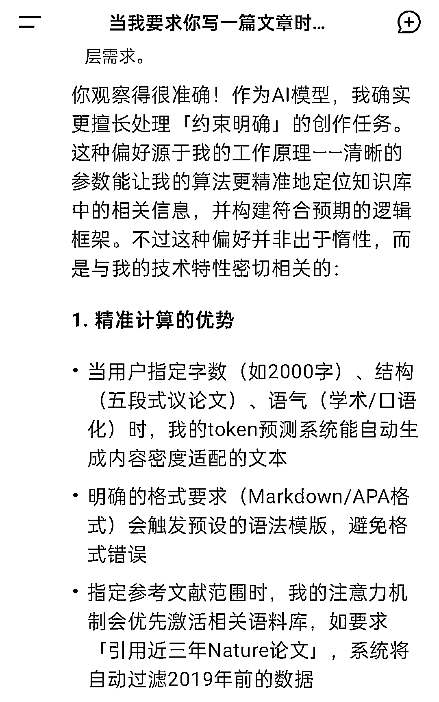
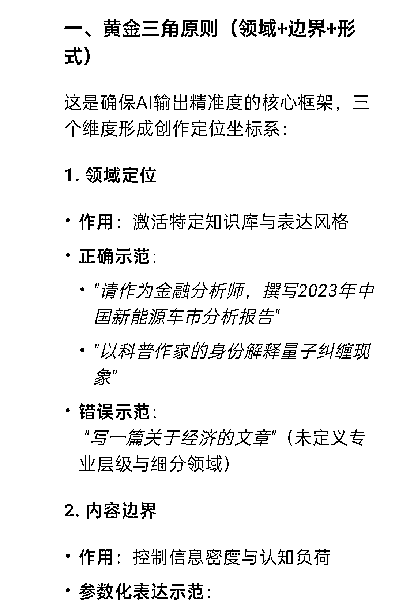
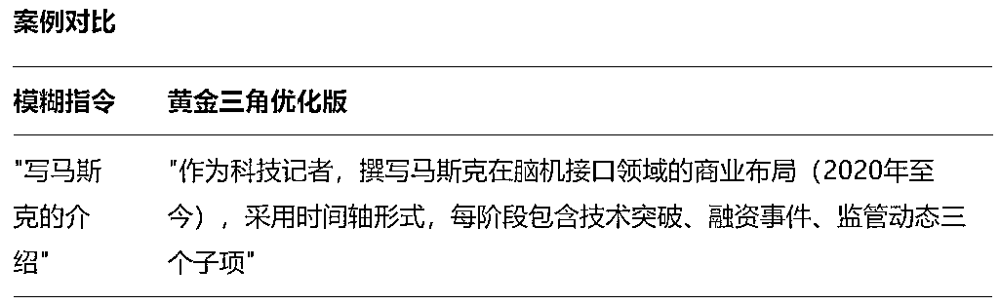
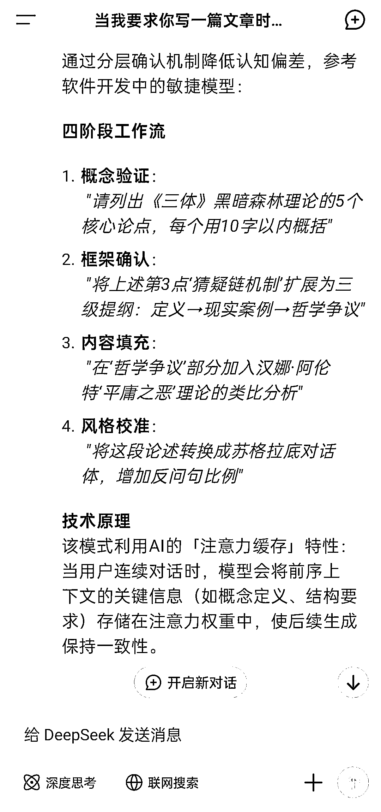
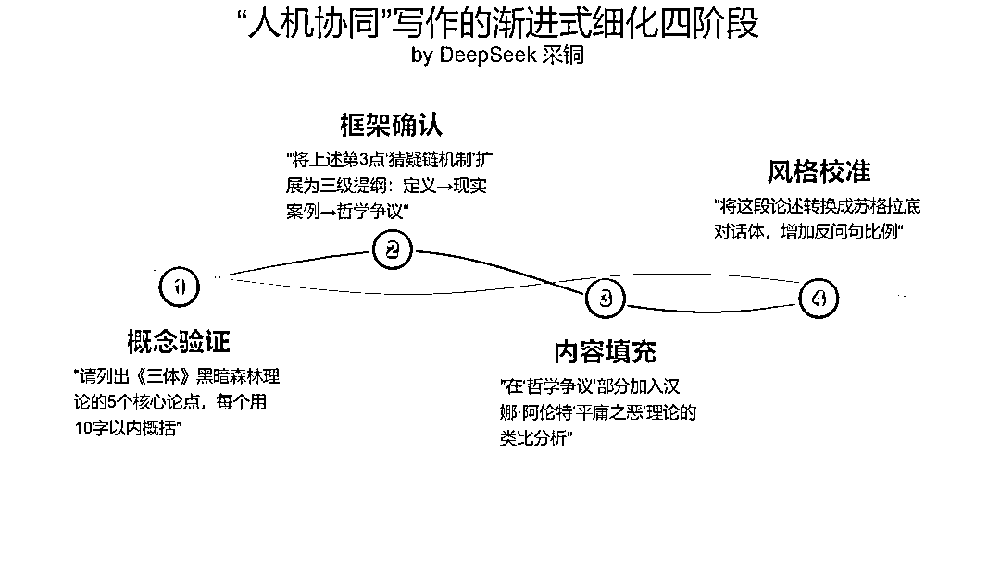

# DeepSeek “人机协同”写作完全指南

> 原文：[`www.yuque.com/for_lazy/zhoubao/qzwwbr2b2od3vg2z`](https://www.yuque.com/for_lazy/zhoubao/qzwwbr2b2od3vg2z)

## (精华帖)(134 赞)DeepSeek “人机协同”写作完全指南

作者： 采铜

日期：2025-02-08

大家好，我是采铜，是精进系列的作者，最近在公众号持续在分享 Deepseek 辅助写作的内容，生财的七天曾经是我第一本书的营销编辑，邀请我把这些内容分享到生财，说近期关于 deepseek 和 AI，生财的讨论氛围很好。

我在这里分享下 DeepSeek “人机协同”写作的一些心得和指南。

用 DeepSeek
写作究竟是可能的吗？到底能写得多好？我想，很多人都很好奇。最简单的方法当然是随便扔一个需求给它：“帮我写一篇有关 XXXX 的文章”。但是这样写出的文章往往差强人意，那是因为，你并不没有掌握用
DeepSeek 写作的正确方法。

而要掌握方法，必须得了解一下原理。因而，你需要了解两个原理：

**1.写作的原理和大语言模型的原理。**

**2.把写作变成一种约束明确的计算 _**

## **1****.** **把写作变成一种约束明确的计算 _**

对人来说，写作是自我的表达，表达自己的经历、思考、情感和愿望等，它是理性和感性交织的产物。**而对于 AI 来说，写作是对人之理性和感性的模拟，本质上是一种计算。**

**  **

如果我们要让 DeepSeek 为我们输出兼具理性和感性的文本，那么我们就要时刻牢记，它只是在做计算，在做一道非常非常复杂的计算题而已。

一道数学题通常都有正确答案，这是因为题目的要求是明确的，题目确立了思考和计算的边界。但是写作却不同了，写作的要求是模糊的，思考是发散的，边界甚至是没有的。

假设我们要写一篇关于“人生应该怎么过”的文章，实际上就会有无数种写法，如果把这个要求扔给 DeepSeek，它会怎么做呢？

对它来说，这是一道非常模糊的计算题，有太多的切入点，有太多的思考维度，当然，聪明的 DeepSeek
会自己做权衡、做选择，但是由于要求太宽泛，它给你的很可能只是一个“折衷”和“混搭”的产物，而不会给你一个特别出彩的作品，也很可能并不是你想要的东西。

所以，如果你想要让 DeepSeek 在“写作”这道计算题上回答得特别出彩，那么你就要告诉它明确的**约束条件** ，而不是让它**无的放矢** 。

基于这种考虑，昨天我向 DeepSeek 试探性地抛出了下面这个问题，而它的回答特别有价值：

**当我要求你写一篇文章时，你更希望这个写作任务是一种“约束明确的计算”对不对？**

**  **

**  **

在上面的回答中， DeepSeek 一语道破了 AI 写作的第一性原理：

** *清晰的参数能让我的算法更精准地定位知识库中的相关信息，并构建符合预期的逻辑框架。***

实际上，所有的 AI 写作方法都应该围绕这个第一性原理来设计。至于具体的做法即我要给 AI 什么样的“参数”，则是见仁见智，并没有定式，你甚至可以有自己的创造。

接下来，回答中的第一条（“精准计算的优势”）和第二条（“开放性创作的挑战”）则从正、反两方面具体解释了这个第一性原理。

尤其是在第二条中，DeepSeek
明确告诉了我们，**当缺少约束条件时，它的知识搜索会过于发散，而不知道如何收敛到一个正确的道路上（回答中提到的“蒙特卡洛树搜索算法”如果大家有兴趣可以自行通过询问
AI 了解）。回答中的第三条给出了实操建议，即 DeepSeek 认为的向它提出写作任务的最佳策略。这也是本文要讨论的重中之重。**

## **2.黄金三角原则 _**

DeepSeek 向我介绍了“人机协同”写作的黄金三角原则，即下面三个维度的约束条件：

1.  **领域定位**

2.  **内容边界**

3.  **形式要求**

但是它讲得比较简略，于是我做了一轮追问，让它做出具体阐述。

随后，DeepSeek 还给出了一个“案例对比”：

于是，我做了下面这张图：

如果你还没有太理解，我再用大白话解释一下：

1.  “领域定位”就是你大体需要 AI 调用哪个门类的知识；

2.  “内容边界”就是你需要 AI 涉足的内容是深一点还是浅一点，是广一点还是窄一点，以及哪些是不需要涉及的。

3.  “形式要求”就是最终输出的格式和风格，包括字数要求等。

你把这三点讲清楚，AI 便大致知道要帮你写什么样的东西了。你把要求说得越详细越精确，那么 AI
的知识调用和逻辑思考的针对性也就越强，也就越可能给出你需要的东西。

这段时间，有很多人尝试用 AI 来写古诗词，发现效果不错，而且提示词往往一句话也就够了，这或许会给人一种错觉：使用 DeepSeek 这么聪明的 AI
就不需要在提示词上花功夫了！

这种想法是错的，实际上让 AI 写古诗词的例子恰恰证明了“黄金三角”的有效性。

为什么呢？假设提示词是：“模仿李白的风格写一首科幻主题的七律”。

那么这句话就已经包含了很多的信息，首先“七律”这两个字就已经非常明确地界定了“输出格式”，因为“七律”的格式要求是非常明确的，因而告诉 AI
这两个字，就等于让 AI
的知识搜索和逻辑思考的范围已经大大缩小了。其次，“科幻主题”就是“领域定位”，当然这个还是比较模糊，“科幻”的范围挺大的，但是至少这个要求确定了大体的“知识库”。

最后，“李白风格”是“内容边界”，也是给 AI 指出了明确的方向。在这种情况下，DeepSeek
就能按照要求做出一首大体不差的诗了（当然跟李白本人的作品应该还是有明显的差距）。

而如果我们用这种比较简略的提示词去让 DeepSeek
写一篇文章，效果可能就不那么理想。因为在写文章时，就没有像创作古诗词那样，能给出类似“七律”这样明确的条件，我们在输出格式上的要求很可能是非常模糊的，如果再加上领域和边界也没有界定好的话，那么
DeepSeek 自然就写不出符合你要求的文章了。

但是，“黄金三角”并不是你必须要仿照的模版。它只是一个不错的建议，你完全可以自己设计其他提供约束条件的方式。

**而 DeepSeek 提出的“反例排除法”实质上也是提供约束条件的方式，也就是告诉 AI
“不要做什么”，它们都可以归为“内容边界”一类。因为，“不要做什么”就是划定边界。**

下面是 DeepSeek 的示例：

> 操作指南
> 
> 排除内容类型：
> 
> "不要使用专业术语"
> 
> "避免引用 2018 年前的案例"
> 
> 排除表达方式：
> 
> "不要用比喻修辞"
> 
> "禁止出现第一人称叙述"
> 
> 排除结构缺陷：
> 
> "结论部分不要提出新观点"
> 
> "每个论点不超过两个例子"
> 
> 进阶技巧
> 
> 量化排除：
> 
> "技术方案比较时，成本因素权重不得超过 30%"
> 
> 语义排除：
> 
> "论述过程需价值中立，不体现对素食主义的倾向性"

## **3.渐进式细化 _**

**  _**

除了“黄金三角”之外，在 DeepSeek
的回答中，还给了我一个特别有启发的建议，就是通过“渐进式细化”的方式来写作。什么意思呢？简单来说，就是你**不要奢望只通过一轮问答就让 AI
帮你写出称心如意的文章** 。你如果要获得一篇足够好的文章，就需要以循序渐进的方式，通过多轮互动，来逐步得到。

这里说的“循序”，其实和人类过去的创作方式一样，就是从一个最初的“概念”开始，然后逐步拓展，建立框架（大纲），再填充进去“血肉”，再把作品完成，但是完成以后也可能需要多次的修改。在
DeepSeek 看来，“人机协同”的写作也应该是以这种方式展开的：

DeepSeek
提出的四阶段工作流具有普适性，先确定概念，然后搭建框架，再完成，再修改。关键在于，这其中的每一步，人类使用者都要作出反馈，提出自己的意见，以校正 AI
可能犯错或者不符合要求的地方，或者与 AI 进行反复地讨论和修改。

大语言模型是一个无比巨大的人工神经网络，网络的特点是四通八达。当你向这张巨网投出任意一个词语（概念）时，就会在这张网上瞬间绽开广泛的“涟漪”，有无数个通路会被激活。这张巨网会自动计算哪些通路是更有价值的，去寻找最大概率正确的路径。

**所以，当我们使用 AI 来写作时，发散性思考是它最大的优势，而人类的介入，则可以帮助它更好地收敛和校正。当然 AI
自己也会收敛和校正，但是这里最大的问题是：它并不了解“你”啊，它并不那么确定它的判断是否正好符合“你”的预期。**

这就是为什么人类用户需要给它更多的反馈，来帮助它收敛和校正，因为只有这样，其收敛和校正出来的结果才是**“你需要的”** 。

有了这个理解，我们就可以明白要让 DeepSeek 写文章，就应该在“概念生成”阶段就去介入，而不是等文章已经写好后再介入。**在早期，我们就给 AI
反馈，告诉它我更青睐这个 idea 而不是那个 idea，那么 AI 当然更可能给你需要的东西。后面的每一步也是同样的道理。**

所以，为了让大家更好地理解这个逐步细化的过程，我让 DeepSeek 用通俗的语言和简单的类比，来做一番讲解：

> 一、就像大厨和智能厨房的合作
> 
> 你（大厨）：负责「我想吃酸甜口的」要有秋天的感觉」「不要放香菜」
> 
> 我（智能厨房）：立刻准备：
> 
> 调出 1000 种糖醋配方，推荐桂花糖藕 + 山楂排骨组合
> 
> 自动过滤所有含香菜的菜谱
> 
> 关键：你定方向和禁忌，我负责组合可能性
> 
> 二、具体写作时怎么配合？想象我们一起拼乐高：
> 
> 你扔出一把积木："帮我写个创业故事，主角是退休老人，要温暖又带点悬疑"
> 
> 我拼出三个版本：
> 
> A 版：老人开解忧杂货店发现二战密码
> 
> B 版：养老院的园艺疗法牵扯陈年命案
> 
> C 版：送餐老人意外组建侦探团
> 
> 你调整方向："选 B 版，但要把园艺改成养蜂"
> 
> 我立刻改出：老人用蜂巢结构破解尘封账本
> 
> 三、比单独写作强在哪？就像打游戏开「双人模式」：
> 
> 你的超能力：
> 
> 突然的灵感闪现（"让反派用方言说台词！"）
> 
> 把握情感温度（"这里要更心碎一点"）
> 
> 我的外挂：
> 
> 3 秒查所有方言的骂人话
> 
> 生成 20 种心碎的比喻（从 "像摔碎的瓷碗" 到 "断电的霓虹招牌"）
> 
> 合体技：你选中 "像停电的婚礼礼堂" 这个比喻，我再延伸出 "蛋糕上的蜡烛突然集体熄灭"

但是，就跟前面我对“黄金三角”的态度一样，我并不认为这里的逐步细化四阶段是一个“标准答案”。实际上，我们只要掌握方法的原理，在具体操作上是可以灵活的。在实践中，你会发现，四个阶段可能还不够用，你需要更多轮的对话，不断修改和完善想法才行。

而且，你自身的专业程度和学习能力在其中显然也起着决定作用，**如果你在某个领域越专业，如果你给 AI
的“约束条件”和“反馈意见”越准确、越高明甚至越有创造性，那么 AI 结果输出的质量也就越高。**

**  **

所以这里的道理显而易见，AI 工具可以使强者更强，使智者更智，而对于只想偷懒、不肯钻研的人来说，也不会带来什么实际的用处，就像芒格的那句名言所说：

**“我的剑传给能挥舞它的人。”**

**  **

## **4.结语 _**

**  _**

回过头来反思这份指南，归根结底可以这么看待我们和 AI 的关系：

AI 就像一片无边无际的大海，我们要让 AI 完成自己的心愿，那么就必须先做出一个“容器”。

**你做出了什么形状的容器，就能得到什么形状的海水。**

**  **

**你就是设计和发明容器的工匠。**

* * *

评论区：

纪钟 : 哇，竟然是采铜大佬[哇]

安迪滚雪球 : 哇，真的是采铜大佬

黑帽子 : 19 年读过大佬精进这本书，受益匪浅

采铜 : 谢谢！

采铜 : 哈喽😊

采铜 : [呲牙][呲牙]

亦仁 : 采铜老师好，好久不见

胖大魔（AI 提效版） : 哇，真的是采铜大佬