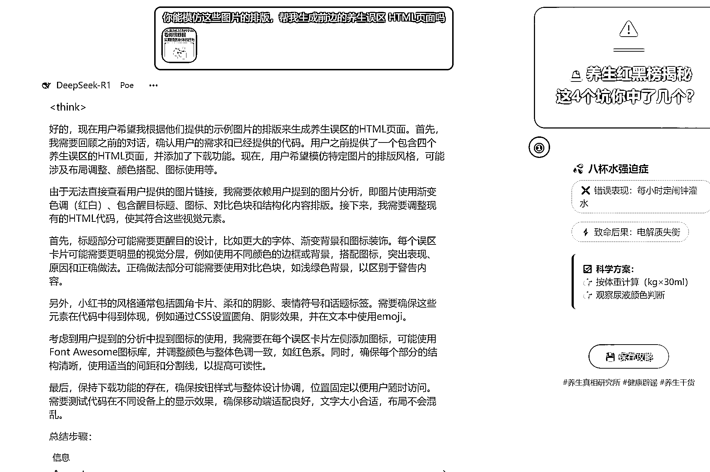

# 用 DeepSeek 一键生成小红书图文卡片，高产似母猪

> 原文：[`www.yuque.com/for_lazy/zhoubao/txlyf5s83by7tuvl`](https://www.yuque.com/for_lazy/zhoubao/txlyf5s83by7tuvl)

## (53 赞)用 DeepSeek 一键生成小红书图文卡片，高产似母猪

作者： 抖音电商-时光

日期：2025-02-06

生财圈友大家好，我是时光，最近爆火的 deepseek，大家都用的怎么样？

我也分享一下最近使用的小技巧，希望能对刚接触 deepseek 的小伙伴有点帮助！

学会用 DeepSeek，批量创作爆款图文，轻松拿捏 小眼睛 ！

小伙伴们，还在为怎么在小红书输出图文干货头秃吗？今天我把最近使用的小技巧分享出来。

以前，我为了做一篇养生图文，从找资料、写文案到设计排版，没有个把小时根本搞不定。

现在，用了 DeepSeek，短短 1 分钟就能产出一篇高质量的图文，真的太香了！

很多人只把 DeepSeek 当聊天搭子，却不知道它还能辅助我们快速完成图文笔记。

下面，我就手把手教大家怎么用它。

## **一. 创作文案**

首先，明确你想创作的养生内容方向。

比如，你想写一篇关于常见养生误区的笔记，给 DeepSeek 的提示词就可以这么写：

【列出 4 个常见的养生误区，包括误区表现、原因以及正确做法，

写成一篇小红书笔记，要符合小红书的创作风格和规则，

让用户看了能收获满满，马上就能用起来】

看看 DeepSeek 给出的内容：

【标题】🔥95%的人都踩过的养生雷区！4 大误区+正确指南，看完别再交智商税啦💸

【正文】

姐妹们！最近发现好多宝子一边熬夜刷剧一边狂灌枸杞水，无效养生看得我着急！今天必须扒一扒那些披着"健康"外衣的智商税误区，手把手教你们科学养生不踩雷👇

💣误区①：每天必须 8 杯水灌到饱

🚫表现：掐点吨吨灌水，喝到反胃还在坚持

💥原因：每个人代谢/体重/活动量不同，过量喝水反而导致电解质紊乱

✅正确做法：每天喝水量=体重（kg）×30ml，观察尿液呈淡黄色就是最佳状态！

💣误区②：运动越猛越健康

🚫表现：每天 10 公里+帕梅拉，膝盖痛到蹲不下还在硬撑

💥原因：过度运动会产生皮质醇加速衰老，关节磨损不可逆

✅正确做法：每周 3-4 次中强度运动，穿插瑜伽/游泳等低冲击项目，运动后一定做筋膜放松！

💣误区③：吃素=减肥必杀技

🚫表现：水煮青菜吃到脸发绿，结果疯狂暴食甜品

💥原因：纯素饮食易缺乏蛋白质和 B12，代谢率不升反降

✅正确做法：每餐保证「211 法则」：2 拳蔬菜+1 掌优质蛋白（鱼/蛋/豆）+1 拳杂粮饭

💣误区④：晚上不吃饭狂掉秤

🚫表现：五点后连黄瓜都不敢吃，半夜饿到啃指甲

💥原因：长时间空腹损伤胃黏膜，更容易触发暴食机制

✅正确做法：晚餐吃够「黄金三要素」：膳食纤维（凉拌菜）+慢碳（燕麦粥）+植物蛋白（豆腐汤）

【敲黑板总结】📝

养生不是自我折磨！真正的健康是倾听身体的声音，别再被伪科学 PUA 啦～从今天开始跟着这份指南调整，评论区蹲你们一周后的变化反馈❤️

#养生误区避坑指南 #科学养生小课堂 #变美变瘦变健康 #生活小常识 #养生女孩打卡

总结下来，结构大概是：

标题：吸引人，带数字和警示

正文：问候，点出主题，引起共鸣

内容：每个误区包括误区表现、原因、正确做法，用符号和分段

结尾：引导互动，添加话题标签

整个结构，非常符合小红书平台的作品风格。

## **二. 一键生成图片**

以前生成图片，得在专门的图片平台制作，例如用 PDF，可画，美图秀秀，剪映等，再手动替换文案内容，特别麻烦。

现在有了 DeepSeek，一键就能搞定！

继续和它对话：【根据上面的养生文案，帮我生成一个 html 页面，包含小红书的封面，以及这 4 个养生误区。

要求符合小红书平台的图文要求规则和风格，还有小红书平台的用户审美】

DeepSeek 会生成一段网页代码，直接运行就能看到效果。

目前是网页格式，要发布作品，分别截图保存封面和内容就行。

要是不想截图，还能让它加个保存图片功能。

【我想分别下载封面和其他卡片内容，在刚才的代码里加上这个批量下载功能吧】，

优化代码后，点击底部一键保存按钮，所有图片就都保存好了。

 images.zsxq.com/FgipMCxY_fNbTMV_y5yjXIulZ7No) images.zsxq.com/Fktx6eGAkPNF0HPgqaVlhmj9dJm6) images.zsxq.com/FonIpOW5u6ue3VBtNhc9ycC61jtV) images.zsxq.com/Fg8Ba1kzEsXWTXanyeMBcMAGaYt1)

## **三. 形成模板**

要是想生成新的养生内容，难道要重新改代码吗？完全不用！

DeepSeek 超擅长学习，还支持上传文件。

你也可以找对标，或者你感觉好看的排版，然后上传文件，告诉它你的新需求，

让他模仿上传图片的元素，生成 html 页面，

这样，新产出图文，布局风格就焕然一新啦！

## **四、制作智能体**

后半程我是再 Poe 上运行的 DeepSeek,所以顺手做了一个智能体，填上

关键词，然后他就可以按步骤生成内容了，非常高效便捷。

Tips：如果你会使用 RPA，那就更简单了，制作一个关键词表格，

A、导入关键词，

B、自动下载图片，

C、打开小红书--上传图片--发送

**OK，到这里，一个极简的小红书图文账号就可以量产了。**

小伙伴们，学会用 DeepSeek ，创作养生赛道的小红书图文，真的很方便！

虽然还有一些瑕疵需要优化，不过操作下来，大体的思路没问题，可以玩起来。

* * *

评论区：

珊瑚虫 : 抖音有看到讲的一样的案例😂

文 : 我照着学习，但是没找到怎么可以一键下载图片，能进一步指导一下吗？

旭哥 : 太强大了

江大虾 : 你让他生成一个一键下载的按钮

夜未澜 : 感谢分享

小梁 : 不知为什么我的是这样[撇嘴][撇嘴]

抖音电商-时光 : 你用手机看一下，或者 poe 看一下