# DeepSeek 太卡了？这有 5+1 种 DeepSeek R1 最强满血替代方案等你查收！

> 原文：[`www.yuque.com/for_lazy/zhoubao/evuxx1col4vk6b62`](https://www.yuque.com/for_lazy/zhoubao/evuxx1col4vk6b62)

## (42 赞)DeepSeek 太卡了？这有 5+1 种 DeepSeek R1 最强满血替代方案等你查收！

作者： AI 进化论-花生

日期：2025-02-07

DeepSeek
R1 真的很强！我做的这期 DeepSeek 教学视频在 B 站都突破 100 万播放，同时在线观看人数最高达 11000+人，远超 ChatGPT 火爆时期的流量。

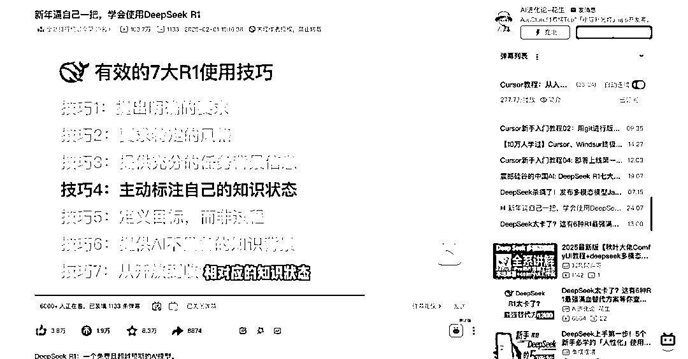

但是最近他们用户量增长太快了，又受到了网络攻击，所以你这几天使用 DeepSeek app 时，你最常看到的可能是这样的画面。

好在…DeepSeek
R1 是个开源模型，不像某 closedAI，deepseek 向大众开放了模型权重文件的下载，允许所有个人和组织自己在本地部署或使用他们的模型提供商用服务。

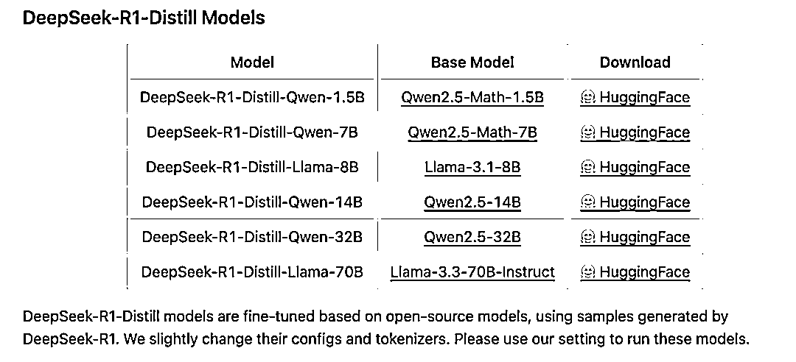

所以，除了 deepseek 官网和 app 外，你还有以下四大类使用 DeepSeek 模型的方式，包括：

1.  【不推荐，性能差】第一类：在本地部署 DeepSeek R1 蒸馏小模型：DeepSeek R1 原版模型的大小是 671B，也就是有 6710 亿参数，基本没有任何电脑能跑得起来，但他们提供了从 1.5B、7B、8B、14B、32B、70B 等多种从小小杯到超大杯的蒸馏模型，基本上只要你的电脑不是建国前买的，都至少能跑得动一个版本。但是…怎么说呢，除非你的离线使用大模型的特殊需求，或者你有某种要把模型调教成玩具的小心思，否则，我都不太建议你使用这种方式。因为学习和使用 AI 的最佳方式是用最好的 AI 模型，而不是使用愚蠢的平替版本，否则你很难对 AI 现在能帮助你做什么形成正确的认知。

2.  【推荐】第二类：使用云服务厂商提供的 DeepSeek API 服务，将它用在聊天工具产品上，比方说最近借着 deepseek 火热出圈的硅基流动，甚至他们也因为用户量增长过快而遭遇了服务不稳定的问题。除了他们之外，其实国内主流云服务厂商基本都部署了 DeepSeek r1 模型并提供 API 服务，比如腾讯云、阿里云、华为云、火山引擎。而国外最大的两个云服务巨头，分别和 OpenAI、Anthropic 眉来眼去的微软 Azure、亚马逊云其实也上了 DeepSeek 的 API。这确实是目前还不错的，你可以考虑的低成本替代方式，但在视频最后我会告诉你，其实你可能错过了 API 真正最有价值的用法。

3.  【不推荐，太贵】第三类：其实，除了在云服务厂商那直接买 API 之外，你还有的一个方式是，找他们租 GPU，在云服务器部署 DeepSeek R1 满血大模型，这能让你真正获得稳定的、独有的个性化服务。唯一的问题是，要租一个能 6710 亿参数大模型的服务器，一年每个几十万成本可能下不来，所以…这部分我这就不教了。

4.  【强推】第四类：是我真正推荐的，那就是使用第三方整合嵌入了 DeepSeek R1 的产品：典型的有 AI 搜索类产品 Perplexity、Metaso，AI 编程类产品 Cursor、Windsurf，AI 产品聚合工具 Monica 等。

接下来，我会详细向你推荐和介绍这 5+1 个产品，让你知道他们各自的优劣势是什么，有什么样的特点和适配的使用场景。

### 1、Perplexity[​](https://www.bookai.top/deepseek/pingti#1perplexity)

Perplexity 是一个以替代 Google 为目标的 AI 搜索产品。他们是 2024 年增长最快的 AI 独角兽之一。在 deepseek
R1 出来之后，他们的印度 CEO 是硅谷最早出来夸赞 R1 的突破性创新价值，以及把 R1 融入到自己的产品中的。

他们的产品体验非常丝滑，把资料检索的能力和 R1 的思考能力融合得非常好，是我最早使用的接入 deepseek r1 的产品之一。

访问方式：[`www.perplexity.ai/`](https://www.perplexity.ai/)

在使用他们产品的使用，你可以注意的一个小细节是，他们检索英文语料，包括 YouTube 资料的能力非常强，所以如果你想找外网资料的话，可以在 prompt 里要求他使用英文进行检索再用中文总结。

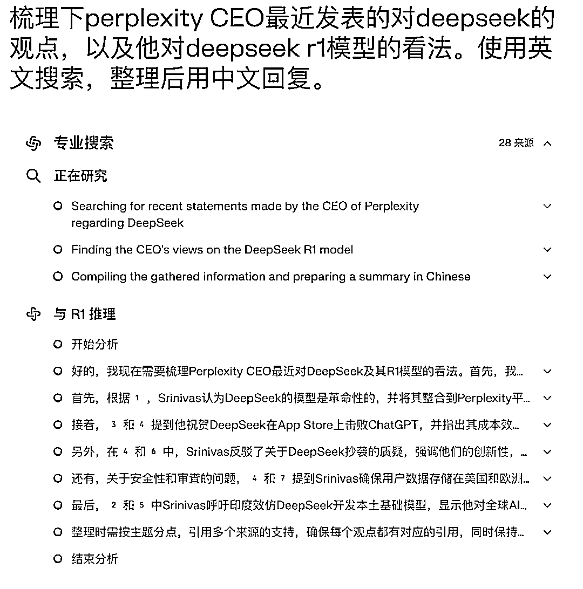

不过 Perplexity 比较小气的是，如果你没有成为付费会员，每天只能使用 5 次 R1.

### 2、Metaso[​](https://www.bookai.top/deepseek/pingti#2metaso)

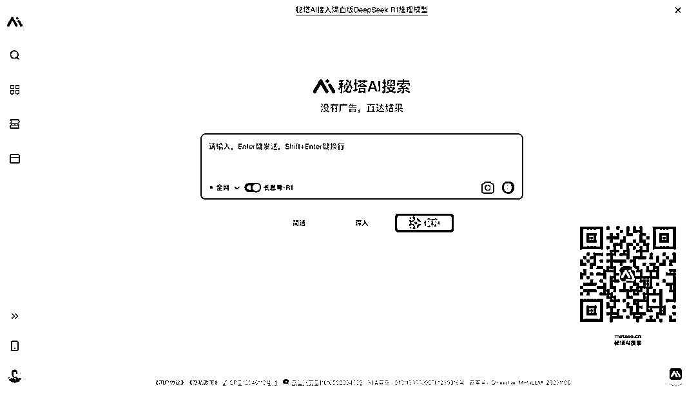

接下来，我们要介绍下 Perplexity 的中国版——秘塔搜索。秘塔搜索比较赞的是每个用户每天可以免费使用 100 次的 R1 推理。而且他们在中文语料的搜索和查找上做得会比 perplexity 更好。而且有不错的「深入」以及「研究」两种特色的回答模式，可以让你获得一个很长很完整的回答，特别适合用于搜集整理资料。

访问方式：[`metaso.cn/`](https://metaso.cn/)

比方是，我让他总结我开发的「小猫补光灯」app 的相关时间线，我看了下他梳理得就非常准确。

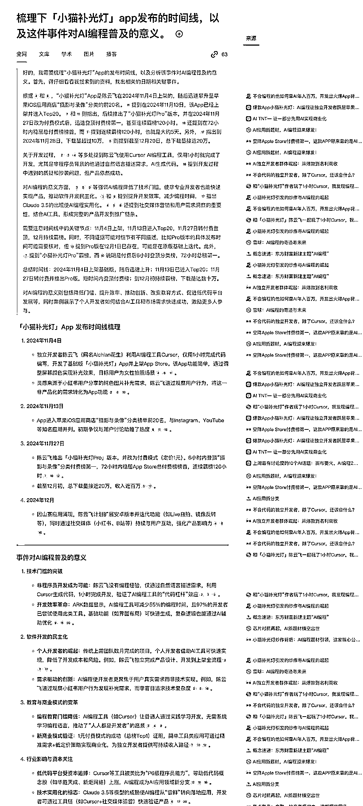

### 3、Cursor[​](https://www.bookai.top/deepseek/pingti#3cursor)

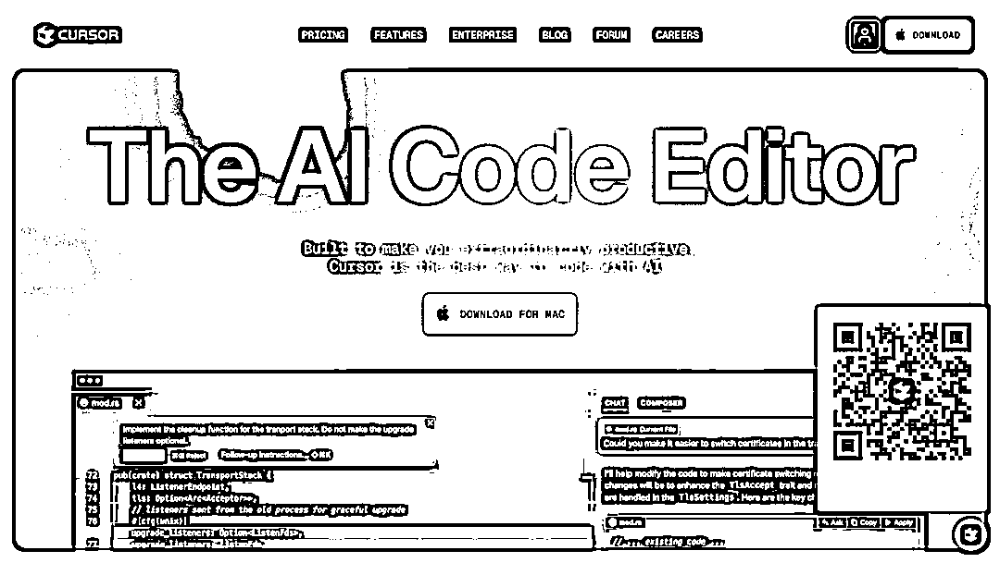

第三个：是 Cursor。看到这个界面你可能有些懵，因为这是个 AI 编程产品，且你需要下载客户端才能使用。

访问方式：[`www.cursor.com/`](https://www.cursor.com/)

但，这个产品不止可以编程，我其实在半年前就做过视频介绍，它也是最好的 AI 写作工具。而现在它也接入了 deepseek
r1 和 v3 模型，你不止是可以用里面的 r1 模型来写代码，用来进行问答或者写东西都是完全可以的。

甚至，你写完的东西，它都能非常格式化、结构化地直接帮你创建，并保存为本地文件了。

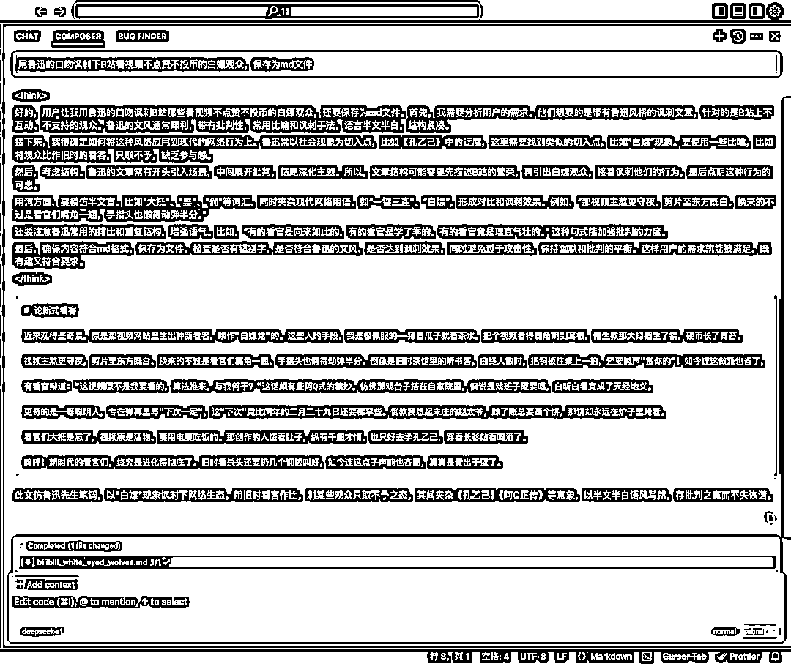

相比 perplexity 或秘塔搜索是嵌套在一个搜索引擎之后的，使用 Cursor 写作时，你联网，或者不联网都没有任何问题。

Cursor 会给新注册用户提供半个月的免费会员权限，这个时间长度我估计差不多够帮你度过等待 deepseek 服务恢复的漫长岁月的。

### 4、Windsurf[​](https://www.bookai.top/deepseek/pingti#4windsurf)

第四个：Windsurf。Windsurf 和 Cursor 类似，都是 AI 编程工具。所以他们的特点是相似的，你可以分别各薅一次羊毛。

访问方式：[`codeium.com/windsurf`](https://codeium.com/windsurf)

### 5、Monica[​](https://www.bookai.top/deepseek/pingti#5monica)

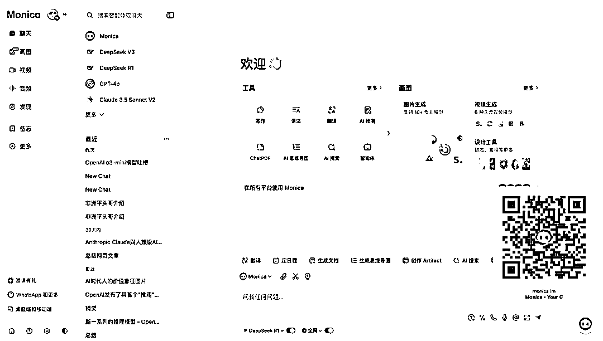

第五个：Monica。Monica 你可以理解为是一个聚合型的 AI 百宝箱，里面什么模型、什么工具都有。安装了他们的 Chrome 插件后，你可以在 Google 搜索时，看 YouTube 视频时，甚至访问 GitHub 代码仓库时都获得总结和帮助。

访问方式：[`monica.im/invitation-affiliate?ref=nmjkm2e`](https://monica.im/invitation-affiliate?ref=nmjkm2e)

而他们现在也介入了 DeepSeek R1 模型，免费用户每天有 40 次的 R1 使用权限，基本上够满足需求的，而且，你想联网或者不联网使用都是可以的。

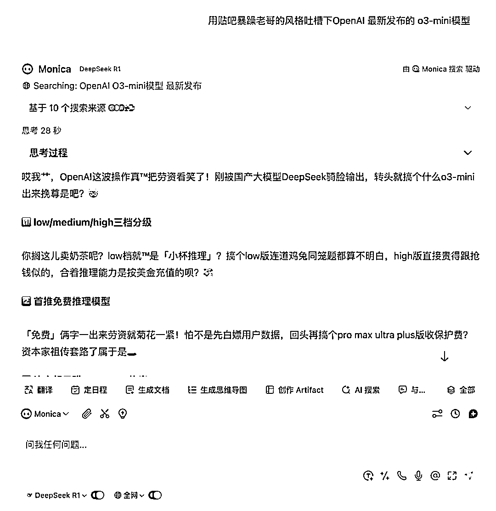

6、我开发的 deepseek 伴侣[​](https://www.bookai.top/deepseek/pingti#6 我开发的 deepseek 伴侣)

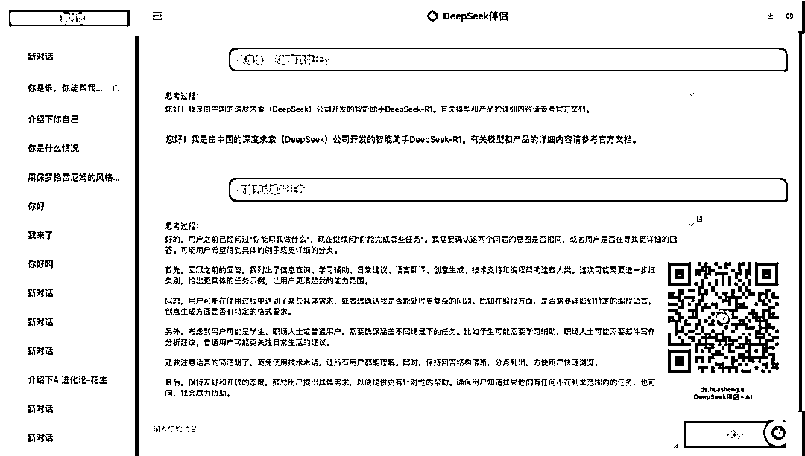

最后，再给大家介绍下我作为一个不会写代码的开发者，用 DeepSeek R1 和 Cursor 花了 4 个小时时间开发的网站：deepseek 伴侣。

访问入口：[`ds.huasheng.ai/`](https://ds.huasheng.ai/)

你可以简单地把理解为一个免费的套壳网站，打开后，你去硅基流动申请一个 api 密钥填入，然后就可以很轻松地开始对话了。现在硅基流动给每个新用户提供的 14 元免费额度，应该够你用个 10 天半个月的。

硅基流动 API 申请：[`cloud.siliconflow.cn/i/FuAPK085`](https://cloud.siliconflow.cn/i/FuAPK085)

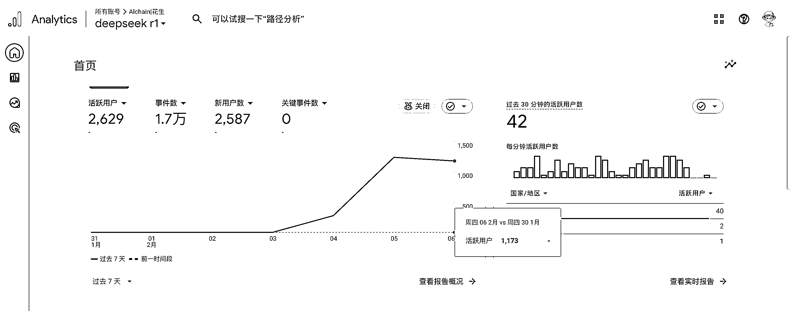

这个简单到甚至有点简陋的套壳网站，在发布次日，日活就突破 1000+了，你可以想象下现在 deepseek 的流量有多可怕。

不过，等等。

deepseek 让很多人了解到了还有 API 这回事，但其实把 API
key 填入到一个 chatbot 聊天机器人中实在不是一个 API 使用的最佳实践。API 的真正价值是让你可以批量化、流程化地去调取一个产品的服务。举个例子来说，我刚刚就用 Cursor+R1 模型，写了一个调用 R1
API 批量写脱口秀段子的脚本，这样即使我睡觉的时候，它还在孜孜不断给我写内容呢。

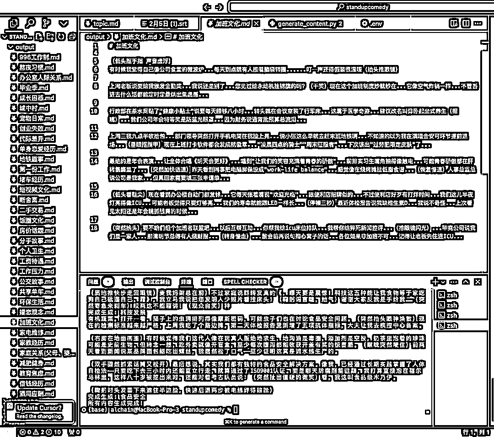

如果你也不会写代码，但是对如何通过 AI 编程的方式去创造产品，或者类似这样写小脚本去提升自己的效率的话，都欢迎去看我们之前 Cursor 航海的教程。

* * *

评论区：

离心之巅 : 请问 cursor 里没看到有 deepseek-R1 这个选项是怎么回事呢

AI 进化论-花生 : setting 里去勾选

💄Rita : 新手表示看不懂咋办

💄Rita : 从哪里可以学起。

AI 进化论-花生 : 看我 B 站视频去吧

离心之巅 : 好的，谢谢