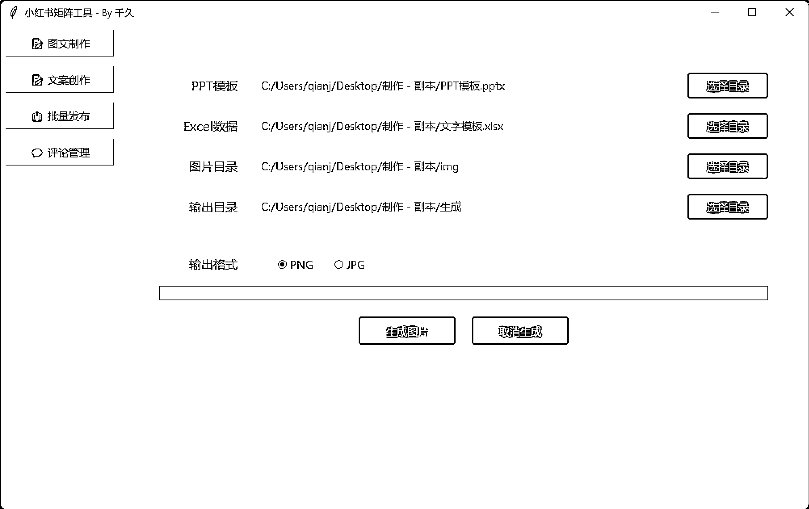

# 如何通过 Cursor 编写小红书图文批量生成工具

> 原文：[`www.yuque.com/for_lazy/zhoubao/ng1vnunrkp5xrdqw`](https://www.yuque.com/for_lazy/zhoubao/ng1vnunrkp5xrdqw)

## (20 赞)如何通过 Cursor 编写小红书图文批量生成工具

作者： 千久

日期：2025-02-06

大家好，我是千久！不懂编程零基础开发各种小工具，今天分享一下这款小红书图文批量生成工具的 Cursor 制作流程，制作这个工具的难度其实并不大，但很容易在调试的过程中陷入死循环！原因是 Cursor 在制作这个工具的时候，会有两种方法！一种是通过内置的 Python-
pptx、容易导致文字样式不精确，而另外一种是通过 PowerPoint 使用当前电脑的 PPT 打开软件，在隐藏执行窗口调试中容易陷入死循环。

首先我们梳理一下这个工具的工作原理：

1. 通过制作通用的 PPT 模板（图片、文字、背景）

2. 用 PPT 的窗格属性来设置固定参数

3. 用 Excel 表格来匹配窗格名称

4. 通过 Excel 表格内容控制 PPT 模板进行批量生成图片

具体内容可以移步至飞书：[`si7o8nqh3o3.feishu.cn/docx/WfFYdKhNjoqXcFxA3ZBccSJPnNf?from=from_copylink`](https://si7o8nqh3o3.feishu.cn/docx/WfFYdKhNjoqXcFxA3ZBccSJPnNf?from=from_copylink)

* * *

评论区：

夜未澜 : 感谢分享