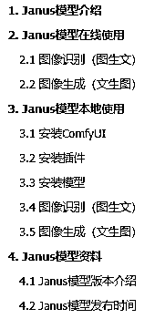

# Deepseek Janus 模型：本地+在线使用保姆级教程，图像生成与图像识别，小白轻松上手！

> 原文：[`www.yuque.com/for_lazy/zhoubao/ea5r0veib4u9y2ew`](https://www.yuque.com/for_lazy/zhoubao/ea5r0veib4u9y2ew)

## (15 赞)Deepseek Janus 模型：本地+在线使用保姆级教程，图像生成与图像识别，小白轻松上手！

作者： 来来

日期：2025-02-05

Janus 是深度求索（DeepSeek）公司开源的多模态大模型，主打 AI 图像生成与 AI 图像识别，支持文生图、图生文等多模态交互，属于其 AGI 技术布局中的关键产品之一。**（简而言之：一个能画图、能识图、开源可定制的 AI 模型）**

**2025.01.27** ：Janus-Pro 发布，这是 Janus 的高级版本，显著改善了多模态理解和视觉生成。

**2024.11.13** ：JanusFlow 发布，这是一种新的统一模型，具有用于图像生成的整流流。

**2024.10.23** ：VLMEvalKit 中添加了用于再现论文中多模态理解结果的评估代码。

**2024.10.20** ：Janus-1.3B 发布

**飞书文档：**[`duuxkmjwsy.feishu.cn/wiki/Ra5rwLRg8i5UtLkwdnCcjzSWnrf`](https://duuxkmjwsy.feishu.cn/wiki/Ra5rwLRg8i5UtLkwdnCcjzSWnrf)

**文章目录：**

* * *

评论区：

暂无评论