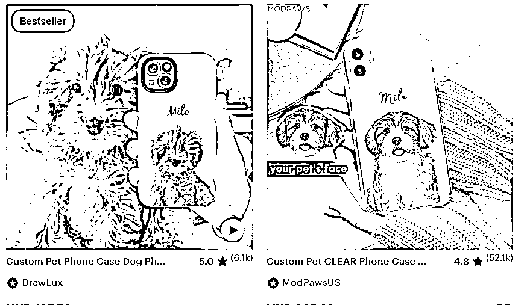
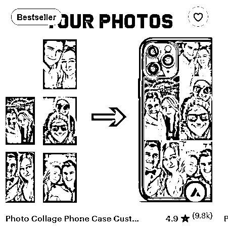
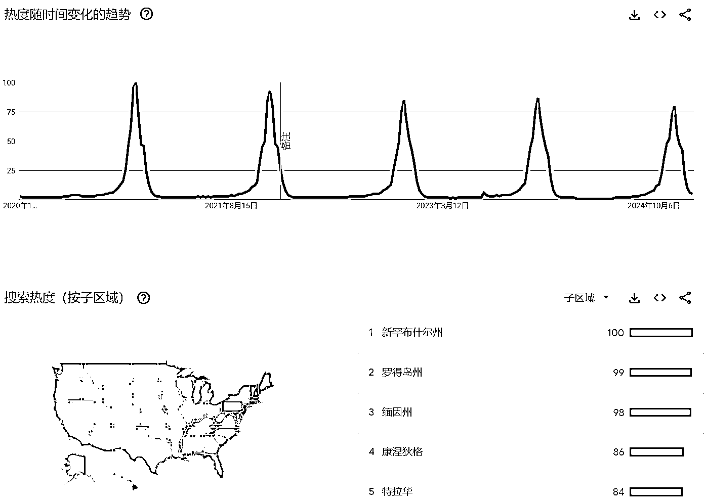

# Etsy 小众跨境电商，新手还能入局吗？过来人告诉你

> 原文：[`www.yuque.com/for_lazy/zhoubao/ah63iwzgpco7ytts`](https://www.yuque.com/for_lazy/zhoubao/ah63iwzgpco7ytts)

## (精华帖)(112 赞)Etsy 小众跨境电商，新手还能入局吗？过来人告诉你

作者： 希声

日期：2025-01-28

嗨咯，我是希声，我们团队主要做 shopee、独立站和 Etsy。

因为最近星球上和 Etsy 相关的风向标较多，所以生财的运营邀请我来做一个 Etsy 的科普，并对一些大家可能关心的问题做一个全面的解答。

我是在 2021 年注册的一个大陆的 Etsy 店铺，后来一直没有运营。

在 2022 年的 3 月，我开始正式运营这个店铺。

在 2022 年 3 月，我的销售额是 636.9 刀，4 月的销售额是 3029.8 刀，4 月的推广成本是 1110.41 刀。

算下来，4 月的净利润是 1919 刀。

因为是虚拟品，无运输和其他费用，一个月也有万把块的净利润了。

后来到 5 月，销售额是 8875 刀，去掉广告费等费用，利润大概在 3 万。

因为我当时写过 3 篇关于 Etsy 的复盘文章，所以我会有清晰的数据记录。

后来店铺运营稳定之后，我就比较佛系了，把店铺交给了一位运营，自己去做其他的事情（因为同时也在做 shopee 和独立站，时间不够），一直到下半年，因为一个朋友的加入，我们开始合伙并尝试放大这个业务。

当时我主要负责研究开店和店铺运营，合伙人负责团队管理和选品。

前后折腾了大概有半年左右，开了上百个店，也组过十多人的团队，我也系统地整理了很多资料，目的就是希望一个新手运营进来可以最快地了解并上手这个平台。

但最后的结果并不好，我们是以亏损状态结束了这个业务。

核心原因就一个：店铺被封得太凶了，开店速度赶不上封店的速度。

我们不停地开，不停地被关店，后来放弃合作直到现在，我们的店依然被不停地关，截止到现在，还能运营的店铺只有个位数了。

虽然我们合伙做的 Etsy 业务是亏损的，但是不再开新店铺之后，大多数店铺都是盈利的——包括我最早开的大陆店铺一直都是盈利的。

**所以哪些人适合入局 Etsy？**

如果你有海外的朋友或者亲戚（因为需要使用他们的资料和银行账户来注册店铺），如果你的有一些小众独特的产品供应链，如果你的电商经验并不丰富并且只想赚一点小钱（比如一个月几万的水平），那么 Etsy 是非常适合的。

**哪些人不适合入局 Etsy 呢？**

没有海外资源开店的，想通过买店来做这个平台的，想赚大钱的（Etsy 的天花板远没有亚马逊那么高）。

为什么我会这么建议，以及大多数人关心的对于 Etsy 的开店的具体要求和封店原因，我在下面的内容逐一分析。

**以下是这篇文章的简单大纲：**

Etsy 是什么平台？有什么特点？怎么收费？_

Etsy 上允许销售的产品展示 _

Etsy 的优点和缺点是什么？_

Etsy 开店所需的材料是什么？如何注册不被封？_

Etsy 如何选品？有哪些选品渠道？_

Etsy 的主要流量来源和运营思路 _

Etsy 如何发货和选择物流服务商？_

Etsy 货源哪里找？_

我的 Etsy 运营经验分享 _

Etsy 的其他问题 _

一些祝福 _

# 一、Etsy 是什么平台？有什么特点？怎么收费？

## Etsy 是什么平台

Etsy 于 2005 年在美国创立，是一个专门为独立**设计师、手工艺者、艺术创作者以及古董收藏卖家** 打造的在线交易平台。

和亚马逊、eBay 不同，Etsy 主打的商品多为**手工、个性化、定制化** 或富有创意的生活方式类产品。

平台买家以欧美地区为主，女性占比较高，消费者大多比较注重产品创意、品质与独特性。这些买家更倾向于购买个性化、定制款、手作感强的产品。

平台数据（截至 2024 年最新）如下：

活跃买家数量：超过 9600 万人

活跃卖家数量：660 万+

2024 年第二季度营收：6.478 亿美元；平台交易总额(GMS)：第二季度达 25 亿美元

## 消费者选择 Etsy 的主要原因

消费者来到 Etsy 主要是为了寻找非大规模生产的手工商品，更注重商品背后的故事性和手工制作的价值。

所以 Etsy 一直是消费者作为**礼品需求** 的热门平台，消费者会认为这里的定制化礼品能更好地表达送礼心意，在节日（如圣诞节、母亲节等）的时候，销量会明显上升。

## Etsy 开店收费吗？有哪些费用组成？

以前 Etsy 开店是免费的，但是后来风控加强，开设店铺不再是完全免费的。

平台现在对新店铺收取一次性的费用（Setup Fee），金额在 15-29 美元之间，具体取决于卖家所在地区，目的是验证卖家身份。

Etsy 主要收取三类基础费用：

1.商品上架费/Listing Fees，每个商品需支付 0.20 美元，有效期为 4 个月，售出后如果设置自动重新上架则会再次收取。

2.交易费用/Transaction Fees，平台会对每笔订单收取 6.5%的费用，这个费用基于商品价格和运费的总和计算。

3.支付处理费用/Payment Processing Fees，对于国际卖家，使用 Etsy
Payments 时需要支付订单金额的 4%加 0.30 美元固定费用；美国卖家则是 3%加 0.25 美元。

除了基础费用外，还有一些额外费用：

1.如果使用 Etsy Ads 进行平台内推广，费用是根据点击量收取；

2.对于年收入超过 1 万美元的卖家，会强制加入 Offsite Ads 计划，成功销售时需支付 12-15%的广告费。

3.另外，如果涉及货币转换（比如商店货币与买家支付货币不同），还会产生 2.5%的转换费用。

# 二、Etsy 上允许销售的产品展示

## Etsy 主要允许销售的三大类产品

1.手工制作产品（Handmade）：必须是卖家自己制作或设计的商品

2.复古/古董商品（Vintage）：至少 20 年以上的物品

3.手工艺用品（Craft Supplies）：用于创作的材料和工具

常见的产品类型如下：

独特的手工艺品：包括珠宝首饰、个性化定制商品、艺术品

家居装饰：手工制作的家具、装饰品、壁画等

个性化礼品：定制贺卡、纪念品、个人用品

DIY 材料：手工艺创作材料、工具、配件

除了上面提到的这些常规产品，Etsy 和其他平台最大的产品区别还包括：

可以销售虚拟产品，可以销售定制类型产品，还可以销售卖情趣用品（对，就是你能想到的那些）。

因为这个平台的独特调性，所以也让这个平台成为了一个很不错的**选品平台。** 许多做亚马逊的，做速卖通等其他平台的运营，都会习惯到这个平台寻找选品灵感。

下面我会罗列出一些常见的，也包括些有意思的，独特的产品，让大家感受一下这个平台的独特性。

## 定制类型的产品

许多日常的产品，其实都可以定制，比如下面这个，是刀叉的定制。

用处是什么？可以送礼，也可以用在婚宴上面。

或者下面这个斧头，感觉就很粗鲁，和定制好像没啥关系。

但是可以在木柄上面，或者是包装壳上面定制。

当然，在这个平台定制类型下面，销量最牛的还是首饰的定制。

比如这种最常见的，英文字母的首饰定制。

把名字或者祝福定制在项链，吊坠，耳环上面。

而除了以上这些，还有的就是比较常规的定制了。

比如徽章，胸针，衬衫，水杯，包包，图片，衣服，玩偶，卡片，插画等等。

看多了你就会发现一个真理：万物皆可定制。

定制是一个很大的类目，而且可玩性很大。

写到这里，延伸一下，提供一个系统化的定制和营销思路。

我们在做定制产品，最常见的定制思路是什么？

大概就是客户提供一张照片，我给你打印上去。

这种是最常见的，但也是竞争最激烈的。

在此基础上，可以延伸的思路可以是：

**图片定制**

**图片+文字定制（客户提供一句话，或者名字，日期等）**

**拼图**

**图片+风格化处理（动漫化，线条化，黑白色，彩铅风格，辛普森的风格等等）**

**图片+特定模板**

比如最常见的手机壳，根据上面的思路，就可以找到许多新的定制思路。

**图片定制**

**图片+文字定制**

**拼图**

**图片+风格化处理**

 images.zsxq.com/FsodCNrLsOBRyP04_531KvCbqOKs) images.zsxq.com/FpQJC7G1sTU7-E5LepOcJwVGKg2j)

 images.zsxq.com/FqRsShBLYQgennf9_XT5rqKnP4W5) images.zsxq.com/FioF-Rj65BKa7jxa4Gr07kW70pX_)

**图片+特定模板**

 images.zsxq.com/FnSqB7pGfa9uiGVI5eBSjHnQOr1_) images.zsxq.com/Fmsq3OMkTpVH7E9CcCaXwteCMAxG)

## 虚拟产品

虚拟产品指的就是不需要发货，客户下单之后，可以直接下载的产品。

判断一个产品是否是虚拟产品，最简单的方式就是看 listing 下面的图标，是否带有 digital download 标志。

最常见的就是各种模板。

比如 Instagram 的贴文模板。

 images.zsxq.com/FmIQBvNHpvWmAUV2TZwsUFxWM0N_) images.zsxq.com/FntNPhmxljUtseeD8VuZ9JDhY1B8)

PPT，Excel 模板。

或者是直接卖课程，教程。

也可以是卖设计图纸。

比如刺绣的图纸或者教程。

 images.zsxq.com/Fnk4ZwSbqKYwesFsLB6I4MiSwBJN) images.zsxq.com/Fl-D8rDsLrU9Wn7Os_gkswTZFVIM)

狗屋的设计图纸，老外就是这么喜欢自己动手（毕竟蓝领的费用实在是太高了）。

## 成人情趣用品

成人情趣等用品，比如各种小玩具（包括电动的），娃娃之类的，这种我就不展示产品图了……

你可能会困惑，一个电动的玩具难道也算手工艺产品吗？

后面我会给出解释。

## 独特有趣的产品

**植物瓜果。**

当然，这类产品必须本土发货，不然海关就可以给你扣下来。

**标本，或者是标本+机械。**

 images.zsxq.com/FuBP2GO7chLjfmChXqR79JWEjyPc) images.zsxq.com/FhYktf27renLKNXrjlpVfogYtuB8)

**mini 生态系统。**

带有苔藓+流水系统的漂亮摆件。

**独特的摆件。**

比如下面这样的。

还有些更加重口味的，甚至让人感到不适的，恶心的雕塑或者摆件产品，都是有需求的，而且客单价一般都很高，具体图片我就不放了。

**手工+环保类型产品。**

比如这个用马蹄钉做的装饰件，全店也卖出了一万多件。

把旧物改造，以环保之名，老外很吃这一套。

# 三、Etsy 的优点和缺点

## Etsy 的优点

**1.客单价高，利润高。**

手工艺产品的定价普遍较高，而且因为是与众不同的东西，消费者价格敏感度相对主流电商平台更低。

比如以这个常见的苹果手机壳定制的产品来看。

产品售价 243 港币，大概 226 人民币，而我们如果在 pod 网站上面定制并发货到美国，总费用是 38.71。

简单扣除一下，毛利润是 187.29，毛利率大概是 82%。

 images.zsxq.com/FrmUztkhfGNPbP1y9hZUpfSjKE8j) images.zsxq.com/FspTZC7_uHZEMgS7TBlnJhBk5vAq)

再看一款同样是非常热销的产品——字母手链定制。

平台上的售价是 160 港币，也就是 148 人民币，拼多多的定制价格是 10 元，算上 30 元的国际物流费用，毛利润大概是 108，毛利润率是 72.9%。

 xU8I3Co6SW9WBUL) yoHVm0nu37xg3eMrc)

当然，做电商的都知道还要考虑广告费，平台佣金等其他成本，但即使考虑了这部分的成本（我在上面已经列举出了 Etsy 的收费标准，和其他主流平台对比来看并不高），利润依然是很可观的。

**2.竞争相对没那么激烈。**

虽然近两年 Etsy 上的卖家数量有所增加，但整体和亚马逊、eBay 相比，竞争程度还是相对可控，尤其是细分市场中的“小众产品”、“定制化产品”。

**3.后台简单，新手好上手。**

后台非常简单，用半天的时间就可以了解完。广告系统也很简单，可操作的空间很小，对于新手非常友好。

**4.回款快。**

一般订单完成之后 3 天就可以收到平台的打款，在后台还可以设置每天，每周或者每个月自动回款。

**5.物流时效要求低。**

因为平台上有许多定制的需求，所以物流的发货时效是可以自己设定的。

比如我们运营的是美国地区的店铺，可以设置发货时效是 14 天。

当客户下单之后，我们可以在国内采购，然后通过小包物流公司发到美国（一般一周就可以收到），然后把包裹在美国当地的单号（当包裹到达美国之后，会更换为美国当地的物流公司）填写到 Etsy 到后台，那么客户看到的就是美国的物流轨迹。

**6.注册要求简单。**

只需要个人证件+银行卡+信用卡+邮箱，就可以注册店铺。

**7.一个店铺卖全球。**

Etsy 不分地区，一个店铺就可以卖向全球的消费者。只要是消费者可以在 Etsy 上注册账户，就可以买到来自任何地区商家的产品，区别只是运费的不同。

## Etsy 的缺点

**1.对产品要求高。**

Etsy 的审核机制较严格，对于产品的原创性、版权合规和定制化元素有明确要求。普通的代发货或非原创产品，容易面临被下架或关店的风险。

而且在前面罗列的产品里面，我们也可以看到，一个产品是否符合 Etsy 平台的定义标准，有时是很难鉴定的。

风控强的时候，很多卖了多年的老产品也会因为不符合要求被下架，而一旦被平台下架的 listing 数量过多，就可能导致店铺被风控甚至封店。

比如我们打开 1688,，上面常见的大多数产品，其实都不适合在 Etsy 上面售卖。

即使是最常见的服装，想在 Etsy 上面售卖，要么是走定制路线，要么就是服装的设计很独特小众，最好是原创的服饰。

直接搬运产品和图片到这个平台上去，是一件风险很大的事情。

**2.天花板低，订单量不如大平台。**

相较于亚马逊、eBay 等通用平台，Etsy 专注手工创意细分市场，虽然买家对产品价值认可度高，但平台整体销量、订单量相对有限。

**3.最大的缺点，不支持大陆信息注册店铺。**

早期 Etsy 是支持大陆店铺的注册，后来在 2021 年 4 月 26 日，Etsy 平台关闭了中国大陆卖家的入驻通道。

除了大陆的资料（比如香港资料是可以的），绝大多数常见的国家和地区的资料都是可以注册的。

具体可以看官方的资料：[[`help.Etsy.com/hc/en-us/articles/115015710408-Countries-`](https://help.Etsy.com/hc/en-us/articles/115015710408-Countries-) Eligible-for-Etsy-Payments]([`help.etsy.com/hc/en-`](https://help.etsy.com/hc/en-) us/articles/115015710408-Countries-Eligible-for-Etsy-Payments)

在这个资料里面看到 china 的选项不要惊讶，主要针对的还是以前已经注册好的中国店铺。

# 四、Etsy 开店需要什么资料？如何注册不被封？

## Etsy 开店所需材料

开店需要的材料如下：

证件照片、邮箱、电话、地址信息、付款卡、收款账户、手机验证器软件、产品照片、ip、环境。

下面详细说明。

证件照片，主要指的是 Etsy 允许注册的国家/地区的个人证件信息，一般是驾照或者护照。大陆身份在其他国家留学的证件一般是不行的，如果对你的证件能否注册有疑虑，可以直接咨询 Etsy 客服。

邮箱，只要使用国外的邮箱即可。

电话，一个国外的电话，但是不需要接收验证码，只要填写进去即可。

地址，一个真实存在的住址即可。

付款卡，也就是信用卡。建议使用海外的信用卡，不要使用国内的信用卡或者服务商批量开设的虚拟信用卡。通过每张信用卡的卡头，是可以直接查到卡片类型和发卡机构的。

收款账户，也就是银行帐户。建议使用海外的真人银行账户，不推荐使用服务商（比如 pingpong，万里汇等）批量开设的虚拟银行账户。

手机验证器，用在注册的最后一步做验证，使用谷歌或者微软的验证器即可。

谷歌的叫 Google Authenticator，微软验证器的名字叫 Microsoft Authenticator。

产品照片。

这是非常重要的一点，但是很容易被大家忽略。

因为 Etsy 明确表示了，这是一个手工产品和复古产品的平台。所以我们的产品照片必须能够突显这一点。

注意，**不是我们自己判断产品是否符合标准，****最重要的是要拍得让 Etsy 官方知道我们的产品是符合标准的。**

那么最简单的办法就是能把产品的制作过程拍下来，然后作为上传。

同时，最好保留一份产品制作视频，有利于后期触发审核时申诉。

IP，也就是网络。推荐用当地的网络，不推荐在任何 ip 服务商那边购买，许多 ip 的质量是不行的。

环境，也就是注册过程中的环境。一般推荐使用本地电脑，如果是在大陆的电脑，推荐用指纹浏览器隔离信息（因为我们自己的电脑语言一般是中文）。常见的指纹浏览器比如 adspower，比特浏览器或者 Hubstudio。

## Etsy 如何注册店铺才不会被封？

每个平台都有一套风控系统，风控系统的背后我们可以简单理解为是一套欺诈值打分的系统。

我们的资料（证件资料，ip 地址，信用卡等），我们的操作行为等等，都会被计入这个打分系统，如果越不像个“正常人”，那么我们的欺诈分数肯定就越高。

而当这个欺诈分数达到某个临界值时，Etsy 就会封店了。

Etsy 平台这套欺诈值打分系统是怎么计算的，我们永远无法得知，但是我们能做的就是在每一个细节上面，越接近一个“正常人”，努力降低这个分数，那么店铺就会越稳定。

比如我是一个美国人，我要注册一个 Etsy，“正常人”的操作应该是：

打开家里的电脑（用的是美国的电脑环境和美国干净的住宅 IP），上传自己的证件资料，用自己的信用卡作为付款卡（不是虚拟信用卡，卡段用的人少，所以真实性高），用自己的银行卡作为收款卡（不是虚拟银行账号，卡段用的人少，所以真实性也高）。

一句话总结就是：风控是一个概率问题，不是简单的“是”或者“不是”的问题。

## 我想要有个稳定的 Etsy 店铺，最靠谱的操作是什么？

对于在中国大陆的人来说，想有一个稳定的 Etsy 店铺，最靠谱的操作就是找一个海外的朋友或者亲戚合作，用他的电脑，他的资料还有他的银行信息来注册账户。

这种合作的弊端主要有三个：

1.钱是先收到合作伙伴的卡里面，需要他再转给你，一来比较麻烦，二来会有汇损。

2.如果对方不靠谱，可能做大之后卷钱跑路。

3.欧美等地区会有税费产生，如果是合作模式，一般税费需要我们来承担。而且如果对方的收入不高，他不一定愿意，因为当这么多收入进入他的银行账户，会损害他的一些利益（比如领不了低保）。

## 与他人合作怎么谈分成？

怎么谈看你的谈判能力了。

可以给个参考，提供资料的人一般是拿销售额的 3-5%，且不负责税费。每个月给个几百的电费和网络的费用，出单了分钱就行。

建议按照销售额分成，不推荐用利润分成。

你可以买一台二手的 mac mini 主机放在合作伙伴的家里，不需要购买屏幕。然后平时可以用“向日葵”这类远程控制软件来远程运营店铺，这种模式是最稳定的。

## 找服务商买的店铺靠谱吗？

我不知道，但是我劝你慎重。

买店铺最大的问题是，服务商用的是什么资料来注册店铺你永远不知道，这是一个黑盒。

而从人性趋利的本质来说，大概率会用一份资料去注册多个店铺……或者服务商的资料本身就是有问题的。

## 买的 Etsy 店铺已经注册一年了，靠谱吗？已经出单了的店铺，靠谱吗？

这两个问题其实是一个问题。

答案是，都不一定靠谱。

Etsy 的风控机制是动态且持续的的。

一般来说，在 Etsy 店铺注册好的第二天；以及当你出单了，在出的第一单，第十单，第三十单，第一百单，第一千单等等，这时候，Etsy 都会进行多个维度的审核（包括资料，商品信息等）。

所以如果一个店铺没有出单，那么注册时间再久，其实说明不了什么。

或者这个店铺出了十单八单，也依然不能说这个店铺就一定没问题。

## 服务商说店铺有一个月质保，封了免费换店

正如我上面描述的 Etsy 风控机制，Etsy 的风控机制是动态且持续的的。

所以如果你买了一个店，但是一个月内没出单，或者出单了没被封，都不能保证这个店是稳定的。

那么给你再更换一个店，有啥意义呢？

## 注册海外公司，然后申请 Etsy 可以吗？

大陆人注册香港公司或者美国公司，然后用香港公司/美国公司的信息去注册 Etsy，多位朋友测试过了，有的成功，有的失败，失败居多。

所以答案是，有一定的概率能成功。

所以丑话说在前头：如果你有现成的香港公司，可以去试试看，但一定要有被封的心理准备。

而且即使是这种情况下要注册，我建议你最好是已经有了海外的银行账户，海外的信用卡，还有靠谱的海外网络，不然成功率只会更低。

但如果没有香港或者美国等公司，就不要浪费钱注册一个再去测试了，毕竟成本太高了。

## 为什么必须是海外的银行账户和信用卡？

在早期风控松的时候，有许多人使用虚拟信用卡或者虚拟银行账户去注册 Etsy。

那么对于 Etsy 来说，这些虚拟信用卡或者银行账户都会有一个很显著的特点：卡头是一致的。

想象一下，我们是 Etsy，在后台监测到有大量的注册信息，而这些注册信息的资料都是有问题的，且信用卡和银行账户的卡头高度一致。那么 Etsy 就可以把这个卡头记录下来，作为一个风险点，当以后有人注册店铺用到类似的卡头，就可以直接把他封了。

## 我没有亲戚在国外，我有啥办法弄一个稳定的 Etsy 店铺？

那就不建议做这个平台。

已经有太多人跟我反馈，找了很多服务商买了很多店铺，花了好几万块钱（从几百一个店到几万一个店）辛苦弄了几个月，最后封干净了。

这个平台真的是封店最凶的一个平台了，为了防止钱，时间两空，何必强迫自己呢？

## 为什么我是自己做的产品，自己拍摄图片，出单后还是被封了？

店铺开始稳定运营之后，除了资料问题之外，被封店最大的问题一般都是产品不合规导致的。

但并不是说只要产品合规了就一定不封店，还有可能导致封店原因如下：

1.订单短时间激增；

2.过多订单未发货；

3.客户投诉，侵权造假；

4.差评过多；

5.没有支付平台费用；

6.资料、运营环境不合格。

是的，即使你店铺已经在稳定运营了，Etsy 还是可能会随时查看我们的资料和环境，或者要求我们提供更多资料来验证，只要他们觉得风险过高，就有可能封店。

## 我的店铺运营一段时间了，也出单了，是不是就稳定了？

有许多人开了 Etsy 店铺，卖一些淘宝，1688 上面的普通产品，运营一段时间之后，店铺就封了，然后跑来问我为什么？其实一般都是产品问题。

Etsy 这个平台有个最大的特点就是会不定时检查产品的合规性。

什么是产品合规性？就是要符合这个平台“原创、手工”的定义。

那“原创、手工”又该怎么界定？

答案是没法界定，看 Etsy 审核人员的心情，毕竟这个店铺上还有卖家在卖蔬菜的呢…

不开玩笑了，正经回答是：

第一，这是个很主观的定义，因为我们都不是 Etsy 审核人员，所以我们怎么认为并不重要，重要是 Etsy 审核人员怎么认为。

第二，我们要做的就是，能自己拍图就自己拍图。不要盗用平台上的图片，不要直接搬运淘宝 1688 等图片，如果搬运，至少要二次创作。

所以这还是个风控问题，而不是“是”和“不是”的问题。

风控的意思就是说，没有百分百，但只要你做到了尽可能接近平台的要求，店铺活下来的概率就越高。

## Etsy 这个平台可以 S 单吗？

不推荐这么干，容易把店铺干没了。

# 五、Etsy 如何选品？有哪些选品渠道？

## **选品原则**

选品的四个要点：符合平台调性 + 差异化 + 数据验证 + 合理定价

**符合平台调性：** Etsy 上的买家普遍偏爱原创设计、个性化定制、具有手工痕迹或文化特色的商品。

**差异化：** 产品最好要和同类产品有区别，如果风格设计不一样那最好，可以避开竞争（当然也有风险，可能用户并不买账）。

如果产品比较同质化，可以在不同维度做差异化。

比如同行是单件销售，我们可以做组合销售，又或者可以在产品的包装上面下功夫，提供定制选项等。

**数据验证：** 在选中产品之后，最好用数据来验证一下市场的需求和竞争情况。

在后面我会介绍一些常见的 Etsy 数据分析工具。

除了 Etsy 的数据分析工具，Google
Trends 也是一个很好的工具，可以对产品关键词的搜索量和趋势进行调研。如果某类关键词热度不断上升或有季节性高峰，说明有潜在需求。

**合理定价** ：产品选好之后，一定要计算一下我们的利润，而且一定要是扣除物流费用之后的利润。

计算物流费用的时候最好自己手动测量一下打包后产品的尺寸和重量，然后在物流服务商的软件上面测算一下发往主要发达国家的运费是否在自己的承受范围之内。

这里有一个简单的费用计算工具，但是不包含物流费用。

[`www.alura.io/resources/Etsy-fee-calculator`](https://www.alura.io/resources/Etsy-fee-calculator)

## 选品的主要渠道

### Etsy 官网

最好的选品渠道一定是官网。

通过 Etsy 官网首页的类别选项，把所有选项都看一遍过去，有助于培养选品经验和适应理解平台的产品特点。

在 Etsy 官网搜索相关关键词，看看排在前面的店铺都在卖什么、定价如何、顾客评价如何。

对热销店铺或同品类店铺进行追踪，观察其产品更新速度、风格变化。

或者对感兴趣的产品，店铺进行收藏，加购等动作，利用平台的推荐算法，源源不断地推更多类似产品给我们。

### 海外社交媒体

通过 Pinterest、Instagram、TikTok 或者是 YouTube，关注手作博主、设计类账号，了解当前流行色、风格和工艺趋势。

或者在上面搜索“handmade”、“DIY”、“Etsy gift”等关键词，看达人的分享或推荐，获取选品思路。

 images.zsxq.com/FhtC40UQqIILM1w0rucuBVRPV_5G) images.zsxq.com/FmnLzZBUZnF7CEc9cgOq0BDJZO2U)

### 数据分析工具

用 Etsy 相关的分析工具，比如 eRank/ Marmalead / Alura / EtsyHunt
等，输入感兴趣的产品关键词，查看用户的搜索量、竞争度及热门标签（tags），帮助寻找高需求、低竞争的蓝海产品。

### 国内社媒和电商平台

与海外社交媒体平台类似，可以在小红书，B 站，抖音等平台关注有趣的手工博主或者是主动搜索关键词来获取灵感。

除了社媒平台，还可以重点关注下淘宝，万能的淘宝上面有很多有趣的产品和店铺。

比如可以在淘宝首页的“全部频道”进来，选择“神店榜”，在这里浏览获取选品灵感。

### 线下渠道

除了线上渠道，还可以通过一些线下的渠道来选品。

比如当地的手工艺集市、设计展、新兴艺术博览会等，或者去那些有传统手工艺（如刺绣、木雕、陶瓷、剪纸等）的地方转转，都能提供不一样的选品思路。

## 选品过程演示

下面演示一个简单的选品过程，让大家能够更加直观地了解整个过程。

提前说明：选品是一个主观+客观的事情。

比如你一名非常优秀的设计师，对于你来说，客观数据也许就不重要，因为你很了解用户需求。

而对于大多数普通的运营人员来说，要接触大量完全不同的产品，那么就更加依赖于客观的数据。

但是数据是庞大的，我们不可能完全穷尽，所以常见的选品都是一个“主观选择+客观验证”的过程。

### 浏览 Etsy 官网并选品

假如我是一个小白，那么要选品最好就是先看官网，把自己的角色代入消费者，然后来找找感觉。

比如我们可以选择一个“家居装饰”的类目。

然后就可以开始浏览产品。

在浏览的过程里面，我们就能看到大量各色的产品，有高客单的，有低客单的，有现货的，也有定制的。

在浏览这个类目的时候，我发现了：这里面的产品，大概就是两种，一种是桌上的摆件，一种是墙上的摆件。

然后我就突然想到，之前在亲戚家里看到过他们的墙上有一个用绳子编制的挂饰品，于是我就用英文搜索“Macrame”这个关键词。

通过浏览，可以下一些简单判断：

这个产品的需求是很大的——通过点击不同的 listing，来查看他们的评价和店铺销量。

同时看到这个产品的价格跨度很大，从一两百到一两千的都有。

价格跨度大是一件好事，说明客户能接受高客单价，对于新手进入来说，能选择的方向也更多。比如是要选择普通的产品做低客单，还是选择有设计调性的做高客单。

### 关键词数据验证

然后搜索一下关键词数据，这里我以 erank 工具为例。

我们不停地往下滑，查看关建词的数据。

这里我就发现了一个不错的关键词“macrame plant hanger 挂毯植物吊架”，月搜索量有 2600，竞争度也不大。

### 官网继续选品

于是就继续回到 etsy 上进行搜索查看。

然后我看到了一些不错的品。

比如下面这个，19 年上传的，总销量一千多，7 天的预估销量是 6 件，单价一百多港币。

还有这一款，23 年上传的，销量七十多，单价四百多。

而且看得多了之后我就发现，一般带流苏的产品会更好看一些，单价也相对更高些。

### Pinterest 上选品

然后我继续在 Pinterest 上面搜索这个关键词找找产品灵感。

这么一搜，我就发现了一个不错的产品，左上角的一款带 led 灯的看起来就很不错。

### 验证产品趋势

接下来我们需要看一下这个产品的整体趋势。

看下产品的趋势是上升还是下滑，有没有季节性的爆发需求等等。

使用到的工具是谷歌趋势，这里我查询了两个关键词“macrame plant hanger 挂毯植物吊架” 和 “macrame wall hanging
挂毯编织墙饰”，选择的时间是过去五年，在美国地区。

可以看到整体的趋势并不好，是稳中向下的。但好消息是没有明显的季节性的需求波动。

虽然大趋势并不好，但是不是意味着这个产品就不能卖了？

我觉得并不是，因为我们不是一个大商家，我们只是一个小卖，我们需要的销量并不多。

所以产品的趋势向上固然好，但是向下，只要下滑得不是很严重，那么就说明需求存在，只要存在，且竞争不激烈，我们就可以分一杯羹。

同时，我也在后面的调研发现，这个产品其实可以切入多个使用场景，那么需求其实是可以叠加的。

### 寻找货源

接下来我们就可以找货源，看下国内的采购价怎么样。

我用了淘宝和拼多多的“以图识货”的功能，找到了许多同类产品。

 cL87KumvnoCRM3aM8snTkoP) images.zsxq.com/FlDGgtcoSf1uGISk0bO_CHXCaek6)

可以看到，大概的价格就是在 10-30 之间，造型越复杂，价格越高。

### 价格计算

接下来我们可以做个简单的计算，如果是普通的造型款式，采购价按照 20 来计算，再加上运费和包装，成本大概就在 50-80 之间。

所以为了保证有充足的利润，产品最好的定价应该在 150-240 左右，那么我们在对标竞品的时候，可以重点看那些单价较高的。

### 差异化思路

解决了货源之后，下一步我们是不是就可以开始上传产品了？

不是的，如果就这样直接上传产品，因为我们是个新品，没有评价没有销量，客户很难产生下单的欲望，我们就很容易陷入价格战。

所以接下来我们要整理出一些差异化的思路，才能避免我们陷入价格战，也能更快地从竞品中突围出来。

1.第一个差异化的思路是在主图方面。

一开始我在浏览产品的时候，就注意到了这两款产品。第一是他们的客单价很高，第二是我被这个主图吸引了。

和其他主图不同的是，他们的主图上面有个模特（大概率是店主），这样明显是可以提高点击率的。

所以给我的启发就是后续在做主图的时候，如果有条件，就找个模特实拍，没有条件也可以用 AI 的形式生成一个模特放上去。

2.第二个差异化思路来源于 Pinterest，我在上面看到的带有 LED 的款式。

加上这样一条灯带价格就几块钱，但是我们的溢价却可以高很多。

3.第三个差异化思路来源于国内淘宝，在上面找货源的时候，我注意到一些有意思的 sku。

有写着“不含盆”，也有“三件套”。

所以我们可以优化的 sku 思路就是，可以带着花盆一起卖（当然这样体积增大，售价必须大幅度提高，最终结果可能不一定是好的），又或者是打包销售。

把多种不同款式打包在一个套餐里面销售，这个技巧其实对于国内卖家是最友好的。三件一起卖，我们的售价可以翻一倍，成本就多了一些，溢价和优势一下子就出来了。

4.第四个差异化思路来源于 Etsy 上的同行。

同一款产品，可以有款式的不同，也可以有颜色的不同。

5.最后一个差异化思路同样来自淘宝。

可以看到，造型差不多，但是多了其他的使用场景。

 images.zsxq.com/Fsc3qmWQMWuZygWvnMRIJAm9a-VN) images.zsxq.com/Ft10RC7nAye4zA9YgC4aO65Jc_eV)

既可以拿来当猫的秋千，还可以做灯罩。

### 运营思路

整个选品过程到这里就差不多了。

接下来就是上传 listing 了。根据上面总结的思路，我们在上传产品的时候，可以在主图上做出差异化，还可以设置不同的 sku 类型（从款式，颜色）。

而且还可以把不同的产品打包销售，还可以测试带有 LED 灯饰的款式。

在店铺运营上面，我们可以根据产品的使用场景做分类。即使是同一款产品，加入不同的场景，就能覆盖不同的需求，那么能接触到的潜在用户就更多了。

# 六、Etsy 的主要流量来源和运营思路

Etsy 主要的流量来源包括四个部分：

**搜索流量、推荐流量、广告流量、站外这四个渠道。**

### 搜索流量

自然搜索流量指的是用户通过 Etsy 站内搜索框输入关键词触发，这是 Etsy 最核心的流量来源，大量买家会直接在站内搜索关键词。

运营思路：

1、Listing 的 SEO：比如标题的前 40 字符含核心关键词（如“Custom Engraved Necklace”）
，同时 listing 的描述，图片之中，都要包含核心关键词和辅助关键词。

2、标签（Tags）：可以在 listing 的文字描述中填写多个标签，可以从多个维度添加标签，比如主要关键词、长尾词（如“personalized
grandma necklace”） 或者是一些属性关键词，比如材质、节日、场景等分类（如“Mother's Day Gift”） 的关键词。

3、可以使用 eRank 等工具分析长尾词，然后搜集并汇总发送给 AI，让 AI 自然地把这些关键词融入到描述当中。

### **推荐流量**

主要来源于首页个性化推荐、“You may also like” 之类的板块，以及主题活动、礼物指南等特定板块的曝光。

运营思路：

1、制作高点击率的主图（比如使用场景图或者在图片上添加重点信息来吸引用户注意）。

2、添加 listing 的视频，视频会提高转化的同时在主图上带有一个视频图标，增加点击率。

3、提高 liosting 的收藏率（可通过活动来引导用户收藏，比如“收藏商品送 5%折扣码”）

### **广告流量**

广告流量主要包含两个部分，一是在 Etsy 平台搜索结果页的 Etsy Ads；另一部分则是在 Google、Facebook、Pinterest
等外部平台的 Offsite Ads。

运营思路：

1、优先投放长尾关键词，因为长尾关键词一般出价更低，转化更好。每天看一下广告的消耗和 ROI，及时调整表现不好的广告。

2、如果你是低客单产品，比如是$10 以下低价品，Offsite Ads 并不友好，佣金可能吃掉利润。

### **站外流量**

一种是卖家或买家在 Facebook、Instagram、Pinterest、TikTok
等社交媒体平台分享了商品链接，通过点击链接进入的流量。有部分流量也来自 Google 等搜索引擎。

还有一种是 Etsy 的节假日营销活动（例如黑五、网络星期一、母亲节等特定节日促销）

运营思路：

1、重点发力 Pinterest 和 Instagram，内容可以同步到 Facebook、TikTok、Youtube 等渠道，可以发布的内容类型包括产品展示、制作过程花絮、买家秀等。定期可以做一些优惠或者赠品活动来吸引用户互动和转发。

2、如果有条件可以寻找与店铺风格契合的 KOL，与其合作推广。

3、在一些特殊节日，例如情人节、母亲节、万圣节、圣诞节等节点，策划一些应季的产品或者优惠，而 Etsy 也会有相关的活动，积极参与能拿到不少的流量。

# 七、Etsy 如何发货和选择物流服务商？

Etsy 的产品分为两种，一种是虚拟产品，一种是实体产品。

如果是虚拟产品，那么在制作 listing 的时候，就需要上传一份文件，这份文件会在客户购买之后自动发送给客户。

比如你销售的是课程，那么你可以把课程上传到谷歌网盘（或者上传到一些课程网站），然后把谷歌网盘的链接放到 word 文档里面，之后上传到 listing 内就可以，客户下单之后就会收到这份 word 文档。

第二种就是实体产品。

下面我们来重点讲一下怎么进行实体产品的发货。

当客户下单之后，沟通好客户的需求，那么产品制作完成就要打包发货了。

对于 Etsy 的货物，我们一般有三种物流方式选择，**商业快递，物流小包和 E 邮宝** 。

商业快递就是大家熟知 DHL，Fedex， UPS 这几家，时效好，服务好，唯一缺点就是贵。

商业快递一般是从揽收到派送都由同一家公司来完成，中途不会更换物流商。

物流小包的模式是：物流公司揽收包裹之后，运送到目的地国家，然后再转交给目的地国家当地的物流商进行尾程派送。中间更换过物流商。

常见的服务商有：燕文，递四方，云途这几家公司，时效一般，价格实惠。

顺丰也有电商小包的服务，价格相对上面几家便宜些，时效差不多。

E 邮宝是由中国邮政承运的，许多偏远的国家或者偏远的地区，小包、商业快递到不了的地方，都可以选择 E 邮宝，速度慢，价格低。

为了便于说明物流发货细节，先把店铺分为三种：大陆店，香港店，海外店。

对于这三种店，在发货细节上又有所区别。

## **第一种，大陆店**

如果是大陆店，那么不管我们是选择哪种物流方式发货，都可以直接填写物流承运商的名称和相对应单号。

## **第二种，香港店**

如果是香港店，操作方式可以和大陆店一致。

操作一致意味着如果有些货是从大陆发货，客户是可以看到从国内发出的轨迹。

如果你不想让客户看到国内的运送轨迹，那么可以看下面的第三种方式。

## **第三种，海外店**

如果是海外店，因为我们实际运营和物流采购打包都在国内（当然，如果你的采购，发货都在海外，那么就不需要看下面的方法），那么我们在发货的时候，其实是不能让客户知道货物是从中国发出的（比如你在运营一个美国店，客户看到物流轨迹是从深圳开始揽收，那么就可能感到困惑，甚至取消订单或者投诉）。

那要如何不让客户知道货物的实际发出地址呢？

**01 选择商业快递**

商业快递没办法隐藏部分轨迹，所以常见的方式是发两个包裹。

包含产品的包裹用正常发商业快递出去，同时再发一份小礼品，用物流小包的方式发出，然后填写小礼品的这个物流单号。

至于小礼品的物流小包的单号怎么填写，接着往下看。

**02 选择物流小包或者 E 邮宝**

如上所述，物流小包的模式是：物流公司揽收包裹之后，运送到目的地国家，然后再转交给目的地国家当地的物流商进行尾程派送。中间更换过物流商。

所以当我们在这些小包公司的物流系统上面下单之后，这些物流公司一般会给到两个单号，一个是小包公司自己的单号，这种单号能从包裹的揽收到签收都有轨迹显示，显然这种单号不适合我们的需求。

第二个单号就是尾程派送的单号，我们只要把这个单号输入到 Etsy 后台即可。

需要注意的是，物流小包公司有多达几十种的运送产品方式，在价格和时效上面都有所差异，而最重要的是，不同的运送产品方式的尾程派送服务商也会不一样。

所以对于新手来说，最简单的方法就是在注册好这些物流小包公司的物流账号之后，在发货之前，向他们的客服咨询下不同的国家的不同的运送产品方式的尾程派送服务商分别是谁。

同时，还要注意的是，当你在物流服务商的物流系统上下单之后，不同的运送产品方式生成尾程单号的时间是不一样的，有的是你下单之后就生成单号，有的却需要物流商揽收之后才能生成单号。

# 八、Etsy 货源哪里找？

**1.自制原创。**

如果你具备手工或设计能力，完全可以自制产品。

**2.本地的手工艺人/工作室/工厂。**

**3.电商平台。**

京东，1688，拼多多，闲鱼，淘宝。不过还是最推荐万能的淘宝，上面有很多稀奇古怪的产品，也有很多个人运营的小店铺。

**4.社媒平台。**

抖音，快手，视频号，小红书等，会有很多手艺人会在上面发布自己的作品，可以直接谈合作。

 images.zsxq.com/FvsdBO6wQTOHRBW-8ba1LDmVBn_r) images.zsxq.com/FnFzaOwtg_5UO74_Xia-NKk_dOr-)

**5.POD 服务商**

国内的 pod 供应链很成熟了，既可以在拼多多淘宝上面找商家，还可以上专门的 pod 网站，比如指纹定制，sdspod。

这些服务商既可以帮你定制和直接发到海外，还提供定制的工作台，在上面可以直接设计用来作为主图。

最后提醒有两个提醒。

第一，要注意合规与知识产权，千万不要在 Etsy 上销售盗版、仿品或未经许可的素材、图案，这会导致严重的店铺处罚，甚至封店。

第二，许多手工艺产品的制作流程很复杂，所以如果是找人合作，很容易断货或者是缺货，所以一定要考虑在内。

# 九、我的 Etsy 运营经验分享

## Etsy 爆款产品的因素分析

每个爆款产品在我看来都是综合因素下的结果，很少能看到那种 listing 做的一塌糊涂，但是因为产品很独特就能大卖。

即使偶尔有这种产品的出现，但是也很快会被别人模仿和超越。

所以如果用一个公式来总结爆款，大概就是：

**爆款=符合平台调性的选品+差异化卖点+listing 优化+包装和物流+合理定价**

选品必须是符合平台调性，且有独特的卖点（如果没有差异化的卖点，很容易陷入价格战），listing 的优化是到位的（包括产品图片的拍摄，标题和描述是否足够吸引人，是否埋入关键词），价格合理，包装精美（这个平台的用户大多是有送礼的需求，所以如果包装精美，他们是很愿意留下晒图评价或者主动帮你在社媒上曝光）。

比如我们以这一款产品（<[`www.etsy.com/hk-en/listing/1558048590/handmade-macrame-`](https://www.etsy.com/hk-en/listing/1558048590/handmade-macrame-) plant-holder-plant）来分析。>

2023-9-22 上架的，总销量 289，最近 7 天销量大概是 12 件。

首先是选品，这款产品给人的观感就是手工编织的，符合平台调性。

产品售价 115 港币，和其他产品比起来，售价属于中等的一类。

而在 listing 优化上面，有视频也有颜色的说明图。

文字描述部分也可圈可点。

强调了是百分百天然材料，说明了没有气味，而且尺寸也从英寸和厘米两个单位来说明，照顾了更多不同地区（Etsy 是面向全球的）的消费者。

在卖点方面，既有不同的款式，还有不同的尺寸，还有不同的颜色，客户的可选项很高。

## 从选品到用户购买，整个路径是怎么样的？

要在 Etsy 上打出一款爆款，从选品到用户最终下单，通常需要经历以下路径：

**调研和产品定位**

从多种渠道进行选品，先确定一些产品之后，利用 eRank / Marmalead / Alura / EtsyHunt
等关键词工具进行分析，对于新手来说，最好是找高搜索量、低竞争度的产品切入。

**优化 Listing 并上新**

根据前期调研的关键词，并搜集优秀同行的标题和描述，用 AI 分析之后，改写成自己的标题和描述。

拍摄图片并上传，在图片中要重点突显产品卖点或者是品牌故事。

早期产品可以适当地增加一些折扣或限时优惠来刺激初期点击和转化。

**广告与外部引流**

如果选品 ok，一般是能做到自然流量出单。

假如你比较着急，那么也可以在 Etsy 后台投放广告。

但由于 Etsy 后台广告系统可操作性太低，也可以注册 Pinterest 或者 Instagram 账户，直接宣传我们的产品。Pinterest 这个平台是允许直接在每个帖子下面挂产品的链接。

**买家浏览和购买**

当买家通过搜索或外部链接进入你的 Listing，决定是他否购买你的产品的因素一般包括：图片是否吸引人、价格是否合理、评价是否可信，以及是否能提供个性化定制。

然后客户就会选择收藏，或者和你聊天沟通，又或者马上下单购买。

**下单、评价与口碑扩散**

买家完成购买并收到产品后，如果体验满意，就可能留下好评或五星评级。那么就会进一步提升这个 listing 在 Etsy 上的的权重。
随着正面评价不断积累，店铺和产品的口碑效应开始显现，从而形成良性循环，最终打造所谓的“爆款”。

## 一个失败的 Etsy 产品运营分享

先看一个产品。

这是刘润在年度演讲里面分享过的一个产品，而在刘润分享之前，我们就在做这个产品了。

是不是很酷？把手机拆解，然后装裱起来。

这个产品最开始是我的合伙人发现的，我们初步判断有利可图之后就开始找货源。

因为这个产品很小众，所以我们从 1688，淘宝，闲鱼，小红书等多个渠道找货。

找的过程中我发现了几点：

1.这个产品的可延伸性很大，理论上来说，只要是电子产品，都可以这么做。

2.如果是普通的苹果手机拆解，虽然销量更大，但是利润不高。

3.一些小众的电子产品，比如照相机，客单价和利润可以做到更高。

找了一圈之后，大多数的商家定价都太高了，所以我们先找了一些定价合理的产品（主要就是手机的装裱）上架，目的是验证能否跑通。

对于老外来说，需求最大的还是苹果手机。

当苹果手机出单之后，我们也慢慢上架了一些相机上去。

后来的出单情况的确验证了我的猜想，苹果手机的需求最大，但是利润不高。而像相机的拆解装裱虽然需求小，但是利润极高，一般一个订单的利润都能做到 3-5k。

所以后来我们是不是就发财了？

不是的，后来我们就踩坑了。

由于这个产品的特殊性，当客户下单之后，我们找的供应商一般也要一周左右才能发货给我们，等我们收到货，再打包发出去，客户大概要等个 2-3 周才能收到货。

而在第一单出来之后，后面的订单就来得更快了，基本上每天都有 1-2 单，我们也就不停地采购和发货。

然后，不出意外，我们遇到了许多问题。

1.有产品断货了，供应商不做了等情况，于是我们不得不取消订单。

2.因为是苹果手机，所以有的物流商拒收，不得不更换物流商。

3.有的客户地址很偏（比如太平洋的岛国），物流费高的吓人。

4.这个是最大的问题，就是破损。

我们当时卖出了一件商品，卖到德国，扣掉两千多的物流费用之后，大概该有三千的利润。本来很高兴，但是客户收到之后，相框裂开了。

这就尴尬了，这东西本来就是装饰品，裂了就得修。于是我们和客户说，我们给你补钱（如果让客户再寄回来，直接没利润了……），你能找个人修一下吗？

一天之后客户的回复是，他找人修理的价格比我们的利润还高……

所以后来我们打算优化一下包装，比如增加泡沫。但是这东西本来就是一个抛货，再增加填充物之后，体积更大了，随之而来的物流费也再次暴增，那我们的利润也就更低了。

后来因为以上这些原因，导致我们早期订单的差评特别多，店铺的流量也就越来越差了。

虽然最后我们放弃了这款产品，但其实也给了我不少启发。

1.当一个产品有容易破损，体积太大等缺点的时候，大多数人的选择是放弃。

2.但是事物都有两面性，容易破损是缺点，但优点就是其他要做的竞争对手也同样面临这个问题，所以如果我们解决了这个问题，是不是就成了我们的一个门槛/护城河了。

3.要解决这个问题，就必须花时间去研究产品和包装，通过定制包装的方式来达到“体积不能太大”和“产品不容易破损”的平衡，可能相框也得改进一下。

4.很多时候我们看到一个产品，简单核算一下好像非常有利润，但是却不容易看到背后的潜在问题。

5.所以最后赚钱的，往往都是领域的深耕者，他们知道这个产品的优点和缺点，他们不停地解决这些缺点来获利。而每一个冒失的闯入者，都必须走一遍他曾经走过的路。

## 一个小而美产品给我的运营启发

有一次我在浏览产品，无意间发现了这样一个店铺。

卖的是陶瓷装饰品定制，主打婚礼礼物，纪念礼物。

这个产品看起来很普通，但是一看销量可就不普通了，全店总销量是 50w+。

这个店铺最吸引我的点是，全店有三百多款产品，但款式其实就几种，比如圆形的陶瓷，爱心形状的陶瓷，绝大多数 listing 在我看来都是重复铺货，只不过上面的设计款式会不停地变更。

这个给我 2 个启发：

1.对于定制化产品，其实一个设计模板就可以是一个新的产品。

2.只要是定制类型的产品，就可以通过设计不同的款式来铺货，从而获取流量。如果要做得精细化一些，还可以搜集产品的关键词，把关键词分散到不同的 listing 里面，从而获取更长尾的流量。

在这个启发下，我们批量上传了许多产品。为了更快地生产主图，我们用的是 POD 厂商自带是设计工具，比如这是指纹定制的设计工作台，包含多种角度，下载下来就可以直接作为主图。

这个方法很简单，也很实用。就是借助这个方法，我们才能在大规模开店，同时大规模招人的时候，搞定产品的批量生产和运营。

因为这本质上卖的不是产品，而是设计。

在这个基础上，还可以延伸的一个很好思路是，加上一段有趣的文字内容。

因为对于 POD 这类产品形式，卖的是设计，用户有的时候需要的就是一种特立独行的感觉，所以我们可以利用 AI，或者从 reddit 等论坛上搜集一些老外的俚语，然后作为定制选项的一部分。

## Etsy 工具推荐

### eRank

这个工具最常使用的点就是用来查询 Etsy 上相关的关键词数据。

除此之外，还可以给出热门标签（Tag）建议、店铺及 listing（产品链接）的 SEO 分析，分析竞品店铺、追踪关键词排名变化。

### Marmalead

和 erank 比较类似，可以进行深度关键词分析（搜索量、竞争度、季节性趋势等）；给出 Listing 的标题和标签优化建议，辅助进行 SEO 调整。

### Alura

同样可以进行关键词挖掘、Listing 检测，提供 SEO 建议；还包括竞品监测，包括销量、价格、关键词等。

和以上两个工具不同之处是还有营销功能，包括 Pinterest 和邮件营销。

这个工具还有一个插件，安装之后，当你在搜索框搜索关键词，可以直接显示相关数据。

### EtsyHunt

这是一款国内服务商开发的工具，很适合用来选品，价格比较实惠。

同时也建议安装他们的插件，能够直接查看 listing 的相关数据。

# 十、其他问题

## 为什么很多明显不是手工产品，也可以上架？

很多人会很奇怪，为什么有的店铺卖的明显和“手工原创”不沾边的东西，店铺还活着？

如果你有一个真实的美国店铺，我觉得在上面直接卖蔬菜也是可能的哈。

其实，这还是和上面说过的风控一个道理。

为了最直观地说明风控的原理，我们可以先假设这样一个情况：Etsy 对于欺诈值的临界点分数是 60 分（超过 60 分就封店）。A 店铺是用真实资料注册的，但是付款和收款用的都是虚拟卡，Etsy 对于 A 店铺的欺诈值打分是 50 分，这个时候，Etsy 发现我们在卖蔬菜，于是欺诈值就加了 10 分，达到 60 分，所以店铺就被封了。而有一个真实美国的 Etsy 店铺 B，Etsy 对这个 B 店铺的欺诈值打分可能是 10 分，然后发现也再卖蔬菜，那么即使欺诈值分数增加到了 20 分，但还是没到临界值，所以店铺存活。

同时，随着店铺越老，销售额越高，那么 Etsy 对于这个店铺的宽容度也会变高，也可以简单理解为欺诈值分数就会慢慢下降。

所以如果你是新手，也是新店铺，不要学这些不好的点，容易把店铺搞没的。

## 他们的销量好高啊…但，那是全店销量

我常常在星球里面看到许多人截图 Etsy 到产品，然后错误地把 Etsy 店铺的销量认为是这一条链接的销量……

这是新手做 Etsy 常常搞错的一个点。

要注意，我们在这里看到的评价和销量都是指全店的。

进入到 listing 之后，右上角销量，**是该店铺的全店销量，不是这一条 listing 销量。**

往下滑，可以看到商品的评价。

左边是该 listing 的评价，右边的是商店评价。如果这条链接没有评价，那么显示的就是全店评价。

Etsy 不显示 listing 的销量，不过我们可以通过评价数量，大概预测总销量。

有些插件也支持预测销量。

比如使用 Etsy hunter，可以查看产品的标签，类别，还有销量的预测等数据。

但是要注意，这里的销量是工具自己推测的，所以数据并不准确，只能参考。

## 一个人可以在 Etsy 上开多个店铺？

Etsy 官方是允许卖家拥有多个店铺的，但每个店铺必须独立运营，且符合 Etsy 的政策和规则。且不能通过多个店铺重复上架相同的商品（避免滥用平台流量）。

但一套信息注册多个店铺最大的风险是，这些店铺默认是关联的，如果你多个店铺之间存在违规行为（例如违反 Etsy 政策、客户投诉过多等），Etsy 可能会封禁所有与你关联的店铺。

# 十一、祝福

如果你有海外朋友或者亲戚，或者你本身就拥有海外身份，那么 Etsy 是适合大多数人切入电商的一个平台。

在电商越发竞争激烈的今天，对于卖家还能比较友好的平台已经不多了，对于新手容易上手的平台就更少了，同时还能拥有不错利润的平台就更是少之又少了。

所以如果你有以上资源，这的确是一个很适合新手入局的赛道。

你可以通过这个平台先锻炼自己的选品经验，运营经验，然后逐步扩展延伸，尝试运营 Pinterest 或者 Instagram 账号……再一步一步地把你的商品通过亚马逊，tiktok 甚至是品牌独立站等渠道来销售。

之后你就会发现，你虽然是从 Etsy 开始，但学到的经验，其中的 80%是适用于其他任何电商平台，其中的 50%适用于你做的任何互联网项目。

**如果分享对你有帮助希望点个赞哦~**

**————————**

**我在生财的精华文章**

[跨境创业？新手下场前必看的赚钱指南！](https://articles.zsxq.com/id_n97vrpiahx5w.html)

[一个工具管理 100 个 facebook、ins、tiktok 社媒账号？指纹浏览器使用全攻略！](https://articles.zsxq.com/id_u2ub0iv60p1g.html)

[【生财技能】如何分析产品/项目的海外市场体量与机会](https://articles.zsxq.com/id_wwkanemt57gt.html)

* * *

评论区：

May : 好像在哪见过你[偷笑]

哲学工作室 : 学习了 有公号没 关注一下

christina : 收获好大！感谢

线鱼 : 路过

飞哥 : 写的太好了

希声 : [抱拳][抱拳]

希声 : [玫瑰][玫瑰]

希声 : [太阳][太阳]