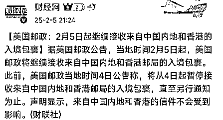
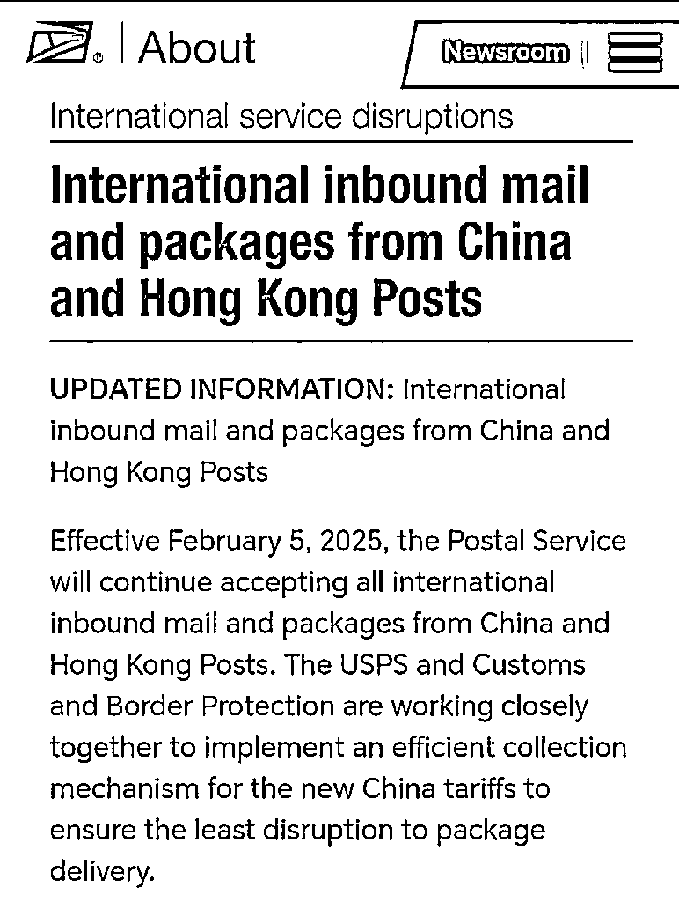
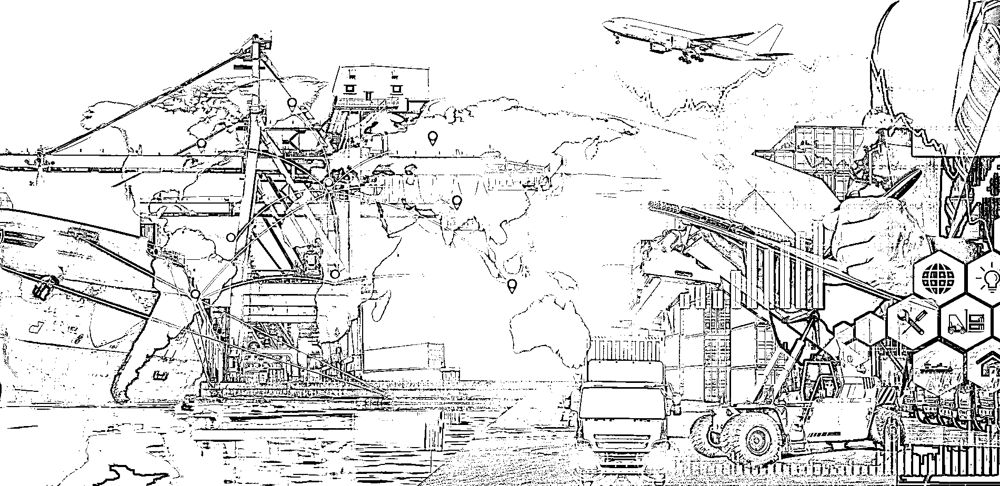
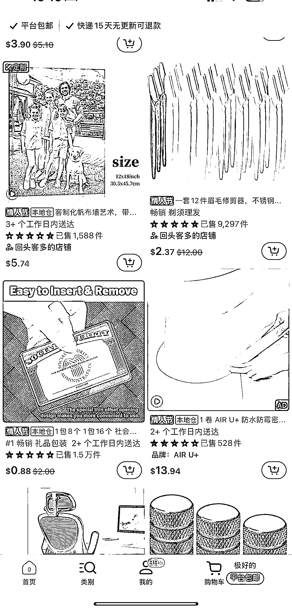

# 特朗普加税，跨境电商外贸何去何从？

> 原文：[`www.yuque.com/for_lazy/zhoubao/wq3221t4xtah3thh`](https://www.yuque.com/for_lazy/zhoubao/wq3221t4xtah3thh)

## (6 赞)特朗普加税，跨境电商外贸何去何从？

作者： 国民弟弟的跨境十年

日期：2025-02-07

这次中国出口到美国的关税加 10%，算是正式落锤了。在这之前，外贸圈就像在等一场风暴，怕它不来，来了又怕太狠，现在看来，这只是个开头，未来甚至可能加到 60%，没人能预测接下来的走向。

尤其是家具行业，这次是最直接被打击的一波。毕竟东南亚已经吸走了一大批产能，如果美国再针对东南亚加税，事情就更加复杂了。更何况，加拿大、墨西哥的关税都被加到了 25%，这已经不是单纯针对中国，而是全球供应链的一次重组。

但有一说一，10%的关税，中国供应链完全能抹平。真正的挑战，是未来的不确定性。东南亚的税会不会加？美国会不会进一步收紧进口？这些都是悬在中国制造头上的达摩克利斯之剑。

> **全球贸易博弈：到底谁才是赢家？**

2025 年 2 月 4 日深夜，美国邮政（USPS）突然宣布，全面暂停接收来自中国内地和香港的入境包裹。这一炸弹式消息瞬间在跨境圈引发地震，国内卖家们连夜开会研究应对方案，海外买家更是疯狂囤货，生怕断供。

然而，戏剧性的一幕发生了——仅仅 24 小时后，USPS 又悄悄撤回公告，恢复正常通关。这场“来得快，去得更快”的政策骚操作，让人不禁怀疑：这到底是一次试探？还是一场毫无章法的政策闹剧？

这次事件本质上告诉我们一件事：全球贸易格局在变，跨境电商也要跟着变。

从短期看，这次加税确实是冲着中国来的。但从长期看，全世界都在互相加税，最后就成了一场经济闹剧。美国的政策还没定型，但很多家具 OEM 转移到东南亚已经是大势所趋。

说到底，99%的家具制造没啥技术门槛，拼的就是成本。美国市场已经被东南亚家具占领，中国制造的身影越来越少。而且很多大采购商早就收到指令：中国供应商的订单比例不得超过 30%。

这意味着，哪怕你辛辛苦苦把工厂搬到越南，质量下滑、成本上涨，最终还是被压价、被踢出局。

就像这场 USPS 闹剧虽然只是短暂的乌龙，但它再次提醒我们：不要迷信任何一个市场，不要依赖单一渠道，全球化布局才是王道。

> **外贸企业的出路：别再当代工厂，去终端市场抢地盘！**

做外贸，掌控链条越多，话语权就越大。设计、生产、物流、销售，能自己掌控的，就自己来。

继续代工，利润被压到极限，最后连订单都不稳定。要么转型，要么死路一条！

在拉斯维加斯展会上，也看到不少华人企业已经在行动——不再只做 OEM，而是自己做品牌、开店、布局终端。靠个人单打独斗确实难，但如果抱团出海，联合国内供应链一起抢市场，那就是另一回事了。要知道，外贸的核心不在于生产，而在于掌控全链路，从设计、制造、物流到销售，自己把控得越多，主动权就越大！

这种代工订单，说白了就是在给美国贸易商打白工。 他们啥都不干，吃掉最大利润，中国工厂承担所有风险。汇率变了、原材料涨价，订单就白做了。

所以，不管是制造业，还是做跨境电商，OEM 的时代已经过去了，必须往品牌化、渠道端转型！

> **我的观点：**

*   墨西哥这一块的话，还是会保持北美零关税，个人觉得不太可能继续往上去有更高的一个关税。所以，供应链转到墨西哥还是可以接受的。

*   中国的这个 10%的关税是确定加上，那其他的只能，将这个产业链转口到东南亚国家，像越南这些其他国家，向美国再次进行出口。

*   最主要的在利润端的话，就是需要到美国本地来落地，真正的高利润，在美国本地落地，建立品牌和销售渠道。筹一些线下门店，或者渠道优势，只有这样，才不会被关税、采购商、供应链政策牵着鼻子走。

> **跨境电商：新关税下的生存之道**

800 美金小包免税取消，让很多跨境电商卖家慌了。这意味着，所有订单都会加 10%的税，利润直接被压缩。而对于美国消费者来说，物价也会同步上涨，最终影响的还是整体销量。

有些人开始搞低报关值，短期可能行得通，但长期来说，这种方式只是饮鸩止渴，不是稳定方案。真正的解法方向只有一个：抛弃低端市场，进军高利润赛道！

> **跨境电商的出路：**

### 1. 转口贸易 + 海外仓，解决短期成本问题

*   东南亚转口：很多人开始考虑转口，货先发东南亚再进入美国，短期确实有一定规避关税的效果。

*   海外本地仓备货：美国本土发货，减少进口环节的税务压力，直接提高溢价能力。

*   TEMU 等大平台已经在布局本地仓，未来一定是本土化运营的天下

这些路，都是短期可行方案，尤其是海外仓，能解决物流时效问题，顺便提高售价。

### 2. 低价走不通，直接上高端市场！

低端买家买不起了？那就去找高端买家！

*   精准高端客群：比如买奢侈品复刻、莆田鞋、广州奢包的客户，买个 200-300 美金的商品，额外多付 30 美金的税，他们根本不在乎。

*   品牌溢价更重要：当市场卷不动价格的时候，拼的就是品牌认知。能卖得贵的商品，才有未来。

TEMU 这波受伤的，都是低价用户，但高端市场的买家完全不受影响，他们买的是价值，不是价格。

### 3. 美国市场很大，但不是唯一市场！

*   南美、中东、欧洲、东南亚，这些市场正在快速崛起，别只盯着美国。

*   全世界有 200 多个国家，不是只有美国才有市场！

*   现在已经有独立站卖家一天出 200-300 单，而且是在日本、中东、南美这些地方，市场机会很大！

> **总结：**

短期策略：外贸企业可以通过东南亚转口、墨西哥建厂等方式降低关税，但这只是权宜之计，不能当长期策略。

长期策略：必须摆脱 OEM，建立品牌，掌控渠道，直接面对终端消费者，否则利润永远是别人的。

跨境电商方向：海外仓、本地运营是未来趋势，单纯依赖直邮模式会越来越难做。

市场拓展：全球市场那么大，别把鸡蛋全放在美国！

贸易规则在变，供应链在变，但真正有远见的企业，早已在调整布局。要想在未来站稳脚跟，你得掌控终端，真正做自己的生意！

以上！

**国民弟弟相关创业的故事文章推荐：**

**跨境电商认知分享，个人创业者从 0 到 1000w+**

[`articles.zsxq.com/id_8n2o7gax71fr.html`](https://articles.zsxq.com/id_8n2o7gax71fr.html)

**3 分钟搞定美国公司，150 美金，超简单**

[`articles.zsxq.com/id_exggkcb30j69.html`](https://articles.zsxq.com/id_exggkcb30j69.html)

**3 分钟，如何远程开美国实体银行,送 2340 入金奖励。**

[`articles.zsxq.com/id_ubk2osmj6wzb.html`](https://articles.zsxq.com/id_ubk2osmj6wzb.html)

**美国收款工具：**

美版支付宝 Venmo:[`articles.zsxq.com/id_x73bbkhkkzau.html`](https://articles.zsxq.com/id_x73bbkhkkzau.html)

* * *

评论区：

暂无评论