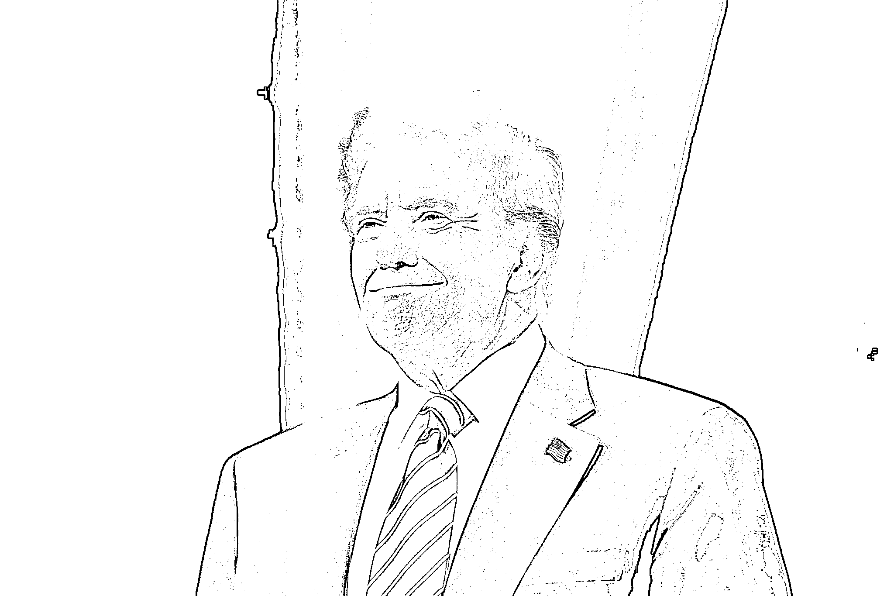
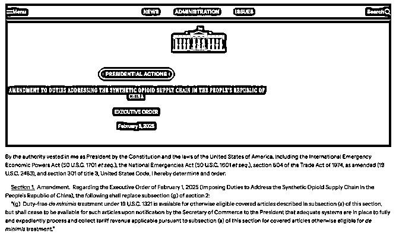
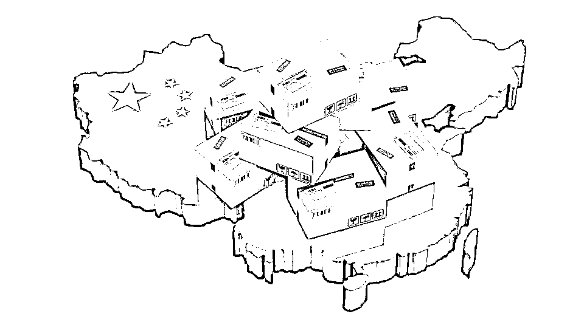
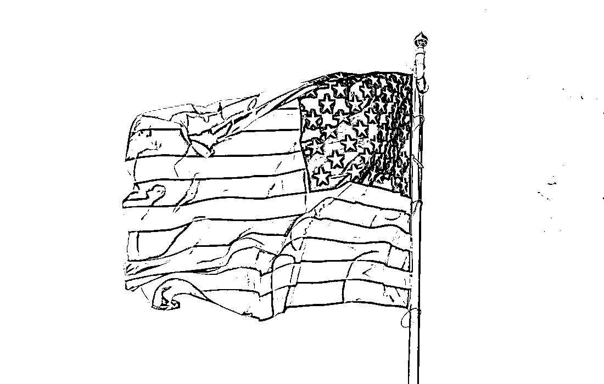

# 突发!!特朗普又恢复 800 美金免税政策

> 原文：[`www.yuque.com/for_lazy/zhoubao/xti1rnovpyn59ldw`](https://www.yuque.com/for_lazy/zhoubao/xti1rnovpyn59ldw)

## (3 赞)突发!!特朗普又恢复 800 美金免税政策

作者： 国民弟弟的跨境十年

日期：2025-02-08

特朗普恢复“800 美金”免税政策

据新闻报道：美国总统特朗普周五又宣布恢复 800 美元免税政策，这意味着从中国进口的小包裹（单个包裹价值低于 800 美元）将继续享受免税待遇。这一政策的恢复，直接影响了跨境电商行业，尤其是中国卖家。对我们这些在这个领域深耕多年的跨境电商从业者来说，这无疑是一个值得关注的信号，因为这不仅关系到税务成本，还可能影响整个运营链条的优化。

特朗普此举是为了给美国商务部更多时间完善系统，以便更好地处理和征收关税。对于跨境电商来说，这意味着海关程序的复杂性有望得到改善，税务压力将得到缓解。虽然目前没有明确的时间表，但这一政策的恢复无疑在行业中引发了广泛讨论。

> **恢复免税门槛的意义**

从我的经验来看，这项政策对中国的跨境电商企业尤其重要。过去几年，我们一直在依赖 800 美元的免税政策来降低成本，从而保持在美国市场的竞争力。在美国，每年约有 13 亿个包裹通过最低限度的关税豁免政策进入市场。这些商品包括鞋服、家居用品、电子产品等，其中大部分来自中国。

根据海关和边境保护局的数据，过去十年中，享受“800 美金”关税豁免的包裹数量大幅增长，尤其是在 2023 财年，超过 10 亿件商品利用这一政策进入美国市场。这对跨境电商企业尤其是中小型卖家来说，意味着更低的成本和更具竞争力的定价。

对于我们这些已经在这个行业深耕的卖家来说，关税免除是提高市场份额的一大利器。少了税务负担，我们能够更具灵活性地调整产品价格和销售策略，更容易在价格敏感型市场中占据一席之地。

> **未来的调整与应对策略**

这个政策的来来回回，简直比跨境人的心情还要反复无常！从取消到恢复，很多卖家甚至连应对方案都还没来得及调整，就又要重新规划。这一波到底是福是祸？所以，如何应对这一变化是我们需要认真考虑的问题。 images.zsxq.com/FqlzrU5q5Gxd1xzNWJP_4i0WI_fV)

这次特朗普的免税恢复，表面上是为了给美国商务部“腾出时间”来优化政策执行，但实际上，核心问题是“执行难”。

### 1. 美国海关根本忙不过来

你能想象吗？美国每年有超过 13 亿个申请免税的小包裹入境，仅肯尼迪机场一年就处理 6000 万单。想要一下子对所有包裹重新征税？根本没这个能力！

前几天，美国海关和物流公司还在紧急开会，讨论如何消化堆积的 100 万个包裹。说白了，就是他们自己都还没想清楚要怎么操作，就直接砍掉了 800 美元免税政策，结果包裹爆仓、系统崩溃、清关大排长龙……最后不得不再恢复免税，否则整个物流系统都可能直接瘫痪。

### 2. 跨境电商订单太多，一刀切根本行不通

据 Xeneta 的数据显示，仅 Temu 和 Shein 每天全球发货就有 9000 吨，折合 88 架满载的波音 777 货机。  这么大的包裹量，短时间内改政策，物流、平台、海关根本跟不上节奏。你说要征税可以，那怎么收？怎么报？如何核查？没有完整的系统支撑，根本没法落地！

所以，800 美元免税政策恢复，看似“给了大家一个喘息的机会”，但这次政策的变化，透露出一个明显的信号——美国真的下定决心要针对小包征税，只是时间问题！

> **为什么小包跨境电商的税务成本一定会增加？**

现在我们可以肯定，免税政策的恢复只是临时缓冲，而不是政策“放水”。接下来，一定会有更加完善的系统上线，确保美国能收上这笔税！那跨境电商卖家要怎么应对？

### 1. 未来低价小包卖家日子会更难

美国贸易战的背景下，800 美元免税的漏洞一直是他们想堵上的口子。尤其是中国的低价小包商品，占据了美国市场的相当大份额，超过 10%的进口商品都用到了这个免税政策。  你以为他们会一直让我们“白拿”这点税收优势？不可能的！  从未来趋势来看，低价 SKU、低客单价的卖家一定会首当其冲，因为低价模式的利润空间本来就很薄，税务一旦加上去，价格优势基本就没了。

### 2. 平台可能会提前调整收费策略

无论是 Temu、Shein、亚马逊，还是各种 DTC 品牌，未来一定会在物流费用上提前调整成本，因为税负增加后，平台也不会自己买单。他们可能会：

*   调整平台费用：提高佣金或增加额外手续费

*   优化物流模式：推动 FBA 或本地仓，加速本土化

*   转移成本给卖家：无论是物流附加费、清关费用，还是提前代扣代缴税款，最终这部分成本都会落到卖家身上

### 3. 物流成本会上涨，报关会更复杂

政策变动后，报关流程已经开始变得复杂。之前的“简化申报”被取消，现在需要按照正式报关流程来操作，人力、时间、报关费全都上升，不少物流商已经提前调整了收费标准：

*   部分物流商开始加收报关费

*   部分物流商开始在包裹签入时预收一定比例的关税保证金

而未来，等美国的系统真正准备好后，小包征税将会更严格，物流成本也会进一步增加。

## 卖家如何应对？

政策虽然一直在变，但核心逻辑始终不变——跨境电商不能再靠低价小包模式活下去，必须提前布局！

### 1. 提前规划“本土化”布局

如果你是专门靠低价小包发货的卖家，现在是时候考虑升级模式了。可以考虑：

*   备货海外仓，减少跨境直发成本

*   利用美国本土仓储和物流，避免政策不确定性

*   打造品牌，提高客单价，减少税负对利润的影响

### 2. 选择多元化物流方案

目前来看，最稳妥的方式就是：

*   海外本地仓优先：避免未来小包直邮模式被进一步限制

*   合规报关，避免不必要的风险：如果未来税务更严格，违规操作可能会导致更大损失

*   提前测试不同物流渠道，降低对单一模式的依赖

### 3. 关注平台政策，灵活调整价格

政策变化直接影响物流和关税，最终会传导到商品价格。如果你依赖平台销售，务必密切关注平台的费用调整，比如 Temu 是否会加收税务费用，亚马逊是否会调整 FBA 的费用等等。根据市场反应调整价格，才不会被政策打个措手不及！

## 总结：

特朗普恢复 800 美元免税政策，表面上看是个利好，但长期来看，小包直发征税已成定局。与其等政策再变动，不如提前做好准备！跨境电商的核心竞争力，已经从低价红利向品牌、供应链、合规化方向转变。  如果你的商业模式还在依赖免税政策，那就要警惕了，真正的挑战才刚刚开始！

以上！

**国民弟弟相关创业的故事文章推荐：**

**跨境电商认知分享，个人创业者从 0 到 1000w+**

[`articles.zsxq.com/id_8n2o7gax71fr.html`](https://articles.zsxq.com/id_8n2o7gax71fr.html)

**3 分钟搞定美国公司，150 美金，超简单**

[`articles.zsxq.com/id_exggkcb30j69.html`](https://articles.zsxq.com/id_exggkcb30j69.html)

**3 分钟，如何远程开美国实体银行,送 2340 入金奖励。**

[`articles.zsxq.com/id_ubk2osmj6wzb.html`](https://articles.zsxq.com/id_ubk2osmj6wzb.html)

**美国收款工具：**

美版支付宝 Venmo:[`articles.zsxq.com/id_x73bbkhkkzau.html`](https://articles.zsxq.com/id_x73bbkhkkzau.html)

* * *

评论区：

暂无评论