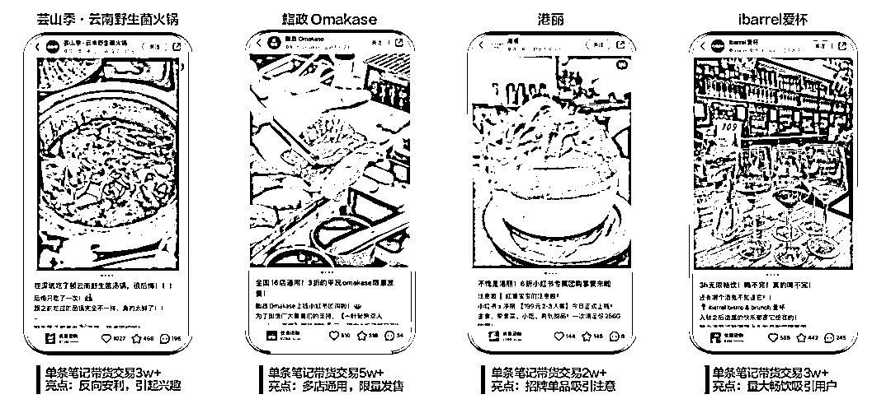
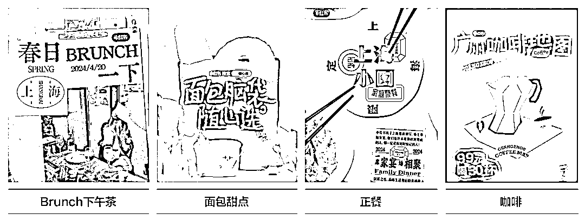

# 小红书 POI 发力了！2025 本地生活红利，是时候 All in？（深度分析）

> 原文：[`www.yuque.com/for_lazy/zhoubao/hg89cugr6a4m3g8n`](https://www.yuque.com/for_lazy/zhoubao/hg89cugr6a4m3g8n)

## (24 赞)小红书 POI 发力了！2025 本地生活红利，是时候 All in？（深度分析）

作者： 楚川

日期：2025-02-06

**2025 年小红书正式进入本地生活时代，对标 2020-2021 年的抖音，直接在地址 POI****（*****Point of
Interest，可以是一栋房子、一个商铺、一个邮筒、一个公交站等*****）_**的**落地页下正式接入小程序，做成平台闭环。在抖音本地生活迅速崛起下，小红书的 POI 生态闭环后，代表中国自媒体的本地生活进入全域营销时代，未来还有视频号、bilibili 入局。**

**  **

**官方手册已发布**

### **Part 1 小红书的 POI，正在复刻 2020 年的抖音：流量洼地，闭眼冲！**

2020 年的抖音本地生活，商家靠一条短视频就能撬动百万曝光，如今这种“野蛮生长”的红利正在小红书 POI 重现——**3 亿月活、95 后占比 50%** ，用户主动搜索占比 42%，平台日均产生海量探店、打卡、搭子内容。

**为什么说这是“抖音级机会”？楚川从 2020 年开始做抖音本地生活，经历了前 2 年的无序、疯狂增长！**

**  **

**流量分配倾斜** ：POI 页面整合了内容、商品、活动入口，平台算法优先推荐带 POI 标签的笔记，**自然流量倾斜堪比早期抖音的“同城页”** ；

**商家基建红利** ：目前 POI 功能刚完成升级，商家竞争度低，**抢先绑定专业号、搭建群聊的玩家，能吃透第一波流量红利** ；在这里就不用管太多，矩阵铺起来，全员营销干到底。

**用户心智养成** ：年轻人“搜小红书”已成习惯，探店前先搜 POI、领券下单的链路逐渐成熟，**转化效率碾压传统平台** 。

**案例拆解** ：鲨政 Omakase 通过 POI 群聊组局+达人笔记种草，单场活动交易破 5 万；上海某商场用 POI 发券功能，七夕 1 万支花 2 小时抢空——**早期入场者，已经赚麻了** 。

### **Part 2 POI 闭环=实体商家全域营销时代开启！视频号、B 站正在路上**

小红书的 POI 生态，** *第一次把“内容种草-交易转化-私域留存”全链路跑通*** ，**这标志着中国本地生活正式进入“全域营销”时代** 。

**全域营销的核心公式** ：

**线上** ：笔记种草+POI 领券+小程序下单；

**线下** ：到店核销+签到打卡+UGC 反哺内容池；

**私域** ：群聊搭子+会员运营+长效复购。

**未来战局** ：视频号依托微信社交链，B 站靠 Z 世代内容力，势必入局分羹。但小红书已卡住“生活方式平台”心智——**用户来这就是为了“边搜边买”** ，天然适合做本地生活，**尤其是单店、非标、高客单类目的天堂** 。

**关键洞察** ：全域营销≠全平台铺量，而是**在一个生态内完成用户生命周期管理** 。小红书 POI 的群聊、签到、通兑券，本质是让商家 *“一次投入，反复收割”* 。

### **Part 3 为什么小红书是“线上导流+线下履约+长期复购”的最优解？**

对比美团、抖音，小红书有 3 大杀手锏：

**用户质量碾压** ：95 后占比过半，高净值用户愿意为“体验感”买单，客单价提升空间巨大；

**内容驱动交易** ：70%用户看完笔记会产生消费意愿，POI 页面直接嵌入团购券，**决策链路比抖音更短** ；

**私域基建完备** ：群聊搭子功能让商家低成本沉淀粉丝，后续发券、直播、上新都能精准触达。

**案例实操** ：用 POI 发起“多店通兑次卡”，用户买一张券可跨店消费，既拉新又提高门店利用率；

**新店冷启动** ：某奶茶店通过 POI 发放“500 杯免单券”，笔记带定位即领福利，开业 3 天爆单。

本质逻辑：小红书不是卖流量，而是**用内容构建信任，用 POI 承接需求，用私域延长价值** 。

### **四、2025 小红书 POI 玩法拆解：抓 4 个红利，赌 3 个未来**

**当下必抢的 4 个机会点** ：

**第一，POI 基建卡位** ：立即认证专业号，绑定门店信息，开通群聊搭子——**页面越完整，流量权重越高** ；

**第二，内容+活动组合拳** ：发布商品笔记时必带 POI 标签，同步策划“限量发售”“组局打卡”活动，撬动平台推荐流量；

**第三，多店联动打爆** ：联合周边商家发起“主题地图”（如咖啡探店地图），用通兑券分摊成本、共享客流；

**第四，私域反哺公域** ：把到店用户导入群聊，鼓励发布 UGC 笔记，触发二次推荐，类似爆店码的疯狂期。

**未来 3 大想象空间** ：

**第一，技术赋能** ：AR 探店、AI 生成 POI 攻略，当下 DeepSeek 的崛起进一步降低内容生产成本，这是很棒的契机；

**第二，会员经济** ：通过 POI 发放等级制会员券（如满 200 减 50），锁定高净值用户，用服务和产品持续复购；

**第三，跨平台核销** ：与支付宝、微信打通券码系统，覆盖非小红书用户。

**可预测的风险点：**

**第一，服务商-商家的迅速接入，要考虑什么时候被平台掀桌子。** 抖音从 2020 年发力，到 2021 年 11 月掀桌子，抢服务商饭碗，那就意味着有 1 年左右的绝对红利期，必须是把用户薅到底，**成为平台马仔是没有好下场的。**

**第二，小红书对于内容的控制高于抖音，粗制滥造的内容增长周期会很短。** 所有的从业者，一定不要迷信工具的牛逼和无敌，在内容力上继承抖音的基础，持续升维才是正解。

**第三，小红书就是针对大众点评的存在，意味着会出现核心商家的站台问题。** 品牌就一定是学会明面上“一碗水端平”，不同平台组品有区别。

### **全域营销的终局，是“用户资产”**

小红书的 POI 生态，本质上让商家从“买流量”转向“养用户”——

一场活动既能拉新成交，又能沉淀群聊粉丝，还能收割 UGC 内容。**这波红利不是“赚快钱”，而是提前囤积用户资产** 。

2025 年，本地生活的胜负手不再是 GMV，而是**谁先跑通“内容-交易-私域”的正循环** 。

**动作要快，姿势要帅，All in 小红书 POI 的老板，评论区举手！**

* * *

评论区：

小熊 : 必须冲 本来产品就是受限只能服务本地

快印老司机唐应群 : 大哥，搞个航海。

蝈蝈、 : 来了来了，抖音本地服务商遇到瓶颈了，任务越来越重，扶持力度越来越低，苦不堪言！