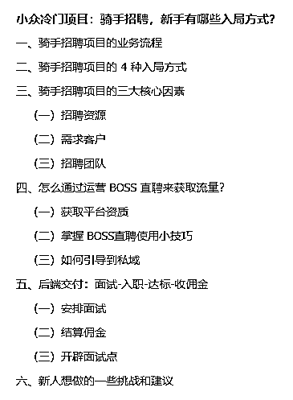

# 小众冷门项目：骑手招聘，新手有哪些入局方式？

> 原文：[`www.yuque.com/for_lazy/zhoubao/tk40rd8s8ynwp2w5`](https://www.yuque.com/for_lazy/zhoubao/tk40rd8s8ynwp2w5)

## (精华帖)(41 赞)小众冷门项目：骑手招聘，新手有哪些入局方式？

作者： Yc·Jw

日期：2025-02-05

各位圈友，开工大吉！

我是 YC，坐标广州~做着一家每天为大家提供 20 万次外卖配送服务的公司

上次发布了一篇关于行业蓝海的项目，很多圈友都对我们骑手行业有非常大的兴趣

所以这次再分享一篇关于我们圈内热门、圈外小众的好项目给大家

这次的项目单人人效在 8k-2w 营收/月，成本低，可持续，可全职可兼职的灵活项目。

无论你是寻找项目赚钱的自由职业者，还是居家带娃的宝妈，抑或是想创业想找项目的，都可以参考下这个项目。

依旧是内容较多，原文较长，为了更好的观看体验请移步飞书，感谢大家耐心观看~

[`bcn6wmdgk3ny.feishu.cn/wiki/Q7ehwuzzEibpa8kqXTlcC9m5n0d`](https://bcn6wmdgk3ny.feishu.cn/wiki/Q7ehwuzzEibpa8kqXTlcC9m5n0d)

以下是本次大纲：

* * *

评论区：

三生 : 那上游渠道怎么找呢

Yc·Jw : 部分城市我可以对接，你自己也可以去到你当地城市的配送站点，找站长，联系到当地城市的城市经理就可以洽谈合作

三生 : 有唐山的么

布丁茶 : 怎么加您好友

Yc·Jw : 没呢，有广东这边的，武汉西安无锡这些城市，线上招聘，招哪里也可以的

Yc·Jw : 联系鱼丸就可以

七天@生财有术 : 很冷门的赛道，但是讲述很清晰~ 好奇骑手行业上下游已经这么完善了哇~

Yc·Jw : 这个细分小众的行业在 15 年开始，到现在 10 年了[呲牙]