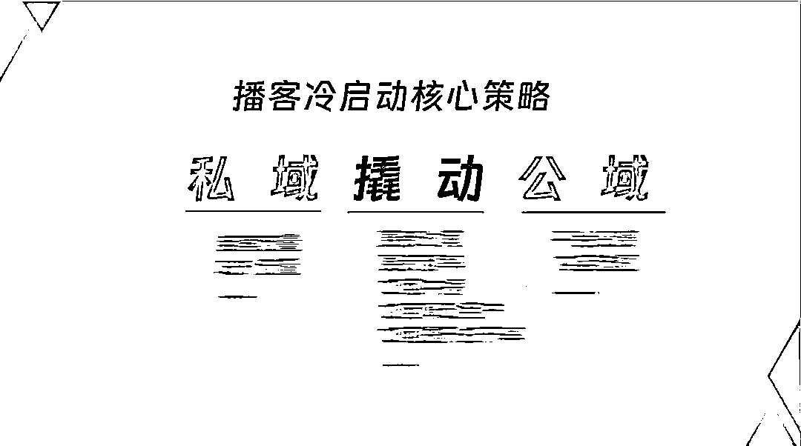
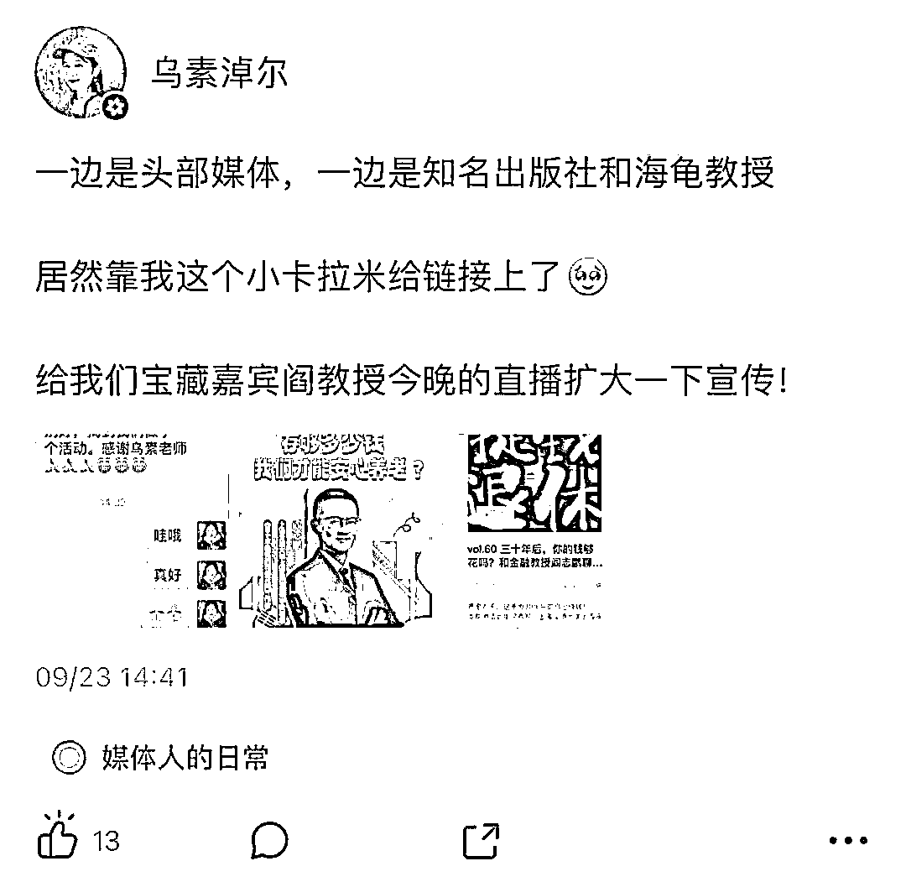

# 播客到底如何赚钱？ 变现案例万字揭秘！

> 原文：[`www.yuque.com/for_lazy/zhoubao/nggdcglxe8cwk5fg`](https://www.yuque.com/for_lazy/zhoubao/nggdcglxe8cwk5fg)

## (精华帖)(36 赞)播客到底如何赚钱？ 变现案例万字揭秘！

作者： 乌素淖尔

日期：2025-01-20

Hi 大家好，我是乌素~ 是《提钱退休》的制作人兼主播，在做播客不到两年的时间里在小宇宙单平台突破五万订阅，算是赶上了一波红利。

大家可能都听到过一个说法，播客都是为爱发电，播客不赚钱。但实际上在我看来，播客是非常有潜力的一种媒体形式，所以就借这个机会来跟大家好好分享一下。

这篇内容会拆解播客变现案例，给大家分享到底播客如何赚钱、什么样的人能在播客赚到钱

这篇分享包括三个部分：

01 播客 2 大变现逻辑和行业案例

02 播客生态有哪些角色和机会点？

03 做播客稳赚不赔的 5 类人

# **01 播客 2 大变现逻辑和行业案例**

那第一部分咱们先讲讲播客变现的逻辑，可以简单分成两种逻辑，水上变现和水下变现。

**1、水上变现**

所谓水上逻辑呢，其实就是大家比较容易理解的接广告的逻辑。

大家肯定听到过一些播客说，本期节目由谁谁谁赞助播出，对吧？我们节目也经常有这种广告。

那大家有没有了解过播客广告的报价呀？

上次给我们播客实战营的同学们，分享了一些播客账号的广告报价，所有人听到这些报价的反应都是：啊，竟然这么高！

都说播客不赚钱，但是一期节目广告接到上万块，这种价格其实是还蛮普遍的。

我其实做播客也就做一年多，但是一年多就已经能够接到五位数的广告了，所以播客还是挺香的~

这边也可以跟大家悄悄剧透一下头部播客账号的广告报价，有一个目前在单个平台有 20 万订阅的账号，报价其实不算特别高，大概就是 6 万这样。还有一个账号有 30 万订阅的账号，报价大概是 10 万。

不过他们的报价还不是那种深度定制的价格，因为在广告报价里，会涉及合作的深度。

就像我这边五位数的报价，其实走的是比较定制化的合作。我们会根据客户的产品来确定选题，考虑找什么样的嘉宾、聊什么样的问题，以及用什么好的方式去介绍产品。

我们会从头开始规划和设计，这样的话节目效果也会比较好，很可能这一期原本是个广告，但用户也非常喜欢。

但更多小伙伴肯定会觉得自己还达不到头部的水平，或者才刚刚起步，甚至还没开始接广告呢，是不是感觉离自己特别遥远呀？其实也不是的。

我发现好多新播客，新到什么程度呢？可能是注册的账号，才刚开始运营，但他们也很容易拿到赞助。

赞助是什么意思呢？

就是可能不会直接给你很高的费用，但是会让你有品牌露出，还会给一些福利，比如给用户抽奖的福利。

通过这样的赞助，一方面能调动用户收听的积极性，只要评论或者收听就能拿到奖品，用户肯定觉得有好处就会来。

另一方面就是让别人，不管是同行还是金主，都感觉你的账号挺有价值的，才刚刚起步就有赞助了，就有金主合作了。

这都是新播客能得到赞助的机会，但是为什么新播客能得到赞助呢？

**其实这里又会有一个信息差，新播客它是有流量扶持的。**

大家别听网上说新播客好像一点流量都没有，不是这样的。新播客是有流量的，只不过这个流量不是那么容易获取，是需要一些运营技巧的，并且本身内容要做得比较好，才能调动和撬取流量。

说一个最新的趋势，前几天我一个做广告投放的小伙伴跟我说，他们最近在跟一些品牌聊投放的事，发现很多品牌开始把播客当作投放渠道了。

以前大家可能都会选择投小红书、抖音之类的平台，但现在已经有越来越多的金主开始留意到播客了，这也是个最新趋势，分享给大家。

播客还处于增长期、成长期，我们现在进入很有机会。

那这些是关于变现逻辑里比较水上的部分，其实这算是比较简单的，下面我们来介绍一下播客水下变现的逻辑。

**2、水下变现**

水下变现，我们可以理解为是一种更广义上的变现。

广义上的变现是什么意思呢？就是我们可能不是直接通过这一期播客来变现的，而是通过这期播客扩大了自身影响力，增加了用户对我们的信任，从而实现变现和转化。

我觉得这其实是一个更大的变现规模，或者说是潜在机会。

举个例子，相比于其他平台（比如小红书），播客更容易转化到私域，有些播客的用户粘性很不错，他们就会把用户引流到私域当中，在社群里卖货，或者进行一些产品的分享。

据我了解，有的比较新的账号，可能大家也听说过，在私域变现了上百万，这真的很惊人。

像我自己就经常会有用户听了我的播客之后，觉得我讲得很专业，就会来购买我的陪跑服务、课程或者进行咨询之类的。

其实这些我都不会把它们归为播客带给我的变现，它好像没那么直接，甚至如果我不说的话，你可能都不知道乌素老师还有这种变现方式~

以上这些就是公转私的变现模式，也就是我们说的“水下变现”。

# **02 播客生态有哪些角色和机会点？**

第二部分我们来聊聊播客有哪些角色和机会点。这里面会有超多具体的案例，还会讲到一些我最新了解到的东西。

咱们先来拆解一下角色~

### **1、播客有哪些角色？**

#### **角色 1：听众**

首先第一角色是听众，大家包括我在内，很多人都是播客的听众，我们每周都会花好几个小时来听播客。

#### **角色 2：主播**

第二个角色是主播，像我现在就是一名主播，有些小伙伴要是开始做播客了，那他们也成了主播。

#### **角色 3：嘉宾**

第三个角色是嘉宾，要是你自己没做播客，不过你的朋友在做播客，ta 邀请你去分享，那你就担任嘉宾这个角色了。

#### **角色 4：剪辑师**

上面三种角色都很常见，接下来就是进入到偏幕后一点的第四种角色，剪辑师。

可能有些小伙伴没想到，剪辑居然能单独成为一份工作，而且在播客里是非常重要的。

我有不少播客主朋友，他们经常问我，有没有好用的剪辑师可以推荐呀，有没有专业的外包剪辑能够合作呢？这样的情况非常多，所以播客剪辑现在是个非常重要的岗位。

要是咱们想做播客相关的工作或者副业的话，这个岗位真的很值得去了解一下。

而且播客剪辑跟短视频剪辑不太一样，它对剪辑技术的要求没那么高，反而更注重对内容或者表达的审美，毕竟在听内容的时候，大家都有自己的品味。

那如何把素材加工成自己觉得比较好的内容呢？这就属于内容审美范畴了，这一点其实比较重要，其中还包括提炼重点。

很多播客在开头都会有一个片头 highlight，用来讲述本期的精华高光部分。这就要求剪辑师有比较好的内容思维，这样才能做好这方面的工作。

#### **角色 5：播客制作人**

接下来要讲的角色是播客制作人，有的朋友可能没听说过，这其实是一种比播客剪辑师更新的岗位或者工种。

播客制作人是什么意思呢？

有些主播自己本身就是制作人，比如乌素，我做过内容创作，所以就可以直接担任制作人。

还有些人自身带有 IP
属性，算得上是小明星。但他们一方面可能忙不过来，另一方面可能希望有专人在幕后整体操盘，所以就需要制作人这样一个角色，专门统筹播客的全部内容。

播客制作人就如同播客的大管家，而主播就相当于演员，这样理解就比较形象了。

#### **角色 6：品牌方**

接下来就是品牌方了，这是另一种角色，开始涉及到变现环节了。

#### **角色 7：播客 MCN**

再就是播客 MCN，这也是随着播客越来越趋向专业化而出现的一种角色表现形式。

### **2、播客角色对应的机会点**

刚刚已经谈了播客里有这么多的角色，接下来我们就要讲讲这些角色对应的机会点了，我们先从案例讲起。

#### **案例 1：听众中可能有甲方，因为喜欢所以付费**

第一个案例就是听众中可能存在甲方，我有过好几次这样的经历，他们跟我打招呼说：“乌素老师，其实我是你的听友，我听了好几期的节目。我今天是带着品牌方这个身份来的，因为很喜欢咱们的播客，所以就想看看有没有合作的机会。”

我这一下就来劲了，广结善缘果然有好处，听众当中有金主，而且这个事情已经有至少三个了。

从听友成为金主，会有一个什么样的好处呢？

因为他们经常听你的节目，所以对你非常了解，清楚你的调性与产品的匹配度，并且非常信任你这个人，这样就能节省大量的沟通成本。

我们这种内向型的人其实很少主动社交，很少主动去推销自己或者包装自己。

但是如果他们是听过我节目的，本身就对我有所了解，我就会感觉这种沟通特别顺畅、舒适，不需要过多的寒暄。你信任我，我也了解你，我们的合作就是这么默契，真的很开心。

还有一个非常重要的点，如果是品牌里负责播客投放工作的人员，一般来说都是会听播客的。因为他们要在这个渠道进行投放，就必然要对这个渠道十分了解。他们得知道这个渠道里哪些账号比较优质，哪些账号值得投放，那他们自己肯定得去听播客。

播客不是那种三、五分钟就能听完的内容，要是换做其他渠道，可能账号刷一刷，十分钟就能刷好几十个账号。

但播客不是这样的，你可能一听就是一个小时，可能就喜欢上了这个播客的主播，会对主播有更深入、更全面的了解。

如果能够抓住投放负责人的心，或者说抓住品牌金主的心，那基本上就已经成功一半了。

#### **案例 2：听友中可能有客户，因为相信所以付费**

第二个案例是听众当中可能还会有客户。

刚刚说的是那种投放方面的逻辑，属于比较偏水上变现，第二种就是偏水下变现了。

我经常提到我有听友成为了我的客户，可能一开始是先购买咨询服务，不过购买咨询并不是一上来就因为了解我才这么做的，他们会针对自己感兴趣的领域，先在播客当中进行搜索。

他们会觉得播客是一个提供深度内容的渠道，比如他们想要了解小红书，就会在播客里进行搜索，会发现有很多人分享了自己对小红书的认识。

可能就会看到我的分享，我也讲过几期相关内容，播放量和口碑都还不错，有好几个来咨询的客户就是因为搜索了小红书相关内容后，发现我讲新媒体很专业，还懂变现，所以就来找我咨询。

咨询之后，他们觉得我讲得很好，非常满意，接着就会问能不能提供陪跑服务，这样客单价就达到了五、六位数。

这就是我做播客能赚钱的原因，因为我在后端有很强的交付能力，以及产品承接能力。

### **接下来我们讲几个具体角色对应的机会点：**

#### **① 如果你是听众**

如果你是听众，你可以到自己喜欢的播客去做全职或者兼职工作。

就像我们刚刚提到的，如果是做兼职，你可以从剪辑师这个角度切入。要是你想做全职的工作，也可以从剪辑入手，进而去担任播客制作人这样的角色。

#### **② 如果你是剪辑师**

如果你是剪辑师，那你一定要关注播客这个渠道。因为对于剪辑师而言，播客目前是一个竞争没那么激烈，而且非常容易找到岗位、找到工作的机会。

短视频竞争非常激烈，因为短视频的节奏很快，而且可能会更注重技巧方面的东西，仅仅 30 秒的短视频里就有好多花样，而播客就好多了。

播客其实不需要太多花哨的技巧，甚至剪辑得粗糙一点，别人会觉得更自然，不过它会非常关注内容，像内容逻辑上的调整与梳理，还有亮点的提取。

比较适合在内容方面更有优势的剪辑同学，这是一个比较新的机会。

#### **③ 如果你是品牌方**

如果是品牌方，我特别建议大家可以尝试着去做播客，或者在播客上投放广告。

播客是一个被严重低估的平台，而且它算是一个比较新的流量渠道。

那些成熟的流量渠道，大家都知道价格很透明，也很卷。但是新的流量渠道价格没那么透明，很容易找到流量洼地或者说是价值洼地。

每次新渠道崛起的时候都是市场格局重新洗牌的时候，所以如果大家觉得自己的品牌非常有潜力，完全可以尝试做播客。很有可能借着播客的上升趋势，就成为一个顶呱呱的品牌了。

去年一整年有好几十家品牌都在播客投放了广告，这就是新渠道给品牌带来的机会，如果大家正在做品牌的话，很有可能只花一点小钱就能撬动这个渠道，从而把品牌做起来。

#### **④ 如果你是主播**

即使你现在还不是主播也没关系，可以听一听作为主播可能会获得的好处和价值。

**对于主播而言，可以用非常低的成本建立起自己的影响力，进而达成破圈合作。**

这是什么意思呢？就是说，假如我现在打算做一名自媒体博主，想要去积攒自己的人气，那我有很多选择，我可以做直播，也可以录制短视频，还可以写公众号之类的，当然也可以做播客。

**在这些选择当中，其实播客的门槛是非常低的。**

它不需要你出镜，像我们这种比较内向的人，不用化妆，也不用精心打扮，正常说话就行。

而且，你不需要很高级的设备，你自己也不需要写非常细致的主持稿或者很精细的脚本。

关于主播如何低成本建立自己的影响力，我再来大家举一些例子，都是非常新的案例。

像我自己呢，前两天就有一个离我非常近的机会，我在一个主播交流群里看到他们说有一个可以采访邓亚萍的机会。但是这个采访地点在北京，而我人在上海，并且还要给大家做直播，所以我就没去，真的非常可惜。

但是咱们要是作为主播的话，想要通过采访、链接等方式去接触到各个行业顶尖的人物，都是有机会的。

所以我觉得这一点非常吸引我，可能也会吸引到大家，真的有很多这样的机会。

还有，这也是我近期的一个案例。8 月份，我去电视台录制节目了，是那种要在卫视播出的节目

而能够上电视的前提是因为我有一档播客，我也算是一个小有名气的 KOL 了，这样就可以去分享一些自己的观点之类的。

**这就是我认为对于大家来说的情况，即便你现在没有很高的变现需求，但是你希望能够拥有比较多姿多彩的生活，能有一些美好的人际联系与合作机会的话，其实播客是非常适合的。**

像这些机会都不是我一开始就预料到的，我哪里能想到自己能上电视呢，说不定之后还会有更好的机会呢。

播客还处于一个上升期，让我们拭目以待吧~

## **3、播客是一种新的社交名片**

我经常会建议大家做播客，因为我觉得播客是一种非常新颖的社交名片。

大家都见过名片，传统的名片是一张小小的卡片，现在其实已经不太会去发这种小卡片了。

可能很多人还会发一个网址作为个人说明书，我也有。但说实话，个人说明书还是相当冗长的，别人不一定会马上查看。

而播客呢，对我来说它其实也是一种社交名片。我会跟大家说，我是某个播客的主播，大家一看觉得还不错，点开数据，再一听内容，觉得讲得也很好。

这样对乌素是不是就有一个认识了呢？实际上我都没怎么多做介绍。但对于别人来认识我而言，这是一种更简便的方式。

对我去介绍自己来说，这也是一种更简单的方法。我都不需要说我擅长什么、我的爱好是什么、我的性格怎么样之类的话了，他们一听播客内容就都能听出来了。

还有一个案例，我们出版社的一位编辑老师给我发来了喜报。

之前我采访过一位嘉宾，这位嘉宾是一位非常厉害的大学教授，我们做的那期节目广受好评。因为我们这期节目被某个头部媒体听到了，这个头部媒体就去找这位嘉宾做直播了。

之后出版社的老师就特别感谢我，我当时就在想，像我这种内向的人竟然也成为了这种头部媒体、头部大佬之间的一个资源枢纽，这也是依靠播客的力量才实现的。

那以上就是我们关于播客的角色和机会点的分析，大家都可以去对应到自己，发现属于你的机会点~

# **03 做播客稳赚不赔的 5 类人**

接下来就是讲到做播客稳赚不赔的五类人，看上去非常标题党，但其实是很实在的内容。

### **1、有自己的产品/服务的人，播客可以低成本引流**

第一类情况就是，假如你有自己的变现途径，有自己的产品，也有自己的服务，那你就可以利用播客来低成本地引流。

**具体来讲，如果你的用户画像为一线城市人群，消费水平较高，认知水平也比较高的话，其实就比较适合尝试播客。**

这和播客整体的用户画像有关系，播客整体的用户画像就是：认知水平较高、消费水平较高的人群。

如果你的用户正是这样的人群，那你就非常适合去尝试播客。

播客还非常适合那些需要建立信任关系的业务模式，比如房产经纪、保险经纪或者教练业务等。

比如说客单价比较高，你不可能一下子就付钱给一个陌生人，你肯定会觉得这样太不靠谱了，我不可能那么冲动的。

在这种情况下，如果 ta 已经凭借自己的专业征服了你，而且已经陪伴了你很长时间，那你肯定在感性和理性上都会更倾向于 ta。

这就是比较适合做播客的第一种人。

### **2、朋友多的人，自带嘉宾和多元话题**

如果你的朋友很多，而且在你的朋友当中有不少大佬，那这也非常适合做播客。

因为假如你有很多朋友，平时你跟他们聊天，你们的聊天内容很可能会给其他人带来启发。那你为什么不把这个聊天的过程分享给其他人呢？同时还能建立自己的影响力，多好~

给大家说个具体的例子，我身边有那种朋友特别多的 e 人，多到什么程度呢？每次我们见面的时候，我会说我这周好不容易出了一天门，见了两三个人就觉得已经精疲力竭了，ta 说这周见了二十多个新朋友，我心想这也太厉害了。

像这种朋友众多并且表达欲较强的人所做的播客，就会吸引许多新朋友参与进来，同时也会融入很多新的视角。

这样的播客非常有助于大家拓宽自身的认知范围，去聆听更多新鲜的故事，这确实是一种很棒的途径。这种播客增长速度相当快，还常常能够接到广告。

还有就是，我们刚刚提到过，如果你的朋友很多，那么嘉宾就能助力你提升自己的势能和影响力了。

也许你自己只要是一个很善于提问的人就可以了，并不需要自己对各行各业都了解。只要你怀着一颗好奇心，能够替听众问出比较好的问题，你就能够获取这样的影响力和流量。

### **3、i 人不用出镜，安全感很足，被动获得影响力**

这时候有些朋友可能会说：“不行啊，我没什么朋友，这可怎么办呢？是不是就不适合我做播客了呢？”

完全不是这样的，看看我就知道了。我其实不是那种朋友很多而且经常聊天的人，我很内向的，我可以三个月不出门还特别开心。

但是播客很适合我的原因就在于，它不需要出门，不需要进行大量的社交活动，还能够比较被动地获得影响力。

大家通过播客认识我之后，我跟大家的沟通就会简单很多，我不需要过度地去表现自己。

还有一个好处就是，我发现自己做播客这段时间之后，我也开始变得更加开朗了，我也开始进步了。我也开始想着要跟朋友们聊聊天，这样可以增进我们相互之间的了解。

所以我现在的很多嘉宾都是我之前认识很久的朋友，但是我们可能从来没有深入地聊过天。像这样聊一聊的感觉也很不错，既做出了很好的节目，又增进了彼此的了解。

而且我最喜欢的就是在录制结束以后，我们还会闲聊一会儿。这个闲聊很多时候含金量还挺高的，也让人很开心。

所以如果是像我这样比较内向的人，但又有表达或者交流的欲望，就可以用播客去做一个沉淀。

### **4、播客非常适合垂类**

播客也非常适合垂类，什么是垂类呢？

现在很多人都会想，我要做一个播客，我要做一个关于赚钱的播客，或者做一个关于个人成长的播客。我就会提醒他们，你们要小心一点，因为这种播客现在是竞争非常激烈的赛道了，大家都在做成长类、搞钱类的播客。

像刚才提到的这些类型，我都会把它们定义为泛娱乐类或者泛生活类的播客，就是涵盖内容非常宽泛的一类播客。

这些类型的播客其实收听量很大，也有很多头部账号做得很成功。但这个时候你再去做这类播客，相对于那些头部账号，你有什么优势呢？

想要做出流量就会比较困难，所以做垂类播客会比较好。

垂类的优势在于，由于播客整体用户数量在上升，所以垂类播客的用户基数也不会太小，并且目前垂类播客领域没有那么强的竞争关系。你就有可能成为这个领域里最出色的，所以这就是我比较建议大家去做垂类播客的原因。

如果是做垂类播客的话，还有一个信息差的优势。

比如说玄学类、医学类、投资类、法律类的节目，根据我的总结，这些垂类节目在增长方面的效果非常好。

而且这类内容在其他平台受到的限制比较多，很容易出现违规、被封号或者因为没有资质而无法发布的情况。

但目前在播客平台，相对来说比较宽松，所以就更容易在这些方面获得影响力。

这可以说是一种红利吧，用户有消费需求，而这种消费需求在其他平台很难被满足。播客可以满足，所以能够看到这些垂类节目在播客平台的效果非常好。

### **5、其他平台已经有一定成果，想增加 IP 厚度**

如果你在其他平台已经取得了一些成果，那你非常适合做播客。

这也是我近期接触到的一些客户的情况。他们其实在其他平台已经有了自身的积累，有了一定的知名度，也拥有自己的用户群体。这个时候，如果他们想要做播客，那就是一种降维打击了，这种优势可不是很多人都有的。

但是我们可以思考一下，假如我们在很多平台并没有粉丝，但我们有自己的微信，如果我们把自己的微信经营得好的话，也是拥有非常优质的人脉资源的。

我为什么要和大家说这个点呢？就是因为我发现了这个趋势。

大家应该也有发现，很多明星艺人也都开始做播客了，开始来抢占播客这个小而美的渠道了。

那这时候如果说你还不开始，等后面竞争特别激烈的时候你再说，我现在想做播客了，那就真的来不及了。

**现在就趁着很多人还没有意识到播客价值的时候，我们先进来，抓住第一波红利~**

希望这篇分享对大家有所启发~

* * *

评论区：

暂无评论