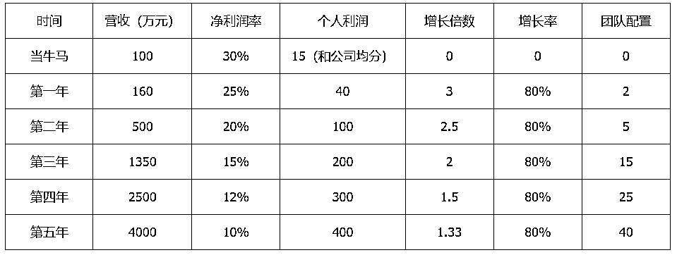

# 从生财到生才——我的生财创投笔记（二）

> 原文：[`www.yuque.com/for_lazy/zhoubao/opqukqsoc1edtnuf`](https://www.yuque.com/for_lazy/zhoubao/opqukqsoc1edtnuf)

## (27 赞)从生财到生才——我的生财创投笔记（二）

作者： 张昭

日期：2025-02-06

自从转型做创业制片人并孵化了不少圈友之后，有很多圈友会链接我，希望我可以提供一些关于创业、赛道选择方面的建议。其中有一个非常有共性的问题，今天拿出来分享一下，供有类似想法的圈友参考。

这个问题是：我想用五年的时间挣到 1000 万（净利润），我应该怎么做？

为了更好地解答这个问题，我跟圈友们分享一个我的做蛋糕理论，这样理解起来会更容易一些。

如果你想挣到 1000 万，且让这个事情看起来切实可行，那么你首先应该知道哪个行业能够承载和容纳你的野心和欲望，这就牵扯到一个非常现实的问题：有哪些财务上的 benchmark 值可以去界定和衡量？

我用一个表格进行了以终为始的数据拆解，看起来会比较清晰：

通过表格可以得出以下结论：

*****1、当牛马的时候，你需要是一个合格的牛马。*

_  _

你所处于的行业需要 30%以上的净利润率，且自己是一个优秀的单兵，能够创造出年均 100 万的营收，这才具备了用五年时间创造千万利润的最基础的前提条件。

你在当牛马的过程中，你其实并不需要考虑很多问题，只需要把业务做好即可，这时候，你的精力比较聚焦，会有更多的时间去专攻自己的业务，如果这时候你都表现的不够优秀，那么，一旦开始创业，事情多了，造成精力分散，你创造的价值会迅速降低，所以，这就要求你必须是一个优秀的牛马。

自己是优秀的牛马，还有另一个核心的作用：你可以树立标杆，吸引到跟你差不多人，否则你都很烂了，什么人会加入你这个团队呢？因为烂人只会吸引烂人。

这刚好印证了一句古话：男怕入错行，女怕嫁错郎。无论是入行还是嫁人，都是非常重要的选择，如果选错了行业，那你就只能苦逼哈哈的挣钢镚了。

PS：如果你不知道哪个行业值得你下手，那就去看看政府工作报告、上市公司的招股书、行业研报等等。别傻呵呵的进到一个行业，走了半天，才发现盘子太小了，那不是浪费时间么？

2、当你开始下场创业的时候，你要始终牢记几个指标： *年营收、净利润率、增长率、增长倍数、团队配置。*

_  _

（1）从你开始创业组队的那一刻开始，你就要意识到，除非你一直做一个单兵，否则一旦开始组队，整个组织的效率就会下降，这个是客观规律，无法避免。我设定了一个恒定值 80%。（其实这是很多组织都无法达到的标准）

（2）组织能耗的下降就意味着你的团队人数在增加、年营收在增加，但净利润率可能会更快的下降，因为这里面有很多无法避免的损耗在增加，比方说办公室政治。

（3）为了确保你的增长倍数，你不得不靠增加团队人员、推广费用、办公成本等，而这也会进一步消耗掉你的心力，结果导致增长倍数无法实现预期目标。

所以，要看你最舒服的状态是什么，在舒服的前提下，再去其他几个维度上去寻求优化的空间。

3、通过表格计算，5 年的总营收合计 8500 万，净利润 1000 万，平均净利润率 11.76%。比国内上市公司平均净利润率高出 56.8%。如果真的能做到这个数据，你已经很牛了。

PS：截至 2024 年 12 月 31 日，境内股票市场仅发 A 股的公司有 5160 家，加上 A+B、A+H 等多股份类型的公司后共 5392 家。2024 年 A 股上市公司营业收入总和为 60 万亿元，净利润总和为 4.5 万亿元，粗略计算 2024 年综合年度净利润率约为 7.5%。

综合下来，你要根据自己的管理能力去确定，你究竟如何达到各方面的平衡：

（1）如果你想一个人轻轻松松，做个一人公司也不错，只是你会面临遇到问题的时候，无人商量；

（2）如果你想小而美，组一个 10 人以内的团队，那么你大概率要进入一个高毛利的行业，不需要靠很大的营收就可以支撑起你的盈利目标；

（3）如果你想做一个稍微有点规模的公司，那么你就要搞清楚如何做管理、如何通过体系化的运营来降低能耗，更好的激励你的牛马去给你搬砖。

蛋糕理论的核心精髓在于以下三点：

1、以终为始的思想贯彻始终。

最大的蛋糕、胜利的果实是最后才能得到的，如果没有坚实的基础，你连开始的机会都没有。所以，目标可以远大，但是切口一定要小，要不你无从下手。

2、蛋糕的大小取决于操盘手的格局，更取决于行业的限制。

俗话说的好，再牛的师傅也烙不出比锅大的饼。你的格局会决定你看到多大的饼，行业的限制会主宰你能吃到多大的饼。如果你的格局足够大，你就会看到行业的限制，或许一开始就不会进入这个行业。

3、要用做蛋糕的思维而不是吃蛋糕的思维去看待未来。

做蛋糕的人会决定这个蛋糕究竟能做多大，吃蛋糕的人看到的永远都是已经成型的蛋糕。做蛋糕一定是开放性思维，吃蛋糕的人只能是存量博弈。

最后说一句：只有找到对的行业（行业天花板足够高、毛利足够高、交付相对简单、链条尽可能的短等等）、有对的战略规划（用更简单、试错成本更低、更容易获得市场正反馈的方式），加上超强的执行力（不要叽叽歪歪、不要玻巨婴心态、敢打敢拼），才能做大蛋糕，分到蛋糕，否则，你只能吃到蛋糕渣渣。

备注：如果想找我聊天，请把个人全部信息（原生家庭、后天家庭、婚育经历、人生规划等等）整理好、顺便加上盖洛普测试、MBTI 测试、生财里面所有跟我相关的帖子全部读一遍，写个读后感，拉平一下认知，再来找我。不要浪费彼此的时间。

* * *

评论区：

希平 : 拜读[呲牙][呲牙]