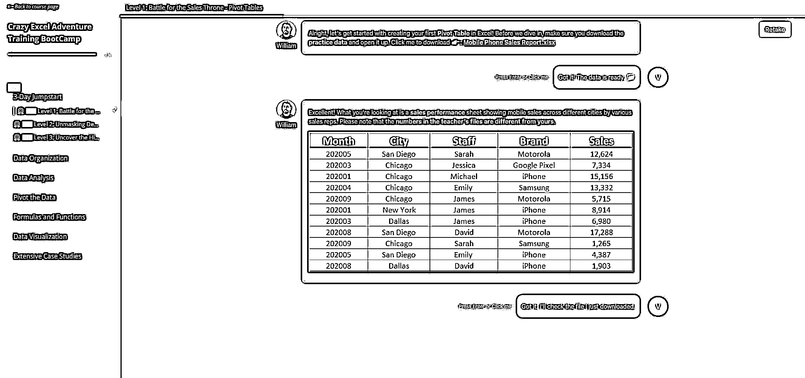

# 从大厂到副业下海，搞了个知识付费出海平台

> 原文：[`www.yuque.com/for_lazy/zhoubao/kv6wwu9s61f3nemw`](https://www.yuque.com/for_lazy/zhoubao/kv6wwu9s61f3nemw)

## (精华帖)(21 赞)从大厂到副业下海，搞了个知识付费出海平台

作者： QUICKER

日期：2025-02-05

它喵的，算起来入行第 10 年了。

过往都是以产品或者运营的身份，或在大厂，或者创业公司，做一款知识付费或者内容型的产品。以前在某大厂（名字就不说了，有辱斯文哈哈），操盘过某职场技能类知识付费产品，是该项目的负责人。小业务线，一年千把万收入，不多也不少，够养活一个十几人的小团队。

但正儿八经自己下场从头开始搭一款知识付费产品，还是头一遭。为别人做，和自己做，还真挺不一样。

**一、定位**

**  **

首先是坚定不移的选择出海这个赛道，因为在 2 年前，就意识到国内已经很难有机会了。自己手里的股票，也都是买的出海型公司，业绩都还不错；反观国内的公司，即时质地优秀，这两年利润不降就不错了。

瞅了一眼，海外知识付费蓝海一片哈，国内做的人很少，能挖到的有效信息都很少。

之前也考虑过做 AI 工具出海，毕竟 AI 现在是甚嚣尘上，自己又是产品经理出身的，又正儿八经做过出海产品的，自然会有一些这方面的冲动。

调研了一圈，包括身边的朋友，和圈内的现状，发现这个领域，已经不是个人单枪匹马可以干的了。广州深圳一大把做工具出海的，人家都是矩阵打法，一个 idea，衍生出 N 个产品矩阵，一个个的去测试。自己又不懂技术，技术上还得蹭一下我哥哥（他是干技术的），业余状态下，根本没精力做得好。

一个好的工具产品背后的技术开发、产品打磨，太太太太太费神思了。不建议没完整编制的野生团队贸然进入，至少得配齐产品+前端技术+后端技术+测试+运营，七八个人起步。别说你有个很好的 idea，不是说完全没可能，是概率上已经判了你会壮烈牺牲，我们得相信概率，而不是相信某个爆火的故事。

退而求其次，还想过 2 个赛道，一是做跨境电商，一是做虚拟产品出海。前者自己没接触过，链条也很长，这几年竞争也异常激烈，不敢贸然切入。后者想来想去，最后还是选择了课程类产品，毕竟自己做过嘛，熟悉。

那做什么类型的课程呢，看了下 Udemy、Coursera、Skillshare 这几个海外知识付费平台，发现大头还是技能型的课程，毕竟是刚需。其它也有什么类似于领导力啊、沟通技巧啊、时间管理啊这类课程，做是能做，国内一搜一把。

但是这里必须要考虑跨文化的差异，做软性课程，难度是比较大的，没有竞争力。选来选去，最后选择了技能型课程，也是自己曾经熟悉的领域。

所谓极简战略选择，可做，能做，想做，至少三者占了 2 样。

于是着手开始，搭建一款技能类的知识付费产品，名字就叫 VeryCareer 吧（Google 可以搜到）。

**二、对标**

**  **

做好定位之后，最重要的不是立马下场干活，而是去对标。

于是从 5 月开始，就在研究海外知识付费各种渠道，从产品，到内容，到平台，到竞对，到支付，到运营，大致都摸了一遍。Udemy、Coursera、Skillshare 这几个平台是没法直接对标的，人家是平台型公司，课程也是海量的，还有很多海外的垂直课程平台，比如 CG 动画类，烹饪类，课程制作的非常精美，或者非常接地气，但不了解海外背景，不好直接对标。

选来选去，选择了国内的几家公司。名字也略去不讲了，反正就是既有 K12 类大公司，也有垂直行业的创业公司，营收规模大概在 3000 万-1 亿之间。有 1、2 家公司的核心操盘手，我借所在公司（我还在职）的平台，仔细面试过，摸清楚了底细。

接下来就是，把它们的模式、课程、打法做个拆解，了解清楚对方是怎么做的，逻辑上来说，有没可能复制到海外。

从模式上来说，都是走小课-
大课的形式，这在国内 K12 是玩烂了的。但是这背后有个巨大的疑问，就是出海做知识付费，要做的这么重吗？背后的私域和销售，到底该怎么打？这背后有个跨文化的因素在里面。归根结底，就是走简单的知识付费轻交付，还是走在线教育重交付。这里埋个伏笔先。

从竞品来看，SKU 并不多，少的只有 3 个 SKU，三四十人的团队，能做到年入 1 个亿哦；多的有二三十个 SKU，团队几百人，一年也能做到大几千万。还有个团队，三十多人，只有一个 SKU（其它都是绿叶陪衬），一年也能做 3000 万，厉害。看了下自己，SKU 不在多，而在精。这个很关键，不然我这一摊事就没法开张了，毕竟我只有单枪匹马一个人，算上我老婆下班帮我捯饬一下，外加偶尔花点钱请人帮我干点活，也就三瓜两枣的配置。

从课程形式上来看，海外主要是录播课、直播课；国内这几家对标公司，主要都是交互式课程。首先，录播课，对课程制作要求比较高，毕竟你不能搞个中国人出镜讲课，老外也不信。直播课就更难了，口语、文化层面都是层层障碍。最后选择了交互式课程，因为它不需要真人出镜。也考虑过数字人的形式，后来研究了好几家海外做数字人的公司，据我的了解，目前最前沿、最顶级的数字人视频公司，也只能做到有点僵硬的口播，虽然逐步的有情感了，但是跟真人视频相比，还是差了很多的。因为老外肢体动作特别丰富，数字人视频一看就是假的。有这个精力，还不如请几个老外来录课。

总结一下，交互课，少 SKU，交付模式待定。

**三、平台选择**

**  **

做课程，最重要的事情就是选一个好的平台。海外的各种做课的工具，基本研究了个遍，有一个多月的时间，下班后到 12 点，都在研究、尝试各种平台，最后锁定了四家：Teachable、Thinkific、Kajabi、Learnworlds。

先说明一个点：你不可能自己去研发一套 LMS 系统的，因为它的功能可以很复杂，开发工作量很重、很重。除非你高举高打。

好了，言归正传，说下这几个平台的差异。

teachable 最傻瓜式上手，但是功能也比较少。最重要的是，它的官网模板实在是太朴素了，看起来呆呆傻傻的。很多插件功能都没有。

Thinkific 还不错，UI 精美，操作简便，很多实用插件，但是都要付费，费用还不低。缺点就是可定制化程度偏低，以及官网模板也有点朴素。Kajabi 没有仔细研究过，看起来跟 Thinkific 差不多。

Learnworlds 是这几个平台中，功能最全、最复杂的、定制化程度最高的。缺点也来了，复杂难用，光弄明白它都花了大半个月不止。还有一点最头疼的，因为它的功能复杂，代码很冗余，于是时不时莫名其妙的一些小 bug 就来了。我想定制一下课程播放页的 UI，莫名其妙的课程就进不去了。但是，抵挡不住它的一些实用功能，以及，它对 SEO 真的超级超级友好，一两天就被 Google 收录了。

在 Thinkific 和 Learnworlds 之间摇摆了一段时间后，最后还是选择了 Learnworlds。不得不说，海外这些平台，订阅费用还真是贵啊，一个月都要一千多 RMB。

选择了平台后，还有三道大关必须去解决，一是课程落地页制作，二是课程制作与上架，三是支付接入。

课程落地页方面，Learnworlds 的优势就凸显了，非常多的模板，是我用过的最好用的建站工具，我觉得比 wordpress 还简单好用，看看我的课程落地页就知道了。

课程制作方面，Learnworlds 的能力非常多，可以支持录播、直播、讨论、证书、习题，几乎你能想到的，它都有。但是，唯独不支持我想做的交互式课程。

怎么办呢？自己动手做一套吧！

于是充分发挥了自己产品经理的经验，写了一份需求文档，提交给我的哥哥，花了他一个月的时间，让他帮我开发了一套交互式课程系统和后台😂，前台页面如下图所示。支持对话式课程，支持纯文本、图片（PNG/GIF 等）、附件超链接、单选题、多选题、对错题。

后台功能更多，主要是围绕配置来展开的，就不一一细说了。

上文说埋了个伏笔，就是 K12 里是先 9.9 的小课，然后再转大课；知识付费是直接一票子的买卖。

这里我一直有些纠结，背后影响到的是，课程体系的设计，系统平台功能的支持，课程定价逻辑，交付流程的设计。

如果是 K12 的逻辑，那么我得先打磨一套前端小课，配套一个投放落地页，系统上得配置一个 1 美金的小课，得有私域来承接和做转化（这方面 WhatsApp 就派上了用场，WhatsApp 也有很多门道，这里就不展开讲了）。

如果是知识付费的逻辑，我就直接一套课，一个课程介绍页，一套定价，没有后端服务，完事了。

这背后涉及到，我的资源精力投入、所在验证周期、资金投入、我自己是否全职出来，等等。

**四、课程研发**

**  **

系统准备好后，就要准备课程研发了。课程研发，我可是认真的。先确定 SKU 选题，再确定人群画像，再确定课程大纲，再确定知识点，再磨课...扯远了，哪那么多事。直接拆解/学习竞品吧。

于是，课程大纲在 GPT 的辅助下，做好了，如下：

但是，光抄是不行的，毕竟跨了语言和文化，很多东西直接搬会有问题。

比如，课件里会提到身份证，五险一金。要知道，美国人可没这些东西哦，美国人的社保号、security
ID 都不会直接对外的，所以没法拆解出他的年龄出生日期。美国人要交的是联邦所得税、州所得税，税率也要符合美国的基本常识。美国人的名字，也不叫陈小红，而是 John
Smith 这些。

所以，说是搬，其实是二次研发。这个还是有点工作量的。

并且，课程脚本，也要好好地写一下吧？起码得符合美国人的口味、美国人的语境吧？

虽然 GPT 能帮一点小小的忙，然而，我发现实际上是在帮倒忙——GPT 太不稳定了，老是出错。

于是，课程研发，又持续了 2、3 个月。我下班后基本都在弄，我老婆带娃之余帮我搞一搞。

**五、支付**

**  **

只要你想收美刀，支付是绕不开的槛。但是支付不是什么热，你就去开什么支付，而是要看你选择的平台，支持哪些支付通道。

像 Thinkific、Learnworlds 这些平台，支持 PayPal、Stripe 这些支付通道。但是要申请下来，可没那么容易。一般大陆个人注册，都是会被驳回的。有两种方式，一是注册一个香港或者境外公司主体，这个就复杂了，也有很多风险，不建议没经验的人去折腾。另一个就是去弄个境外银行户头，再去弄个境外手机号，以及护照这些，去开个 Stripe。开通过程稍微有点曲折，就不详细展开了。

开通之后，集成到 Learnworlds，设置好课程的价格，自己沙盒、线上测试一下，看能否到账。折腾一下，一两个星期又过去了。

**六、投放**

**  **

补充说明下，最终我决定先走验证，我现在没法判断直接走知识付费，还是走 K12 的重交付模式。我先验证 PMF。

首选了 Google，开了个广告账户，投了两三千块钱，数据就不贴了。大概就是，通过 Google Tags 和 Google
Analytics 看到，用户通过广告关键词进来后，层层漏斗下去，抵达落地页-收银台-支付-
完课漏斗，整个漏斗模型不是很理想，1%都不到，按电商 1-5%的转化率，这个是不太及格的。我在想是不是因为 Google 的搜索广告过于精准，我现在还不知道用户画像长什么样，于是改投 Facebook 广告，给了 4 组广告，分别锁定找工作、职场晋升、工作提效、办公技能课程 4 大类，投出去，数据依然不是很理想，消耗了几十美金，我就停下了。

这里面不得不承认一点的是，第一，我对于广告投放，不那么熟悉。第二，我投入的投放资金，实在是太少了。因为不太敢烧钱去投模型。

说个插曲，2024 年 4 月份时我有创业想法的时候，我同学说找几个朋友给我凑个百八十万，支持我出来创业，但当时想法还不是很成熟；2024 年 11 月份，我又跟我同学见了一面，他提出个人出资 50 万，让我出来创业做这个课程产品。我有点犹豫，我同学也不是富二代，即使是富二代，亏了钱心里也过不去。我就跟他讲，我们先不要下这么大个决定，我们先边走边验证，当前最重要的是验证市场。我同学让我粗算了下验证市场需要多少钱，转手给了我 5 万港币现金😂我说这笔钱亏了你别怪我，有余我退给你。实在是花同学的钱有心理包袱啊！

更重要的是，这里面有两个问题：

1，我这个选品，是个竞争比较激烈的赛道，我的产品的差异化还没让用户感知到。虽然国内同行也跑出来了，但是还是要非常专业化的去做的。

2，我的市场能力，还有点弱鸡。

关于问题 2，曾经有去试过用 SEO 和 Reddit 引流的方式去做。SEO 是个长周期的活，且最好子页面足够多，SKU 一少之后，能做的极其有限，就只能借助博客了。博客也是个比较重的活儿，想了下，当前阶段不适合。去 Reddit 上试了试，暂时还没找到营销的门道，老是被 subReddit 给 ban 掉。也许是我没挑对 subReddit。收效有限，以及精力有限，就没再折腾了。

最终还是锁定投放这一单一市场策略了，费点钱，但是简单直接。

不过 12 月和 1 月，工作巨忙，开始搞各种年终复盘、年度规划，一晃这一年过去了。

**七、尾声**

折腾了大半年，市场还没打开，还没有拿到第一块美金，心里还是有点不是滋味。过去半年，熬夜没少熬，工作压力也挺大，也接了公司主 APP 运营负责人的活儿，手头的这个副业还没捋清楚，这路该怎么走，一时还么想好。

今天也刷了好一会 Reddit，有人在吐槽 coursera 和 udemy，说课程单调，每个证书都要付费，课程学不下去之类的。有个点慢慢的逐步清晰了，知识付费出海，个人小打小闹可能行不通，还是得搞个团队出来，而且得长时间扎下去专业化运营才行。得找个专业专职的课程研发，再把流量运营好好地、耐心的做一做。如果是 K12 的打法，再组个小前端团队，一个小后端团队。还得有个金主爸爸，投点钱😂，搞个小团队出来干。

1 月份的时候，小红书上有人跟我聊说他们七八个人的团队（3 个投手，4 个课程），去年做大健康赛道的知识付费，一年赚了 400 万，毛利润大概 40%。跟我说今年想做欧洲市场，做新的课程，想买我开发的上课系统，但是他要定制的东西有点多，而且还得给他托管服务器（他们没有技术团队），实在是没精力给它弄，所以就没再谈下去了。

* * *

评论区：

QUICKER : reddit 上有人这么回复我："A glance at the online education sector reveals a vast blue
ocean, with competition still relatively mild and scarce actionable
intelligence." Was this post AI-generated? The online education sector is
anything but a "vast blue ocean", and competition in the online education
sector is overcrowded and fierce. "Actionable intelligence" is available and
very easy to access, assuming you aren't an AI model that lacks proper
training in the online education space.
知识付费出海，真的靠谱吗？我看国内都在宣扬，海外知识付费，目前是个蓝海市场。这个结论靠谱吗？有没有比较了解的专业人士？

夜未澜 : 优秀的人，有主业作为支持的前提下去搞，保证了经济基础，同时精力上虽然没有那么多，但是很好的尝试了，假以时日应该会看到结果的