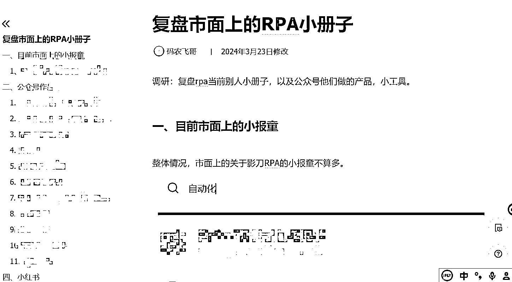
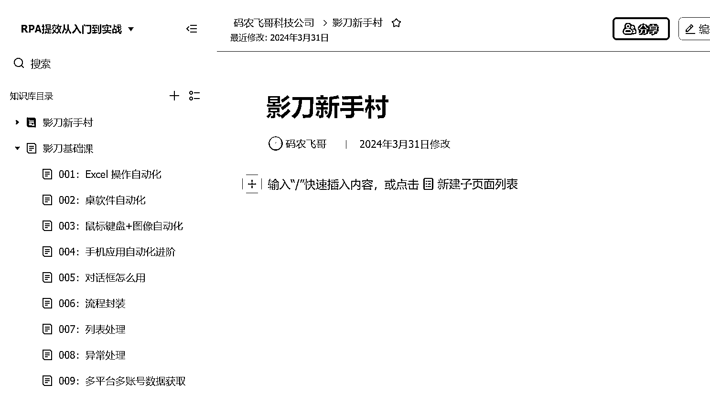
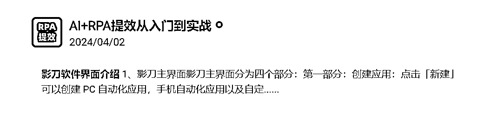
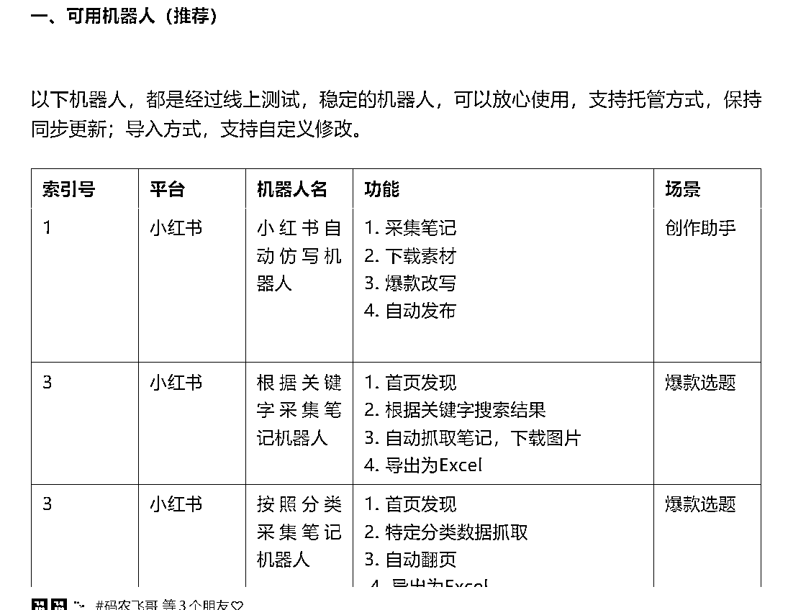
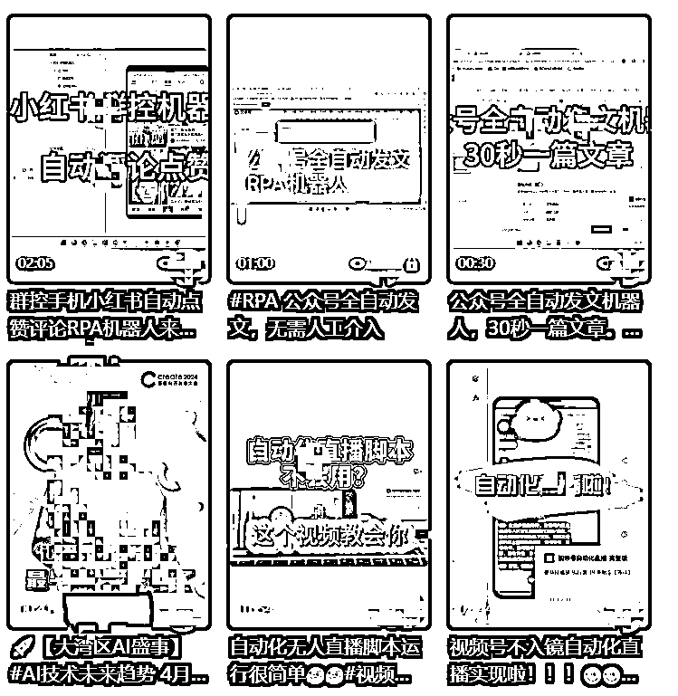

# 2024 年我的 RPA 生财之路

> 原文：[`www.yuque.com/for_lazy/zhoubao/xyafhcytah4ocmdv`](https://www.yuque.com/for_lazy/zhoubao/xyafhcytah4ocmdv)

## (19 赞)2024 年我的 RPA 生财之路

作者： 码农飞哥|RPA 定制

日期：2025-01-21

大家好，我是码农飞哥，大厂在职程序员，目前主要从事大模型应用开发。副业提供的服务主要有毕业设计服务，RPA 定制开发服务。

我的标签：

1.  大厂程序员

2.  CSDN 博客专家

3.  爱折腾的大龄码农

我的过往经历是就是一个普通程序员瞎折腾的黑历史。

我写过博客，写了 7 年的博客，在博客平台也积累了 14 万粉丝，但是大部分是僵尸粉，变现不强。

我卖过毕业设计，卖过成品的毕设源码，也接过毕设定制，赚了一些米

我也接过商业广告，曾经，给金主爸爸写一篇推广文报酬 2K+。

可是这一切如过眼云烟，2024 年广告减少，博客流量不行，我一度陷入深深的忧虑之中，我将自己重新清零，以一个小白继续出发。

2024 年对我而言是实现副业商业小闭环的一年。回望 2024 年感慨良多，我将站在素人小白的视角来梳理一下 2024 年做过的那些事，走过的那些路。

# 一、找准定位锚定赛道

## 一）找准定位

小白搞副业的第一件事情就是找定位，定方向。一个没有方向的船最终只会迷失在茫茫大海里，直到燃油耗尽。

凡事预则立，不预则废。老师让我做的第一件事情就是梳理个人过往情况，写一篇个人 IP 文。

IP 文写完之后我重新认识了我自己，也让更多的小伙伴了解到我，认识到我。

IP 文写完之后，老师给我的定位是：继续吃技术饭，整理好公众号现有的技术文章，形成一个合集，然后就是出一个自己的 RPA 小报童，做软件定制的工作。

## 二）个人小报童诞生

2024 年我出了自己的第一个小报童，关于 RPA 的小报童，目前订阅量 600+，这个订阅量对一个小白而言，也是一个小小的突破。



下面，我将对这个产品的前世今生娓娓道来，以此给 2024 年做一个总结。

### 1、找准需求

任何一个产品的出现一定是市场上有相应的需求痛点之后，然后才有产品形态的出现。

也就是说没有需求，没有应用场景的产品大概率会黄掉。

比如：人们不想下楼去小餐馆吃饭，这就诞生了外卖；人们想躺在床上购物，这就有了电商网站，人们不想走路，这就有了交通工具。

产品的诞生一个是有需求痛点，有应用场景。另外一个是需要技术可以实现。这两者我认为缺一不可。

不能实现的需求痛点要么是镜花水月，要么成为人类不断追求的终极目标。

举个高频的痛点场景：长生不老是古往今来权贵人士孜孜不倦的诉求，但是，就目前而言还没有技术可以实现这个场景。

回到我这个产品，2024 年大环境是啥情况相信各位圈友都有切身的体会，降薪裁员，降本增效成为 24 年的主旋律。

打工人都被巨大的不确定性，深深的焦虑感都笼罩。这时候左手职场，右手副业，打造个人 IP 的概念应运而生；

自媒体小白们纷纷立志在自媒体的沙漠中树立自己的 IP，淘到一份金。

公众号搞起来，小红书搞起来，视频号搞起来。

**找对标，抄同行，选最热门的赛道，抄最牛逼的同行。**

手动一条条的找对标笔记，一篇篇文章的手动编辑发布还是有亿点点累，有亿点点烦，有亿点点浪费时间。

这个时候能够解放双手的机器人（RPA）就应运而生了。机器人帮我们干活，我们躺着赚钱，何乐而不为呢？

我做的第一个 RPA 机器人应用是小红书爆款笔记采集机器人。卖了不少单。然后，我就顺势推出了自己的小报童 RPA 小报童。

**这里想和跟我一样的小白说一句掏心窝子的话：****多看生财精华帖，多看生财风向标****，这真是一个宝藏社群。我们要做的就是****发现需求，顺势切入。**

### 2、输出产品

需求确定好之后，接下来就是打磨输出我们的产品了。产品不知道怎么做还是那百试不爽的好办法：**找对标，抄同行，同行就是我们最好的老师。**

这里我有几点小心得想跟各位小白圈友分享一下：

#### 1）找对标，拆解同行

1.  先找对标，分析拆解对标账号的作品，模仿借鉴他们的风格。我在做这个小报童的时候调研了不下十几个同行竞品。

拆解对标产品，可以让自己知道市场愿意为哪些产品买单，不为哪些产品买单，从而可以确定自己产品应该输出方向，避免闭门造车，造成市场不认可。

#### 2）输出内容大纲

接下来，我们可以着实输出自己小报童的内容大纲了。我当时在就是在飞书文档里将框架本小册子的大纲都列出来。大纲列出来之后我随即找大佬审核下，大佬确认没问题之后，我就照着大纲来更新小报童了。

前期最好每天更新一篇小报童，后面更新到 10 篇左右就可以找大佬帮忙发售了。

#### 3）一些小 tips

关于小报童的申请，创建，我这里有几个小 tips 可供大家参考借鉴下：

1、专栏的头像需要清晰可见，一般推荐 蓝底白字或者绿体白体，这样的话，别人看到你的小报童推广页面一眼就能看清楚你这小报童是个啥。
制作头像推荐使用**稿定设计 或者 创客贴** 。

2、专栏名称需要简明扼要：比如我这个小报童的定位是 AI+RPA 提效，那么我取的专栏标题就是《AI+RPA 提效从入门到实战》。

3、专栏简介：专栏简介需要清晰地说明，专栏的制作人是谁，专栏的定位是啥，专栏适合哪些人群。专栏对读者有啥帮助。大家可以可以参考下我的这个小报童专栏。

4、打开合伙人模式：众人拾柴火焰高，让小伙伴们帮你一块分销，就可以快速地让你的专栏被更多人所知道。分销比例一般设置为 50%及以上。

# 二、变现闭环的一些操作

产品出来了，接下来自然就是拿出来卖了。小报童是一个低客单价的产品，相对而言比较容易卖。

## 一）找 KOL 发售

当我们自身势能不够的情况下，我们可以通过购买一些大 KOL 的合伙人，让他们去帮忙推荐我们的小报童。

小报童发售的渠道有很多，比较常见的路径是：

1.  以直播公开课的形式在公域上获取客源

2.  将粉丝们拉到微信群中进行集中分享转化

3.  通过涨价策略刺激购买

4.  制定分佣策略，小报童的分佣比例一般是 60%，除此之外还有额外的分销奖励。

## 二）公域引流

公开发售结束之后该如何保持持续的客源呢？ 我的做法有如下几步：公域引流，朋友圈装修。

一句话总结就是，**前端引流，后端成交。**

### 1、公众号发文

我在自己的个人公众号上持续不断地发 RPA 相关的文章，将自己做好的 RPA 机器人通过图文的形式发布出来。

有的文章是某个具体的机器人的使用手册，以及部分的实现逻辑，有的文章是一个 RPA 的产品合集，

粉丝看到我的公众号之后，对我的 RPA 产品一目了然，有需求的自然会通过底部二维码找到我。

### 2、视频号展示效果

在视频号上通过视频的形式展示机器人的效果，现在是短视频时代，视频号的流量还是蛮大的，我们通过视频的形式展示机器人的实现效果，这样直观清晰，有需求的人一看就能明白。

#### 1）视频号踩过的坑

但是，视频号流量虽大，里面的坑也很多，我们一不小心就会掉进坑，轻则限流，重则封号。这里说说我曾踩过的坑。

1.  在视频里留微信号：虽然视频号是微信的，但是在视频号里明目张胆的留微信号大概率会被判定违规的。

2.  在评论区里引导关注：比如在评论区里说 评论"666" 送机器人啥的，这类也是会被判定违规。

我视频号玩的不算多，就被限流了好几次了，最常见的限流是：**账号被减少推荐** 。



这种限流的处理方式是： 十条原创视频➕如下解封文案

官方大人你好，视频号是一个正能量的短视频平台，很开心可以在这样的平台里展现自己，由于本人自己的疏忽作品中可能存在「与视频号内已发表的视频高度相似」的问题。

现在我已经认识到自己的错误，以后我会好好审核作品内容，做一个正能量的创作者，我已经按照平台规则，发布了十条原创作品，雷同的视频我都已经处理了。

望审核人员给正在努力的我一次机会，帮我账号恢复正常，以后我会认真审查视频内容，遵守视频号社区规范。



### 3、小红书图文包装

小红书作为当前图文领域的 Top1，上手容易，粉丝消费力高，我这边就是将机器人的几个关键效果截图组合成一篇图文笔记发到小红书上。

小红书粉丝的消费力还是刚刚的，从小红书上引流的客户成交率特别高。

公域的操作完成之后，就静静地等待客户的到来把，静待花开。

## 三）朋友圈装修

朋友圈就像是我们自媒体人的家，家里装修的好坏直接决定了别人对我们的第一印象。

一个装修良好的朋友圈会大大增加新好友的信任感，提高成交率。

朋友圈主要是告诉别人你是谁，你有哪些产品，这些产品适合哪些人，你取得了哪些成绩。

别人一看你的朋友圈，人靠谱，产品满足他的需求，价格合适，这不就妥妥的成交了么。

## 四）升单操作

10 块钱的小报童客单价还是太低了，一般而言，都会有后续升单的操作，我这边也不例外，在完成小报童的初始粉丝积累之后，我随即就开通了自己的 RPA
训练营。训练营累计 100+人报名。

# 三、2025 年展望

2025 年已经到来，新的一年新的开始，在此立下如下 flag。

1.  私域粉丝达到 8000+，目前 4800+。

2.  读 20 本书，认知，技术，历史类都不限。

3.  公众号粉丝破万，视频号粉丝也破万，公众号更新 100 篇文章

# 四、给和我一样的小白们一些建议

## 一）保持聚焦

锚定一个主赛道，持续不断地去深耕，去输出，机会很多，但是只有我们能把握住的机会才属于我们，切记不要啥都搞，啥都浅尝辄止，因为这样是赚不到钱的。跑通一个小闭环之后再去开启下一个闭环。

## 二）锻炼基本功

啥是基本功呢？我认为的基本功就是：沟通能力，输出能力。我们可以通过不断地写作输出，锻炼自己的文字表达能力，通过不断地参加交流讨论，锻炼自己的沟通能力。

## 三）慢一点不用怕

这年头，太多人教你如何快速赚钱，诚然想赚快钱是人的天性。但是，基础不扎实的情况下可能不仅赚不到钱，还有可能到处交学费。

## 四）不要盲目付费

付费之前先想一想，这个产品可是你需要的，你可有时间跟着学习，如果拿捏不准的话，那么可以找一个 KOL 问一问。别忙忙碌碌一年都在给别人交学费了。

新的一年，祝大家都能发发发。

* * *

评论区：

小树 : 怎么联系

码农飞哥|RPA 定制 : 联系鱼丸就可以了