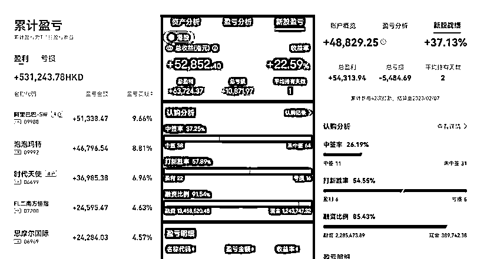
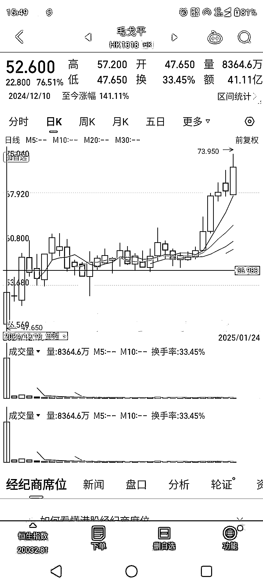

# 金融低风险套利---《港股打新策略》

> 原文：[`www.yuque.com/for_lazy/zhoubao/ugg7vp1gqdrykokx`](https://www.yuque.com/for_lazy/zhoubao/ugg7vp1gqdrykokx)

## (12 赞)金融低风险套利---《港股打新策略》

作者： 股丰登【老吴说投资】

日期：2025-01-24

# 前言

在 2019 年至 2021 年期间，港股打新策略表现极为出色。当时，投资者可以使用多个账户参与打新，几乎所有参与者都获得了丰厚的收益。我们当时也全程参与其中，收获了一大笔可观的利润。

遗憾的是，自 2021 年起，港股市场遭遇了一轮近乎“腰斩”的熊市行情，港股打新的赚钱效应也随之戛然而止，从之前的盈利模式逐渐转变为亏损局面。参与人数和认购热度也随之大幅降温，跌至低谷。然而，最近随着毛戈平的上市，这一沉寂已久的打新策略又重新引起了市场的关注。毕竟，毛戈平的一手中签率高达 100%，上市首日股价暴涨 76%，累计涨幅更是达到了 92%。所有参与申购的投资者都获得了可观的收益，其赚钱效应确实非常显著！

现在有不少新投资者加入港股打新的行列。对于经验丰富的投资者来说，港股打新似乎是一件很简单的事，但对于新手来说，可能需要花费不少时间去理解。当时，许多朋友前往香港办理银行卡，当时机票、住宿和餐饮费用都很便宜，顺便旅游一圈后回来开户打新。如今，那些早早就参与港股打新的投资者早已赚得盆满钵满。那么接下来，我们将讲讲港股打新得整个思路。

因篇幅较长，请移步飞书阅读：

[`wiizueiq5ks.feishu.cn/docx/LFqVdWDOco4Zx0xosVycsZayngh?from=from_copylink`](https://wiizueiq5ks.feishu.cn/docx/LFqVdWDOco4Zx0xosVycsZayngh?from=from_copylink)

* * *

评论区：

吴海晖 : 飞书链接无法直接点击进入哦，是灰色的，不是蓝色的

渊杰 : 现在主要是看基本面猛打了

股丰登【老吴说投资】 : 已经可以了