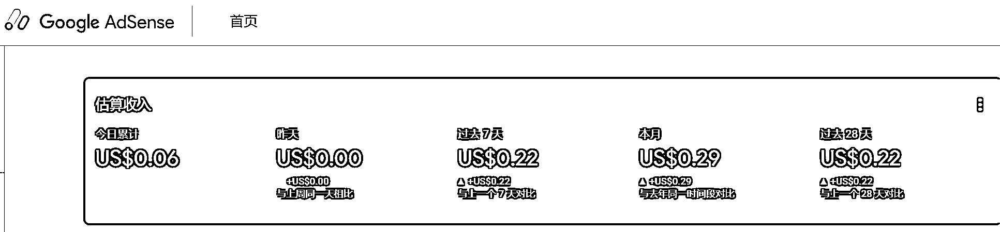

# 参加 Cursor 航海后-做了个 AI 文字生成透明 PNG 图片生成网站加国外支付

> 原文：[`www.yuque.com/for_lazy/zhoubao/xl01bn7abt1mwcsn`](https://www.yuque.com/for_lazy/zhoubao/xl01bn7abt1mwcsn)

## (精华帖)(33 赞)参加 Cursor 航海后-做了个 AI 文字生成透明 PNG 图片生成网站加国外支付

作者： 一鱼两吃

日期：2025-01-20

大家好，我是一鱼两吃，生财透明人第一次发帖。AI 文字生成透明 PNG 图片生成网站的想法-
变现全过程，Cursor 航海期间看到教练分享了一个“硅基流动”大模型超市，可以直接调用各种大模型 API，但是上面的 API 都是文生图、文生视频之类的。后面偶然又刷到了一个老外做的网站可以直接生成透明 PNG 图片网站，(对标网址和成品网址都在最下面)，突发奇想自己能不能做一个一样的。

万事开头难？不可能，其实很简单，因为后面才是绝境。

说干就干，经过对比硅基流动上面的各大模型 API 的优劣，最终决定选用：black-forest-labs/FLUX.1-dev（FLUX.1 [dev]
是一个 120 亿参数的 Rectified Flow Transformer
模型，能够根据文本描述生成图像。）。直接写了一个“README.md”文档，把初步想法和要调用的 API 相关信息：模型、请求地址、以及 API 文档上的一些关键信息与大框架写在了里面，避免 Cursor 失忆和“心血来潮”给自己乱加功能。“README.md”文档具体是怎么用的我也是一知半解，因为我也是问的豆包，依葫芦画瓢弄得，就是一个说明文档或者计划书吧。

第一步想法实现

直接打开 Cursor，把包含 README.md”文档的文件夹拖进面板，施加咒语：根据“README.md”文档的要求开发一个文生图网站，因为提前在”README.md“文档里面详细写了需求和 API 关键信息以及 API 文档链接，Cursor 咔咔咔一顿输出，简单的网站首页就输出成功了，测试了下，嘎嘎 OK，但是麻烦也随之而来，文生图是实现了，但生成的并不是透明 PNG 图片。避雷提示：用 Cursor 或者 Windsurf 开发项目到一半的时候，一定要在”咒语“后面添加：不要乱改已有的代码和功能。不然它两到中途都有抽风乱删乱改的行为！！！能把人气的跳脚啊啊。

第二步骤 搜索大法

怎么实现去除背景？开始是问 GPT4O，发现市面上并没有直接可以生成透明 PNG 图片的大模型，但是 SD 生图模型有个插件可以实现，看了下流程，是要用 CFUI，看完头更大了只能放弃。接着又去搜索免费的抠图模型，一搜还真又收获，一个是成”RMBG“还有一个是”BiRefNet“，都是抠图实力选手，关键他们还是开源的。好吧连夜找了点学习视频，不出意外出意外了，虽然 B 站有很多博主把这两个抠图的做成了一键启动包，但是对于我们这种没有编程知识的菜鸟来说，不会把它弄成 API 调用就等于白瞎。题外话：个人感觉 RMBG 抠图总体而言比 BiRefNet 要好。因为弄不出 API 调用，所以就没有然后了，折腾了几天，想想不心肝，最后又去”GitHub“上找答案，最后发现 RMBG 有人对接好了 API，哈哈。我直接就拿来用了。

第三步骤 成功生成透明 PNG 图片

首先通过 FLUX.1-dev 生成图片，再将 FLUX.1-dev 生成图片返回的地址提交到 RMBG 进行抠图，最后再呈现抠图后的 PNG 图片。这句话应该写开头的，但是写开头大家看了就跑路了哈哈哈。通过优化调整，批量生成 4 张透明背景图片的速度比模仿的对标网站速度要快很多。嘎嘎，接下来就是给网站加后台加双语言。后面这些几步就不写了因为都是用 Cursor 去生成的。

第四步骤 对接国外支付通道和谷歌账户登陆

说到国外支付通道，我也是掉了几根头发才搞好，开始是在生财里面搜国外支付，找到了 paypal、Stripe、Payoneer 还有个英文名很长的支付平台，经过了解发现不适合我们新手，又跑去翻以前的航海实战手册，看看有没有类似的文档，最后找到了生财实战里又一个”工具站出海“发现有大佬分享用[`ko-
fi.com/`](https://ko-fi.com)做了一个老照片修复的网站，我跑去找鱼丸要[`ko-
fi.com/的相关资料，`](https://ko-fi.com/的相关资料，然后)然后”鱼丸也不会捏
超纲啦疯了“，于是生财和 AI 查了下资料注册了一个 ko-fi 账户，因为它要绑定 paypal，又注册了一个 paypal 账户，借助网页翻译发现 ko-
fi 有一个程序通知的功能，刚开始也不懂这个”通知“功能干嘛用的，直接复制丢到 GPT4O 里面才晓得是个什么作用。就是别人在网站上给你捐款，可以通过它的 ko-
fi”通知“功能，实现给网站自动充值的功能，于是屁颠屁颠的又用 Cursor 对接了 ko-
fi 的这个功能，从而让网站实现了别人捐钱，网站就能自动给用户充积分的功能。

ko-fi 国内要上梯子才能用。

第五步骤 变现

很遗憾，目前变现为 0.哈哈哈。虽然借助工具站出海的航海手册进行了推广，每天有 40-50 个 IP 访问，但是目前一毛钱都没有收到。反而是我用 Cursor 开发的另外一个网站实现了 0.2 美元的广告费变现哈哈哈，别问为啥中间有几天没广告费，因为我手贱把 ADS 的 txt 文档给删除了，今天才又加上。上图上图

第六 总结

写这个贴子的目的是 2 个，一个是看亦仁在鼓励大家发掘 AI 应用，一个是想大家帮我找找问题，网站是哪里有问题为啥别人不充钱（1 毛钱都不给我），顺便记录下自己的开发过程。欢迎大家留言交流。代码方面给不了大家帮助，这块我也是个新手村。

对标网站 [`pngmaker.io/`](https://txtpng.com/)

我做的网站：[`txtpng.com`](https://txtpng.com/)

用到的”硅基流动“大模型平台：[`cloud.siliconflow.cn/i/3miICqqA`](https://cloud.siliconflow.cn/i/3miICqqA)

赚了 0.2 美元的网站：[`freepngzone.com`](https://freepngzone.com)

最后的最后给大家打打气：加油努力拉屎要用力，实在不行放个 P。。。

* * *

评论区：

暂无评论