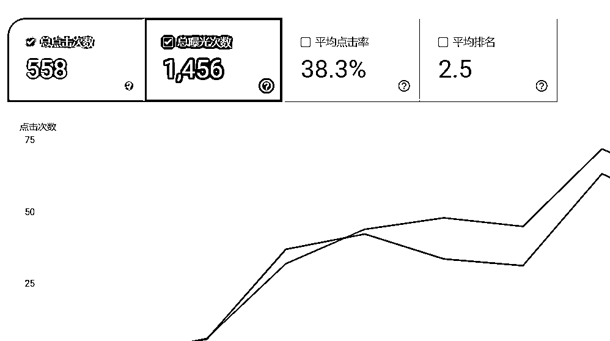
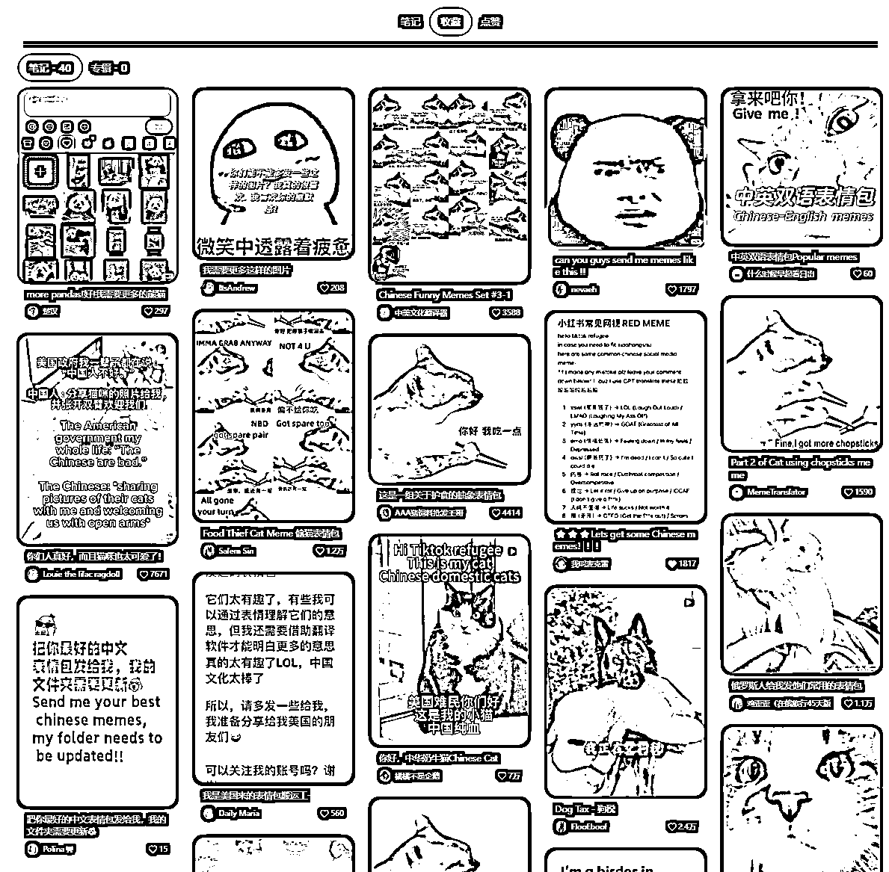
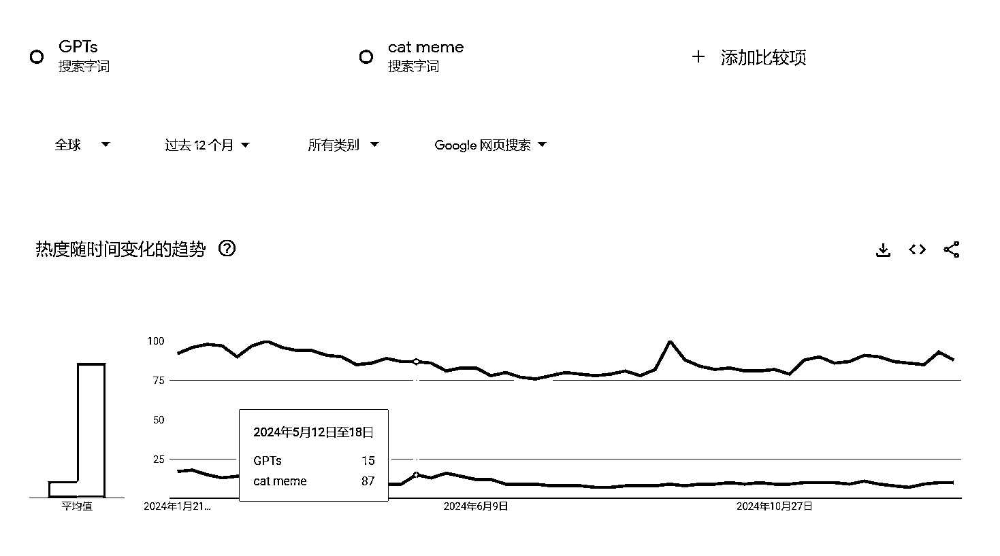
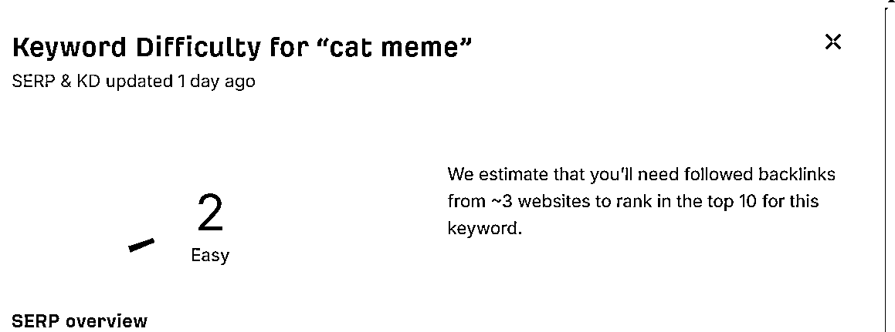
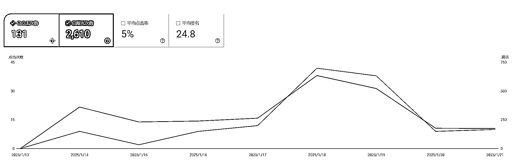

# # 龙珠悬赏 03 猎龙计划 2

> 原文：[`www.yuque.com/for_lazy/zhoubao/xeztzr4bs8gbngmg`](https://www.yuque.com/for_lazy/zhoubao/xeztzr4bs8gbngmg)

## (15 赞)# 龙珠悬赏 03 猎龙计划 2

作者： 彩笺

日期：2025-01-23

本文分为**两部分**

上期我做了一个 AI 鸡尾酒吧，在那之后我多出来了很多的思考和实践，一两句话很难概括清楚，但是我觉得这些内容非常的有价值；昨天晚上关于这部分的所有内容，自动的在我的脑海中变幻、演化；就像是，最近的一些思考、实践、网站具体的数据、一些灵光，全部全部碰撞到了一起，发生了一场大爆炸。

我做的新网站的过程分享。上次，我严格按照龙珠悬赏要求的内容格式来写的；具体的过程，和用到的方法，在上篇中都有写，这篇，重点会放在挖掘需求上。

上期链接：[`t.zsxq.com/rrujF`](https://t.zsxq.com/rrujF)

## 第一部分 自上篇之后的一些思考

### SEO 优化

众所周知，网站的元数据中；title，description 是最先呈现给用户和搜索引擎的；再之后是页面文本；爬虫通过你的页面文本介绍，来知道你的网站是做什么的；应该分配什么词的曝光和排名给你。在我过去做的那些垃圾网站中；差不多我能把 SEO 做成 60 分的样子。

这 60 分是怎么做的呢？很简单。我的页面所围绕的关键词是确定的；参考着他人的网站，以及自己猜也能猜出来的大概的内容要怎么写；再加上使用 Cursor 编程时，会 AI 智能补全，它会预测我要输入的下一个单词是什么；所以 60 分的
title、description；以及页面的文本描述（faq feature）不难写；甚至你只需要写上关键词；然后一直按 tab 就好了。

那我如何才能从 60 分，做到 80 分；甚至 90 分呢？

我好像没有仔细思考过这个问题，但是我从我的一个网站内页，结合过往的实践；我似乎找到了一个还能行的答案。

以前我经常用百度，去找一些资源，或者信息。很离谱的是，在搜索结果中，有很多的广告，完不成我的需求的网站，我需要一个个甄别。在打开之前我做过的最多的一个动作是什么呢？是看 description。
来看 description 的描述，和我要做的事情，关联度有多少。

在我 60 分的 SEO 中，我的 description 大抵也是围绕关键词来写的，用人话说就是；写两句通顺的贴近用户需求的自然语言，中间包含关键词。

此刻我再去回过头来看我的 description；如果我是目标用户，我应该会想再往下翻翻看看。用我自己的两个网站举个例子吧。

**栗子 1：**

我刚出海的时候写了个 BAC Calculator；这是一个通过输入你的体重、性别、喝了多少酒来计算血液酒精浓度含量的计算器；现在的 description 是：

`Most Accurate Blood Alcohol Content (BAC) Calculator - Calculate your estimated blood alcohol level accurately. Get instant results.`

`最准确的血液酒精含量 (BAC) 计算器 - 准确计算您的血液酒精含量。立即获得结果。`

如果我这么写：

`输入体重、性别、饮用的酒精，立刻得到准确的 BAC 结果`

我想在这样的情况下，我更乐意去点开这个网站；**因为我寻找的就是一个工具；通过我的喝酒信息来计算 BAC** 。如果是之前的 description，我可能会想？这到底是不是个工具站呢？还是一篇关于 BAC 的文章呢？

**栗子 2：**

我这个月上了一个游戏网站；一个最近小火的一个游戏；恕我无法分享具体的词；这个词最早是圈友阿泽 KK 分享给我的。

我除了首页是游戏之外，我做了一个内页，这个内页为我带来了不少的流量。游戏的一个成就，需要回答一些随机的问题，并且要全部回答正确才能解锁成就。

我的这个内页当时写了 title、description 之后，网站内容只有问答列表。我并没有写 faq 等信息来突出关键词密度。但是；我的这个内页在相关搜索中，排名第二；下图是最近的数据。

在我 google 的搜索结果中，title 还是那个 title；但是 description 不是我自己写的，而是 google**聪明** 的将我的的页面最开始的文本放到了 description 中；从搜索结果中来看就是一个问题的具体问答。

答案很明显了，如果我是玩家，我来找攻略的时候，我看到这个 description 中包含了问答，我肯定会很乐意打开这个页面，大概率就是我想要的。

多好看的图啊，这点击率，这排名；可惜这个网站我不打算做了。**洗洗睡吧，不是我的菜。**

## 降服心猿意马

昨晚，下面这几个想法在我脑子里面打了一架：

*   我做了十几个站，从老的需求，到新的需求，从几十名，到前 10 名，但是没有一个站，能排到前三，因此没有一个网站的流量能大到过 ads 审核，也一分钱没有赚到。

*   为什么做不到前三，google 的排名是很复杂的，但是总结出来也不过是两个大点：1\. 用户在你的网站的行为数据 + 2\. 你的外链

*   你找了一个需求，根据你当时的 SEO 水平，对竞争、对流量的预估，做了一个网站，但是你就是懒，就是不愿意持续的发外链、持续的做 onpage 优化、深入的用户需求分析、用户数据分析

*   你单纯是行为上懒惰吗？不止吧，你也知道前面的大部分网站都是练手用的、此时你的基本功还在持续的进步，这也意味着可能此时回头看，有些网站可以放弃了。

*   为什么不愿意持续的做 onpage 优化？究其原因，也绕不过一个**不乐意** 。**什么情况下你可以把一件事情做好呢？这个网站，你就是他的核心用户，有些深入的东西只有你能洞察到，核心洞察+一定的 content research** ，你就能写出来用户会点击的文章，用户觉得好用的功能。

*   拿上文提到的两个网站举例，

*   你只是看到了这个需求，并做了基本的满足

*   BAC Calculator 可能也没特别深入的用户需求，到这就到顶了，后面就是持续发外链了，换句话说你跟第一名在网站上的功能得分一样，但是人家做的早，有很高的权重。拿什么打过人家？费了老大劲，可能也就是站到了人家屁股后面的位置，是只有这个网站能做了吗？

*   **第二个数据很好，但是你就提不起来兴趣去做，这意味着你或许能忍着恶心做一定的 onpage 优化，但你一定干不过那个喜欢做这个关键词的同行，而你却要经历一次又一次的自我折磨，同时这个需求也没有泼天的流量，让你以 50 分的结果去分到一杯羹。**

*   猎龙计划 1 的网站，其实最近停了一段时间没有更新内容，一部分原因是在搞一个新的网站，另一部分原因是：

*   你在上篇提到了冷启动思路，但是关于 onpage 的部分，写的太虚了，按照那个思路更新的网站内容，也没有太高的竞争力，**人家也有，凭什么看你的** ？

*   看过这么多网站了，只要有一个网站，一个月能有几十 k 的流量，绝对可以有收入了

*   在哪看到的来着，硅谷的那些超牛产品，很多都是**为了满足自己而开始的** ，同时小排老师也分享过他的思路：不去发外链，而是做到很好、最好，靠用户自发传播。**必须得承认，不乐意，就是不乐意，既然不乐意，就去找自己的兴趣所在，怀着鲜有人能比我做的更好的心态，去做** 。

*   **出海就像是挖金矿，很多老金矿，在他们年轻的时候，他们经历过，所以他们可以做到很好，新老一辈之间一定存在文化差异。作为年轻人，肯定存在一些需求，一些内容， 那些老站长不太容易发现，即使发现了，理解也没有年轻人理解深。那里才有我的位置。**

*   **前两天还跟大铭前辈聊，这些老站长，总会有老的一天，新时代的网站，需求；我感觉肯定需要年轻人来顶班。**

*   是时候收束心思了，少看一些新需求，别再想着上新站了，练手也差不多到位了，接下来重点思路应该是先：

*   根据此时此刻你的实践，把你不乐意搞的，不值得搞得，全部放弃掉。

*   聚焦于最后的一两个网站，在一定的时间内，死磕！

*   在思路、以及对需求洞察的念头生发下，只要方向不错，可以肯定能看到数据攀升。

最后，**你应该能在下面这个网站上，看到部分心猿意马的影子。**  **Have Fun.**

# 第二部分

此部分是猎龙计划 2 的正片。**相比于上一篇，我会更多的分享一下我是如何挖到这个需求的。**

## 前：新网站的起因

大家都看到了，tiktok 被 ban，大量用户涌入了小红书，涌入的第一天，google
trends 上的 rednote 关键词一柱冲天。当时犹豫要不要上个站。这是一个品牌词，并且是一个产品，一个平台；暂时是不会有太多的能围绕着 rednote 写的内容的；并且 rednote 不一定能接住这波滔天覆盖，tiktok 也不是一定就会被 ban。这些其实很多大佬都说了，仁哥在社群也说过。

想着感受一下其中的流量变化，买了这么多域名了不差这一个，并且这件事情的发生，肯定会带来一些变化。抱着这样的心态，于是我买了个域名快速上了一个站。

网站刚开始，我写了三篇文章；分别是教人如何修改昵称，更改语言设置，以及什么是小红书。最开始能干的基本也就这些了。

运气比较好的是，还真给我得出了一些验证；通过后台数据，得到了一个结论：

**对于这样的情况，这样的新词，新站是不太容易拿到排名的，用户对于 rednote，并没有很强的，比较实际的需求，只是单纯的想知道 rednote 是什么，和 tiktok 的对比等等信息。一些老牌的媒体网站，可以很快的写一篇文章，依靠自身权重拿到相关搜索的排名和流量。一个新站在这种情况下是没有什么竞争力的。**

但这个站并不是到这里就结束了。

## 中：随之而来的演化方向

### 需求挖掘

我平时看小红书比较少，这件事情热起来之后，我第一时间下载了小红书，并且每天都花一些时间在其中刷外国人相关的帖子。

在这其中有一些现象：

*   互相发作业的

*   外国人交猫税的

*   互相对仗的

*   找翻译的

*   加好友学中文的

*   发表情/表情包斗图的

其中**表情和表情包** 引起了我的注意。

**外国人也玩表情包，并且看起来不是一小部分的，而是挺多人** 。先看下我随便点的几个小红书收藏，以及 trends：

根据第一张图，可以扩展到很多的关键词和需求，图片就不列了，有兴趣欢迎大家自己去看。

我列举一些我当前已经做到网站中的关键词：

*   cat meme

*   chinese meme

*   panda meme

*   **rednote emoji**

*   doodle meme

额外多说下**rednote emoji**

在 rednote，tiktok，facebook 上，搜索关键词你会发现很多人都很喜欢小红书表情。**那么有没有必要把这个功能做到网站上呢？**

我当前的答案是**肯定** 的。[`tiktokemoji.com/`](https://tiktokemoji.com/) 这个网站收集并分享了超多的 tiktok 上的 emoji；两个平台很相似，tiktok 能行，rednote 应该也能行。

**并且这个网站是 24 年注册的网站，非常具有研究意义。**

## 竞争对手分析&变现预估

这里就不赘述了，上一篇写的挺详细了。

让我感到很抱歉的是，自从上一篇之后，我又新学到了或者研究到了一些新的，来判断竞争、流量的方法，后面我会考虑单开一篇文章分享，**请让我再多走两步** 。

（想看的评论区发个表情对一下暗号？hhh）

见上一篇：上期链接：[`t.zsxq.com/rrujF`](https://t.zsxq.com/rrujF)

### 我为什么要做？

有流量是事实，都是可以验证的

我看到了有一部分内容，**我可以做的更好** 。中国的年轻人文化中，表情包是相当丰富的一环，我们有太多的好玩的 cat meme, chinese
meme....

上一条从小红书最近的内容就可以看出，有一部分外国人发帖求中国的这些好玩的表情包。

竞争应该会少一些，我一个年轻的中国人，上学的时候就在玩表情包，那些老站长，外国人应该没我这么懂，同时他们也不一定会乐意做这方面的网站。（大胆猜测）

这些所有的功能点对我来说都不是很难，借助 AI 和爬虫；我可以比较轻松的收集表情包，为表情包生成描述。

表情包具有很多的长尾词，毕竟人们期望比较精确的找到他印象中的某个表情包，**我还没做过这样的长尾词图片网站，我想尝试一下**

## MVP

这个网站其实我已经做了有两天了：[`rednotes.app/`](https://rednotes.app/)

在这两天内，我陆续上线了：

*   小红书使用教程

*   rednote emoji, chinese meme, panda meme, cat meme, doodle meme, text meme

*   对于 rednote meme, 我把 gif 和 jpg 放到了一个页面内，图片文本描述，从小红书获取了最原始的图片 emoji 文字。

*   对于表情包，当前大部分的表情包都是在一个页面内只有图，没有很贴切的文字描述

*   下载功能

在上一篇猎龙计划中，我写了 MVP，后续的冷启动思路，但是我觉得还是不够精准。所以在这篇中，我直接把后面每一步要走的路都列出来，这样也方便我去践行。

### 后续方向

*   把 rednote 的每一个 emoji 都单独做一个长尾词页面

*   为表情包，使用 AI 生成比较详细的文字描述，而不是在 cat meme 中，每一张图的 alt 标签都是 cat meme

*   每一个表情包，单独做一个页面，同时基于上一步生成的描述，再用 AI 为他们分类，在每个表情的页面，下面添加“相关推荐”

*   一个新功能，随机表情包

*   更多的 meme，像是 new year meme? 这个功能会比较靠后，并且要看有没有搜索量和受众

*   站内表情包编辑工具，方便用户直接在我的网站上进行编辑

### 其他

先看下当前的数据表：

曝光和点击攀升的那段，是我在持续的上新内容，有数据攀升说明我应该是做的没错的；

后面有一段曝光和点击下降，是因为这两天刚摸到**更好的 seo** 的瓶颈，我对页面 SEO 做了挺多的修改，并且这两天还会有一些改动；google 需要重新评判我的内容。有下降也是合理的。

这个网站还没有发过外链。

另外，这两天修改 SEO 之后的出词有点怪，有一些词没有按照我的预期出来曝光，另外网站主页主要是写 rednote 相关，如果这部分问题过两天还不正常；**后续我可能会换域名** ，切换到 meme 相关。

最后，欢迎大家给我提意见，比如如何规划这个图片网站？有什么更深入的功能可以上？目前还处于尝试多一些的阶段，各位的建议或许会帮我少走很多弯路，不胜感激。

#龙珠悬赏

* * *

评论区：

书虫 : 写的很 nice

蒙德 : 暗号: hhh