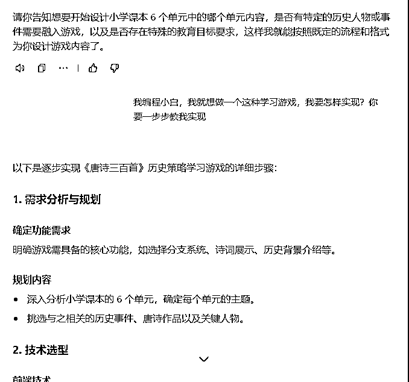
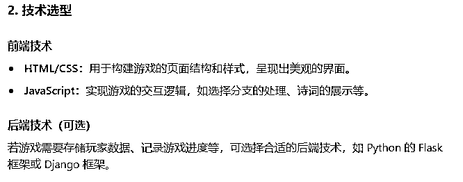
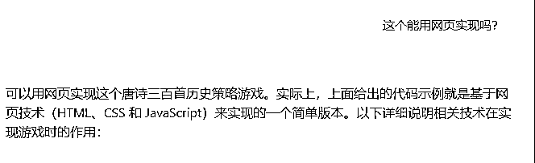
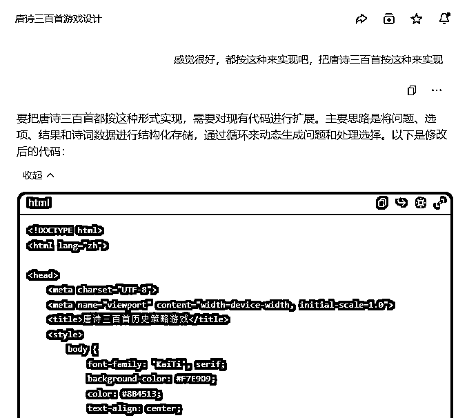
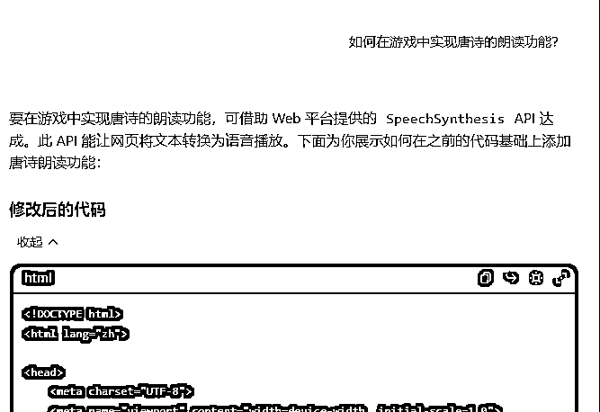
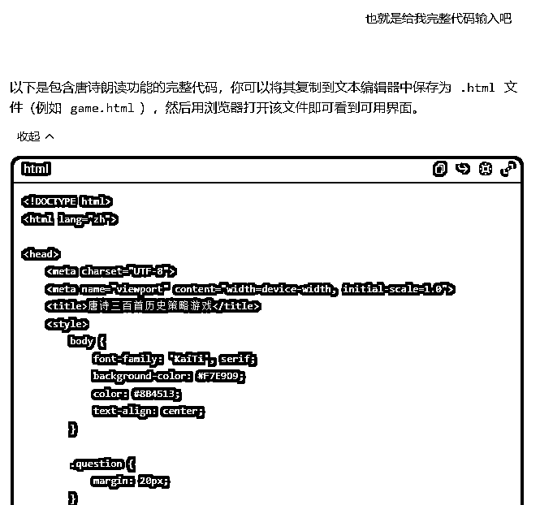
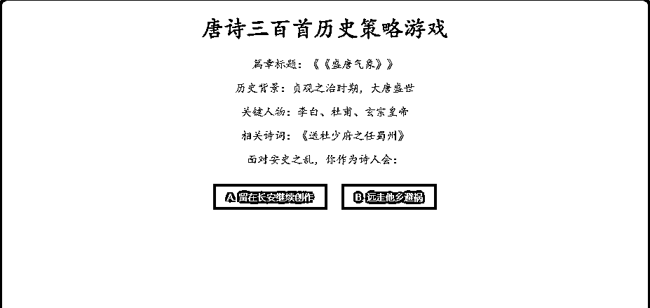
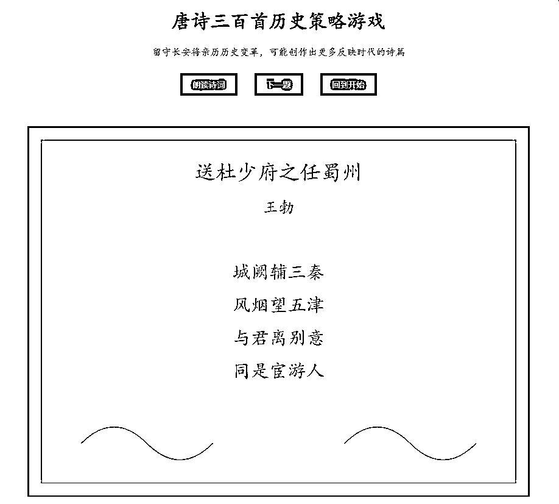
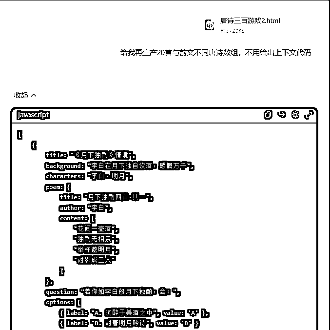

# 利用 AI 创建唐诗三百首策略游戏

> 原文：[`www.yuque.com/for_lazy/zhoubao/qfxufpxpdngwmwx2`](https://www.yuque.com/for_lazy/zhoubao/qfxufpxpdngwmwx2)

## (9 赞)利用 AI 创建唐诗三百首策略游戏

作者： 大老朱

日期：2025-01-24

大家好，我是老朱。

昨天看到周知大老给出 AI 的方向，可以用 chatGPt 做成游戏玩，老朱尝试用国内的 Kimi\豆包，没法直接应用。

刚好豆包有 AI 编程，我直接上手试试能否生成一个直以可以玩的。

一开始直接喂提示词没法直接生成。  images.zsxq.com/FhuOB3fMe32nMp_kl5rbWw1lijZS)

然后我把提示词转化成文字，给豆包。  images.zsxq.com/FjSnVtkP_H_MUL5k5vS-m2z0c4sM)

结果还是这样提问，我忘了说明我是怎样的，然后重新给提示词，让豆包一步步教我实现。

给出 2 种技术，我选择网页（HTML），为什么不选 JAVA，因为我也不明白 2 种有啥区别，瞎选的。

然后我想把作品分享给朋友，直接问豆包怎样实现。

给出 2 个方法。

方式一：使用 GitHub Pages 部署

方式二：使用本地服务器分享

我没有 GitHub，本地服务器不方便，问豆包是否有其他方法。

给三个方案，

1. 使用 Netlify 部署

2. 使用 Vercel 部署

3. 通过本地文件分享【做成网页】

然后告诉豆包生成三百首代码，给拒绝了，只有几首的代码。

问了怎样增加唐诗数量，给出方案  images.zsxq.com/FtJE4rHrXLcLJDu59jUYxtZVj9FQ)

然后豆包增加朗读功能 

功能完成了，让豆包一步步教我生成可用界面  iX2BZHR9rzK)

让豆包给出完整代码。

成品效果

把网页文重新提交给豆包，让它生成 10 首新的古诗，增加游戏可玩性。

成品让小孩玩了 5 分钟也没结束，不错。  xWIyK844)

这是代码块，有兴趣可以存在 文本文档.txt，改文件扩展名为 XX.html 就可以玩了 #龙珠悬赏 #AI 编程

# 唐诗三百首历史策略游戏

*** 评论区： 暂无评论