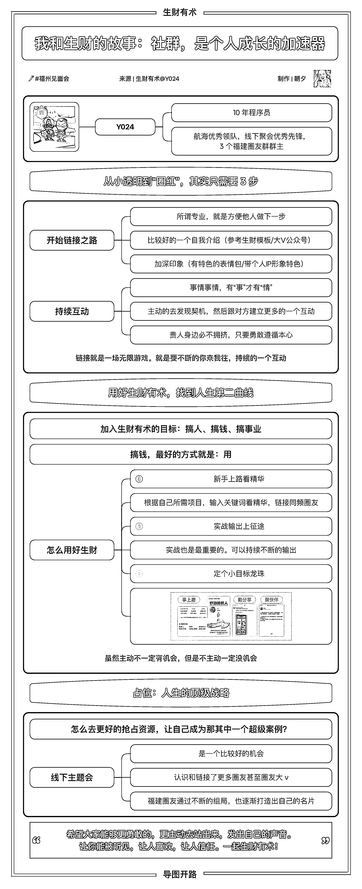
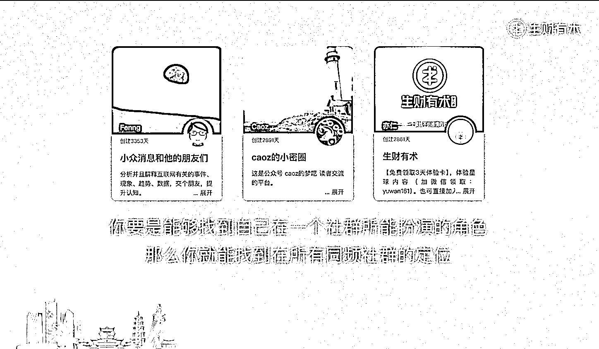
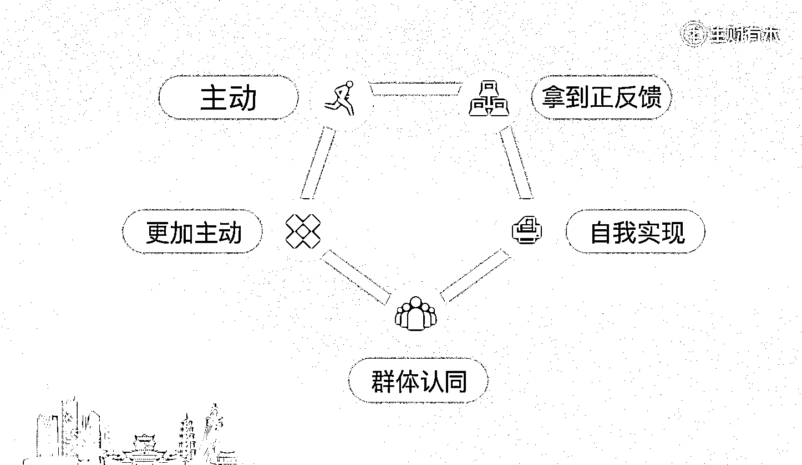
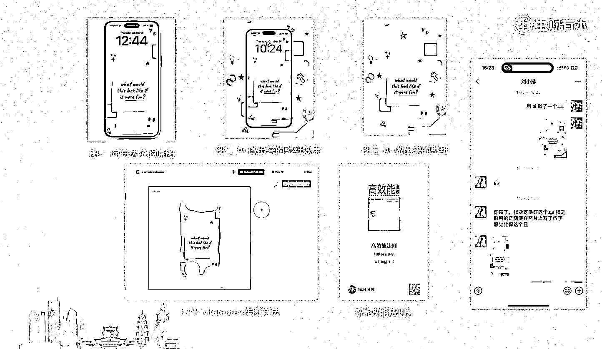
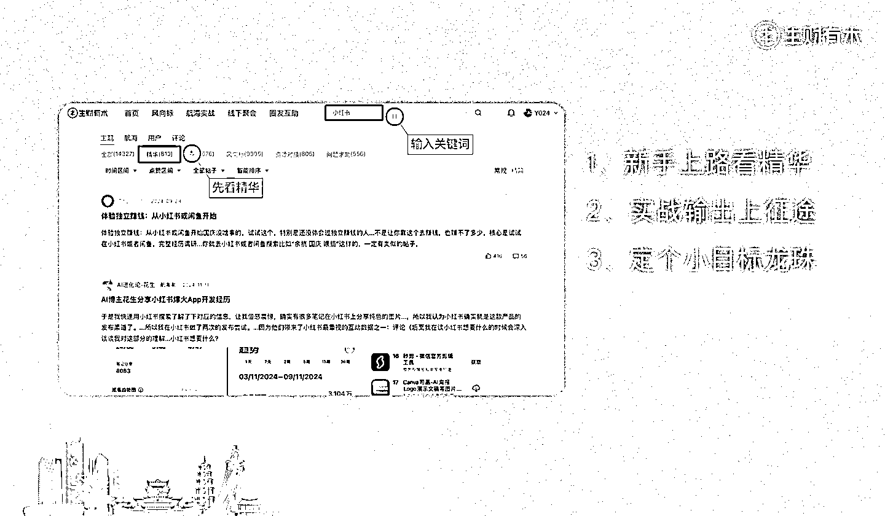
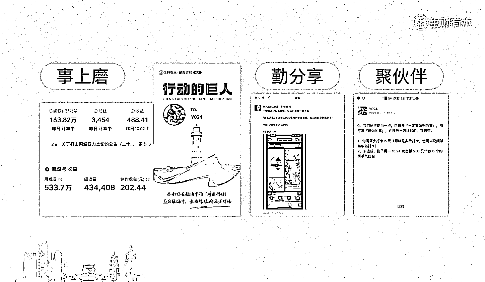
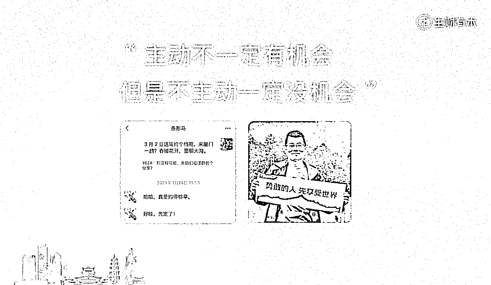
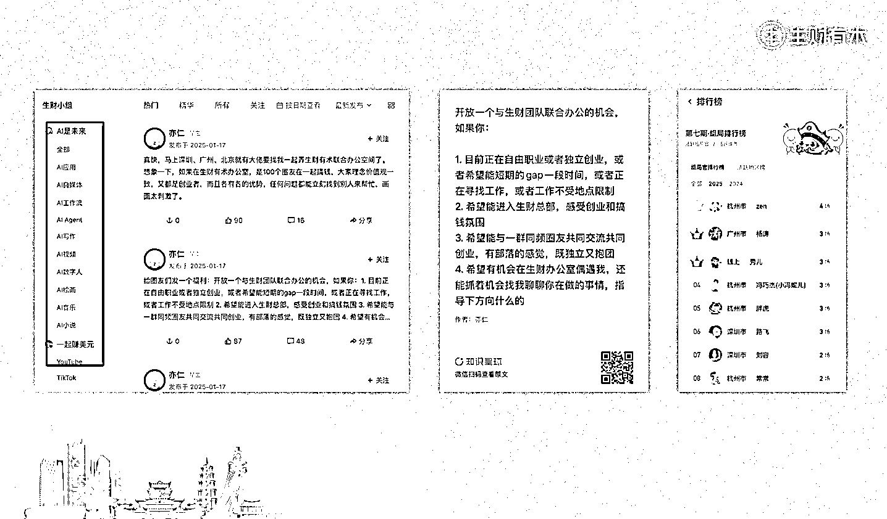

# 我和生财的故事：社群，是个人成长的加速器

> 原文：[`www.yuque.com/for_lazy/zhoubao/gvoees49tcsg2nhh`](https://www.yuque.com/for_lazy/zhoubao/gvoees49tcsg2nhh)

## (精华帖)(64 赞)我和生财的故事：社群，是个人成长的加速器

作者： Y024

日期：2025-01-23

大家好，我是 Y024， 10+年程序员，航海优秀领队，线下聚会优秀先锋，3 个福建圈友群群主。

收到 霜仔@8nana 邀请在福建圈友见面会分享的时候，作为一个 i 人我是拒绝的，就回了一个“你不要乱来”的表情，她眼里就只看到了“来”。

作为一个多次享受被生财“逼”着走出第一步的人，也作为一个“试试看成本不大”的成熟航海人，那我就来了。

嗯，在 200 人的排面拉满的生财有术福建圈友见面会做了**人生第一次分享** ，这次分享的主题是：我和生财的故事。

希望这次分享，能让大家都勇敢一点，在生财找到自己的生态位，享受到社群带来的各种红利。

**「所谓专业，就是方便他人做下一步。」** 先奉上生财内容小伙伴帮忙做的脑图：

以下是这次分享的内容：

* * *

大家好，我是 Y024，大家可以叫我 YY。

作为一个 i 人，我曾经觉得成长会是一个孤独的旅程，但是加入生财之后，我发现我方亦（e）仁（人）会保护我方 i 人，生财成为了我们 i
人的成长加速器，不仅让人成长得更快，更重要的是成长得更好，超乎你想象。

希望通过我的故事，大家都能勇敢一点，在生财找到自己的生态位，享受社群给大家带来的红利。

# 从小透明到“圈红”，其实只需要 3 步

### 怎么知道亦仁的生财有术？

因为是程序员，平时会关注一些技术信息，然后关注了冯大的技术博客，跟着知道了曹大。很喜欢曹大的风格，后来曹大开了小密圈（也就是现在的知识星球），就第一时间加入了。加入了曹大星球之后，在里面知道了亦仁，并见证了亦仁的生财快速冷启动。以至于当初还有一个帖子讨论：曹大星球能否再出现一位亦仁？

不知道大家发现没？冯大、曹大、生财的圈子，冥冥之中它们好像有某种神奇的相同。这就是社群神奇的地方，而我不仅在生财圈子活跃，在曹大星球也是这样的活跃，前段时间曹大核心读者群开放圈友入群，才帮助圈友加入曹大核心读者群了，正在组织曹大星球和生财星球的篮球赛，欢迎大家加入。

所以，**你要是能够找到自己在一个社群所能扮演的角色，那么你就能找到在所有同频社群的定位。**

是的，正如亦仁说过的“[本质上，我们这群人是因为价值观相同才聚到了一起，这群人在一起，能量会大到你（无法）想象。](https://t.zsxq.com/ll1fc) ”

我想这就是链接的底层逻辑，我们有共同的价值观认可，然后能聚在一起，持续不断的去碰撞，去搞事情。

我先加入了志愿者，在里面主动帮忙进行一些解答，然后成为了航海志愿者小组长。在抖音大航海 1.0
中主动尝试开灯、熄灯文案编写，并成为掌灯仙官，后来还上了生财内部分享案例。

主动的发现、主动的出现，然后有了被看见。体验到了真诚利他的价值观，自我实现然后更加积极主动，就形成了一个很好的良性循环。

从此命运的齿轮开始转动，开始了我的链接之路，让我享受到了很多社群的红利。

### 开始链接之路

我们怎么开始链接？**所谓专业，就是方便他人做下一步。**

**  **

我们要相信链接就是一场无限游戏。就是要不断的你来我往，持续的一个互动。所以我们在链接的时候肯定第一步想的就是怎么方便他人认识对方，认识我们，所以一个准确的比较好的自我介绍是最前提的一个条件。

生财官方有提供的各种各样的模板，我们只要遵循那个模板去精心调整一下就好。然后最重要的话就是说我们要尽量控制在一屏里面，这有一个黄金半屏的法则。就像我们搞项目一样，做文案类项目的话，开头要暴击。做视频的话，开头要有所谓的「黄金三秒」。

有一个自我介绍的话是很重要的，其实最重要的话就是我们要提前去做一些功课，可以去微信生态里面看看大 v
的公众号。评论、赞赏都是可以比较快吸引对方注意。比如，像我都是赞赏
10.24。一是这数字不是整数，别人一般会比较好奇。二是如果对方刚好听过这个梗，大概会猜测我应该是个程序员的。三是 10.24 和我的网名 Y024
念起来，大家就会发现其实这是个谐音梗。成本很低，而且也很容易给对方制造了记忆点。

**能输入的地方，就能运营。** 就像条形马老师不仅网名玩谐音梗，连头像也玩。明明是马大爷，非得弄个长颈鹿的头像，你们说这叫啥？不是指鹿为马是啥？槽点满满，一下子大家就记住了。

像我在每周一到周五的航海日志点评里，就用了一套胖胖的奥特曼的小表情，一开始的时候会有一个奥特曼「我来了」的表情，最后的话会有一个胖胖的奥特曼「溜了溜了」的表情，这样子的话其实是有点好玩的，也可以拉近一下跟其他人的一个关系，AI
绘画那期就帮助一位 i 人圈友快速融入生财氛围，成为当期航海榜一大哥，后来也主动参与了航海领队、航海教练等等。

而最最骚的，要属涛哥了，他的微信昵称、头像、拍一拍、群昵称、表情包，连发言行文风格也很独特，他的每个细节都在给人制造记忆点，抓人眼球。还记得最近的千人照片墙不？我花了很大力气还是找不到自己的头像，但是一眼就认出涛哥的头像，想必你们也有这种感觉。

### 持续的互动

我们链接的人，链接到的话，这个其实还没算完，我们最重要的话就是要有一个持续的互动。通俗点讲，就是**事情事情，有“事”才有“情”** 。就是我们要主动的去发现一些事情的契机，然后跟对方建立一个更多的一个互动。

举个例子，刘小排老师最近在星球发了个帖子，名字叫[《越快乐才越成功》](https://t.zsxq.com/maqal)，里面提到了《高效能法则》（英文名《Feel-
Good Productivity））作者阿里**·** 阿布达尔的手机壁纸，有不少圈友想要壁纸，就在评论区里面说“求手机壁纸”之类的。

我自己也很想要，我就先自己尝试找了下，结果没找到。那么，我和其他圈友一样，也是想到找小排老师要。但是我不一样的地方是，我把我做的尝试罗列出来：

1、以图搜图找到了一个官网邮件获取订阅，通过邮件订阅发的资源链接找不到壁纸资源；

2、通过 instagram、Facebook 私信阿里**·** 阿布达尔，自动获取到了一个地址，但是同样也是没找到手机壁纸，就给阿里**·**
阿布达尔也私信留言了，但是没有回复。

然后去找小排老师问有没有原图手机壁纸。好巧不巧，小排老师说他也没有原图，他自己做了一张，但是比较私人不方便分享。

这个时候，我就想到万能的枸杞了，就找他帮忙，他找了一圈也没找到。不过他给我秀了一手，用 AI 仿了一张手机壁纸，然后我就现学现卖自己也仿了一个。

重点又来了，我又做了个不一样的事情，我把这个过程也反馈给了小排老师。

你们猜，怎么招？哈哈哈，第二天，他突然给我说我赢了，他觉得我做得比较好看，然后我做的壁纸就沾着他的光上了生财公众号，同时也上了鱼丸朋友圈，你们可以用“刘小排”关键词搜鱼丸朋友圈去看下。

（PS：聊天记录截图已获得刘小排老师授权）

# 用好生财有术，找到人生第二曲线

我们加入生财有术的话大概有三个目标，简单一点就是说搞人、搞钱、搞资源。

搞钱的话最好的方式就是：用。

怎么用好生财？

简单总结的话会有三步

### 1、新手上路看精华

第一步的话可以就是：看。主动根据你自己所需要的项目，然后去[生财索引站](https://scys.com/)输入对应的关键词，去看对应的一些精华帖，然后在你看精华帖的过程之中会发现你感兴趣的方向，或者特别对胃口的一些圈友，那你就可以点开他的主页，持续的深入交流。

### 2、实战输出上征途

其次是把手弄脏，下海实战（也是最重要的）。实战的话你可以持续不断一个输出。

### 3、定个小目标龙珠

最后的话可以定个小目标，就是看怎么安排自己，做一个复盘分享。

下海实战的话，通过事上磨之后，就会有对项目的一个体感，项目是什么？是怎么做的？会有一个较深的感触。这时候就可以主动把它分享出来。然后这个分享的过程的话，就是相当于你可以加深自己对这个项目的理解，还有就是可以获得更多的曝光。找到伙伴一起做项目降本增效。大家协作起来可以提升我们搞钱的速度。

希望大家都可以主动一点。**虽然主动不一定有机会，但是不主动一定没机会。**

**  **就像去年福建圈友年会，我邀请条形马老师，就是本着初心大胆的问了一句：3 月 2 日这周约个档期，来厦门一趟？春暖花开，面朝大海。

他就用了一句“哈哈”的“废话“，然后马上就说：好哇，先定了。

在生财这个真诚利他的一个氛围里面，其实做事是很容易的，主要是你要勇敢，要主动。就像曹大有一个表情包说的，**勇敢的人先享受世界。**

**  **

（PS：聊天记录截图已获得条形马老师授权）

# 占位：人生的顶级战略

作为一个超级链接者，也是作为一个成熟的圈友，我们应该要知道生财的风会吹向哪里？怎么去更好的抢占资源，让自己成为那其中一个超级案例？

其实线下主题会是我们一个比较好的机会。从我自己本身的话，其实也是线下组局的一个最大受益者。通过参加篮球局，认识了涛哥。通过航海线下组局，成为了福建圈友群主。通过首届福建年会，认识和链接了更多圈友甚至圈友大
v。

24
年咱们福建圈友通过不断的组局，也逐渐打造出自己的名片。比如，厦门组局名片陈导@陈思成，福州组局名片冰哥@Ben（星球编号：36450），泉州组局名片源哥
@追风少年 O2，行走的 AI 布道者登哥@一登 Eden。

希望大家能够更勇敢的，更主动的站出来，发出自己的声音，让人听见，让人喜欢，让人信任，一起和生财做时间的朋友。

我一直以来都是一个腼腆中略带一点点羞涩的 i 人，我今天都可以站在这里，我相信大家也都是可以的。

最后的话，谢谢大家，谢谢生财，下次再见。一起生财有术！

* * *

评论区：

宜澄 : 还得是 Y 哥[旺柴]

Y024 : 试试看，成本不大[社会社会]

黄小鱼🐠 : 一大早就吃上了厦门特产，Y 哥还是太全面了[得意]

Y024 : 作为成熟的圈友，咱花亦仁的钱是专业的。 刚好见面会拿了秀儿一个大红包，还有 MD 的大红包，借花献佛。[机智]

霜仔 : 哈哈哈哈 e 人眼中只能看到自己想看到的，把我方 y 送上出道大舞台！

剑知 : 同为程序员，新人学习。

蓝弈 : 还得是 Y 哥[旺柴]

轻舟 : Y 哥，也是程序员啊[社会社会]