# 不再卡顿的Deepseek 💻📱

> 来源：[https://r0rel9lqdms.feishu.cn/docx/A7Q4d4czyojgGXxPOWQc7mTlnGb](https://r0rel9lqdms.feishu.cn/docx/A7Q4d4czyojgGXxPOWQc7mTlnGb)

# 💻电脑端 Cherry Studio + 硅基流动API

## 🔧工具准备：

1️⃣下载并安装Cherry Studio

下载地址🔗： https://cherry-ai.com/download，选择合适的版本下载即可

⚠️在比较Chatbox、Anythingllm、Cherry Studio后，Cherry Studio有汉化使用及电脑版可训练知识库这两个主要功能，个人有更好的使用体验，所以最终推荐安装Cherry Studio

2️⃣注册硅基流动账号

硅基流动官网：https://siliconflow.cn/zh-cn/

推荐原因：调用模型不卡，而且里面各种大模型，随便调，使用的时候也只需要设置一遍API Key，方便。

⚠️我的邀请链接🔗：https://cloud.siliconflow.cn/i/mpN7Zqif，我的邀请码：mpN7Zqif，双方赠送2000万token，由于使用过于顺滑，已经开始氪金了，感谢扩列🌹

## ⏩操作步骤：

### 1️⃣Cherry Studio调用API Key

请根据步骤打开到以下界面：

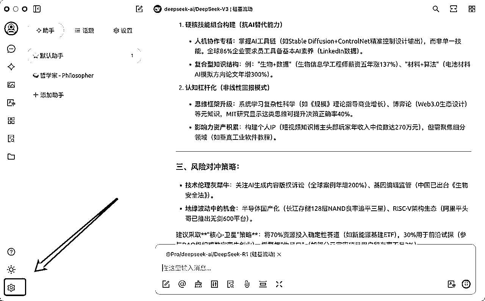

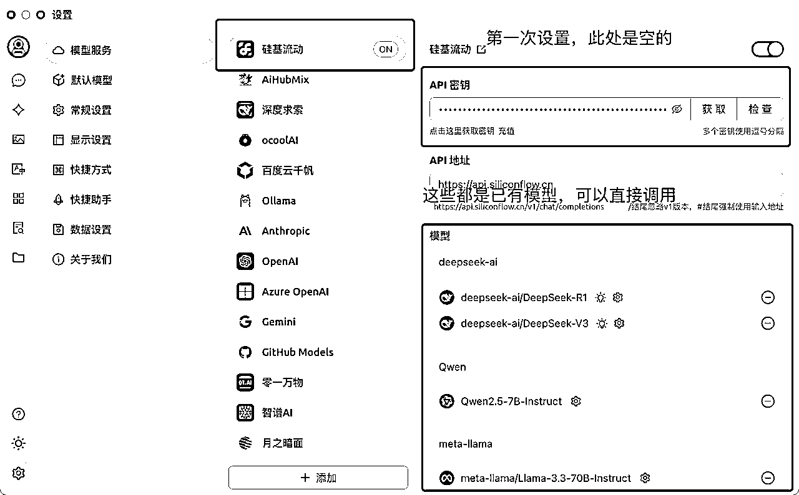

### 2️⃣复制硅基流动API Key

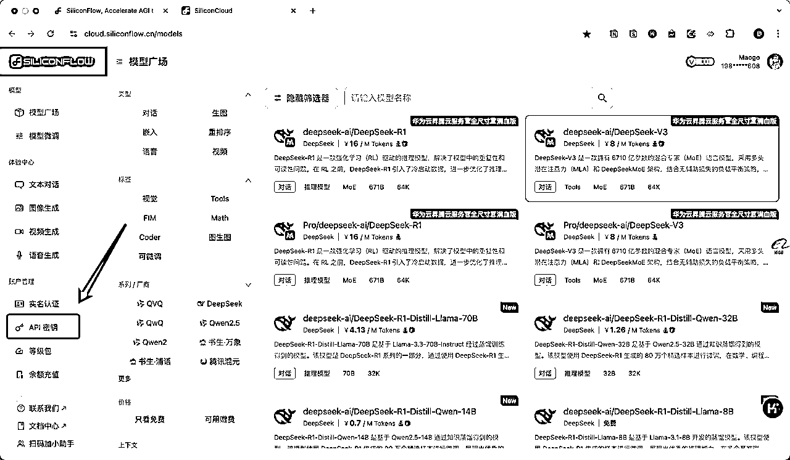

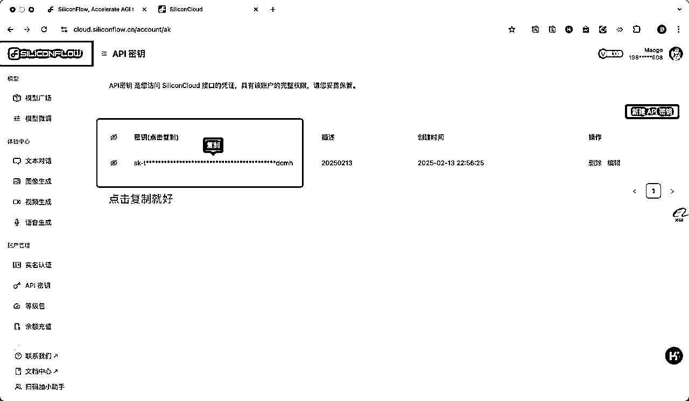

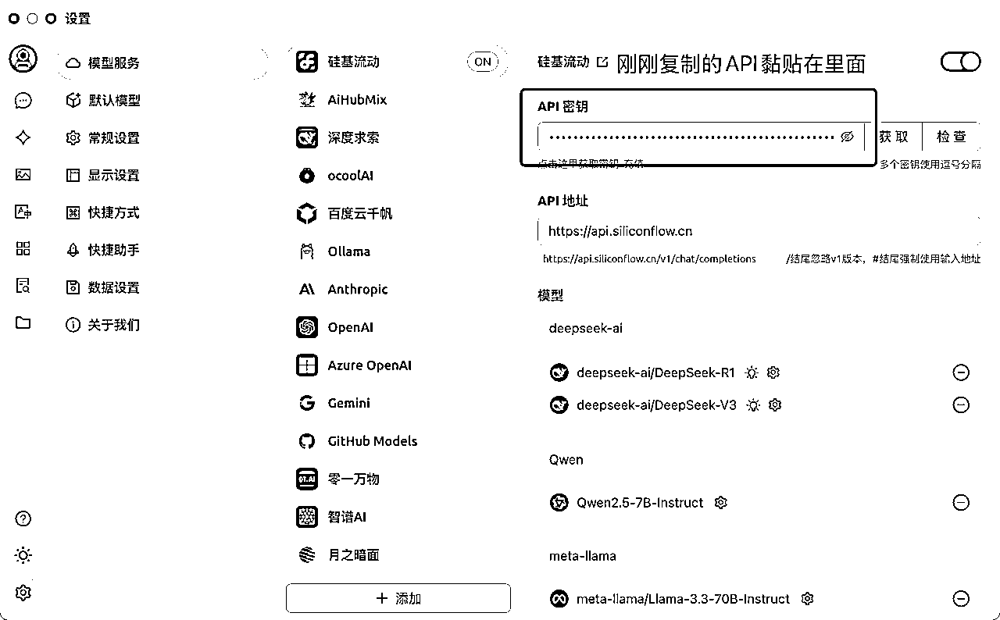

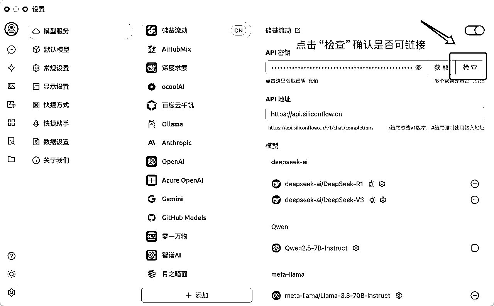

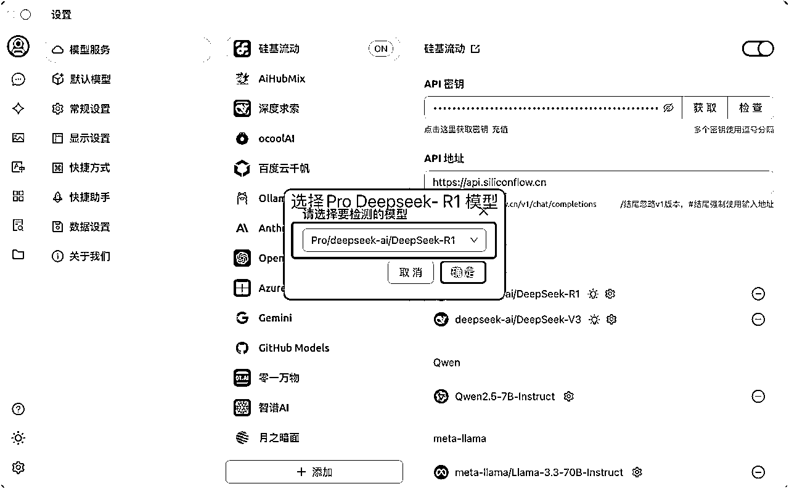

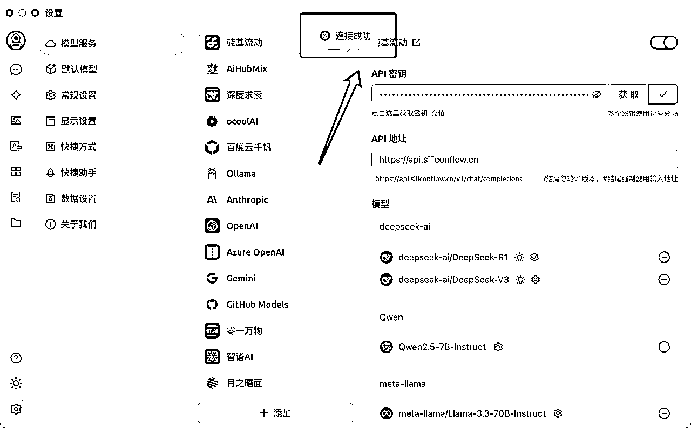

### 3️⃣Cherry Studio窗口使用

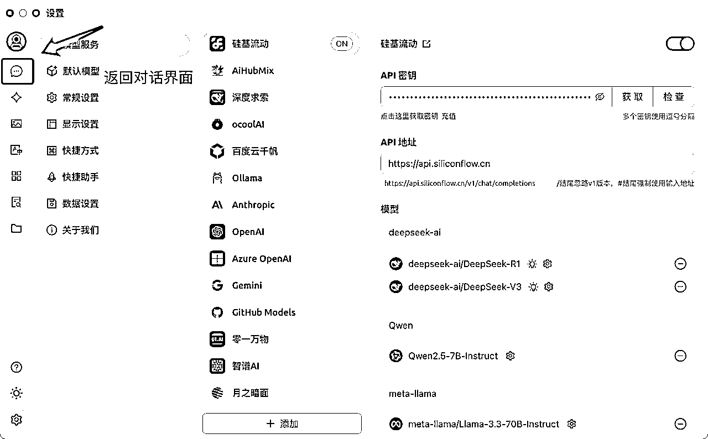

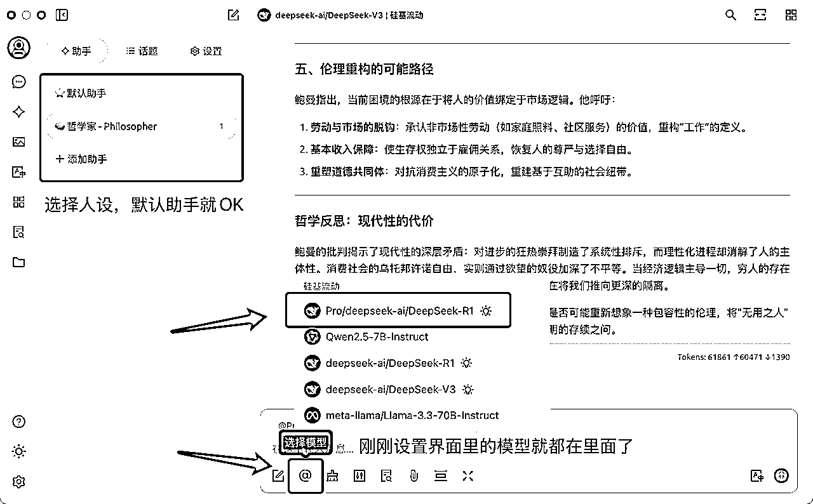

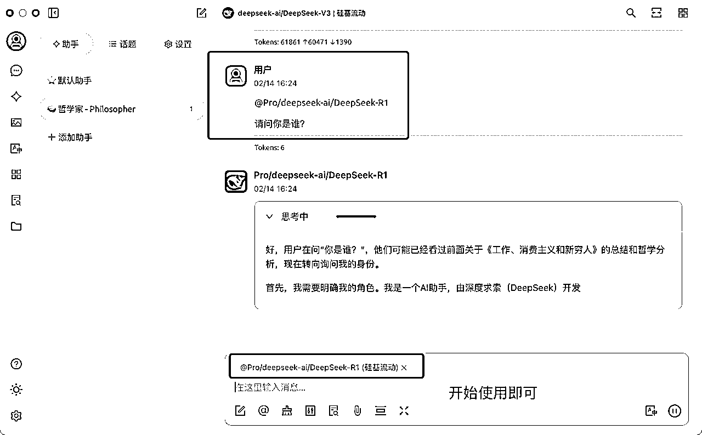

# 📱手机端 Chatbox+ 硅基流动API

## 🔧工具准备：

1️⃣下载并安装Chatbox AI

下载地址🔗：https://chatboxai.app/zh，选择合适的版本下载即可，Appstore可以直接搜到

⚠️ Cherry Studio暂时没有手机版，所以选择Chatbox，功能完全可以覆盖使用需求。

2️⃣注册硅基流动账号

硅基流动官网：https://siliconflow.cn/zh-cn/

推荐原因：调用模型不卡，而且里面各种大模型，随便调，使用的时候也只需要设置一遍API Key，方便。

⚠️我的邀请链接🔗：https://cloud.siliconflow.cn/i/mpN7Zqif，我的邀请码：mpN7Zqif，双方赠送2000万token，由于使用过于顺滑，已经开始氪金了，感谢扩列🌹

## ⏩操作步骤：

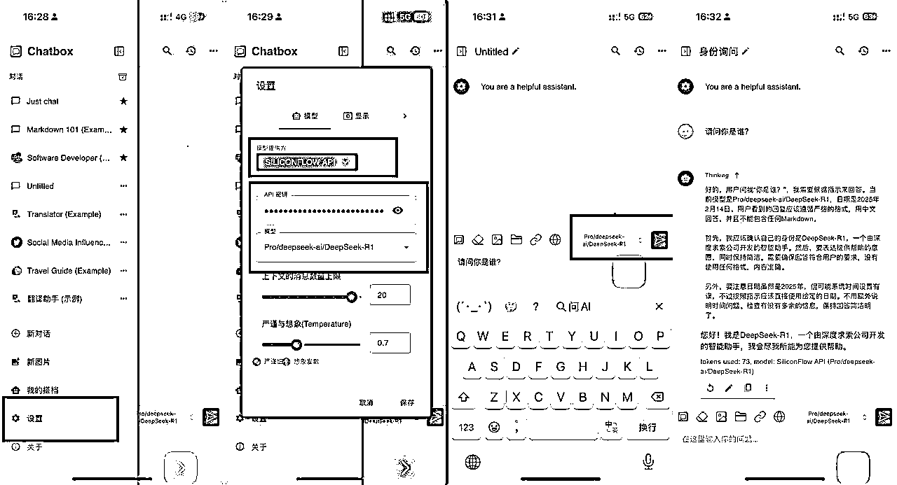

# 💻电脑端 Cherry Studio 个人知识库搭建

## Cherry Studio官方搭建知识库教程🔗：https://docs.cherry-ai.com/knowledge-base/knowledge-base

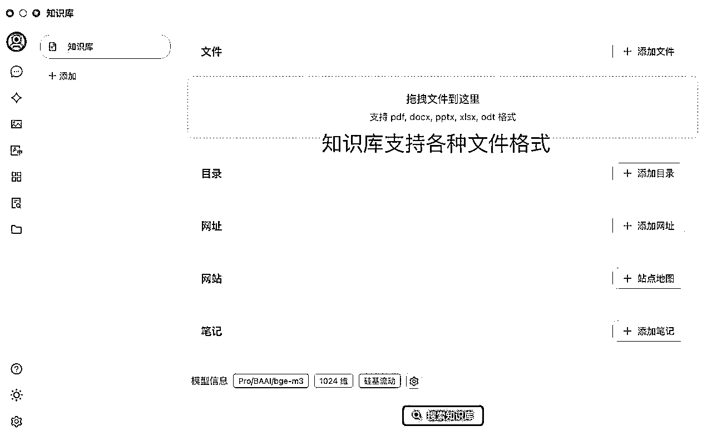

Cherry Studio同时可以创建自己的智能体

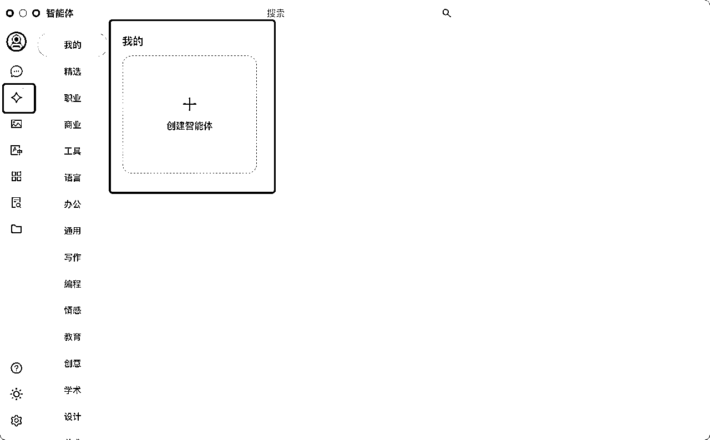

也有内置智能体库可以很顺滑的调用

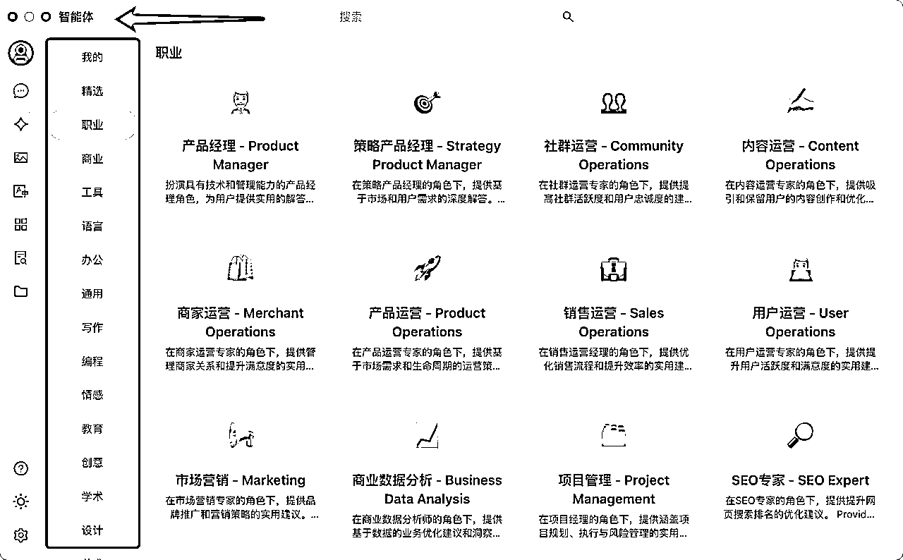

这篇文章我有详细介绍智能体的用法：

若各位实操后体测有用，欢迎给文档点赞👍（要登录飞书账号），我会感受到大家的鼓励🌹

从技术小白的角色做分享，望多指正🙏

另外有篇文档 在私域已经破千浏览了，大家有兴趣可以移步参考🌹