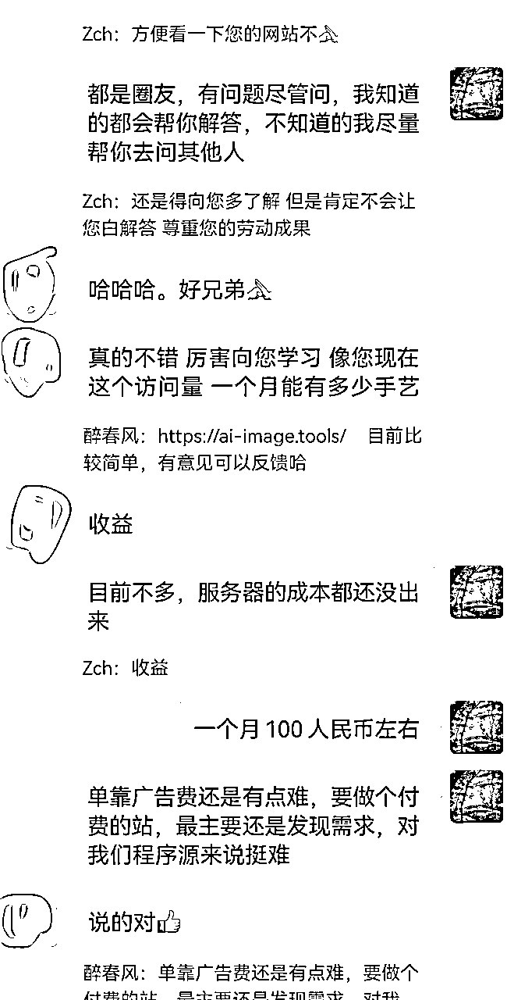
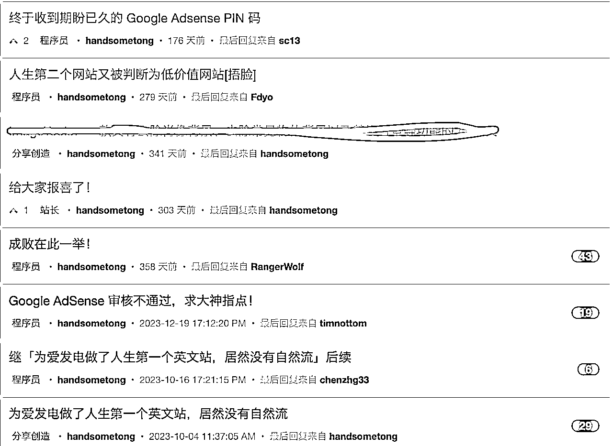

# 继「普通程序员如何花三个月的时间跑通海外工具站MVP赚到人生第一块美刀」后续

> 来源：[https://pcnux1izeagm.feishu.cn/docx/QB43dHxrxoq5HLxwGgVc1NBPn0e](https://pcnux1izeagm.feishu.cn/docx/QB43dHxrxoq5HLxwGgVc1NBPn0e)

## 个人介绍

去年在生财写过一篇精华贴，相关的个人情况里面有介绍，感兴趣的球友可以自行查看「普通程序员如何花三个月的时间跑通海外工具站MVP赚到人生第一块美刀」。

拿到精华第一时间我也没啥感觉，后来我好奇去星球上搜索了下，才发现生财的文章精华率才1.3%。而且我那篇文章最终获得了3个碎片。妥妥的挤到了Top1 的行列。人生第一次有件事情做到 Top1，而且还是在生财这么优质的社群，瞬间觉得自己牛逼轰轰。

## 写了精华后对我有什么影响

*   亦仁的鼓励，是我这一年出海路上的强心剂。每次碰到瓶颈想放弃 ，想想那一句：坚持做下去，至少做三年，然后你会回来感谢我。我就动力满满。因为我学东西向来比较慢，我甚至有持续干四五年的打算。

*   拿到精华后，不少球友私信咨询我一些问题。从来都是别人影响我，不曾想有一天自己也能影响别人。这也成为我公开输出的又一大动力。

## 24年出海进度条

2024年做了很多尝试，为了降低部署成本新学习了next.js、vercel、tailwind css。

7月份导航站是目前做过技术要求最高的一个站，没做起来的原因主要有两个：

*   市场上出现很多体验做的比我更好的导航站，甚至是导航站模版站

*   导航站的核心是自动爬虫优质的工具站并自动收录，由于这块没有实现，所以项目荒废了，后期有时间可以重新捡起来

11月份尝试了游戏站，游戏站很适合新人练手，用来跑通 MVP：

*   用户留存天然比较高，有利于 seo

*   直接开通 google ads，不用解决棘手的stripe、paddle、lemon squeezy等支付网关开通和封号问题

*   iframe直接嵌入小游戏，开发难度低

但是游戏站缺点也很明显，新游戏先发优势很明显，同时要求你具备敏锐的挖掘新游戏能力，而且游戏能不能火需要点运气

为了更真实，先贴上我的收入，目前主要靠我的4个 Google Ads 站。

本来今年没有分享的欲望，毕竟赚钱能力是最大的说服力。我2024年的收入相对于我的投入，肯定是杯水车薪。

上个月看到亦仁开的#龙珠悬赏，激发了分享的念头，想了想不成功的的经验也是经验，可能我才是代表那些沉默的大多数人。就全当是给自己做个复盘总结了。

今年虽然在收入上没有大的突破，但是上站速度得到了质的飞跃，从第一个站的1个多月到后面的两周、一周再到现在的一天，甚至半天。

## 实战过的经验

### 重新分配时间权重

出海是个考验挖掘需求、开发、营销推广三大能力综合的项目。三个方面缺一不可，除非你其中一方面特别强，可以适当弱化其他两方面的权重。举个例子比如你找到了一个很新颖的需求，产品一面市就得到了用户的自转发，那么你营销推广的权重就可以对应降低。

目前大家比较认可的比重是424。什么意思？站在程序员的角度，假设你开发一款产品的时间需要两天，那么你投入挖掘需求和推广的时间分别需要4天。做为程序员我们往往在开发上投入过多的时间，而忽视了挖掘需求和推广的重要性。

随着 AI 编程的出现，开发能力在出海中的权重只会越来越低。

### 关于如何挖掘需求

核心思想就是保持好奇心，看到新的陌生词，养成随时查 Google Trends 的习惯。按教练树哥的话就是：你离成功可能只差一次点击。这块也是三个环节我最薄弱的，我就不在这里「献丑」。详细教程推荐航海的手册和教练哥飞的公众号。每篇文章看一遍肯定是不够的，需要反复斟酌，并勤加练习，不断训练自己的网感。

这里推荐几个增加效率的工具：

*   Google 插件 TrendsBar （Google 趋势分析辅助插件）

*   https://query.domains/ （用于关键字域名注册情况查询）

### 关于如何推广增加外链

通过 Google 搜索网站关键词，找到竞品网站，然后「抄作业」：通过 https://ahrefs.com/backlink-checker 或者「 Semrush 的反向链接分析」查找精品网站的反链，点击跳转网站确认是否可以发布自己的网站。

没有什么技巧，只能通过最笨的方法一个一个查看。把可以增加反链的网站收集记录起来（包括 DR 信息），慢慢积累就有自己的外链库了。后面新网站按照 DR 进行排序，就可以快速增加优质外链了。

后期还可以通过跟踪分析旧网站的 google console 链接数量，通过引荐网站的数据筛选更优质外链网站。

## 踩坑经验和建议分享

### 人要想出名就得多发声

写分享其实主要是讲故事，只要你是有认真做事，你把做事的过程和克服困难的过程用最朴素的语言描述清楚，那就是故事最好的素材。举个我真实的案例，去年我经常在v2ex上记录我从上第一站没流量 ➡️ 到获取到点流量 ➡️ 到审核通过google ads ➡️ 和最终获取到 Adsense Pin 的完整过程。

看标题你就知道里面很多帖子干脆就是求助帖子和引流帖。

然后就是这些引流贴突然有一天收到群友的@感谢！

我一开始有点莫名其妙，往上翻信息才知道原来我的帖子被群主推荐，而且还有好几个群友表示看了我的帖子很有感触！

所以大胆分享，尤其是做技术的，可能你觉得不起眼，甚至觉得 low 的问题，在别人那就是几天都无法解决的「鸿沟」。

想想如果我连续在生财上分享上站的经历，并万一在未来某一天也取得了点成果。那这一个系列记录成长的「故事」，本身就会自带流量光环。

### 拥抱AI雇佣AI「员工」为你工作

2024年是 AI 继续快速发展的一年。这一年诞生了ai生成音乐suno，ai生成视频sora、腾讯混元、海螺视频，高质量的文生图 Flux 等，更是出现了Cursor、Windsurf、Bolt.new 等颠覆未来开发者开发方式的 IDE。

目前我自己是 Cursor 的重度使用者。如果你还没有体验过任何一款 AI 编辑器，生财航海上有很详细的 Cusor 使用手册，我就是根据航海上的手册学习，使用了一周之后就离不开了。。。

2025年我强烈建议每个月花十来块人民币（淘宝共享账号，正版20美刀每个月）给自己雇一个可以24小时为你服务的员工，而且这个多边形「战士」基本可以在个个方面弥补你的不足。

另外，我之所以现在能做到半天上站，也是得益于我雇佣 Cursor 这个得力助手。

### Ship fast、Ship more

根据我个人的不完全统计，我看到普通人拿到比较大的正反馈都是在做了10个站之后。做10个站只能算刚入门（除了个别天选之子）。而我目前只上了9个站，没有大的正反馈属于正常的规律。

2025年我给自己定了20个站的目标。2025降低预期，专心上站，保持平常心，减少预期太大给自己造成的心态困扰。

### 一个人也许走的更快，但是一群人可以走的更远

说实话生财的航海21天对于出海工具站这种难而正确的「船」来说的时间太短。而且每期的时间间隔太长。虽然每一期的航海都有大群，但是随着航海的结束，基本上也沉寂了。

对于出海人我们急需一个环境，这个环境聚集一帮有共同目标的人在里面分享成果、喜悦、困境、行业信息，这个环境不需要时时为你服务，只需要在你心力值低、能量值低的时候给你鼓励并带给你力量！

### 培养快速切换的能力

今年二季度由于公司的业务太忙，白天基本无法摸鱼上站，甚至晚上经常还要加班处理公司事务。这段时间当我晚上有空闲要上站的时候，脑子里经常还沉寂在白天的事情，无法切换到「出海」的进程。又或者当我刚刚要来点干劲的时候，突然被同事打扰，之后就迟迟无法找回状态。

我相信做副业的人多多少少都会碰到类似的问题。

快速切换的能力其实就8个字：事来则应，事去则静的。

“一秒失忆”“一秒上手”，做完一件事，迅速从这件事或这种感觉中抽离出来，迅速进入到下一件事中。

---粥左罗

这是一个需要刻意训练的能力，一旦学会了快速切换，你做事情将变的很高效。

### 120%的信心

出海是件难而正确的事，通常正反馈都比较慢比如：SEO 的效果通常2-3个月，这个过程对于开发者来说是煎熬的，尤其是在兴高采烈做了好几个站后，迟迟没有大的收获。所以需要你对出海的美好未来「盲目」相信，甚至要120%地相信——哪怕被别人泼冷水，打击掉20%，依然是100%地相信。

## 结束语

感谢「Cursor-零基础做软件应用」航海，让我「出海工具站」的开发速度得到了质的飞跃；感谢亦仁的鼓励让我这一年在曲折的出海道路上仍然能保持120%的信心。

生财的信息超前于市场几个等级，在生财上出现新的名词或者新的工具，不妨保持好奇心，多去问问 ChatGpt 了解了解，也许你将打开新世界，从此命运的齿轮发生转向。。。