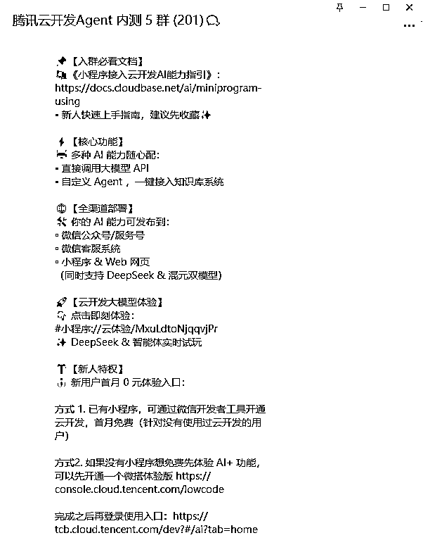
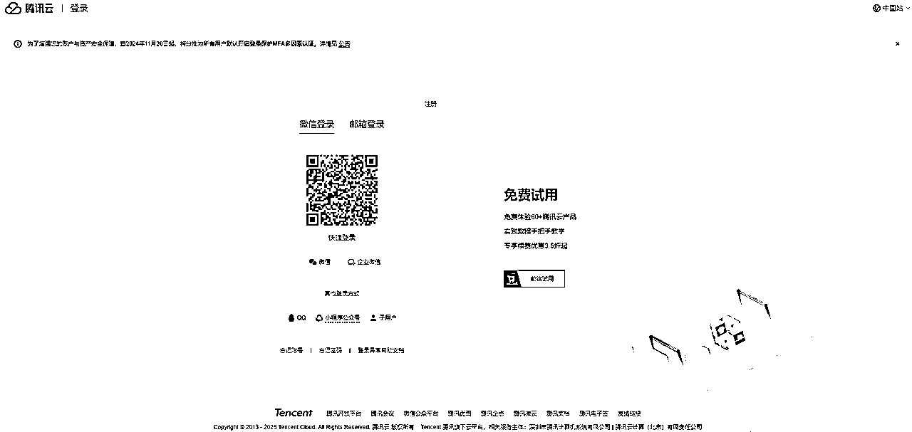
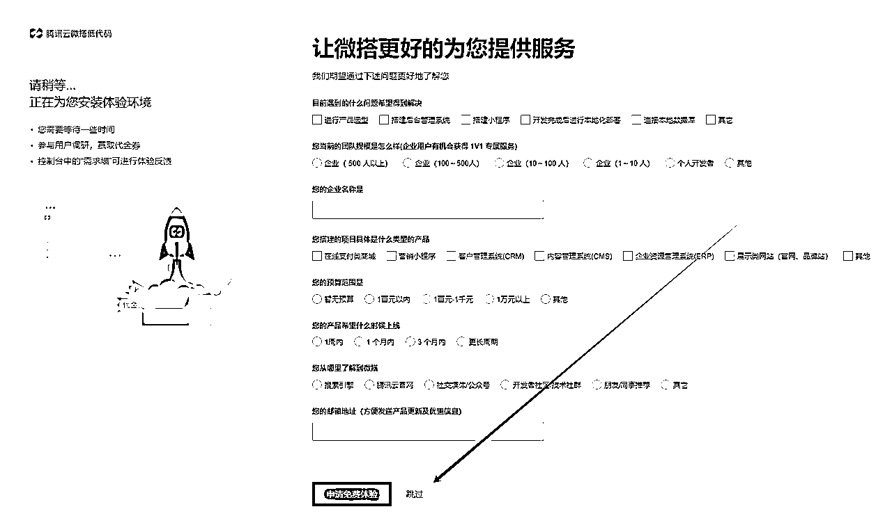
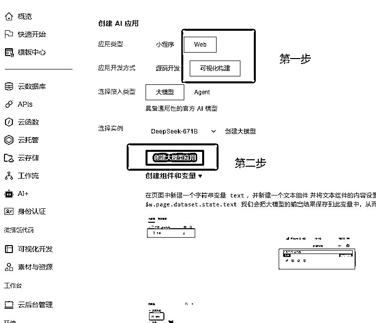
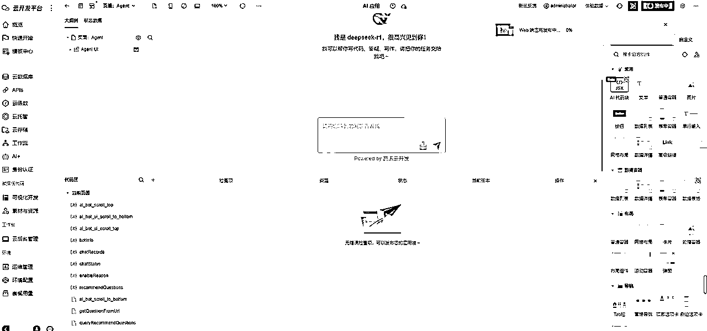
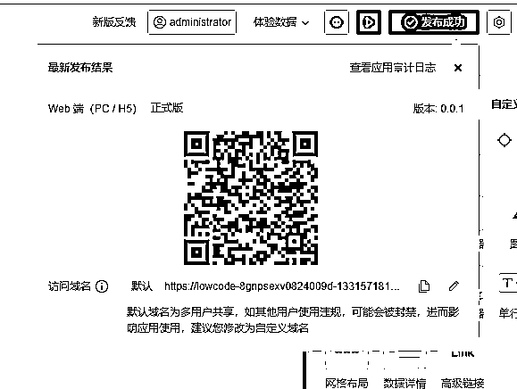
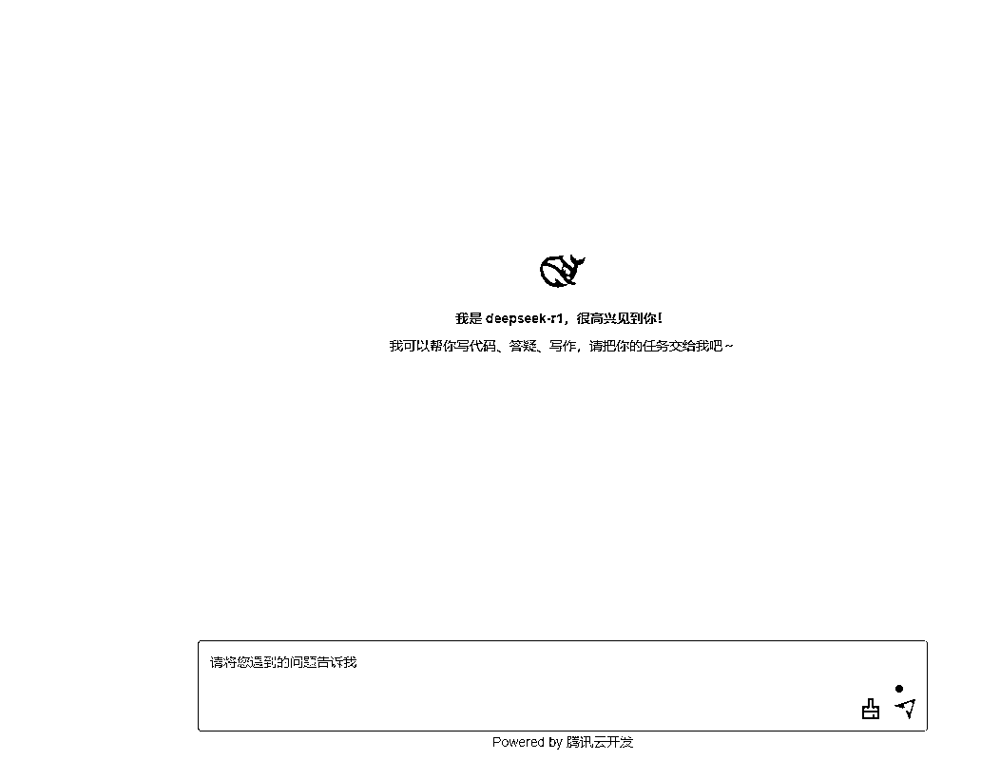
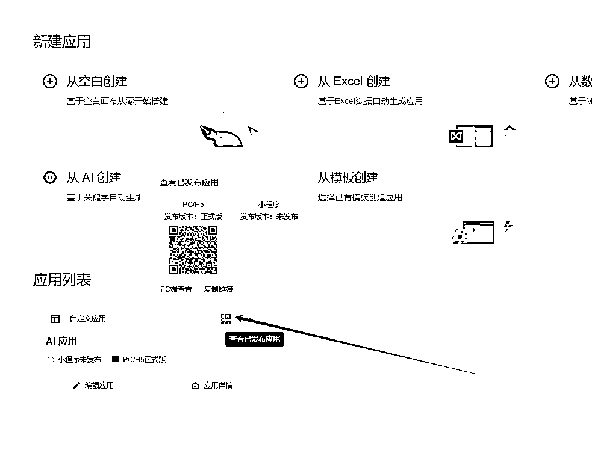
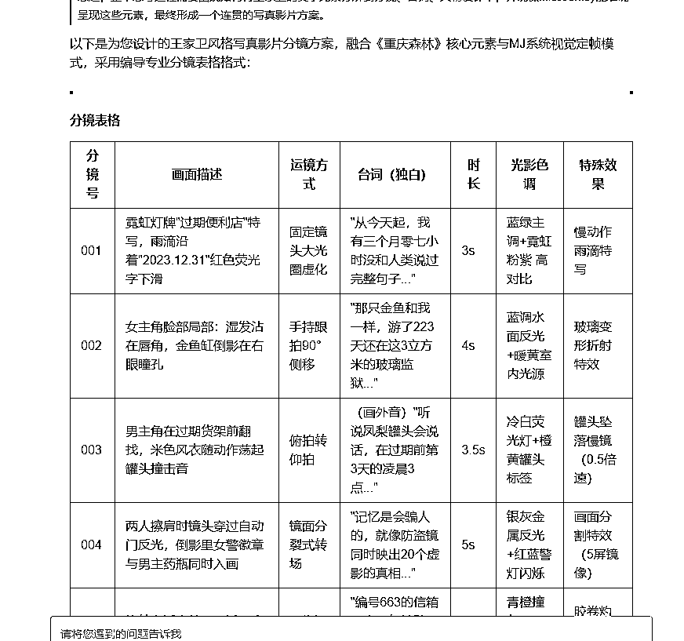

# 小白10分钟部署671B满血DeepSeek，可用一月

> 来源：[https://k0tidc5ov25.feishu.cn/docx/EZ8xdTelGo0okWxgqFDcadKNnSb](https://k0tidc5ov25.feishu.cn/docx/EZ8xdTelGo0okWxgqFDcadKNnSb)

腾讯云昨天晚上出了个新产品，做微代码开发应用，可以对接小程序、网站、订阅号。下面是详细信息。

DeepSeek服务器经常繁忙，现在我们可以部署一个DeepSeek自己私用了，现在可以免费用一个月，网页版展示，也可以发布到自己的个人订阅号上，看需求。

下面是实操教程

打开下方链接注册登录

https://cloud.tencent.com/login?s_url=https%3A%2F%2Fconsole.cloud.tencent.com%2Flowcode

扫码登录

登录后跳转这个链接，点击立即体验

扫码验证身份。

进入后跳过

等待安装环境。

关闭

点应用前往云开发平台

关闭

点快速开始，构建AI智能体小程序。

按照下方设置创建。

直接发布。

正式版体验版都可以

等待发布完成。

点击域名就可以访问了，建议把域名收藏起来

大家随意用，这个号为了演示开的。

https://lowcode-8gnpsexv0824009d-1331571810.tcloudbaseapp.com/app-bea6zoe5/production/

选择体验版的网页链接在这里，先点返回

点击二维码复制链接，常用的话就存个书签吧。

速度很快，效果不错。

教程结束，祝大家玩的愉快！