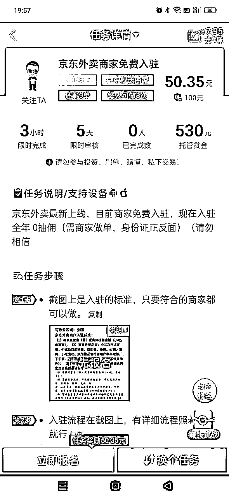

# 信息差项目，京东外卖推广，一单170元-ZSXQ

> 来源：[https://bzpjac2aeq.feishu.cn/docx/APKNdX6Jcos8TTxCfPXc0jFrnjf](https://bzpjac2aeq.feishu.cn/docx/APKNdX6Jcos8TTxCfPXc0jFrnjf)

最近两天京东外卖入局了，目前属于蓝海空白。

目前京东外卖是免费入驻的，并且不抽商家佣，入住少很容易上推荐，一单能奖励170+，力度直接拉满了，白捡的便宜商家能不要么，多一个多条路，抓住机会现在入局拉新也是市场空白，一片大好。

文字教程

与其他外卖项目相比，京东外卖项目具有以下优势：

市场广阔：

不同于成熟平台，京东外卖初入市场，大量空白地区等待开拓。大街小巷的餐饮店铺，无论连锁还是特色小店，都是潜在合作对象。无需费力寻觅，商机就在身边。

商家接受度高，合作无忧：

“0佣金”政策是京东外卖吸引商家的最大亮点。在成本极高的当下，这一举措有效缓解商家运营压力。加上京东品牌光环及技术支持，助力商家优化运营，使得商家对京东外卖接受度极高，推广工作顺势而为。

推广单价高：目前京东外卖推广拉新项目推广奖励丰厚。5月1日前入驻优惠倒计时，商家急切入驻，为推广员创造绝佳条件。努力拓展，日入上万并非遥不可及，利润空间相当可观。

# 申请方式

## 1.首先先申请京东外卖的推广权限

## 2.微信扫码开通任推邦

## 3.然后搜索京东外卖

## 4.等待审核通过后，就可去推广了

# 推广操作流程

推广操作流程

## 商户需要准备的资料：

1.  门头照、店内照上传格式为：png、jpg、图片大小不超过3M。

1.  营业执照上传格式为：png、jpg、图片大小不超过3M。

1.  法人身份证正面和背面图：支持上传身份证、护照、港澳居民通行证、台湾居民通行证。

相关入驻信息：

1.  法人手机号。

1.  入驻手机号（账号登录手机号，未来用于接收各种验证码，最好是运营同学的，方便后期使用）。

1.  邮箱（最好是店主的邮箱，方便以后接收信息）。

1.  对公账户信息（开户行及支行、账号，用于京东验证品牌企业），个体工商户如没有对公账户可以使用法人银行卡或刷脸验证。

1.  品牌LOGO或店铺LOGO、商标注册证（如有）。

## 第一步：

商户在应用市场搜索：“京东秒送商家”下载APP，注册手机号填写商家负责人号码，注册填写完密码

## 第二步

选择“连锁店申请入驻”或“门店申请入驻”均可（单门店选择门店申请入驻，连锁门店大于3家可选择连锁店申请入驻），联系人和联系电话需与账号注册保持一致【经营品类】只能咖啡茶饮或外卖美食，非咖啡茶饮类的餐饮品牌均选择外卖美食

推荐人信息一栏必填，推荐人（填商户邀请码），在任推邦申请推广审核通过后会发放商户邀请码

## 第三步：

上传营业执照并选择合同方案、结算和收款方式（推广员保留商户ID，后期在任推邦进行提交）

注意：自行保留推广证据，以防京东官方抽查，包括但不限于（商家门店照片，地址，营业执照，联系人方式，推广照片或其他证明），如因商户未达标或提交商户ID错误，延迟等其他不通过原因等，则无法结算，结算以京东官方为准，介意勿做

## 第四步：

商家重新登录商家账号，优先选择使用京东实名，完成实名认证；

## 第五步：

商家操作完入驻流程后，进入到合同签署流程，完成线上签署后，等待官方审核（预计需要24-48小时）；

## 第六步：

新建门店，填写门店基本资料上传信息，选择经营位置后，上传完套餐，等待审核完成店铺正常营业，即可在任推邦提交商家ID进行交单；

## 第七步：

商家资质审核通过且所有条件都达标后，在任推邦下方提交商户ID，交错无数据（恶意乱提交会进行平台项目拉黑），当天京东审核成功的数据尽量当日24点前或次日完成交单，不要拖太久；等都达标后再交单（商家入驻成功并上架商品，门店店铺状态为“营业”并至少上架5个商品后再交单），提前交单因商户还未审核通过，会被判定无数据；

# 如何创建门店、上架商品、设置状态为“营业”状态，请参考下方流程

如何创建门店、上架商品、设置状态为“营业”状态，请参考下方流程

# 推广思路

## 1.铺广告

## 2.地推分账

## 3.平台发布任务，赚差价，让别人跑

## 4.boss上发布招聘信息

## 推广优势与商家对话重点：

1.不分佣，你卖多少赚多少，不会额外平台抽佣（京东外卖在2025年5月1日前入驻的商家将享受全年免佣金的政策）。

2.背景强大流量足，京东新市场，会加大力度推广外卖市场。

3.目前入驻商户少，很容易冲到首页推荐，早入局早跑出销量，适合霸榜。

4.免费入驻，多一条销售渠道，总比少一条好，万一做大了呢。

5.你出单，还能额外获得50-100元奖励，只为了你能更好的生意。

准备工作：

当地或者淘宝定制推广马甲

进门话术：

哥，你好，我们是京东外卖官方的，邀请您免费0元入驻。免佣金。

姐，你好，京东外卖官方人员，今天来帮你开通提供一下京东外卖，免费的，不抽商家佣。

# 2月20日更新：推广问题答疑

Q1：全国可做还是39城可作业？

答：39个城市为重点推广地区，但是全国均可推广。

Q2：商家评分看哪里？

答：大众点评APP里，只看评分3.8以上或3.8的餐饮店，低于的请放弃。

Q3：用户是怎么点京东外卖？

答：在京东APP首页最上方点击“秒送”。

Q4：商家入驻后是否入需要上架商品？

答：需要，至少上传5个。

Q5：是否需要对公账户？

答：需要，若个体商家没对公账户，可以使用法人银行卡。

Q6：有的城市点不进去什么情况？

答：检查商家是否操作流程错误。

Q7：基础配送费多少？

答：3公里内3元(可商家承担或用户承担)。

Q8：商家提现及到账时间？

答：3+1，3天后到账商家端，提现到账T1。

Q9：商家资料提交后，审核时长多久？

答：京东人工审核，前期不能保证（建议加商家微信，告知通过后提醒，二次回店协助上商品营业）。

Q10：商家需要操作到哪个环节才属于成功有效，算可结算数据？

答：商家入驻后，上线5个商品或以上，开启商家营业后，就算成功有效。

Q11：商家接受度怎么样?

答：根据市场调研，大部分商家都会同意入驻（相较于其他外卖平台抽成、服务费高等情况，京东上线就是0佣金，推广起来有优势。)

Q12：店铺装修采单需要推广员上传么？

答：不需要。

Q13：推广员有独立后台吗？

答：没有，后续可能也不会有，需返回“任推邦”平台京东外卖项目详情交单。

Q14：连锁门店算几家门店的佣金?

答：按照门店数量算（例如连锁店有10家那么佣金*10倍，目前同一品牌连锁店最高可以享受上限100个店铺推广金）。

Q15：商家的店铺管理后台是哪个？

答：手机APP端：手机应用商店搜索【京东秒送商家】

电脑端网站：https://store.jddj.com

本项目目前处于测试期，建议推广员前期少量测试，届时全面放开再大力推广，所以各位提前布局，肯定没错、

以上为今天的分享，希望能帮助到大家