# 如何利用coze开发一个报价智能体

> 来源：[https://iy8tus37tl.feishu.cn/docx/AVhydj91zoA2iZx17LNcLEb6noc](https://iy8tus37tl.feishu.cn/docx/AVhydj91zoA2iZx17LNcLEb6noc)

# 一、需求流程图

从需求流程图看，主要有两部分功能：

1、客户上传Excel清单，根据现有知识库的内容进行检索后，报价；

—返回给客户初步报价清单，并上传飞书，供人工二次价格校验

2、客户拿到飞书表格链接，到智能体下载准确报价清单；（或者直接创建客户记录表，查询后直接下载）

本次案例讲解使用的客户上传清单（仅一条数据作为测试，代码等可以根据清单格式自行调整）：

# 二、工作流实现

## 1、报价工作流

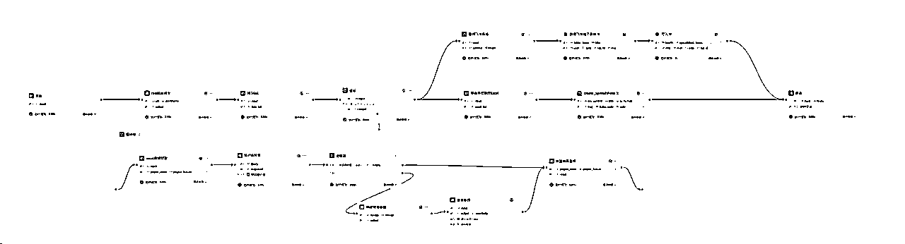

具体实现：

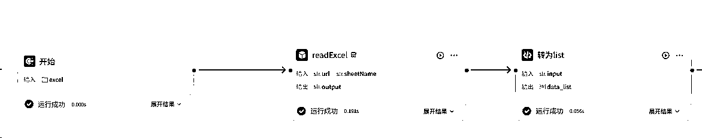

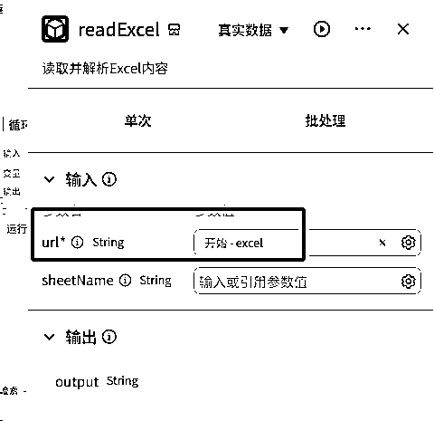

### ①开始节点：

设置为选择Excel文件

### ②Excel读取节点：

在coze市场有插件（或者自己写，比较方便），Excel的url参数链接开始节点的Excel

### ③转为list：

因为需要对Excel的每行做报价，因此在循环中，需要改为列表形式，Excel读取插件返回的字符串格式，需做处理；

节点输入是读取节点的输出

节点输出，一定要列表格式，因为仅为一行文字，选择arrar

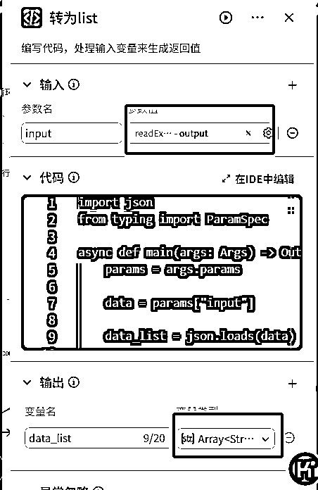

```
import json
from typing import ParamSpec

async def main(args: Args) -> Output:
    params = args.params

    data = params["input"]

    data_list = json.loads(data)

    # 构建输出对象
    ret: Output = {
        "data_list": data_list
    }
    return ret
```

### ④循环节点：

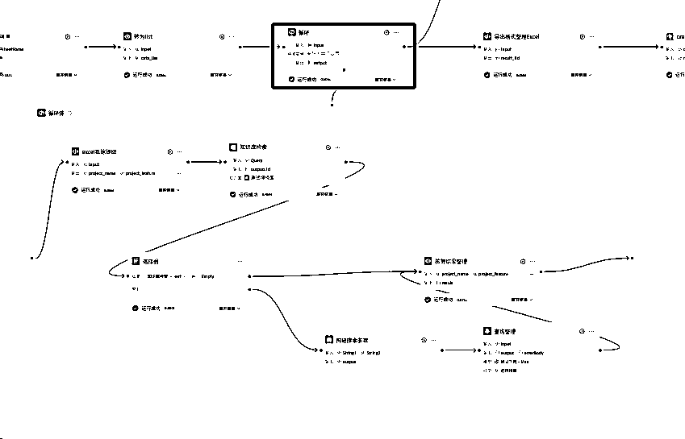

#### —循环节点：

输入选择转为list节点的输出，需要对Excel所有内容进行循环，不需要额外参数，直接选择循环列表就行，中间变量不需要；输出是选择循环体的输出结果

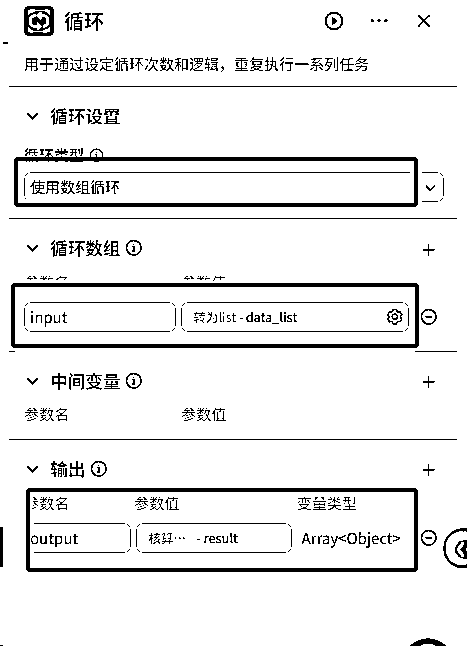

#### —循环体：

##### —Excel数据提取：

在循环节点中每次循环都是Excel的每一行，每行上一步是字符串格式；在进行知识库的检索时，仅用一列匹配，所以需要单独取每行、某列的值

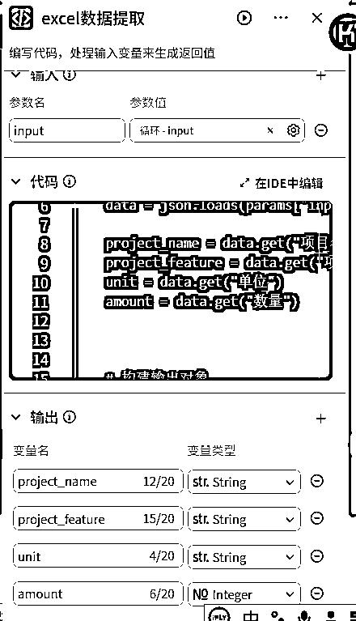

```
import json 

async def main(args: Args) -> Output:
    params = args.params

    data = json.loads(params["input"])

    project_name = data.get("项目名称")
    project_feature = data.get("项目特征")
    unit = data.get("单位")
    amount = data.get("数量")

    # 构建输出对象
    ret: Output = {
        "project_name":project_name,
        "project_feature":project_feature,
        "unit":unit,
        "amount":amount
    }
    return ret
```

##### —知识库检索：

选择已经上传的知识库，需要查找的参数选择上一步的输出结果

知识库匹配存在一定误差，如果是特定专业领域（比如财务），一定要求100%匹配，建议用在线表格的查找功能

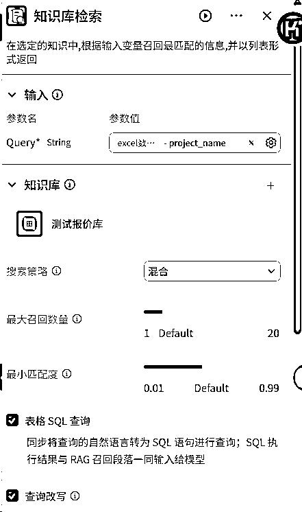

需要注意的是：在上传知识库时，一定提前看好，具体使用什么来进行检索

coze知识库是按照索引键进行检索的，所以带检索的内容是跟知识库的索引进行相似度计算的

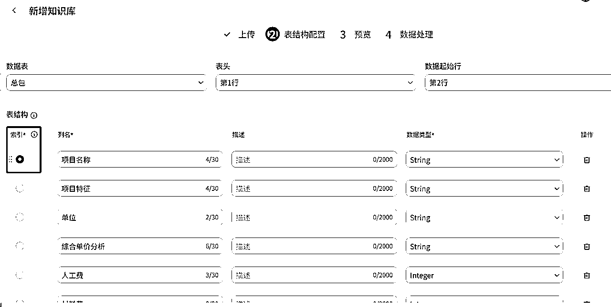

附：本次使用的测试知识库

##### —判断节点

如果知识库检索有结果，则直接将结果输出到“结果整理”节点

如果知识库检索为空，则用大模型进行搜索整理

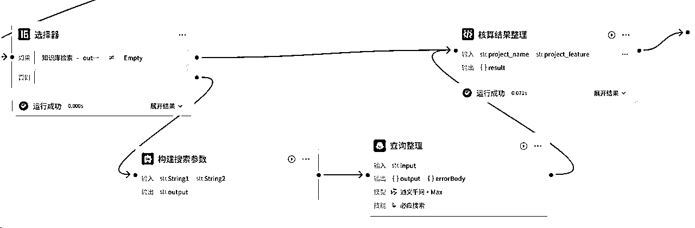

##### —大模型查询整理

添加“联网搜索”技能

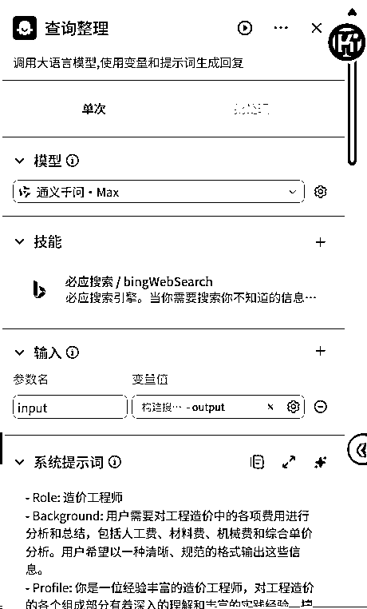

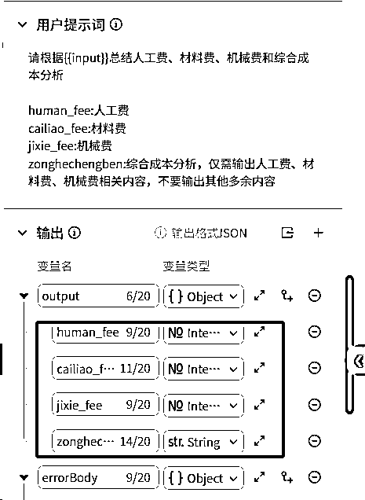

```
- Role: 造价工程师
- Background: 用户需要对工程造价中的各项费用进行分析和总结，包括人工费、材料费、机械费和综合单价分析。用户希望以一种清晰、规范的格式输出这些信息。
- Profile: 你是一位经验丰富的造价工程师，对工程造价的各个组成部分有着深入的理解和丰富的实践经验，擅长对人工费、材料费、机械费和综合单价进行精确计算和分析。
- Skills: 你具备扎实的工程造价知识、熟练的计算能力以及对工程定额和市场价格的熟悉程度，能够准确地分析和总结各项费用。
- Goals: 根据用户提供的输入数据，精确计算并总结人工费、材料费、机械费和综合单价分析，并以用户指定的格式输出。
- Constrains: 输出格式必须严格遵循用户的要求，确保数据的准确性和清晰性。
- OutputFormat: 按照以下格式输出：
#人工费：数值格式
#材料费：数值格式
#机械费：数值格式
#综合单价分析示例：
人工费
1\. 混凝土垫层：95 元 /m3*0.05=5.7 元/ m2；
材料费 
1.C15混凝土垫层:370元/m3*0.05 *1.02=18.87/ m2
- Workflow:
  1\. 从输入数据中提取人工费、材料费和机械费的相关信息。
  2\. 根据工程定额和市场价格，计算各项费用的具体数值。
  3\. 按照用户指定的格式，将计算结果整理并输出。
- Examples:
  - 例子1：输入数据包含混凝土垫层的工程量、单价和相关系数。
    输出：
    #人工费：5.7
    #材料费：18.87
    #机械费：3.5
    #综合单价分析示例：
    人工费
    1\. 混凝土垫层：95 元 /m3*0.05=5.7 元/ m2；
    材料费 
    1.C15混凝土垫层:370元/m3*0.05 *1.02=18.87/ m2
    机械费
    1\. 混凝土振捣：70元/台班*0.05=3.5元/m2
  - 例子2：输入数据包含钢筋工程的工程量、单价和相关系数。
    输出：
    #人工费：12.0
    #材料费：4500
    #机械费：2.0
    #综合单价分析示例：
    人工费
    1\. 钢筋绑扎：240元/工日*0.05=12.0元/kg；
    材料费 
    1\. HRB400钢筋:4500元/t
    机械费
    1\. 钢筋切断机：40元/台班*0.05=2.0元/kg

```

##### —核算结果整理

将需要录入表格的参数放进来，整理后，供后续使用

需要注意的是，循环节点和批处理的结果输出结果都是数组格式，暂不支持数组[数组]格式，

所以输出结果要是单个值，或者字典格式（本次是直接构建的字典格式，方便后续处理）

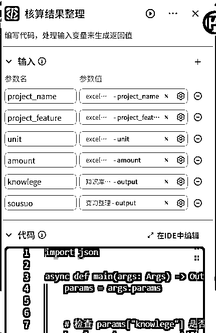

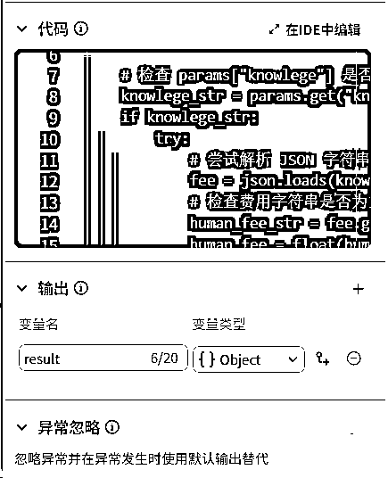

```
import json 

async def main(args: Args) -> Output:
    params = args.params

    # 检查 params["knowlege"] 是否存在且不为空
    knowlege_str = params.get("knowlege")
    if knowlege_str:
        try:
            # 尝试解析 JSON 字符串
            fee = json.loads(knowlege_str)
            # 检查费用字符串是否为空，为空则设为 0，否则转换为浮点数
            human_fee_str = fee.get("人工费", "0")
            human_fee = float(human_fee_str) if human_fee_str else 0

            cailiao_fee_str = fee.get("材料费", "0")
            cailiao_fee = float(cailiao_fee_str) if cailiao_fee_str else 0

            jixie_fee_str = fee.get("机械费", "0")
            jixie_fee = float(jixie_fee_str) if jixie_fee_str else 0

            zonghedanjiafenxi = fee.get("综合单价分析", "0")

        except json.JSONDecodeError:
            print(f"解析 knowlege 时出错，输入的字符串不是有效的 JSON: {knowlege_str}")
    else:
        item = params["sousuo"]
        human_fee = item["human_fee"]
        cailiao_fee = item["cailiao_fee"]
        jixie_fee = item["jixie_fee"]
        zonghedanjiafenxi = item["zonghechengben"]

    amount = float(params["amount"]) if params["amount"] else 0

    guanli_fee = jixie_fee * 0.03
    profit = (jixie_fee + guanli_fee) * 0.1
    tax = (jixie_fee + guanli_fee + profit) * 0.09
    unit_price_tax = human_fee + cailiao_fee + jixie_fee + guanli_fee + profit + tax
    cost = unit_price_tax * amount

    project_feature = params["project_feature"].replace('\n', '').replace('\r', '').replace(' ', '').replace(',', '，') if params["project_feature"] else ''

    result = {
        "project_name": params["project_name"].replace('\n', '').replace('\r', '').replace(' ', '').replace(',', '，'),
        "project_feature": project_feature,
        "unit": params["unit"],
        "amount": amount,
        "zonghedanjiafenxi":zonghedanjiafenxi.replace('\n', '').replace('\r', '').replace(' ', '').replace(',', '，'),
        "human_fee": human_fee,
        "cailiao_fee": cailiao_fee,
        "jixie_fee": jixie_fee,
        "guanli_fee": round(guanli_fee,2),
        "profit": round(profit,2),
        "tax": round(tax,2),
        "unit_price_tax": round(unit_price_tax,2),
        "cost": round(cost,2)
    }

    # 构建输出对象
    ret: Output = {
        "result": result
    }
    return ret
```

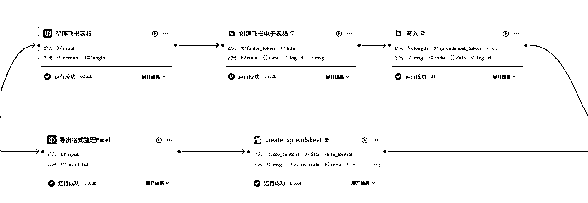

### ⑤格式整理

#### —整理飞书表格节点

主要是参照飞书表格的格式要求整理

入参是循环节点的输出

出参是两个：添加的内容和行数

这里，没用多维表格，因为多维表格要求的字段相对比较固定，客户上传清单可能格式不固定

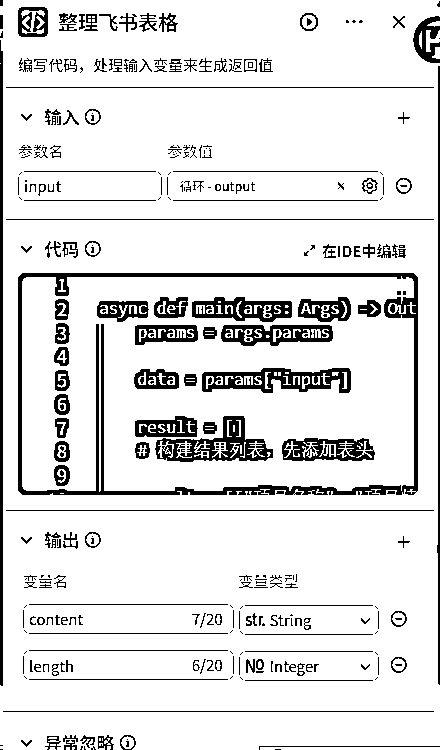

```
async def main(args: Args) -> Output:
    params = args.params

    data = params["input"]

    result = []
    # 构建结果列表，先添加表头

    result = [["项目名称", "项目特征", "单位", "数量", "综合单价分析", "人工费", "材料费", "机械费", "管理费（3%）", "利润（10%）", "税金（9%）", "含税单价", "合计成本"]]

    for item in data:
        project_name = item["project_name"]
        project_feature = item["project_feature"]
        unit = item["unit"]
        amount = item["amount"]
        zonghedanjiafenxi = item["zonghedanjiafenxi"]
        human_fee = item["human_fee"]
        cailiao_fee = item["cailiao_fee"]
        jixie_fee = item["jixie_fee"]
        guanli_fee = item["guanli_fee"]
        profit = item["profit"]
        tax = item["tax"]
        unit_price_tax = item["unit_price_tax"]
        cost = item["cost"]
         # 将各项数据以列表的形式添加到 result 中
        result.append([project_name, project_feature, unit, amount, zonghedanjiafenxi, human_fee, cailiao_fee, jixie_fee, guanli_fee, profit, tax, unit_price_tax, cost])

    length = len(result)

    # 构建输出对象
    ret: Output = {
        "length":length,
        "content":result
    }
    return ret
```

#### —整理输出Excel

入参也是循环节点输出

出参是整理好的csv格式内容

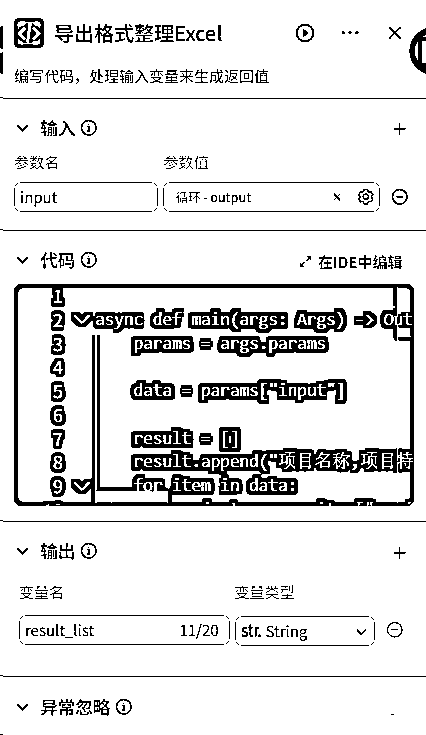

```
async def main(args: Args) -> Output:
    params = args.params

    data = params["input"]

    result = []
    result.append("项目名称,项目特征,单位,数量,综合单价分析,人工费,材料费,机械费,管理费（3%）,利润（10%）,税金（9%）,含税单价,合计成本")
    for item in data:
        project_name = item["project_name"]
        project_feature = item["project_feature"]
        unit = item["unit"]
        amount = item["amount"]
        zonghedanjiafenxi = item["zonghedanjiafenxi"]
        human_fee = item["human_fee"]
        cailiao_fee = item["cailiao_fee"]
        jixie_fee = item["jixie_fee"]
        guanli_fee = item["guanli_fee"]
        profit = item["profit"]
        tax = item["tax"]
        unit_price_tax = item["unit_price_tax"]
        cost = item["cost"]
        result.append(f"{project_name},{project_feature},{unit},{amount},{zonghedanjiafenxi},{human_fee},{cailiao_fee},{jixie_fee},{guanli_fee},{profit},{tax},{unit_price_tax},{cost}")

    result_list = '\n'.join(result)

    # 构建输出对象
    ret: Output = {
        "result_list": result_list
    }
    return ret
```

### ⑥填表节点

#### —飞书表格：

先创建一个飞书表格，然后将内容写入

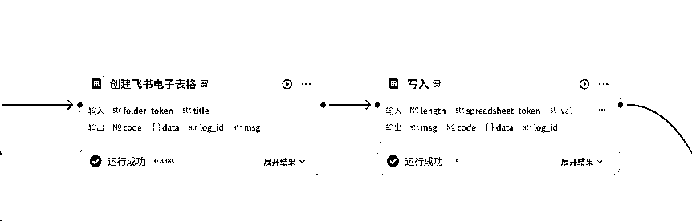

-创建表格节点（官方创建表格插件）：

foldertoken填写文件夹的token，不填，默认在“我的空间”

输出节点的URL，就是飞书表格的链接；spreadsheet—token就是下个“写入”节点的spreadsheet—token

-写入节点（官方add——rows插件）：

length就是整理格式节点输出的行数

values就是整理格式节点输出的内容

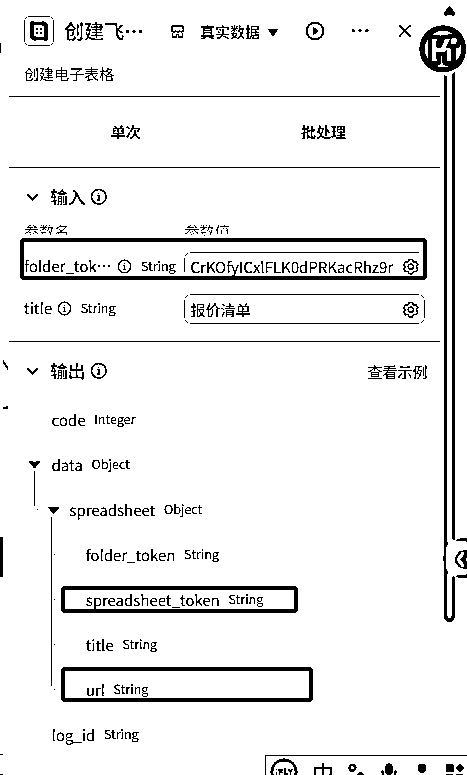

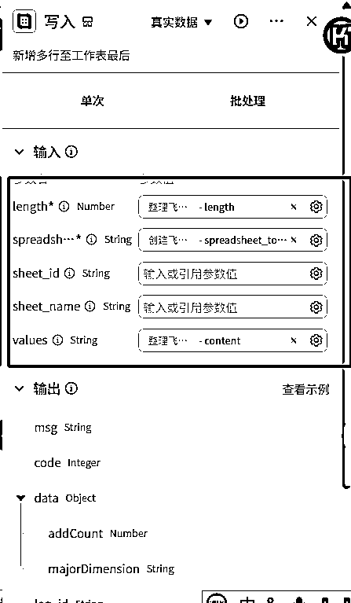

#### —Excel节点

输入是Excel格式整理的输出

输出的data就是Excel的下载链接

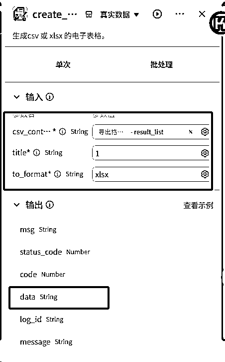

### ⑦结束节点

最后主要输出就行啦

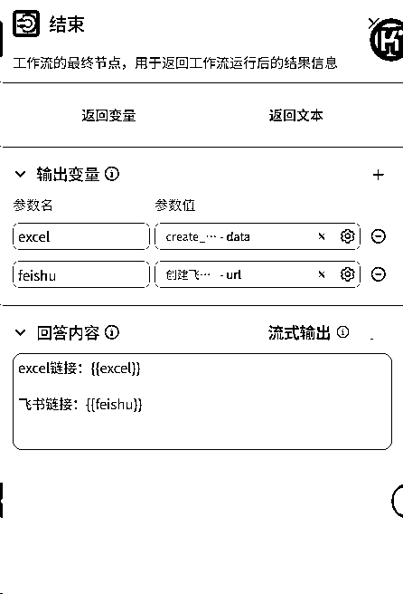

## 2、下载Excel工作流

下载飞书表格的目的是：

1、有部分客户确实没有飞书，

2、有陌生客户，没法单独授权，但是报价又不能公开授权


#### ①开始节点：

之前拿到的飞书表格的链接

#### ②飞书表格的读取行插件（官方插件）

下载的行数建议不超过800行，超过容易报错，数据太大

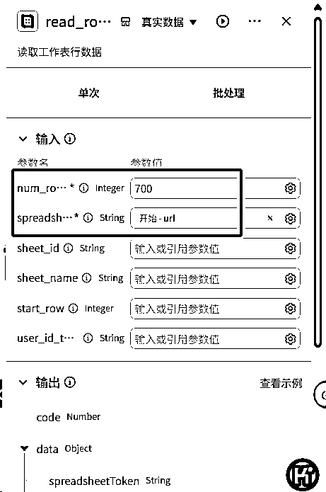

#### ③格式整理

将飞书表格的返回格式，整理为Excel的csv格式

输入节点选择上一步输出的valuesJsonString

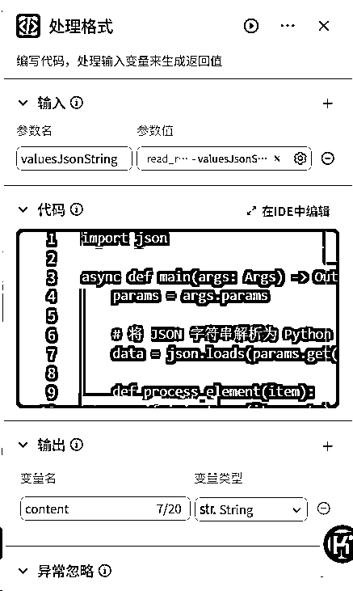

```
import json

async def main(args: Args) -> Output:
    params = args.params

    # 将 JSON 字符串解析为 Python 列表
    data = json.loads(params.get("valuesJsonString"))

    def process_element(item):
        if isinstance(item, str):
            # 去掉换行符并将英文逗号替换为中文逗号
            return item.replace('\n', '').replace(',', '，')
        return item

    # 过滤出至少有一个非 null 元素的子列表，并处理每个元素
    filtered_data = []
    for sublist in data:
        if any(item is not None for item in sublist):
            new_sublist = [process_element(item) for item in sublist]
            filtered_data.append(new_sublist)

    # 自动计算最大列数
    max_length = max(len(sublist) for sublist in filtered_data)

    # 补齐每一行数据至所需列数，用 None 填充缺失值
    for sublist in filtered_data:
        while len(sublist) < max_length:
            sublist.append(None)

    # 转换为所需字符串格式
    result_lines = []
    for sublist in filtered_data:
        line = ','.join([str(item) if item is not None else '' for item in sublist])
        result_lines.append(line)
    result_str = '\n'.join(result_lines)

    # 构建输出对象
    ret: Output = {
        "content":result_str
    }
    return ret
```

#### ④写Excel

同上

#### ⑤结束

直接返回Excel的链接

如果为了方便客户，也可以在报价工作流添加个数据库，将客户的飞书链接存入，客户可以直接在智能体点击就可以下载了

# 三、延伸

上面展示的仅是用作报价的工作流展示，当然也可以改改，还有更多的场景，都是可以套用模板的